# Установка ubuntu - опис для початківця

<!-- TOC BEGIN -->
1. [Вступ](#p01) 
2. [Створення AZURE account](#p02)
3. [Створення віртуальної машини](#p03)
4. [Установка MySQL сервера на ubuntu](#p04)
5. [Установка mysql клієнта на vm2 та vm3](#p05)
6. [MySQL: Створення прикладного користувача та бази даних на сервері mysql](#p06)
7. [MySQL: Підключення до віддаленого сервера клієнтом mysql](#p07)

<!-- TOC END -->

## 1. <a name="p01">Вступ</a>

Прийшлось змінити напрямок і познайомитися з AZURE. Ну і в рамках вивчення цієї хмари, та проходження azure-них  навчальних курсів  роблю деякі замальовки собі на пам'ять і публікую,  можливо комусь і допоможе. Особливо тим, хто довго працював з windows і не працював з linux зовсім та з інфраструктурою хмар.
Базове навчання AZURE передбачає виконання деяких лабораторних робіт в рамках вивчення IAAS. Але, для практичного використання, мені тих робіт здалося замало, тому зробив свій навчальний проект.

Для прикладу, створення віртуальних машин, що розміщені у віртуальній приватній мережі та відкриття відповідних доступів до цих VMs. Ну, і якщо на ці віртуальні машини поставити яке небуть Web-app -  то знадобиться ще і поставити балансер перед VMs  що приймають web запити. До VMs  потрібно вміти підключитися, якщо у вас windows машина в якості робочої санції. А осоливо, коли потрібно управляти  кількома VMs. 

Ну і, як виявилося, треба вміти вибирати потрібну вам конфігурацію VMs  щоб не переплачувати за ті ресурси, що ви не будете використовувати.

Кінцевим етапом цього всьго єстворення додатку, розгорнутого на iaas в azure, що показано на [pic-14](#pic-14)

<kbd>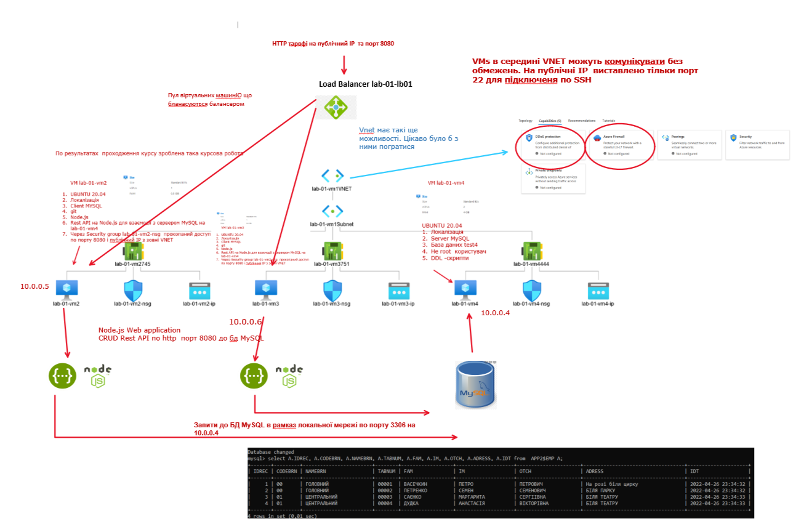</kbd>
<p style="text-align: center;"><a name="pic-14">pic-14</a></p>


## 2. <a name="p02">Створення AZURE account</a>


Заходимо на [портал azure](https://portal.azure.com/)  та реєструємося, та попадаємо на домашню сторінку порталу [pic-01](#pic-01).

<kbd>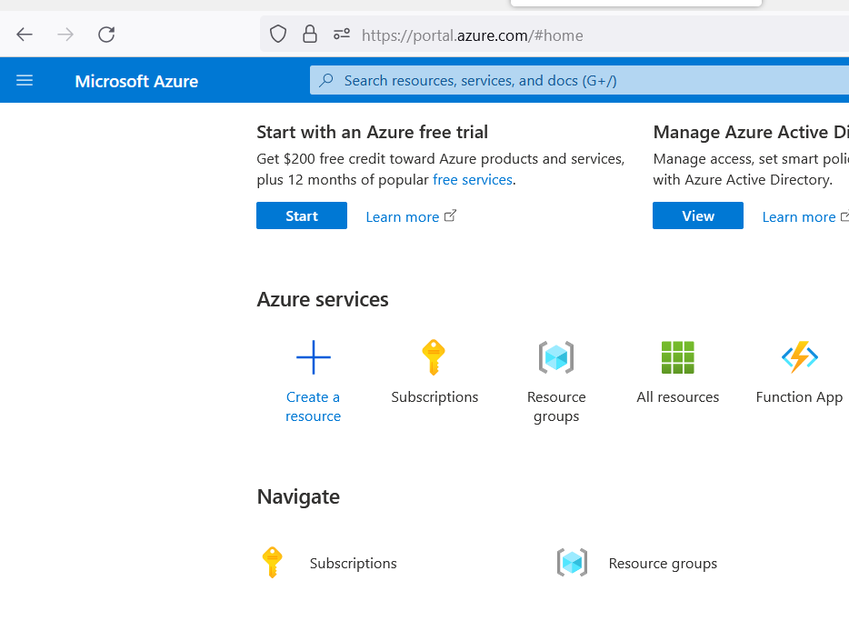</kbd>
<p style="text-align: center;"><a name="pic-01">pic-01</a></p>

Далі буде можливість почати з trial  підписки, отримавши $200 депозиту на рахунок. У вас з'явиться безкоштовна підписка [pic-15](#pic-15).


<kbd>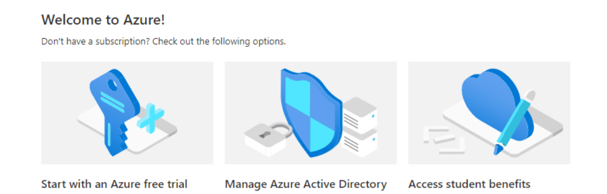</kbd>
<p style="text-align: center;"><a name="pic-15">pic-15</a></p>

 У вас буде автоматично створена Azure subscription 1 [pic-16](#pic-16).

<kbd>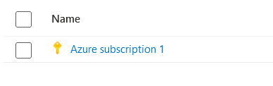</kbd>
<p style="text-align: center;"><a name="pic-16">pic-16</a></p>

А бо ж можна створити підписку pay-as-you-go і використовувати всі сервіси без обмежень. Для тестів - не так багато вого уже і нарахує [pic-02](#pic-02).

<kbd>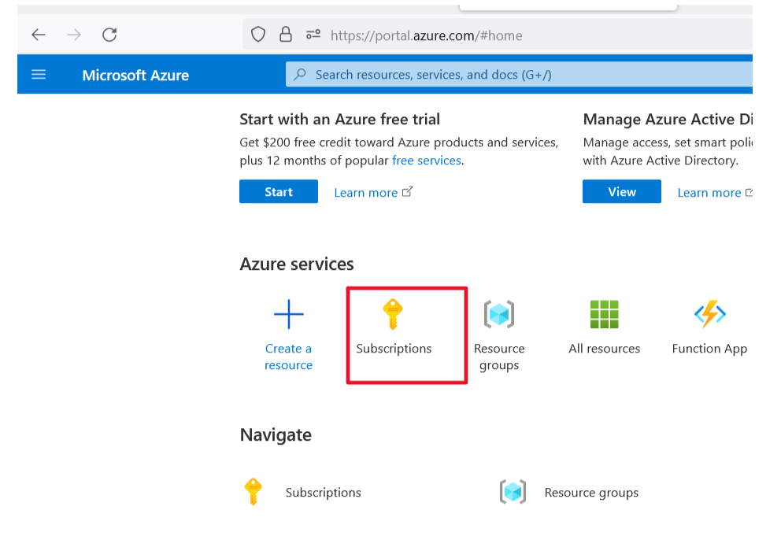</kbd>
<p style="text-align: center;"><a name="pic-02">pic-02</a></p>

При створенні підписки у вас запрсить реквізити платіжної карточки, і можливо спише $1  а потім поверне. Ця процедура схожа у всіх хмарах. На особистому досвіді перевіряв в IBM, ORACLE, DigitalOcean, Azure, навіть для тріальної підписки.

На [pic-17](#pic-17)  показано екран з обов'язковими для заповненя полями.

<kbd>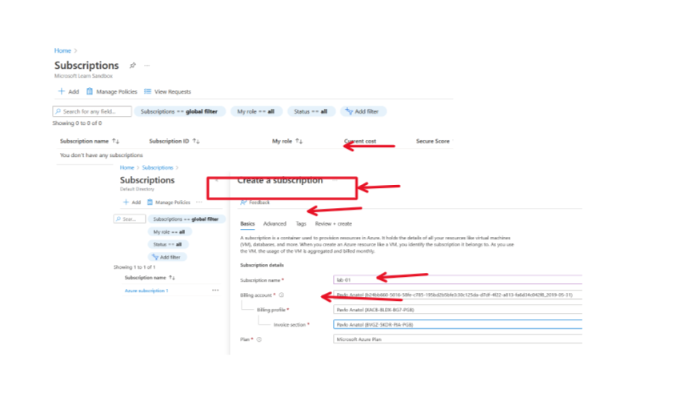</kbd>
<p style="text-align: center;"><a name="pic-17">pic-17</a></p>


Наступним кроком буде створення ResourceGroupe, що дозволить згурпувати ваші ресурси. В подальшому resource group  буде згадуватися при ствренні кожного сервісу і тому потрібно уважно її вибирати. При створенні ResourceGroup  потрібо вибрати центр обороки даних, з яким будуть поєдунватись ресурси, створені в рамках цієї групи.

<kbd>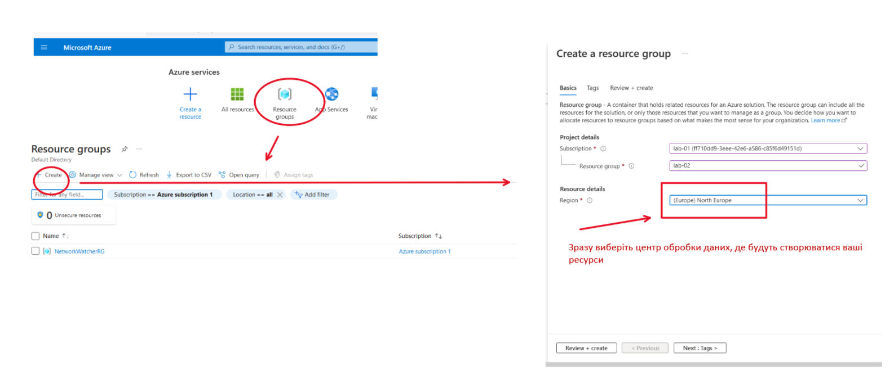</kbd>
<p style="text-align: center;"><a name="pic-18">pic-18</a></p>


## 3. <a name="p03">Створення віртуальної машини</a>

Створювати віртуальну машну можна з меню "Virtual machines". Але перед цим потрібно вибрати, який образ віртуальної машини вам потрібен. В меню стоврення  робити цей вибір дуже не зручно, тому бажано спершу вибрати. Про доступні  образи віртуальних машин можна отримати інфомрацію за лінком: [Linux Virtual Machines Pricing](https://azure.microsoft.com/en-us/pricing/details/virtual-machines/linux/). Тут можна задати ряд параметрів і отримати список доступних конфігурацій та їх опис, ну і вирати ту, що вам потрібна. За замовчуванням зразу пропонують linux машни. Я теж пропоную вибрати найдешевший  Linux образ з широким community.  Тому зразу іду на [каталог образів для ОС Ubunta](https://azure.microsoft.com/en-us/pricing/details/virtual-machines/ubuntu-advantage-standard/).  На  [pic-20](#pic-20)  показано приклад таблиці образів та їх ціна за місяць експлуатаціх  так би мовити "без зупинки 24*7". В навчальних цілях, якщо будете вимикати ресурс, кои ви  з ним не працюєте ви цього прайсу не досягнете. 

<kbd>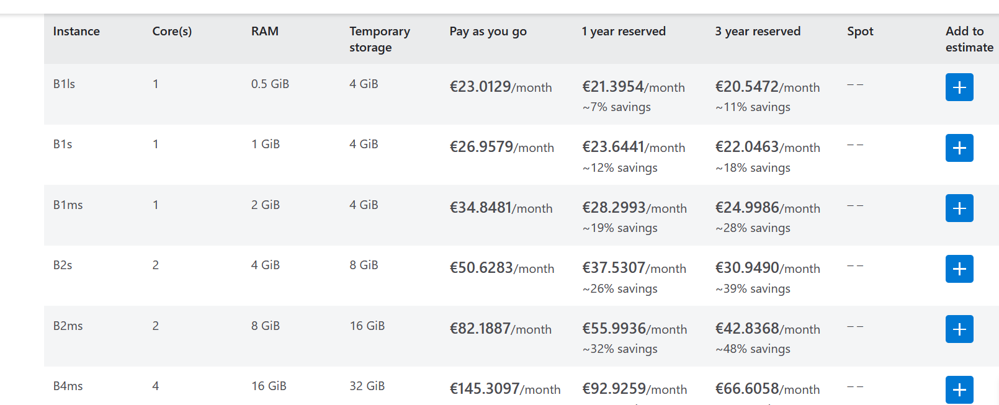</kbd>
<p style="text-align: center;"><a name="pic-20">pic-20</a></p>

Крім того, потрібно визначитися з типом диску. Майте на увазі, що вам за замовчуванням пропонується Premium SSD хоча в більшості випадків вам потрібен звичайний standard SSD. Доступна таблиця  дисків показана на [pic-21](#pic-21), а о прайсингу не знайшов. Судячи з усього прайсинг на диски складається з кількох складових.

<kbd>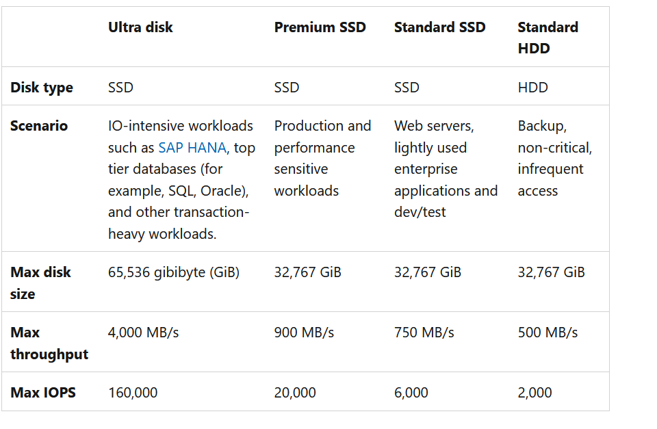</kbd>
<p style="text-align: center;"><a name="pic-21">pic-21</a></p>. 

Тепер перейемо до створення машин. Для створення машин можна використовувати команди [Azure CLI](https://docs.microsoft.com/en-us/cli/azure/vm?view=azure-cli-latest#az-vm-create), а точніше команду [az-vm-create](https://docs.microsoft.com/en-us/cli/azure/vm?view=azure-cli-latest#az-vm-create). Цю команду потрібно запускати з консолі Azure CLI в хмарі. Ну або ж поставити  Azure CLI на ваш ноутбук. Команда буде виглядати щось на кшталт такої:

```bash
az vm create -n MyVm -g MyResourceGroup --public-ip-address-dns-name MyUniqueDnsName \
    --image ubuntults --data-disk-sizes-gb 10 20 --size Standard_DS2_v2 \
    --generate-ssh-keys
 ```
Єдине, що мені в цьому не подобається, що коли ви створюєте це все щерез хмарну консоль, то RSA ключі для підключення по SSH будуь залишатися в хмарі. А я планю підключатися до vm з локального laptop по SSH  на пряму. На [pic-23](#pic-23) показано

<kbd>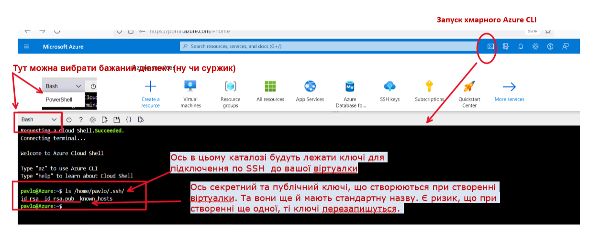</kbd>
<p style="text-align: center;"><a name="pic-23">pic-23</a></p>

як запустити в хмарі цю консоль та де лежать ключі для віртуалки. 

- Тому на початковому етапі створимо віртуалку через UI Azure portal.

Для створення через UI  натискаем на іконку [pic-19](#pic-19)

<kbd>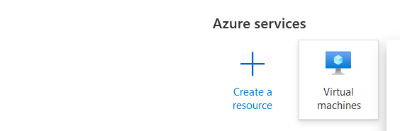</kbd>
<p style="text-align: center;"><a name="pic-19">pic-19</a></p> 

і заповнюємо послідовно екранні форми. Переша екранна форма має основні реквізити vm 

<kbd>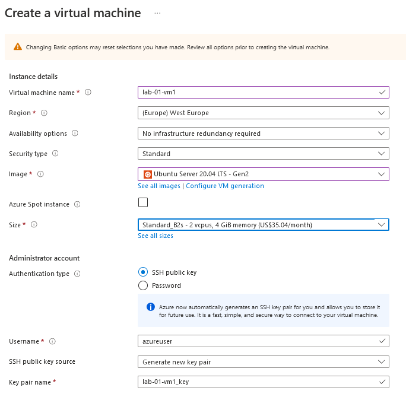</kbd>
<p style="text-align: center;"><a name="pic-04">pic-04</a></p> 

На йьому екрані зверніть увагу на поля **region**,  **size** - де виберіть ваш образ. **Authentication type** - виберіть рекомендоване *SSH public key* та перевірте, щоб було заповнено поле **SSH public key source** та **Key pair name**. Ці поля нам знадояться пізніше. І як показано на [pic-05](pic-05)

<kbd>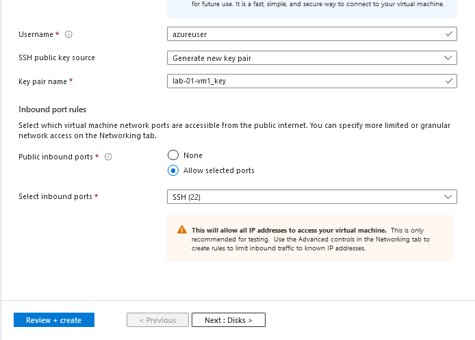</kbd>
<p style="text-align: center;"><a name="pic-05">pic-05</a></p> 

Обов'язково поставте, щоб був доступний порт 22 для підклбчення по ssh **select inbound ports**.

- Далі переходимо до вибору диска.

Вікно вибора диска показно на [pic-06](#pic-06).

<kbd>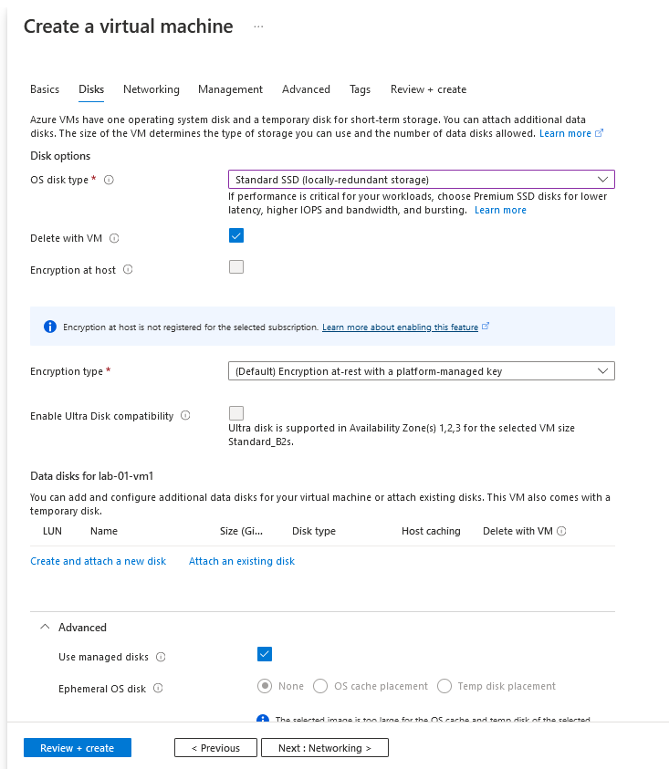</kbd>
<p style="text-align: center;"><a name="pic-06">pic-06</a></p> 

Тут потрібоно змінити значення в полі **OS disc type**, на той, що поаказано на малюнку.

- Переходимо до конфігурації мережі

Заповнення вкладки показано на [pic-07](#pic-07)

<kbd>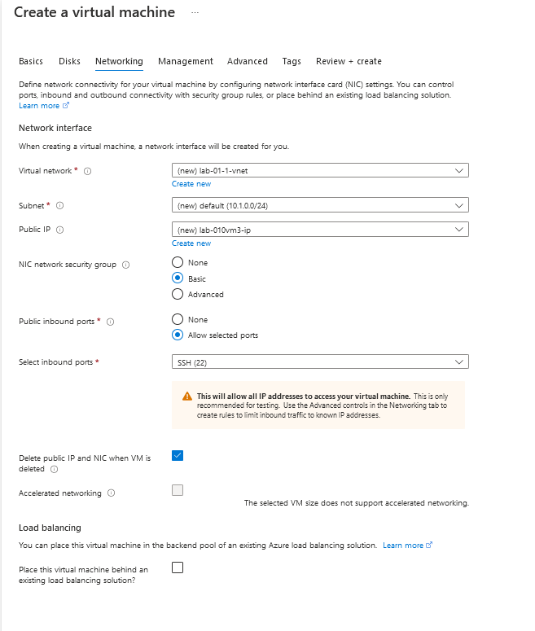</kbd>
<p style="text-align: center;"><a name="pic-07">pic-07</a></p>

Тут ви можете вказати назву віртуальної мережі. Не забудьте вказати на необхідність генерації публічного IP  та  поставити "галочку", щоб публічний IP видалявся разом з видаленням VM. Якщо не видаляти, то публічний IP  буде тарифікуватися і будуть списуватися гроші. Також, не забуваємо звернути увагу, що потрібно створити network security group (NIC) та дозволити в ній доступ з зовні  virtual network до vm по порту 22.

Далі, вкладки **Management**, **Advanced**, **Tag** можемо проклікати без змін і далі перейти до вкладки **Review + create**  [pic-09](#pic-09).


<kbd>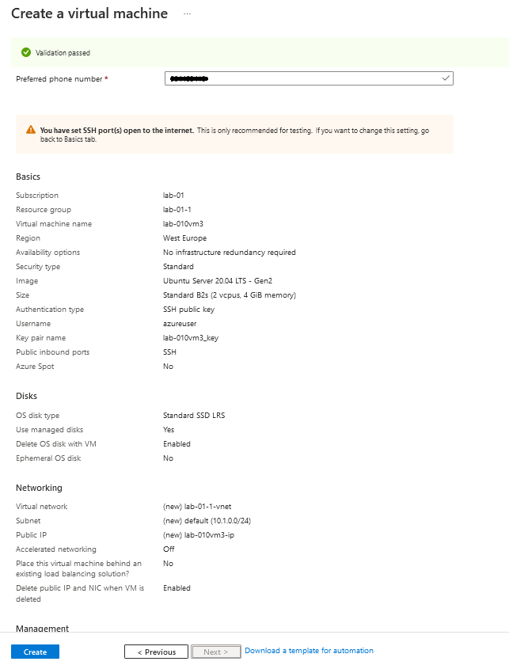</kbd>
<p style="text-align: center;"><a name="pic-09">pic-09</a></p>

Після натискання на кнопку **Create**,  потрібно обов'язково скачати rsa-ключ для пдключення по ssh до вашої віртуалки [pic-10](#pic-10).

<kbd>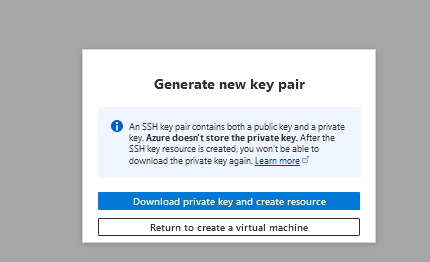</kbd>
<p style="text-align: center;"><a name="pic-10">pic-10</a></p>

Якщо все зроблено првильно, что через хвилину - дві віртуалка буде створена і запущена.

- Підключння по ssh з вашого laptop з windows 10.

Для підключення по ssh з windows 10 потрібно встановити openssh. Як встановити openssh на windows 10 описано  по лінку [Get started with OpenSSH](https://docs.microsoft.com/en-us/windows-server/administration/openssh/openssh_install_firstuse).

Якзо коротко, то щоб  активувати, потрібно в PowerShell виконати: 

* активувати

```bash
Get-WindowsCapability -Online | Where-Object Name -like 'OpenSSH*'

```
на виході отримаємо щось таке

```bash
Name  : OpenSSH.Client~~~~0.0.1.0
State : NotPresent

Name  : OpenSSH.Server~~~~0.0.1.0
State : NotPresent
```

* встановити клієнта (сервер не порібен нам)

```bash
# Install the OpenSSH Client
Add-WindowsCapability -Online -Name OpenSSH.Client~~~~0.0.1.0

```
у відповідь буде щось таке

```text

Path          :
Online        : True
RestartNeeded : False

```

В резульаті цих операцій у вас повинен появитися каталог **C:\Windows\System32\OpenSSH** з переліком файлів як на [pic-24](#pic-24)

<kbd>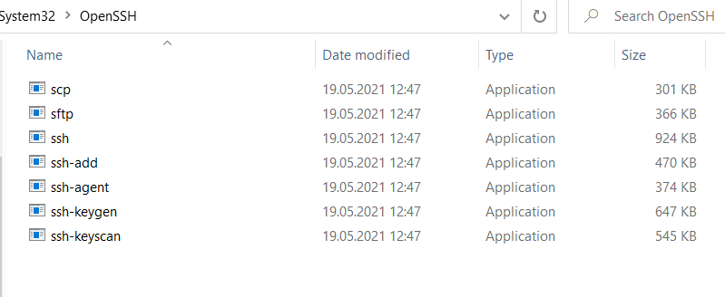</kbd>
<p style="text-align: center;"><a name="pic-24">pic-24</a></p>

Тепер ще потрібно додати в змінну path **C:\Windows\System32\OpenSSH** 

Далі, якщо набрати ssh -h  то отримаємо екран як на [pic-25](#pic-25).

<kbd>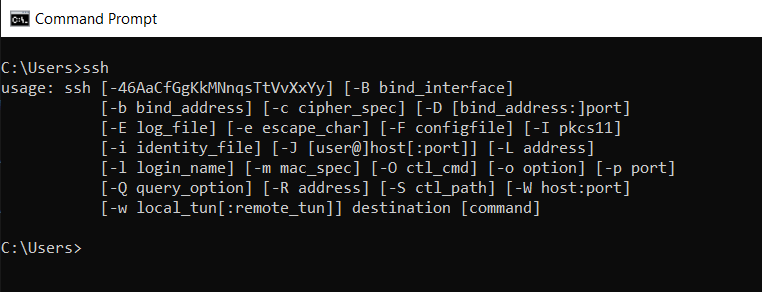</kbd>
<p style="text-align: center;"><a name="pic-25">pic-25</a></p>


- Підключаемося до вашої вітуалки по ssh 

Для підклчення до віртуалки потрібен public IP та секретний ключ, який був скачаний   [pic-10](#pic-10) в процесі створення вашої віртуалки.

Команда підключення:

```bash

ssh -i keyname.pem azureuser@publicIP

```

<kbd>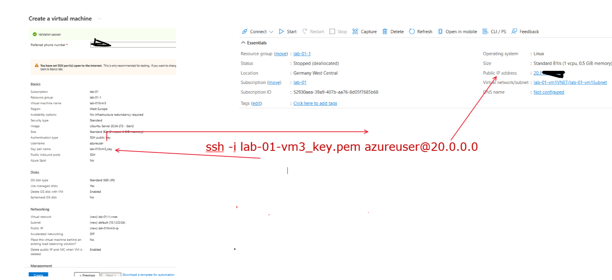</kbd>
<p style="text-align: center;"><a name="pic-26">pic-26</a></p>


В результаті підключення буде щось схоже на таке [pic-27](#pic-27).

<kbd>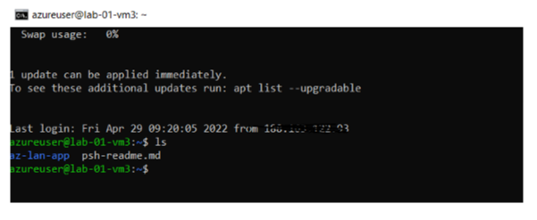</kbd>
<p style="text-align: center;"><a name="pic-27">pic-27</a></p>

Таким чином створили одну VM  та виконали до нех підключання по ssh. Для цілей розробки та тестування цього достатньо.

4. <a name="p04">Установка MySQL сервера на ubuntu</a>

Для досягнення конфігурації описаної на  [pic-14](#pic-14)

<kbd></kbd>
<p style="text-align: center;"><a name="pic-14">pic-14</a></p>

потрібно створити 3 віртуальних машини. На машинах уже присутній git та за замовчуванням вони можуть комунікувати в рамках virtual network одна з одною. Бажано виконати лоалізацію, так як написано в [Настройка linux ubuntu 20.04 для розроника](https://pavlo-shcherbukha.github.io/posts/2022-04-30/ubuntu-setup/), щоб коректно відображалася кирилиця 

Далі на vm4  потрібно розгорнути сервер mysql, так, як написано по лінку: [Установка MySql на VM з ОS Ubunta](https://pavlo-shcherbukha.github.io/posts/2022-04-30/ubunta-setup-mysql/).

Тут, особливо не забуваємо про розділ інстукції: **Зробити можливем підклчення до mysql з віддаленої машини**,  що б сервер приймав підключення з віддалених машин


5. <a name="p05">Установка mysql клієнта на vm2 та vm3</a>

Далі на vm2 та vm3  потрібно розгорнути клієнт mysql, так, як написано по лінку: [Установка MySql на VM з ОS Ubunta](https://pavlo-shcherbukha.github.io/posts/2022-04-30/ubunta-setup-mysql/),  по суті, виконати:

```bash
sudo apt install mysql-client
```

6. <a name="p06">MySQL: Створення прикладного користувача та бази даних на сервері mysql</a>

Далі заходимо по ssh на vm4 (де встановлено mysql) та підключаємося під root для створення прикладного користувача

```bash

sudo mysql -u root

```

Та виконуємо скрипт по створенню прикладного користувача: [mysql-ddl.sql](https://github.com/pavlo-shcherbukha/az-lan-app/tree/main/mysql-ddl). Можна просто, шляхом вклеювання в вікно, але перд цим не забуваємо поміняти пароль в рядку: 

```text
 CREATE USER 'devadm'@'%' IDENTIFIED BY '*******';
 ```

Виходимо.

Підключаємось уже під новоствореним користувачем:

```bash
sudo mysql -udevadm -p 

```
Вводимо пароль та створюємо БД шляхом виконання псолідовно скриптів:

- [db-build.sql](https://github.com/pavlo-shcherbukha/az-lan-app/blob/main/mysql-ddl/db-build.sql) - створення БД;

- [data-ins1.sql](https://github.com/pavlo-shcherbukha/az-lan-app/blob/main/mysql-ddl/data-ins1.sql) - внесення в БД тестових даних;


7. <a name="p07">MySQL: Підключення до віддаленого сервера клієнтом mysql</a>

Для підклюення до віддаленого сервера mysql потрідно зайти на vm2 або vm3  та підкобчитися командою:

```bash
mysql -u devadm -p -h 10.0.0.4

```

Основною відмінністю від роботи на севрері є необхідність вказати ip host машини, де запущений сервер mysql. В моєму випадку це локальний IP сервера в virtual network.


Далі, якщо все налаштовано коерктно, то виконаємо select з [data-ins1.sql](https://github.com/pavlo-shcherbukha/az-lan-app/blob/main/mysql-ddl/data-ins1.sql) 

```sql
use test4;
select A.* from  APP2$EMP A;

```

І повинні отримати щось схоже на 

<kbd>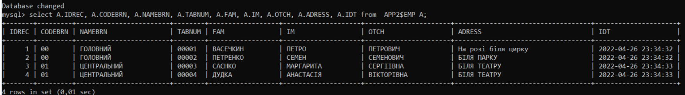</kbd>
<p style="text-align: center;"><a name="pic-28">pic-28</a></p>


та клонуємо репозиторій https://github.com/pavlo-shcherbukha/az-lan-app


Все, пересвідчилися - , зв'язок з сервером є, клієнт працює.

```bash
git clone https://github.com/pavlo-shcherbukha/az-lan-app.git 

```


