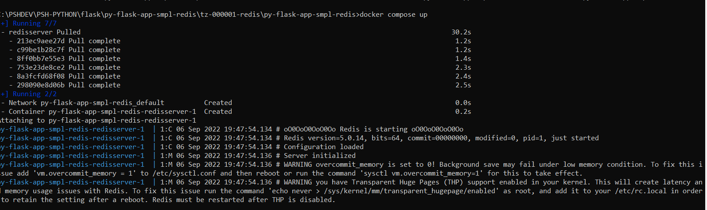
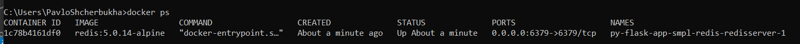
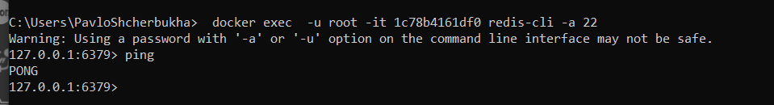
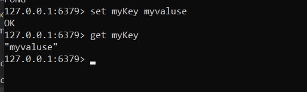
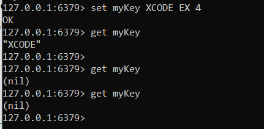
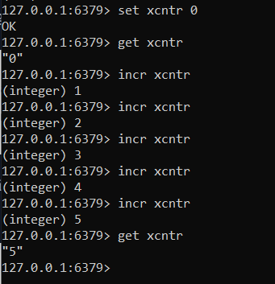

## Зміст

<!-- TOC BEGIN -->
1. [Про що цей блог](#p-1)
2. [Розгортання Redis локально в Docker контейнері](#p-2)
3. [Короткий довідник по командах Redis які можна виконати з допомогою redis-клієнта](#p-3)
  * 3.1. [[SET, GET, INCR]  Встановлення - читання ключа та його значення](#p-3.1)
  * 3.2. [[KEYS]  Отримати список всіх ключів в БД](#p-3.2)
  * 3.3. [[HSET, HGET, HDEL, HEXISTS]  Встановлення - читання hash-ключа](#p-3.3)
  * 3.4. [[DEL, EXISTS] Видалити ключ, перевірити навність ключа](#p-3.4)
  * 3.5. [Як зберегти JSON в Redis](#p-3.5)
  * 3.6. [Корисні посилання по redis](#p-3.6)

4. [Побудова образу з використанням аргументів](#p-3)
5. [Висновки](#p-5)


<!-- TOC END -->


## <a name="p-1">Про що цей блог</a>

Це продовження записок початківця про python flask. В попереніх серіях було:

- [Python - flask start](https://pavlo-shcherbukha.github.io/posts/2022-09-02/python-flask-1/)
- [Python - flask запуск в контейнері від RadHat UBI8](https://pavlo-shcherbukha.github.io/posts/2022-09-02/python-flask-2/)
- [Python, як підключити .dll, .so бібліотеки](https://pavlo-shcherbukha.github.io/posts/2022-06-11/python-dll-lib-find/)

В цьому блозі:

В [Python - flask запуск в контейнері від RadHat UBI8](https://pavlo-shcherbukha.github.io/posts/2022-09-02/python-flask-2/) було показано, що в Linux контейнері під Gunicorn додаток запускається в кілька потоків. Тепер виникла інша проблема, як управляти всіма цими потоками. Ну, уявимо собі, що на сервіс приходить якась команда і всі потоки повинні виконати її. Що це може бути за команда:

- ну завантажити файл з бази даних;
- змінити налаштування (параметризацію сервісу);
- виконати якийсь фоновий процес.

Для організації всього цього було прийняте рішення використати Publish/Subscribe схему на базі in-memory DB Redis. Якщо можна так сказати, то для Cloud Native applicatoin Redis виконує функцію пам'яті для public та shared змінних. Але, опублікувати в Redis -  то не не проблема. Пролема буде прочитати. Якщо просто запустити на Flask такий от цикл:

```py

    while True:
        time.sleep(4.0)
        lpid = os.getpid()
        log( str(lpid) + " : timeout ")
        for message in sub.listen():
            if message['type'] != 'message':
                continue
            log( "Pid: "+ str(lpid) + " - Get message: " +  json.dumps( message['data'] ) ) 


```

То, цикл працювати буде. А от web service  працювати не будуть, на відміну від Node.js, де event loop уже вбудована і цієї проблеми не має. А мені потрібно, щоб працювали web service і щоб  всі підписники слухали чергу і виконували,  команди, отримані з черги.

Тому  цей блог присвячений тому, як Python Flask applicatoin інтегрувати з Redis по принципу public/subscribe.

## <a name="p-2">Розгортання Redis локально в Docker контейнері</a>

Перш, ніж  інтегрувати Python application з Redis  потрібно навчитися впевнено розгортати сам redis. А, якщо зважити на те, що потрібно запустити як мінімум 2 сервіси: python service і БД redis - то краще зразу  запускати все це з допомогою docker-compolser, якщо запускати на вланому laptop. 

Для прикладів вибрана redis-5 з офіційного образу redis на [Docker hub з тегом версії redis:5.0.14-alpine ](https://hub.docker.com/_/redis).  Для старту достатньо підготувати **docker-composer.yaml**

```yaml

version: '3.8'
services:
  redisserver:
    image: redis:5.0.14-alpine
    restart: always
    ports:
      - '6379:6379'
    command: redis-server --save 20 1 --loglevel warning --requirepass 22

```

В цьому фрагмені **Redis** стартує з авторизацією по паролю [--requirepass 22].
Для запуску, потрібно перейти в каталог з файлом **docker-composer.yaml** та і запустити старт командою

```bash
docker compose up

```
На екарні отримаєте щось схоже на таке.
<kbd></kbd>
<p style="text-align: center;"><a name="pic-01">pic-01</a></p> 

Якщо подивитися на контейнери, що стартонули, то можна побачити redis:

В іншій cmd сесії запускаємо:

```bash
  docker ps
```

На екарні отримаєте щось схоже на таке.
<kbd></kbd>
<p style="text-align: center;"><a name="pic-02">pic-02</a></p> 


Тепер спробуємо підключитися до контейнера з допомогою redis-cli. Тут ми нічого не інсталюємо наробочу станцію, а заходиво в середину контейнера, шляхом запука redis-cli:

```bash
    docker exec  -u root -it 1c78b4161df0 redis-cli -a 22

```

Тобто, тут ми заходимо по ssh як root в контейнер з id 1c78b4161df, запускаючи redis-cli  з авторизацією, вказуючи пароль до БД з ключем **-a**


На екарні отримаєте щось схоже на таке.
<kbd></kbd>
<p style="text-align: center;"><a name="pic-03">pic-03</a></p> 

Ну і для перевірки з'єднання задаємо комнаду "PING", а у відповідь отримуємо PONG.
Таким чином в мінімальному вигляді контейнре запущено.


## <a name="p3">Короткий довідник по командах Redis які можна виконати з допомогою redis-клієнта</a>

Особисто я Redis-cli не користуюся. Але в цтому розділі хочу паказати деякі можливості redis, які в майбутньому буду викистовувати через спеціальні мовні бібіліотеки 

### <a name="p-3.1">[SET, GET, INCR]  Встановлення - читання ключа та його значення</a>

Найпершиою і найпростішою операцією є запам'ятати пари: ключ-знаення. Цікавим варіаном є можливість зберігання ключа заданий період часу (секінд, мілісекунд).

 - Встановити ключ та значення

```text
set myKey myvaluse
```

- Прочитати значення ключа

```text
get myKey

```
<kbd></kbd>
<p style="text-align: center;"><a name="pic-04">pic-04</a></p> 

Встановити ключ, що "живе" протягом визначеного часу. На прикладі, що показано видно, як встановлено значення ключа на 4 секунди. А потім, через якийсь час - ключ "пропадає"

```text

#
# set myKey value [expiration EX seconds|PX milliseconds] [NX|XX]

 set myKey XCODE EX 4

```

<kbd></kbd>
<p style="text-align: center;"><a name="pic-05">pic-05</a></p> 

Тут показано простий варіант установки лічільника і його постійного збільшення

```text
127.0.0.1:6379> set xcntr 0
OK
127.0.0.1:6379> get xcntr
"0"
127.0.0.1:6379> incr xcntr
(integer) 1
127.0.0.1:6379> incr xcntr
(integer) 2
127.0.0.1:6379> incr xcntr
(integer) 3
127.0.0.1:6379> incr xcntr
(integer) 4
127.0.0.1:6379> incr xcntr
(integer) 5
127.0.0.1:6379> get xcntr

```

<kbd></kbd>
<p style="text-align: center;"><a name="pic-06">pic-06</a></p> 


###  <a name="p-3.2">[KEYS]  Отримати список всіх ключів в БД</a>

Отримати всі ключі в БД можа командою

```text
  # keys pattern

```

На приклад:

```text
127.0.0.1:6379> keys *
1) "jsondata"
2) "myhash"
3) "xcntr"
4) "counter"
5) "shkey1"

```


### <a name="p-3.3">[HSET, HGET, HDEL, HEXISTS]  Встановлення - читання hash-ключа</a>

Ця команда під одним ключем може зберігати кілька значень FIELD: VALUE. Обмеження - прочитатит можна тілько по одному полю.
Збережемо під ключем sh-book  опис книжки: назву, автора, рік публікації. В принципі, це аналогічно збереженню JSON

{

  "sh-book": {"title": "", "author": "", published: 2009}
}


```text

   hset sh-book  title  "The Museum of Abandoned Secrets"
   hset sh-book  author "Oksana Zabuzhko"
   hset sh-book  published "2009" 

```

або ж можна ввести групову команду

```text
hset sh-book  title  "Second Attempt" author "Oksana Zabuzhko" published "2005" 

```

- Перевірити наявність поля в ключі

```text
  hexists sh-book title
```

- Видалити поле в ключі

```text

  hdel sh-book title

```

По суті ми зберегли та к би мовити плоский json

### <a name="p-3.4">[DEL, EXISTS] Видалити ключ, перевірити навність ключа</a>

```text
  del shkey
```

```text
127.0.0.1:6379> keys *
 1) "myhash"
 2) "xcntr"
 3) "counter"
 4) "shhkey2"
 5) "gey"
 6) "shkey1"
 7) "jsondata"
 8) "get"
 9) "sh-book"
10) "shhkey"
127.0.0.1:6379> del shhkey
(integer) 1
127.0.0.1:6379> keys *
1) "myhash"
2) "xcntr"
3) "counter"
4) "shhkey2"
5) "gey"
6) "shkey1"
7) "jsondata"
8) "get"
9) "sh-book"
127.0.0.1:6379>

```

Так можна перевірити наявнісмть ключа

```text
127.0.0.1:6379> keys *
1) "myhash"
2) "xcntr"
3) "counter"
4) "shhkey2"
5) "gey"
6) "shkey1"
7) "jsondata"
8) "get"
9) "sh-book"
127.0.0.1:6379> exists sh-book
(integer) 1
127.0.0.1:6379>
```

### <a name="p-3.5">Як зберегти JSON в Redis</a>

Допустимо у нас є JSON:

{ "title": "Second Attempt" ,  "author": "Oksana Zabuzhko", "published": 2005 }

то зберегти його можна звичайною команою **set**
Зберегти його можна звичайною командою set

```text
set book1 '{ "title": "Second Attempt" ,  "author": "Oksana Zabuzhko", "published": 2005 }'

```

Ось результат роботи комнади:

```text
127.0.0.1:6379> set book1 '{ "title": "Second Attempt" ,  "author": "Oksana Zabuzhko", "published": 2005 }'
OK
127.0.0.1:6379> get book1
"{ \"title\": \"Second Attempt\" ,  \"author\": \"Oksana Zabuzhko\", \"published\": 2005 }"
127.0.0.1:6379>
```

### <a name="p-3.6">Корисні посилання по redis</a>

- https://stackoverflow.com/questions/40678865/how-to-connect-to-remote-redis-server
- https://redis.io/docs/manual/security/
- https://hub.docker.com/_/redis
- https://stackoverflow.com/questions/7537905/how-to-set-password-for-redis
- https://github.com/docker-library/redis/blob/d36a031654f52ab95601de1f8a841765177cf702/5/alpine/Dockerfile
- https://hub.docker.com/_/redis
- https://stackoverflow.com/questions/33304388/calling-redis-cli-in-docker-compose-setup
- https://geshan.com.np/blog/2022/01/redis-docker/
- https://redis.io/docs/manual/cli/
- https://redis.io/docs/getting-started/
- https://packagist.org/packages/predis/predis
- https://stackoverflow.com/questions/49375856/using-composer-wallet-redis-where-to-see-the-card-in-redis-service 
- https://github.com/hyperledger-archives/composer-tools/tree/master/packages/composer-wallet-redis
- https://geshan.com.np/blog/2022/01/redis-docker/
- https://stackoverflow.com/questions/69140125/docker-redis-seeding-data-cannot-execute-redis-cli-via-dockerfile-or-via-she
- https://stackoverflow.com/questions/60828349/redis-cli-from-docker-compose-redis-container-doesnt-catch-any-keys-set-up-thro
- https://hub.docker.com/r/bitnami/redis


## <a name="p-3">Побудова образу локально</a>


## <a name="p-5">Висновки</a>

Це елементарні приклади для початківця щоб  запустити python appliction в docker контейнері та навчитися з ним працювати. Ну а  в репозиторії програмного коду показані типові приклади побудови api/
Сам репозиторій з прикладом знаходиться за лінком: [py-flask-app-smpl-restapi-for-ubi8](https://github.com/pavlo-shcherbukha/py-flask-app-smpl-restapi-for-ubi8/tree/main)

