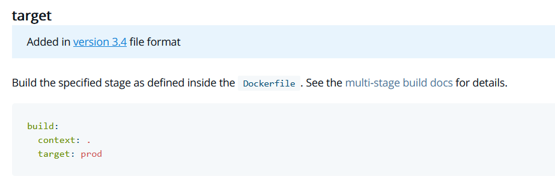
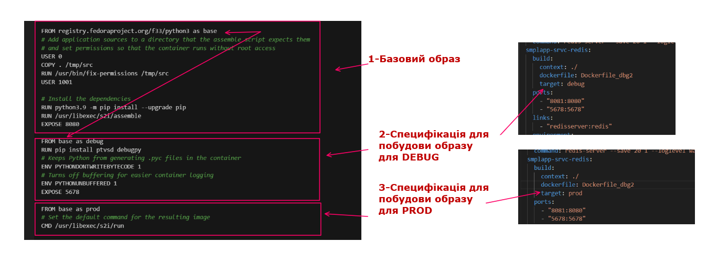
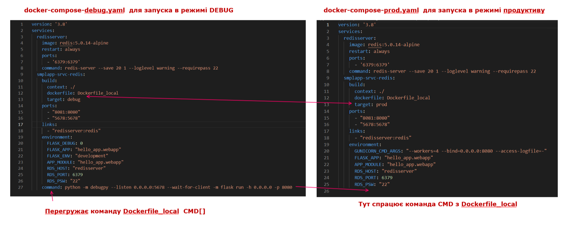
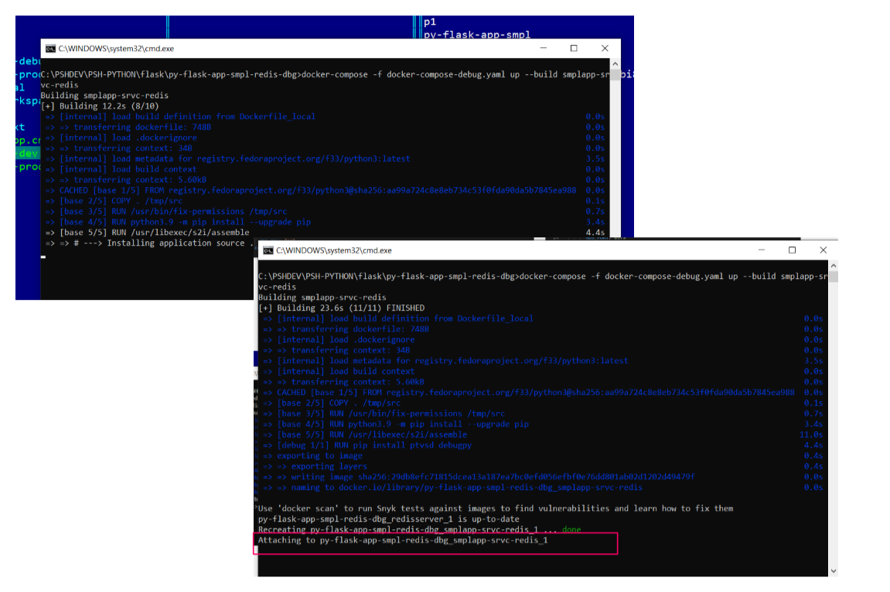
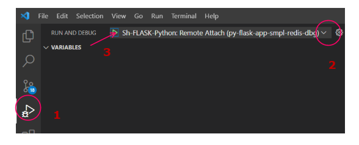
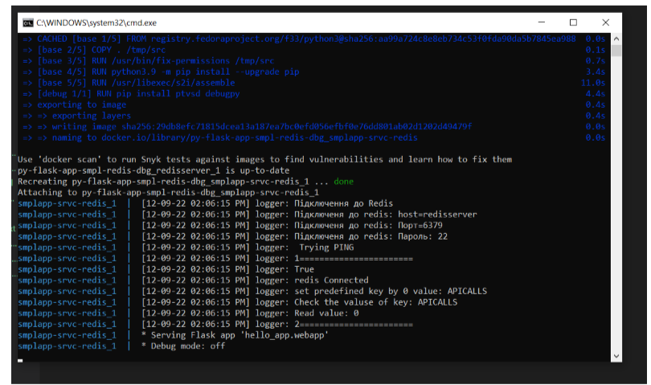
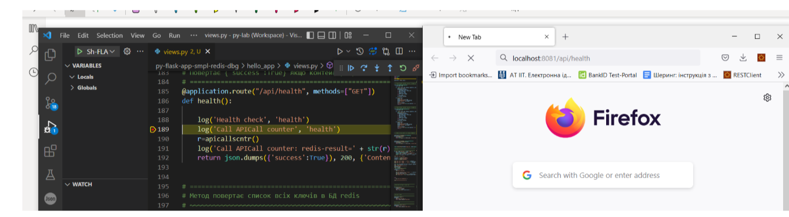
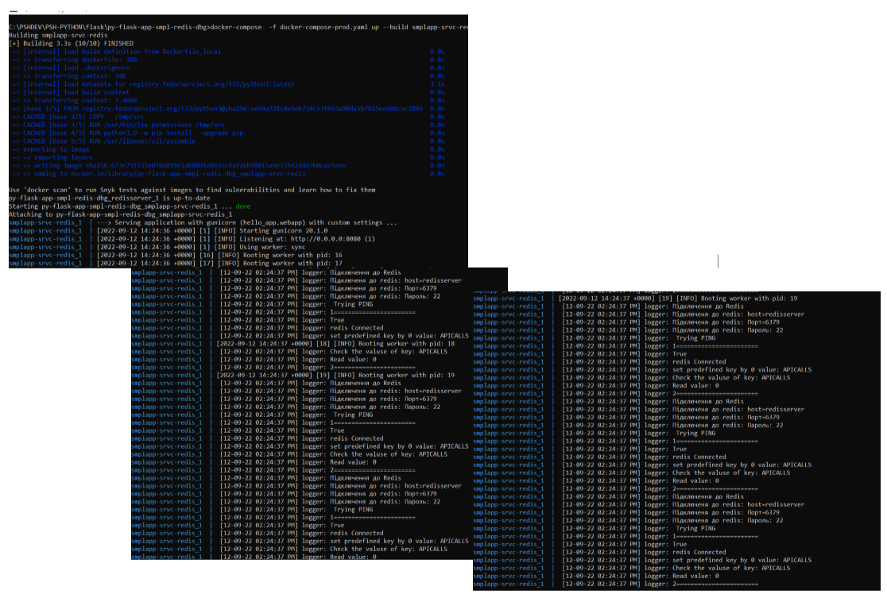

## Зміст

<!-- TOC BEGIN -->
1. [Про що цей блог](#p-1)
2. [Розгортання Redis локально в Docker контейнері](#p-2)
3. [Короткий довідник по командах Redis які можна виконати з допомогою redis-клієнта](#p-3)
  * 3.1. [[SET, GET, INCR]  Встановлення - читання ключа та його значення](#p-3.1)
  * 3.2. [[KEYS]  Отримати список всіх ключів в БД](#p-3.2)
  * 3.3. [[HSET, HGET, HDEL, HEXISTS]  Встановлення - читання hash-ключа](#p-3.3)
  * 3.4. [[DEL, EXISTS] Видалити ключ, перевірити навність ключа](#p-3.4)
  * 3.5. [Як зберегти JSON в Redis](#p-3.5)
  * 3.6. [Корисні посилання по redis](#p-3.6)

4. [Використання Redis сумісно з Python-flask application](#p-4)
  * 4.1. [Опис програмного коду демки](#p-4.1)
  * 4.2. [Підключення до redis](#p-4.2)
  * 4.3. [Проста функція лічилька кількості викликів АПІ](#p-4.3)
  * 4.4. [Розробка API методів, що дозволяюь створити ключ, прочитати занчення ключа, отримати список всіх ключів в Redis](#p-4.4)
5. [Запуск та налаштування контейнерів](#p-5)
6. [Запуск контейнерів docker compose](#p-6)


<!-- TOC END -->

https://dev.to/pacheco/dockerize-a-flask-app-and-debug-with-vscode-34i1
https://github.com/pachecoio/flask-api

Debug flask in container

- https://dev.to/pacheco/dockerize-a-flask-app-and-debug-with-vscode-34i1
Дуже цікаво. Мабуть те що треба
https://github.com/pachecoio/flask-api


- https://trstringer.com/python-flask-debug-docker-compose/
Тут теж інший варіант debug.

- https://code.visualstudio.com/docs/containers/quickstart-python
  https://code.visualstudio.com/docs/containers/debug-python

  Тут опис від VSC


- https://vladyslav-krylasov.medium.com/how-to-use-pdb-inside-a-docker-container-eeb230de4d11
  https://dev.to/zahaar/pdb-ipdb-in-docker-compose-enable-interactive-debugging-1goj
Тут ще debug


## <a name="p-1">1. Про що цей блог</a>

Це продовження записок початківця про python flask. 
В попреденіх серіях було про запуск flask application в контейнері і через docker-compose  поєднати з супутнім сервісов. В якості супутнього сервісу було вибрано Redis DB. Але в усіх цих випадках сервіс Python запускався я продуктивному режимі. Але, не маючи режима debug в контейнері ефективно розробляти не зручно.
В цьому блозі:
- Як налаштувати можливість debug python-flask application, що запущено в контейнері, викорстовуючи docker-compose. Я довго це пробував зібрати до купи. Але цей метод мені здався найбільш дієвим. Тут мова піде не про програмування, а більше про devops навики. Але, якщо розробник не матиме цих навиків, то як йому на своєму laptop  створити середовище розробки і ефективно працювати? Як правильно спроектувати, які компоненти винести в параметризацію?.... Ну і ще  можна знайти купу таких риторичних запитань.


## <a name="p-2">2. Різниця в запуску flask application</a>

Flask template розробдений таким чином, що  його можна запустити в **development mode**, як описано в [Створення найпростішого скрипта для flask app та запуск applicaiton з індивідуальною назвою в DEVELOPENT mode](https://pavlo-shcherbukha.github.io/posts/2022-09-02/python-flask-1/). А бо ж flask application запускається в **productive mode** за WSGI  сервером типу gunicorn, як описано в [Python - flask запуск в контейнері від RadHat UBI8](https://pavlo-shcherbukha.github.io/posts/2022-09-02/python-flask-2/).

Збірка запуск та debug контейнера з сервісом python описана  за цими лінками: 

- [Visual Studio Code:  Python in a container](https://code.visualstudio.com/docs/containers/quickstart-python);
- [Visual Studio Code: Debug Python within a container](https://code.visualstudio.com/docs/containers/debug-python).

Але, воно мене не дуже влаштовує, так як запускає окремий контейнер. А мені потрібно підняти локально  кілька компонентів через docker-compose, які "бачать" один одного в мережі а вже потім підключати debug.

Раптом мені попалася бібліотека від Microsoft, що забезепечує взаємодію debug  протоколу  python додатків та Visual Studio Code: [ptvsd](https://pypi.org/project/ptvsd/) або ж лінк на github [Python Tools for Visual Studio debug server](https://github.com/microsoft/ptvsd). Також, зандобилася бібліотека [debugpy](https://pypi.org/project/debugpy/) , або на github [debugpy - a debugger for Python](https://github.com/microsoft/debugpy).

Таким чином, мені для запуску debug  потрібно:

- для побудови debug образу проінсталювати цю бібліотеку **pip install ptvsd debugpy**
- в контейнеры  выдкрити порт в контейнері для remote debug 5678
- змінитин команту запуска так, щоб замість gunicorn запускався python flask run  з додатковими ключами
- налаштувати правильно файл  ".vscode/launch.json" для підключення до контейнера по порту 5678
- Підготувати правильно Dockerfile та docker-compose.yaml

## Підготовка Dockerfile

Для запуску в *productive mode** Dockerfile виглядава таким чином:

```bash
FROM registry.fedoraproject.org/f33/python3
# Add application sources to a directory that the assemble script expects them
# and set permissions so that the container runs without root access
USER 0
COPY . /tmp/src
RUN /usr/bin/fix-permissions /tmp/src
USER 1001

# Install the dependencies
RUN python3.9 -m pip install --upgrade pip
RUN /usr/libexec/s2i/assemble
EXPOSE 8080
# Set the default command for the resulting image
CMD /usr/libexec/s2i/run

```

Тепер використаємо властивість Dockerfile [multistage-build](https://docs.docker.com/develop/develop-images/multistage-build/).
Сенс використаня multistage-build в тому, що ми можемо використати кілька команд **FROM** з аліасом. Основний секнс цик команд в наступному:

- можна з одної **FROM** копиіювати дані в наступну stage

- можна при побудові образу вказати на якій stage зупинитися.

Ось останню особливість і викристаємо. А при старті docker-compose вкажемо, яка stage у тезі **target** мається на увазі:
[Compose file version 3 reference](https://docs.docker.com/compose/compose-file/compose-file-v3/)

<kbd></kbd>
<p style="text-align: center;"><a name="pic-01">pic-01</a></p> 

- Для debug mode **target: DEBUG**
- Для prod mode  **target: PROD**   


Ось наведно **Dockerfile** який в результаті отримав:

```bash
FROM registry.fedoraproject.org/f33/python3 as base
# Add application sources to a directory that the assemble script expects them
# and set permissions so that the container runs without root access
USER 0
COPY . /tmp/src
RUN /usr/bin/fix-permissions /tmp/src
USER 1001

# Install the dependencies
RUN python3.9 -m pip install --upgrade pip
RUN /usr/libexec/s2i/assemble
EXPOSE 8080

FROM base as debug
RUN pip install ptvsd debugpy
# Keeps Python from generating .pyc files in the container
ENV PYTHONDONTWRITEBYTECODE 1
# Turns off buffering for easier container logging
ENV PYTHONUNBUFFERED 1
EXPOSE 5678

FROM base as prod
# Set the default command for the resulting image
CMD /usr/libexec/s2i/run

```


## Підготовка файлів типу docker-compose  для запуску в різних режимах

А на [pic-02](#pic-02)  показані коротке пояснення, як stage з **Dockerfile** відображається на yaml з docker compose

<kbd></kbd>
<p style="text-align: center;"><a name="pic-02">pic-02</a></p> 


І потрібно не забути, що при запуску в режимі debug flask app  потрібно запускати поза gunicorn командою **pyhon flask run** ну з розшиенням під debug. В нашому випадку: 

```bash
python -m debugpy --listen 0.0.0.0:5678 --wait-for-client -m flask run -h 0.0.0.0 -p 8080

```


На [pic-03](#pic-03) показана порівняльна характеристика docker-comppose - файлів для різних режимів запуску, що будуються з єдного dockerfile.

<kbd></kbd>
<p style="text-align: center;"><a name="pic-03">pic-03</a></p> 


## Налаштування Visual Studio Code


Для налаштування Visual Studio Code потрібно в файл: ".vscode/launch.json" блок для підключення:

```json
    {
        "name": "Sh-FLASK-Python: Remote Attach",
        "type": "python",
        "request": "attach",
        "port": 5678,
        "host": "0.0.0.0",
        "pathMappings": [
            {
            "localRoot": "${workspaceFolder}",
            "remoteRoot": "/opt/app-root/src"
            }
        ]
    }
```
В полі **remoteRoot** потрібно вказати каталог де знаходиться програмний код вашого додатку  в контейнері. Для UBI8 це **/opt/app-root/src**. А в приципі, можна отримати, якщо підключится до контейнера перейти в ваш каталог та виконати команду linux **pwd**.  


## Запуск та підключення до debug з Visual Studio COde

Ну і тепер порібно це все запустити. 

- Запуск в режимі debug виконується комнаою:

```bash
docker-compose -f docker-compose-debug.yaml up --build smplapp-srvc-redis
```

- Запуск в режимі prod виконується комнаою:

```bash
docker-compose -f docker-compose-prod.yaml up --build smplapp-srvc-redis

```

Для швидкого запуску я виніс запуск docker-compose у sh-composer-up-dev.cmd та sh-composer-up-prod.cmd 


Для запуску в режимы Debug  запускаємо sh-composer-up-dev.cmd.

Спершу виконується побудова образу, потім контейнер запускається і завмирає на **Attachin to ......** (обведено червоною рамочкою на pic-04)

<kbd></kbd>
<p style="text-align: center;"><a name="pic-04">pic-04</a></p> 


В цей момент потріно переклчитися на Visual Studio Code  та вирати  налаштований вами в попередньому пункті режим підключення  до контейнера [pic-05](#pic-05)

<kbd></kbd>
<p style="text-align: center;"><a name="pic-05">pic-05</a></p> 


І от диво, сервіс стартонув у контейнері [pic-06](#pic-06)

<kbd></kbd>
<p style="text-align: center;"><a name="pic-06">pic-06</a></p> 


Ну а якщо відкрити файл view.py поставити brakepoint  на обробнику метода /api/health  то отримаємо  зупинку програми при зверенні до http://localhost:8081/api/health  як на  [pic-07](#pic-07).

<kbd></kbd>
<p style="text-align: center;"><a name="pic-07">pic-07</a></p> 


Якщо ж виконати запуск в продуктивному режимі, то  на [pic-08](#pic-08) видно як воно швидко стартує, та ще й в 4 потоках (там для кожного pid в лог записується). 


<kbd></kbd>
<p style="text-align: center;"><a name="pic-08">pic-08</a></p> 


Ну, таким чином, можна вважати що  Remote Debug  для Flask app ,  що запущено в контейнері виконано.
