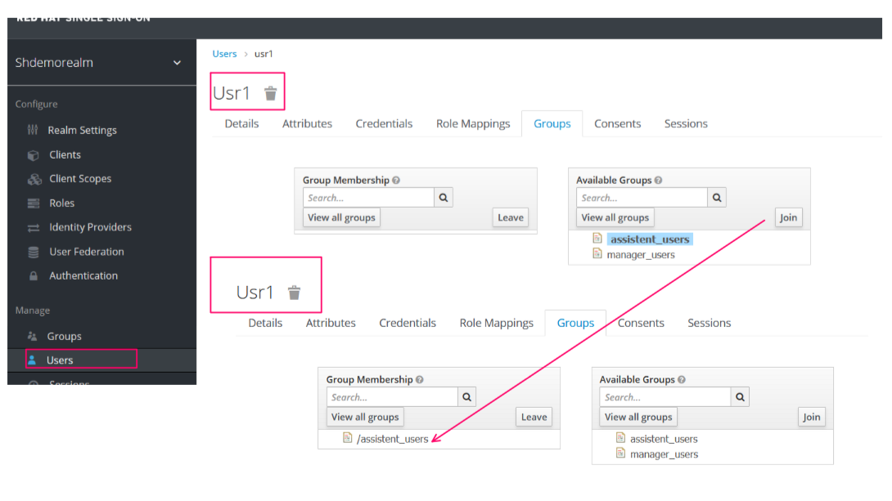
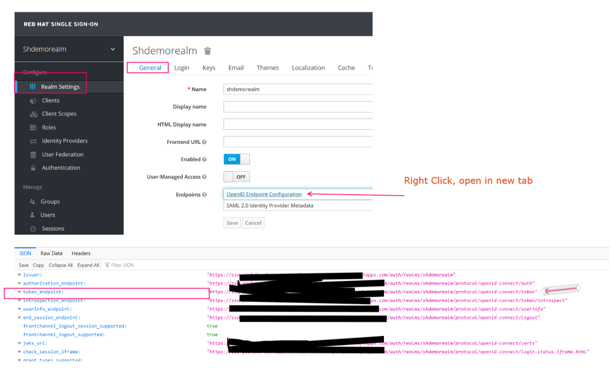

<!-- TOC BEGIN -->

- [1. Інтеграція keycloak з vue.js, Node.js express в openhsift](#p-1)
- [2. Розгортаня keycloak  в OpenShift](#p-2)
- [3. Основні терміни адмінітрування Keycloak](#p-3)
- [4. Ручна реєстрація програми клієнта](#p-4)
- [5. Налаштування прикладних ролей для програми клієнта](#p-5)
- [6. Створення користувачів для призначення їм ролей](#p-6)
- [7. Отримання авторизаційного токену по протоколу openid-connect](#p-7)
<!-- TOC END -->

## <a name="p-1">Інтеграція keycloak з vue.js, Node.js express в openhsift </a>

Продук [Keycloack](https://www.keycloak.org/) є зараз типовим  інструментом для авторизації в Web-based системах.  Документацію можна знайти за лінком: 
- Основна документація знаходиться за лінком [documentation](https://www.keycloak.org/documentation);
- За цим лінком знаходяться більш фокусовані описи [Фокусовані описи](https://www.keycloak.org/guides).

Ну на цьому зацікавився цим продуктом, щоб трохи розібратися як він працює та як його конфігурвати.


## <a name="p-2">Розгортаня keycloak  в OpenShift</a>

За звичай keycloak  можна підняти в контейнері, але він страртує в development mode. Так також там треба прив'язати базу даних типу postgresql. Я вирішив піти більш простим шляхом і роззоргнув його в хмарі RadHat в sendbox  OpsnShift.  Openshift sendbox можна створити за url: https://developers.redhat.com/developer-sandbox, а перед цим потрібно зарєструватися як developer на RedHat. Docker відкинув зразу, тому що  прочитав ліцензійні обмеження для корпорацій.

Щоб не мучитися з  лінкуванням бази даних та самого  сервісу keycloak  я використав калог уже підготованих продуктів, що є вже в любому OpenShift і в пару кліків розгорнув додаток [pic-01](#pic-01). 

<kbd></kbd>
<p style="text-align: center;"><a name="pic-01">pic-01</a></p> 

Через кілька хвилин я уже маю готовий keycloak:
<kbd></kbd>
<p style="text-align: center;"><a name="pic-02">pic-02</a></p> 

І уже натискаємо на роут [pic-03](#pic-03), попадаємо в консоль адміністрування. Можливо потрібно трохи зачекати, поки обидва сервіса стартонуть. Ну, там час старту такий собі, відчутний, але не критично. 

<kbd></kbd>
<p style="text-align: center;"><a name="pic-03">pic-03</a></p> 


Консоль адміністрування запросить логін та пароль. Вони знаходяться в env змінних Keycloak  так як показано на   [pic-04](#pic-04)

<kbd></kbd>
<p style="text-align: center;"><a name="pic-04">pic-04</a></p>

Залогінился і вуаля - попадаємо в  консоль адмінітрування, в головний realm

<kbd></kbd>
<p style="text-align: center;"><a name="pic-05">pic-05</a></p>


## <a name="p-3">Основні терміни адмінітрування Keycloak</a>

Адміністрування в keycloak ділиться на **realm**-и. 
- **Realm**  це одниця адміністрування, що інкапсулює в собі набори: користувачів, ролей, груп та набори додаткових повноважень (чи  прав). Тому, переше, що робимо,  реєструємо свій realm. Назвемо його **shdemorealm**. На [pic-06](#pic-06) показані основні елементи realm.

<kbd></kbd>
<p style="text-align: center;"><a name="pic-06">pic-06</a></p>

Keycloak підтримує як OpenID Connect (розширення OAuth 2.0), так і SAML 2.0. Коли говоримо про security, перше, що потрібно вирішити, це те, що з двох ви збираєтеся використовувати. Я вирішую використовувати OpenID Connect (розширення OAuth 2.0), тому в подальшому мова йде тільки про нього.

- **Client** - це прикладні додатки, що зареєстровані в окремо взятій realm. За звичай додатки аутентифікуються за допомогою clinet ID  або client ID та client secret. Ще є аутентифікація через JWT  токен, але зараз її не розглядаємо. Client ID and Client Secret - це традиційний метод, описаний у специфікації OAuth2. Клієнт має секрет, який повинен бути відомий як прикладному додатку, так і серверу Keycloak.

##  <a name="p-4">Ручна реєстрація програми клієнта</a>

Створюємо клієнта в client ID **DemoApp1**, як показано на [pic-06](#pic-06):

<kbd></kbd>
<p style="text-align: center;"><a name="pic-06">pic-06</a></p>


Після реєстрації зразу попадаємо на вікно [pic-07](#pic-07)

<kbd></kbd>
<p style="text-align: center;"><a name="pic-07">pic-07</a></p>

Тут треба звернути увагу на **Access Type**=public при логіні не поребує client Secret.  А при **Access Type**=confidential потребує client Secret. Зараз залишаємо **public**.


Треба звернути увагу на **Standard Flow Enabled**  треба включити в **"ON"**. Таким чином авторизація піде по стандартному OAuth2.0 за допомогою обміну autorization_code.

Далі потрібно налаштувати URL  додатка так, як показано на [pic-08](#pic-08).

<kbd></kbd>
<p style="text-align: center;"><a name="pic-08">pic-08</a></p>

Тобто, поки що нас цікавлять Root URL  та "правильний" redirect URL.  По ньому відбувається  переадресація у випадку успішного  логіна. Інші, пока що не задіяні.

Все, можна сказати в найпростішому варіанті клієнт-додаток зареєстровано.

## <a name="p-5">Налаштування прикладних ролей для програми клієнта</a>


Після  реєстрації додатку-клієнта  потрібно запараметризувати рольовий доступ до ресурсів програми. Рольовий досутп може ділитися на  по ролям. А ролі діляться на Realm Roles  та Client Roles. 

- Realm Roles  доступні для всього realm. Цей варіант не зовсім вигідний. Але прийнятний в деяких випадках
- Client Roles -  доступні для окремо зареєстрованого клієнта. Цей варіант, як на мене, більш прийнятний. Тому на ньому і зупинимося.

Для нашого майбутньго додатку створемо 2 ролі:

- app_viewer дозволяє тільки читати дані:
- app_editor дозволяє читати та змінювати дані.


Для цього створюємо ролі, як показано на [pic-09](#pic-09)

<kbd></kbd>
<p style="text-align: center;"><a name="pic-09">pic-09</a></p>

Щоб ролі передавалися на клієнта, потрібно пересідчитися, що вони включені в client scope, як на [pic-10](#pic-10).

<kbd></kbd>
<p style="text-align: center;"><a name="pic-10">pic-10</a></p>


## <a name="p-6">Створення користувачів для призначення їм ролей</a>

Набір коритсувачів є  єдиним на весь realm. Але користувачів можна розділити на групи. Набір груп теж єедний на весь realm. А от групи можна вже поэднати з ролями. Так і зробимо.

Процес створення користувачыв показано на [pic-11](#pic-11).

<kbd></kbd>
<p style="text-align: center;"><a name="pic-11">pic-11</a></p>

Тепер створимо групи користовучів і поділимо користувачів на  дві групи:

- **assistent_users** -  група кристувачів,  що  повинна тільки читати дані. Тобто цій групі повинна відповідати прикладна роль **app_viewer**.

- **manager_users** - група користувачів, що можуть змінювати дані. Тобто цій групі повинна відповідати роль **app_editor**. 

Процес створення груп показано на [pic-12](#pic-12) та  [pic-13](#pic-13).


<kbd></kbd>
<p style="text-align: center;"><a name="pic-12">pic-12</a></p>


<kbd></kbd>
<p style="text-align: center;"><a name="pic-13">pic-13</a></p>

Далі, потрібно пройтися по користувачах і додати кожного у відповідін групи так, як показано на [pic-14](#pic-14).

<kbd></kbd>
<p style="text-align: center;"><a name="pic-14">pic-14</a></p>

Тут треба зазначити, що якщо keycloak інтегрувати з Active Directory -  то групи користувачів будть зразу відображатися і розносити користувачів по групах в KeyCloak  не потрібно. Це робиться в Active Directory. У підсумку, користувачі по групах рознесені так, як показано на [pic-15](#pic-15).

<kbd></kbd>
<p style="text-align: center;"><a name="pic-15">pic-15</a></p>


На цьому етапі  співставлення: користувачі-групи-client roles виконано. можна переходити до етапа тестування логіну та отримання авторизаційногг токену.

# <a name="p-7">Отримання авторизаційного токену по протоколу openid-connect</a>

Для перевірки авторизації потрібно визначити, для початку, знайти "правильні" URL. Для цього. ідемо в налаштування realm та отримуємо json, як показано на [pic-16](#pic-16).

<kbd></kbd>
<p style="text-align: center;"><a name="pic-16">pic-16</a></p>

Далі беремо url в ключі **token_endpoint** та формуємо  http - запит на KeyCloack

- Method: Http=POST
- URL ${token_endpoint}
- Http Headers

```text

    Content-Type: application/x-www-form-urlencoded

```

- Request Body:

```text
    grant_type=password&client_id=DemoApp1&username=usr1&password=11111111

```

- Response Body:

```json
{
  "access_token": "eyJhbGciOiJSUzI1NiIsInR5cCIgOiAiSldUIiwia2lkIiA6ICJaUUhtZ0oya2R1b1FPOG12NTVoYU1vOXJKd1hMYVBGZ3VJRU9JejA5Y0xvIn0.eyJleHAiOjE2NzgyODAxODgsImlhdCI6MTY3ODI3OTg4OCwianRpIjoiMjE3NGNhNmUtZjcxMC00MDFkLWJiOGMtYzBjOTBlZWI0N2VhIiwiaXNzIjoiaHR0cHM6Ly9zc28tcGFzaGFreC1kZXYuYXBwcy5zYW5kYm94LW0zLjE1MzAucDEub3BlbnNoaWZ0YXBwcy5jb20vYXV0aC9yZWFsbXMvc2hkZW1vcmVhbG0iLCJhdWQiOiJhY2NvdW50Iiwic3ViIjoiNGJiNTQzZDktOGQ4NS00ZTcxLTlkOTYtMTA1YWNiNTE2MjNlIiwidHlwIjoiQmVhcmVyIiwiYXpwIjoiRGVtb0FwcDEiLCJzZXNzaW9uX3N0YXRlIjoiMzBhN2YwODMtNGFjZi00ZWY2LTg0MGEtZDA4YTYzZmMyNzAyIiwiYWNyIjoiMSIsInJlYWxtX2FjY2VzcyI6eyJyb2xlcyI6WyJkZWZhdWx0LXJvbGVzLXNoZGVtb3JlYWxtIiwib2ZmbGluZV9hY2Nlc3MiLCJ1bWFfYXV0aG9yaXphdGlvbiJdfSwicmVzb3VyY2VfYWNjZXNzIjp7IkRlbW9BcHAxIjp7InJvbGVzIjpbImFwcF92aWV3ZXIiXX0sImFjY291bnQiOnsicm9sZXMiOlsibWFuYWdlLWFjY291bnQiLCJtYW5hZ2UtYWNjb3VudC1saW5rcyIsInZpZXctcHJvZmlsZSJdfX0sInNjb3BlIjoicHJvZmlsZSBlbWFpbCIsInNpZCI6IjMwYTdmMDgzLTRhY2YtNGVmNi04NDBhLWQwOGE2M2ZjMjcwMiIsImVtYWlsX3ZlcmlmaWVkIjpmYWxzZSwibmFtZSI6ItCf0LXRgtGA0L4g0J_QtdGC0YDQtdC90LrQviIsInByZWZlcnJlZF91c2VybmFtZSI6InVzcjEiLCJnaXZlbl9uYW1lIjoi0J_QtdGC0YDQviIsImZhbWlseV9uYW1lIjoi0J_QtdGC0YDQtdC90LrQviJ9.S-xsR0RTac3YwF7hVX5f3N1W4qkoXcIXnnfIQVMKRAi99LCt4UqEKGIGBf_QtbGikMLnm7sSHJAesJIOoVURYklVNM0Hxb6xgy4gy6KGcgxabbeuDdLJsN2OVENTtFL9m3GQAAlN71w7ka8MmMxcxqYhEAxQtVwvCU1pa6tpkOpoQKpRB9CeNRuhx9KdziymvNR4AEhD8Q1QqB0yLvyjxQ_pkKGT808IpWPezvqMGXuLQ2yEfDV8sc3PFyQMhDCwLj5W-egvyJJq2bIgssNNYJ69WsX_WcnfPWOisErGIMijcNq7rFCEwrmIUdrTaTxyEfeJfJgU0MjJd1a-440WIA",
  "expires_in": 300,
  "refresh_expires_in": 1800,
  "refresh_token": "eyJhbGciOiJIUzI1NiIsInR5cCIgOiAiSldUIiwia2lkIiA6ICJkYTVmZWIwOS1hNWYxLTQwZjMtYjc5MC1iYTI0NGJkYTIyMDIifQ.eyJleHAiOjE2NzgyODE2ODgsImlhdCI6MTY3ODI3OTg4OCwianRpIjoiNjk0MTRkMGYtMTAyZS00Yzc1LThlNmQtNjRmZmY1ZjhmODhjIiwiaXNzIjoiaHR0cHM6Ly9zc28tcGFzaGFreC1kZXYuYXBwcy5zYW5kYm94LW0zLjE1MzAucDEub3BlbnNoaWZ0YXBwcy5jb20vYXV0aC9yZWFsbXMvc2hkZW1vcmVhbG0iLCJhdWQiOiJodHRwczovL3Nzby1wYXNoYWt4LWRldi5hcHBzLnNhbmRib3gtbTMuMTUzMC5wMS5vcGVuc2hpZnRhcHBzLmNvbS9hdXRoL3JlYWxtcy9zaGRlbW9yZWFsbSIsInN1YiI6IjRiYjU0M2Q5LThkODUtNGU3MS05ZDk2LTEwNWFjYjUxNjIzZSIsInR5cCI6IlJlZnJlc2giLCJhenAiOiJEZW1vQXBwMSIsInNlc3Npb25fc3RhdGUiOiIzMGE3ZjA4My00YWNmLTRlZjYtODQwYS1kMDhhNjNmYzI3MDIiLCJzY29wZSI6InByb2ZpbGUgZW1haWwiLCJzaWQiOiIzMGE3ZjA4My00YWNmLTRlZjYtODQwYS1kMDhhNjNmYzI3MDIifQ.m6MbJ1bVlbixDzURut5vOPmWVS5aD2o2GCw3v20YOY0",
  "token_type": "Bearer",
  "not-before-policy": 0,
  "session_state": "30a7f083-4acf-4ef6-840a-d08a63fc2702",
  "scope": "profile email"
}

```
Ну, або у вигляді curl

```bash
curl -X POST -k -H 'Content-Type: application/x-www-form-urlencoded' -i 'https://[domain.name]/auth/realms/shdemorealm/protocol/openid-connect/token' --data 'grant_type=password&client_id=DemoApp1&username=usr1&password=11111111'

```


Ну а якщо зайти в меню **sessions** або **users**,  то можна побачити всі підключені сесії жо жаного клієнта, та є можливісь всіх, або окремо взятого користувача - відключити [pic-17](#pic-17).

<kbd></kbd>
<p style="text-align: center;"><a name="pic-17">pic-17</a></p>

