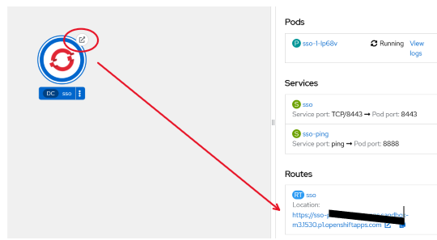

<!-- TOC BEGIN -->

- [1. Інтеграція keycloak з vue.js, Node.js express в openhsift](#p-1)
- [2. Розгортаня keycloak  в OpenShift](#p-2)

<!-- TOC END -->

## <a name="p-1">Інтеграція keycloak з vue.js, Node.js express в openhsift </a>

Продук [Keycloack](https://www.keycloak.org/) є зараз типовим  інструментом для авторизації в Web-based системах.  Документацію можна знайти за лінком: 
- Основна документація знаходиться за лінком [documentation](https://www.keycloak.org/documentation);
- За цим лінком знаходяться більш фокусовані описи [Фокусовані описи](https://www.keycloak.org/guides).

Ну на цьому зацікавився цим продуктом, щоб трохи розібратися як він працює та як його конфігурвати.

## <a name="p-2">Розгортаня keycloak  в OpenShift</a>

За звичай keycloak  можна підняти в контейнері, але він страртує в development mode. Так також там треба прив'язати базу даних типу postgresql. Я вирішив піти більш простим шляхом і роззоргнув його в хмарі RadHat в sendbox  OpsnShift.  Openshift sendbox можна створити за url: https://developers.redhat.com/developer-sandbox, а перед цим потрібно зарєструватися як developer на RedHat. Docker відкинув зразу, тому що  прочитав ліцензійні обмеження для корпорацій.

Щоб не мучитися з  лінкуванням бази даних та самого  сервісу keycloak  я використав калог уже підготованих продуктів, що є вже в любому OpenShift і в пару кліків розгорнув додаток [pic-01](#pic-01). 

<kbd></kbd>

<a name="pic-01">pic-01</a>
 

Через кілька хвилин я уже маю готовий keycloak:
<kbd></kbd>

<a name="pic-02">pic-02</a>
 

І уже натискаємо на роут [pic-03](#pic-03), попадаємо в консоль адміністрування. Можливо потрібно трохи зачекати, поки обидва сервіса стартонуть. Ну, там час старту такий собі, відчутний, але не критично. 

<kbd></kbd>

<a name="pic-03">pic-03</a>
 

Консоль адміністрування запросить логін та пароль. Вони знаходяться в env змінних Keycloak  так як показано на   [pic-04](#pic-04)

<kbd></kbd>

<a name="pic-04">pic-04</a>

Залогінился і вуаля - попадаємо в  консоль адмінітрування, в головний realm

<kbd></kbd>

<a name="pic-05">pic-05</a>

