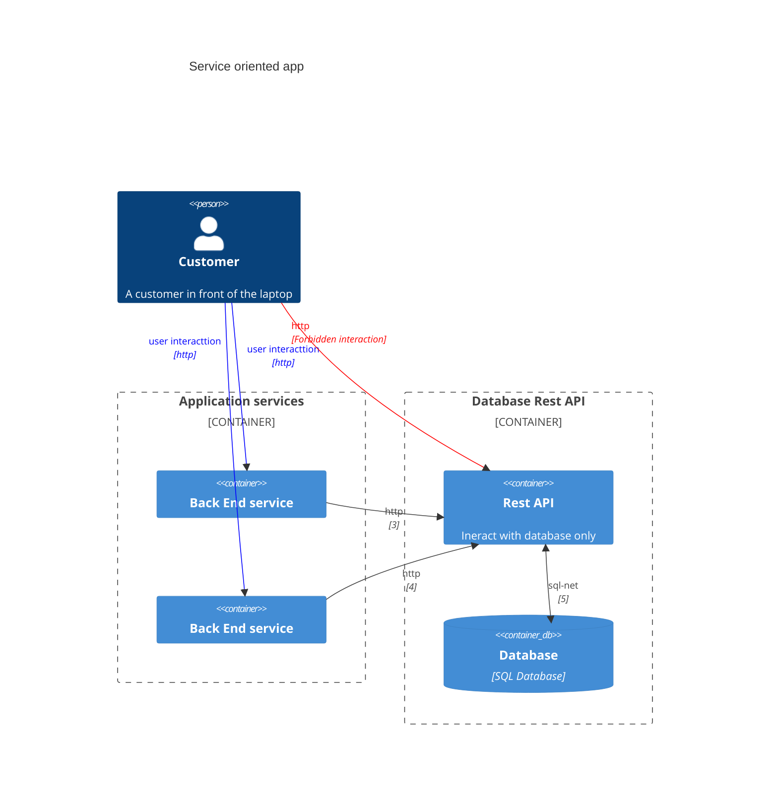

<!-- TOC BEGIN -->

<!-- TOC END -->

## <a name="p-1">Постановка проблеми</a>

При розробці сучасних багатосервісних систем частно виникає необхідність захисту даних на трансопортному рівні. Тому це було першопричиною для того щоб розібратися в цьому, а потім написати цей блог. А в процесі вивчення тми виникли додаткові аргументи в цій сфері.

На приклад маємо таку архітектуру компонентів:

Синіми та чорними лініями показана дозволена взаємодія клієнта (сині) та сервісів (чорні). Червона лінія показує  заборонену взаємодію. Може виникнути питання чому ця дія заборонена. На компоненті RestApi скоріше за все немає аутентифікації користувача. Більш того, backend сервіси можуть організовувати с RestApi сервісом взаємодію, по специфічному шаблону взаємодії типу: webpooling чи webhook -  для того щоб не перевантажити сервіс, чи отримати дані послідовно, порціями, а потім користувачу віддати вже все. При чому, customer  це не завжди вреднючий користувач. Просто він користується такми фронтом, де програміст зробив "покращення", тому що так швидше.

Тут стає питання, як забезпечити тількт дозволені комунікації між сервісами. Більш того, За звичай існує 2 середовища: продуктивне та тестове. І, потрібно максимально ізолювати їх між собою. І не завжди мереживні технології дозволяють це зробити. Тому, одним із швидих  методів дозволити тільки очевидні комунікації між сервісами може забезпечити використання TLS  протоколів з різними типами атворизації.

<iframe
  src="https://github.com/pavlo-shcherbukha/tls-self-sign-certs#tls-self-sign-certs-%D0%BD%D0%B0%D0%B1%D1%80%D1%96-%D0%BA%D1%80%D0%BE%D0%BA%D1%96%D0%B2-%D0%B4%D0%BB%D1%8F-%D0%B3%D0%B5%D0%BD%D0%B5%D1%80%D0%B0%D1%86%D1%96%D1%97-%D1%81%D0%B0%D0%BC%D0%BE%D0%BF%D1%96%D0%B4%D0%BF%D0%B8%D1%81%D0%BD%D0%B8%D1%85-tls--%D1%81%D0%B5%D1%80%D1%82%D0%B8%D1%84%D1%96%D0%BA%D0%B0%D1%82%D1%96%D0%B2"
  style="width:100%; height:300px;"
></iframe>

