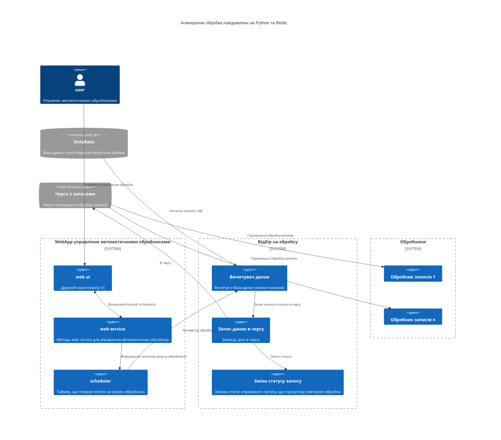
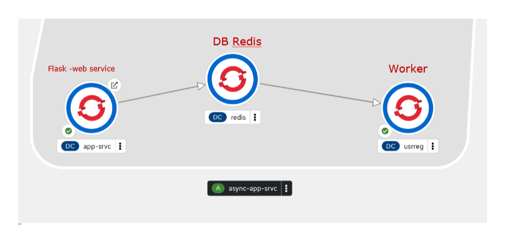
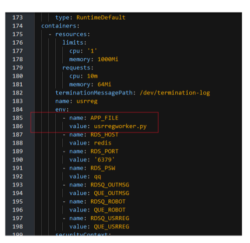

<!-- TOC BEGIN -->
- [1. Про що цей блог](#p-1)
- [2. Інструменти, що використовуються](#p-2)
- [3. Коротко про сутності черг Redis](#p-3)
- [4. Постановка задачі для прототипа](#p-4)


<!-- TOC END -->

## <a name="p-1">Про що цей блог</a>

В рамках роботи над черговим проектом  виникла необхідність в організації асинхронної обробки повідомлень. Нє, ну можна було по тупому, зробити жорстку зв'язку  і викликади web сервіси один за одним. Але web service за визначенням є не надійним з'єднанням, тому потрібно організувати асинхронну обробку з можливісю масштабування. Ну, можна було використати IBM Integration Bus, але монстрозно. Ну як варіант, можна використати Node.js або Node-Red, але в мене XML в протоколах обміну даних, причому може бути досить великих об'ємів. А XML для JavaScript   то не природньо. Крім того, ще додаткові не стандартні криптографічні присідання, що не властиві JavaScript. Тому вибір впав на Python. А з додаткових інструментів MiddleWare у мене є можливість використати тільки Redis. Нєє, ну більш просунуті скажуть:  "Rabbit MQ, Kafka" -  так, я теж згоден. Але,  вони так і на з'явилися для використання за рік. Тому у мене є Redis, Python, NoSql CouchDB що запускаються в OpenShift - і потрібно організувати асинхронну обробку. Спершу я панікнув з приводу бідноти вибору інструментів. Але чим більше я вивчав їх, тим більше в мене складалося враження, що маючи контейнерну платформу Kubernetes/RedHat OpenShift - та Python, Redis, CouchDB - тобі не потрібні монстрозні IBM MQ та IBM Integration Bus (AppConnect-Enterprise). Python, Redis, CouchDB дозволяють зробити туж саму функціональність набагато простіше і швидше. А маючи нормального DevOps іненера на OpenShift - deployment буде літати, а процеси крутитися.  
Якщо все підсумувати, то мені треба побудувати прототип, що буде реалізовувати  архітектуру подібну до того, що показана на [diag-1](#diag-1). Там базу даних можна замінити на Web Service,  але концептуально нічого не змінить. А основний аргумент любителів IBM MQ  про тразакційність легко відкидається, коли в ланцюжку  появляється хоть один Web Service, що працюэ по http. Бо http -  не транзакційний і в такому випадку не відомо що більше нашкодить - наявність транзакційності в IBM MQ  чи її відсутність. Для прикладу, після черги в ланцюжку два http сервіса. Один відпрацював, а нстпний ні. повідомлення повернулося в чергу і потім знову повторилося. Тільки тепер дублюючий запис появився в першому сервісі, а други теж ідпрацював.  Або навіть один http сервіс, відпрацював з помилкою, але дані в БД вніс, а на моменті відповіді зв'язок розірвався. Повторний його виклик задублює дані. ВСі інші присідання з приводу: перш ніж  вносити зміни в БД треба перевірити або, якщо помилка, то треба мати  потік видалення змін - то не має стосунку до транзакційності. То ми так ще на FoxPro  під DOS писали, так би мовити відкочували  логічні транзакції, що створив програміст в процесі розробки.   

<p style="text-align: center;">Приблизна архітектура для якої потрібно розробити прототип</p>


<p style="text-align: center;"><a name="diag-1">diagram-1</a></p>

Таку архітектуру можна реалізувати на IBM IntegrationBus (AppConnect-Enterprise),  а можна реалізувати за допомогою Python  та  Redis  на контейнерах, що запуститься не важно де (в OpenShift, в Kubernetes,  на віртуалках, в контейнерах в DockerComposer і практично ) і притому в любій хмарі, на відміну від IBM IntegrationBus (AppConnect-Enterprise), яка потребує ліцензій, важко засунеться в хмару і контейнери, бо воно просто велике.

Щоб перевірити свій вибір я полазив по інтернету і попав на [блог компанії twillo](https://www.twilio.com/blog). А [Twillo](https://www.twilio.com/en-us/why-twilio) являє собою велику комунікаційну платформу. І в її блозі наткнувся на цікаву статтю [Asynchronous Tasks in Python with Redis Queue](https://www.twilio.com/blog/asynchronous-tasks-in-python-with-redis-queue) а потім ще на [Queueing Emails With Python, Redis Queue And Twilio SendGrid](https://www.twilio.com/blog/queueing-emails-python-redis-queue-twilio-sendgrid), що підтверджує правильність вибраних інстументів. Єдине що, треба навчитися їх використовувати. Цей блог і просвячений спробі побудувати архітектуру, наближену до [diag-1](#diag-1) та спробувати оцінити на стільки це простіше чи складніше ніж писати схоже на IBM MQ та IBM Integration Bus (AppConnect-Enterprise), бо на шині робив це вже не раз. Можливо, спробувати оцінити  плюси та мінуси кожного з  варіантів. 


### <a name="p-2">2. Інструменти, що використовуються</a>

- Для  побулови WebService  та WebUI  використовуємо [Python Flask](https://flask.palletsprojects.com/en/2.3.x/).
Для почтаківця є серія описів, як працювати з Flask:
    - [Python - flask star](https://pavlo-shcherbukha.github.io/posts/2022-09-02/python-flask-1/).
    - [Python - flask запуск в контейнері від RadHat UBI8](https://pavlo-shcherbukha.github.io/posts/2022-09-02/python-flask-2/).
    - [Remote debug Python Flask app on openshift](https://pavlo-shcherbukha.github.io/posts/2023-03-29/remote_debug_py_flask_app_on_openshift/).

- Для збереження глобальних змінних використовую [Redis](https://redis.io/) и бібіліотеку для python [Python redis client](https://redis.io/docs/clients/python/) або прямий лінк на github [redis-py](https://github.com/redis/redis-py) та на [PyPI](https://pypi.org/project/redis/). Треба зазначити що Redis вже поставляється  в OpenShift у якості шаблона і легко може бути  розгорнута в проекті.

- Для роботи з чергами redis використовую бібліотеку Python redis rq
    * [redis rq](https://python-rq.org/)
    * [Github rq](https://github.com/rq/rq).

   Додатково можна використати бібіліотеку [rqmonitor](https://pypi.org/project/rqmonitor/)  що є UI для моніторингу черг в Redis.

- Запускається все в хмарі Red Hat  на пісочниці OpenShift [OpenShift developer-sandbox](https://developers.redhat.com/developer-sandbox). Додатково, можна почитати за лінком як зайти на sendbo [create-openshift-sendbox](https://github.com/pavlo-shcherbukha/google-sheet-to-db#create-openshift-sendbox). 

- В якості базового контейнера використовується RedHat UBI8  з адаптацією під Python3.9 [ubi8/python-39](https://catalog.redhat.com/software/containers/ubi8/python-38/5dde9cacbed8bd164a0af24a).

-  База данних [postgresql](https://www.postgresql.org/),  що вже поставляється в OpenShift як шаблон і може бути легко розгорнута в проекті.  Клієнт Python до Postgresql [psycopg2 на PyPI](https://pypi.org/project/psycopg2/). Додатково, як працювати з Postgres  на OpenShift  можна почитати за лінком [Виконання DDL скриптів в БД Postgres  на openshift](https://github.com/pavlo-shcherbukha/bankapi-demo/blob/master/openshift/readme.md)


Додатково, можна використати цікаву бібліотку для redis [rq_scheduler](https://github.com/rq/rq-scheduler). Але я не використав, тому що потрібно  запускати додатковий процес, що буде постійно крутитися, а його  ж моніторити треба . 

- Приклад прототипу можна взяти за лінком на github [flask-redis-rq Async workes using redis and flask and redis queue](https://github.com/pavlo-shcherbukha/flask-redis-rq).


<kbd></kbd>
<p style="text-align: center;"><a name="pic-02">pic-02</a></p>


## <a name="p-3">3. Коротко про сутності черг Redis</a>

Чим сподобалася Redis. Redis дає можливість зберігати глобальні змінні окремо від контейнера (чи контейнерів одного типу), що запущені. Особливо  цінно, що після перезапуску контейнера, він прочинає записані перед цим дані в Redis і відновить свій стан. Причому, читання-запис відбувається досить швидко.

В Redis створюються черги **queue**. На відміну звичайних черг, що оперують з повідомленнями, тут в чергу вкладається  сутність **task** що являє собою функцію на python з параметрами. А от одним з її параметрів і може бути повідомлення.  

Помістити в чергу task з параметрами можна помістити кількома функціями, які потім визначають порядок обробки повідомлень, а саме:

- **queue.enqueue** -  просто помістити task в чергу;
- **queue.enqueue_at** -  помістити task в чергу, що виконається у вказаний час;
- **queue.enqueue_in** -  помістити task в чергу, що виконається через вказаний промижок часу.

Рузультатм роміщення task  в черзі є сутність **Job**. От **Jobs** і виконуються окремим фоновим  процесом, що має назву **worker**. Фактично worker являє собою маленький самодостатній модуль python, дуже маленький,  що запускається в опреційній системі. **worker** вибирає з черги **Jobs** і виконує **task** з параметрами, що вказані в ньому. 

При виконанні **queue.enqueue** є ще одна особливість. Можна вказати callback функції, що будть виконуватися при окремих умовах, а саме:
- умова **on_success** - виконується функція коли **Job** завершив свою роботу успішно.
- умова **on_failure** - виконується коли виконання Job закінчилося помилкою.

- умова **on_stopped** - виконуэться коли **Job** перейшов в статус **stopped**. Зупиняється **Job** спеціальною функцією *send_stop_job_command()* і більше вже  автоматично не виконується.

Там ще є можливості вибудувати залежності в виконанні **Job**s - тобто встановлювати послідовність їх виконання. Встановлювати час "життя" **Jobs**  та кількість спроб викнатися. 

Всю мінімальну інофрмацію взято за лінком: https://python-rq.org/docs/ (він у мене вказаний в розділі інстументів). 
Якщо підсумувати, то можна побудувати таку аналогію з чергами IBM MQ  та IBM Inegration Bus (AppConnect Enterprise):

- **task** це **compute node** - вузол трансформації  в шині, або багато **compute node**s(вузолів трансформації); 
- **job** це повідомлення та його заголовок в черзі, id, cirel id, repeat in queue  та багато іншого, що розмазано по шині та можливостях IBM MQ;
- **worker** це по суті message flow;
- Ну а **callback**s: **on_success**, **on_failure**, **on_stopped** виконують функцію транзакційності IBM MQ  та ще багато чого іншого.   

Далі, щоб показати як це працює, підготовано дві постановки задачі на прототипування.

## <a name="p-4">4. Постановка задачі для прототипа</a>

1. Потрібно розробити  [Простий асинхронний обробник](#p-4)  простий обробник, який прийме дані з Web форми та через чергу Redis  доведе їх до обробника. Передбачається що обробник оди. Він ніякої роботи не виконує, я тільки виводить в лог отримані дані Web форми.  Цей пункт потрібен для емонстрації та вивчення, що все працює.


2. Потрібно розробити автоматичний обробник, який буде запускатися та зупинятися користувачем через Web UI інтефейс. При цьому, наступний цикл обробки запускається після зауінчення попереднього та після деякого часу очікування. Основні обробники можуть працювати в паралель і можна запараметризувати кількість паралельних обробників. 

## <a name="p-4">4. Простий асинхронний обробник</a>
Приклад знаходиться в репозиторії: [flask-redis-rq Async workes using redis and flask and redis queue](https://github.com/pavlo-shcherbukha/flask-redis-rq.git)
Цей прототип складається з Web форми, в яку вводяться кілька реквізитів. По команді **submus** виконується http метод post та отримує введені дані у вигляді json (dictionary). Отримані дані поміщаються в чергу  з простим обробником, який вичитує праметри форми та виводить отримані дані в лог.  Ну і все задеплоєно в OpenShift. На [pic-01](#pic-01) показано як виглядає задеплоєний проект

<kbd></kbd>
<p style="text-align: center;"><a name="pic-01">pic-01</a></p>

Запис в чергу виконується в  модуі flask [app_srvc/views.py](https://github.com/pavlo-shcherbukha/flask-redis-rq/blob/main/app_srvc/views.py):
```py
@application.route("/userregres/", methods=["POST"])
def ui_user_reg_res():
    """
        User registration 
        Process POST request
        Send user data from http form into queue 
    """
    label="ui_user_reg_res" 
    body={}
    mimetype = request.mimetype
    log("choose right  mimetype", label)
    if mimetype == 'application/x-www-form-urlencoded':
        iterator=iter(request.form.keys())
        for x in iterator:
            body[x]=request.form[x]            
    elif mimetype == 'application/json':
        body = request.get_json()
    else:
        orm = request.data.decode()

    log('Request body is: ' + json.dumps(  body ), label)
    log( "Send the body into queue " + q_usrreg.name, label)

    #==================== Запис в чергу ========================
    job=q_usrreg.enqueue(app_srvc.task_usrreg.task_processor, body)
    #===============================================================

    log( "Message sent into queue with job_id="+ job.get_id())
    log('Вертаю результат: ' )

    return render_template("user_reg_resp.html" , data={ "jobid": job.get_id(), "queue": q_usrreg.name})
```

Параметр: **app_srvc.task_usrreg.task_processor** вказує на task а **body** - то параметр -тіло запиту, з даними форми.

Ось як вигляжає **task** [app_srvc/task_usrreg.py](https://github.com/pavlo-shcherbukha/flask-redis-rq/blob/main/app_srvc/task_usrreg.py)

```py
def task_processor( user_profile ):
    """
      Демо процесор для форми реєсрації користувача
    """
    label="task_processor"
    log("task processor", label)
    log("Обробляю запис " + json.dumps( user_profile ), label)
    delay=random.randint(5, 15) 
    log( "Запускаю затримку оброника на (сек)" + str(delay), label)
    time.sleep(delay)

    log( "======================================================================", label)
    log( "Обробник роботу виконав !!!!", label)
    log( "======================================================================", label)
    return True

```

Тепер потрібно зробити worker. Worker знаходиться за лінком: [usrregworker.py](https://github.com/pavlo-shcherbukha/flask-redis-rq/blob/main/usrregworker.py). якщо відкинути підключення до redis  то всьго worker:

```py
 with Connection(red):
        log("Create worker", label)
        worker = Worker(map(Queue, listen))
        log("Create worker-OK [" + worker.name + "]", label)
        try:
            log("Start worker", label)
            worker.work(logging_level="DEBUG", with_scheduler=False)
            log("Worker is finished", label)
        except Exception as e:
            print(e)   
#
if __name__ == '__main__':
    run_worker()


```

Тепер цей worker деплоється в окремий контейнер і запускається як окремий процес. Deployment відбувається по шаблон в стандартний UBI8 контейнер від RedHat. Шаблон знахдиться в катлозі openshift [openshift/async-worker-templ.yaml](https://github.com/pavlo-shcherbukha/flask-redis-rq/blob/main/openshift/async-worker-templ.yaml). Тут все будується по шаблону, а параметризація вібувається в cmd  файлі:

```bash
set fltempl=async-worker-templ.yaml 
set fldepl=async-usrreg-depl.yaml 


set DATABASE_SERVICE_NAME=redis
set APP_SERVICE_NAME=usrreg
set APP_NAME=async-app-srvc
set GIT_BRANCH=main
set GIT_URL=https://github.com/pavlo-shcherbukha/flask-redis-rq.git
set DOCKER_PTH=./Dockerfile
set WORKER_RUNNER=usrregworker.py


oc delete -f %fldepl%
pause
oc process -f %fltempl%  --param=NAMESPACE=%APP_PROJ% --param=DATABASE_SERVICE_NAME=%DATABASE_SERVICE_NAME% --param=APP_SERVICE_NAME=%APP_SERVICE_NAME% --param=APP_NAME=%APP_NAME% --param=GIT_BRANCH=%GIT_BRANCH% --param=GIT_URL=%GIT_URL% --param=DOCKER_PTH=%DOCKER_PTH% --param=WORKER_RUNNER=%WORKER_RUNNER% -o yaml > %fldepl% 
pause
oc create -f %fldepl%
pause

```

В даному випадку міняється тільк найменування worker (іншими словами - запускаючий скрипт): 

```bash
set WORKER_RUNNER=usrregworker.py
```
Ось, на [pic-02](#pic-02) показано, де вказується файл що заускається в контейнері. Ну, це специфічно для контейнерів UBI8

<kbd></kbd>
<p style="text-align: center;"><a name="pic-01">pic-02</a></p>