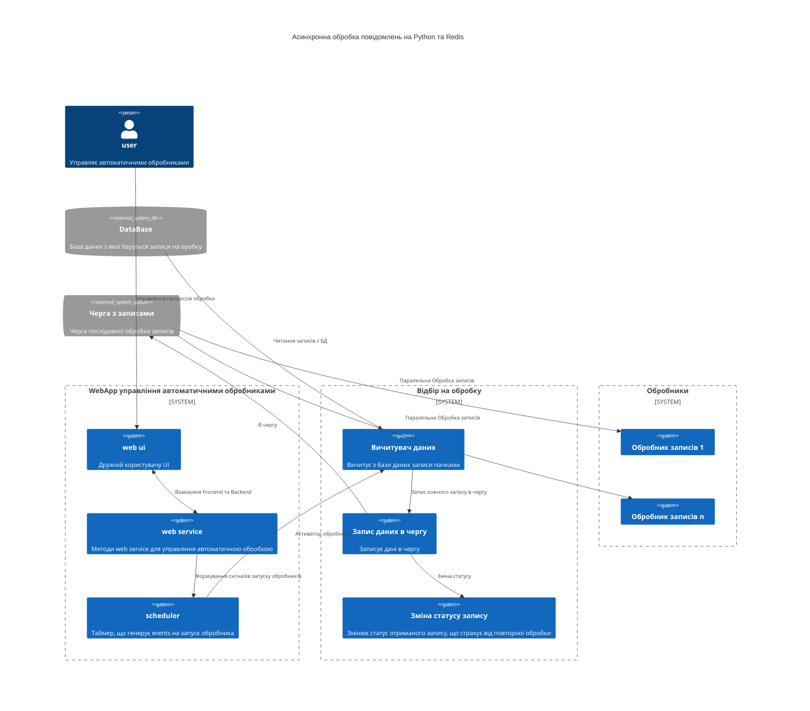

<!-- TOC BEGIN -->
- [1. Про що цей блог](#p-1)
- [2. Інструменти, що використовуються](#p-2)

<!-- TOC END -->

## <a name="p-1">Про що цей блог</a>

В рамках роботи над черговим проектом  виникла необхідність в організації асинхронної обробки повідомлень. Нє, ну можна було по тупому, зробити жорстку зв'язку  і викликади web сервіси один за одним. Але web service за визначенням є не надійним з'єднанням, тому потрібно організувати асинхронну обробку з можливісю масштабування. Ну, можна було використати IBM Integration Bus, але монстрозно. Ну як варіант, можна використати Node.js або Node-Red, але в мене XML в протоколах обміну даних, причому може бути досить великих об'ємів. А XML для JavaScript   то не природньо. Крім того, ще додаткові не стандартні криптографічні присідання, що не властиві JavaScript. Тому вибір впав на Python. А з додаткових інструментів MiddleWare у мене є можливість використати тільки Redis. Нєє, ну більш просунуті скажуть:  "Rabbit MQ, Kafka" -  так, я теж згоден. Але,  вони так і на з'явилися для використання за рік. Тому у мене є Redis, Python, NoSql CouchDB що запускаються в OpenShift - і потрібно організувати асинхронну обробку. Спершу я панікнув з приводу бідноти вибору інструментів. Але чим більше я вивчав їх, тим більше в мене складалося враження, що маючи контейнерну платформу Kubernetes/RedHat OpenShift - та Python, Redis, CouchDB - тобі не потрібні монстрозні IBM MQ та IBM Integration Bus (AppConnect-Enterprise). Python, Redis, CouchDB дозволяють зробити туж саму функціональність набагато простіше і швидше. А маючи нормального DevOps іненера на OpenShift - deployment буде літати, а процеси крутитися.  
Якщо все підсумувати, то мені треба побудувати прототип, що буде реалізовувати  архітектуру подібну до того, що показана на [diag-1](#diag-1). НТам базу даних можна замінити на Web Service,  але концептуально нічого не змінить. А основний аргумент любителів IBM MQ  про тразакційність легко відкидається, коли в ланцюжку  появляється хоть один Web Service, що працюэ по http. Бо http -  не транзакційний і в такому випадку не відомо що більше нашкодить - наявність транзакційності в IBM MQ  чи її відсутність.  

Приблизна архітектура для якої потрібно розробити прототип

<a name="diag-1">diagram-1</a>

Таку архітектуру можна реалізувати на IBM IntegrationBus (AppConnect-Enterprise),  а можна реалізувати за допомогою Python  та  Redis  на контейнерах, що запуститься не важно де (в OpenShift, в Kubernetes,  на віртуалках, в контейнерах в DockerComposer і практично ) і притому в любій хмарі, на відміну від IBM IntegrationBus (AppConnect-Enterprise), яка потребує ліцензій, важко засунеться в хмару і контейнери, бо воно просто велике.

Щоб перевірити свій вибір я полазив по інтернету і попав на [блог компанії twillo](https://www.twilio.com/blog). А [Twillo](https://www.twilio.com/en-us/why-twilio) являє собою велику комунікаційну платформу. І в її блозі наткнувся на цікаву статтю [Asynchronous Tasks in Python with Redis Queue](https://www.twilio.com/blog/asynchronous-tasks-in-python-with-redis-queue) а потім ще на [Queueing Emails With Python, Redis Queue And Twilio SendGrid](https://www.twilio.com/blog/queueing-emails-python-redis-queue-twilio-sendgrid), що підтверджує правильність вибраних інстументів. Єдине що, треба навчитися їх використовувати. Цей блог і просвячений спробі побудувати архітектуру, наближену до [diag-1](#diag-1) та спробувати оцінити на стільки це простіше чи складніше ніж писати схоже на IBM MQ та IBM Integration Bus (AppConnect-Enterprise), бо на шині робив це вже не раз. Можливо, спробувати оцінити  плюси та мінуси кожного з  варіантів. 

### <a name="p-2">2. Інструменти, що використовуються</a>

- Для  побулови WebService  та WebUI  використовуємо [Python Flask](https://flask.palletsprojects.com/en/2.3.x/).
Для почтаківця є серія описів, як працювати з Flask:
    - [Python - flask star](https://pavlo-shcherbukha.github.io/posts/2022-09-02/python-flask-1/).
    - [Python - flask запуск в контейнері від RadHat UBI8](https://pavlo-shcherbukha.github.io/posts/2022-09-02/python-flask-2/).
    - [Remote debug Python Flask app on openshift](https://pavlo-shcherbukha.github.io/posts/2023-03-29/remote_debug_py_flask_app_on_openshift/).

- Для збереження глобальних змінних використовую [Redis](https://redis.io/) и бібіліотеку для python [Python redis client](https://redis.io/docs/clients/python/) або прямий лінк на github [redis-py](https://github.com/redis/redis-py) та на [PyPI](https://pypi.org/project/redis/). Треба зазначити що Redis вже поставляється  в OpenShift у якості шаблона і легко може бути  розгорнута в проекті.

- Для роботи з чергами redis використовую бібліотеку Python redis rq
    * [redis rq](https://python-rq.org/)
    * [Github rq](https://github.com/rq/rq).

   Додатково можна використати бібіліотеку [rqmonitor](https://pypi.org/project/rqmonitor/)  що є UI для моніторингу черг в Redis.

- Запускається все в хмарі Red Hat  на пісочниці OpenShift [OpenShift developer-sandbox](https://developers.redhat.com/developer-sandbox). Додатково, можна почитати за лінком як зайти на sendbo [create-openshift-sendbox](https://github.com/pavlo-shcherbukha/google-sheet-to-db#create-openshift-sendbox). 

- В якості базового контейнера використовується RedHat UBI8  з адаптацією під Python3.9 [ubi8/python-39](https://catalog.redhat.com/software/containers/ubi8/python-38/5dde9cacbed8bd164a0af24a).

-  База данних [postgresql](https://www.postgresql.org/),  що вже поставляється в OpenShift як шаблон і може бути легко розгорнута в проекті.  Клієнт Python до Postgresql [psycopg2 на PyPI](https://pypi.org/project/psycopg2/). Додатково, як працювати з Postgres  на OpenShift  можна почитати за лінком [Виконання DDL скриптів в БД Postgres  на openshift](https://github.com/pavlo-shcherbukha/bankapi-demo/blob/master/openshift/readme.md)

Додатково, можна використати цікаву бібліотку для redis [rq_scheduler](https://github.com/rq/rq-scheduler). Але я не використав, тому що потрібно  запускати додатковий процес, що буде постійно крутитися, а його  ж моніторити треба . 

- Приклад прототипу можна взяти за лінком на github [flask-redis-rq Async workes using redis and flask and redis queue](https://github.com/pavlo-shcherbukha/flask-redis-rq).

<kbd></kbd>

<a name="pic-02">pic-02</a>

## <a name="p-2">Установка IBM CLI та необхідних плагінів.</a>

