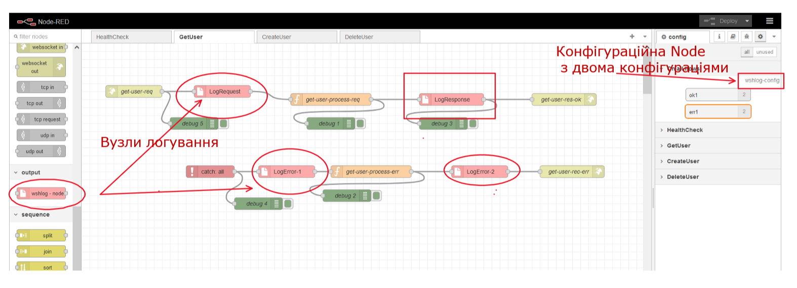
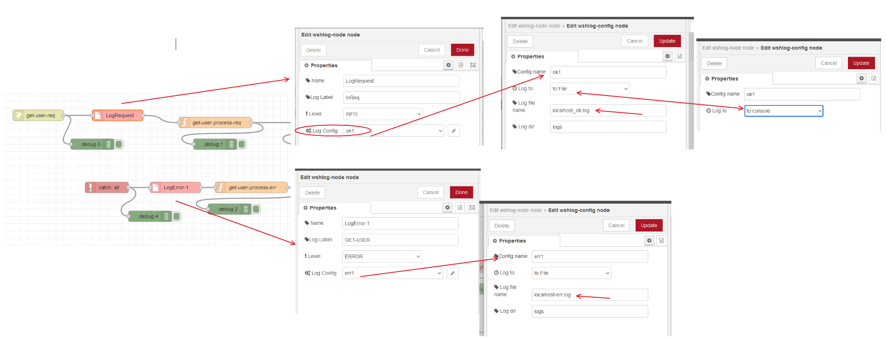

<!-- TOC BEGIN -->
- [1. Про що цей блог](#p-1)
- [2. Розгортання середовища розробки](#p-2)
- [3. Коротко про сутності черг Redis](#p-3)
- [4. Постановка задачі для прототипа](#p-4)
- [5. Автоматичний обробник, який буде запускатися та зупинятися користувачем](#p-5)

<!-- TOC END -->

## <a name="p-1">Про що цей блог</a>

Працюючи з Node-Red мені знадобилося зробити логування в JSON спеціальної структури. Переглянув я існуючі  node - вони мене не влаштували. Вирішив зробити свою. До цього я раніше їх не робив, але, як виявилося, все не так складно. За 2-3 дні  уже більш-менш запрацювало  
Приклад можна знайти в моєму [github repo]()
В цьому блозі я ділюся доствідом, як створвати custom node. Фактично, мені прийшлося створити дві Node:
- [конфігураційну  node](https://nodered.org/docs/creating-nodes/config-nodes), як є глобальною для всього flow  файлу
- [звичайну Node](https://nodered.org/docs/creating-nodes/first-node), але яка використовує парметри конфігураційної Node.
Зрозуміло, що Node [запакована в пакет](https://nodered.org/docs/creating-nodes/packaging), який можна помістити в npm  репозиторій, або у власний репозиторій.

Єдине, що я не зробив, так це не освоїв [unit тестів для нової node](https://nodered.org/docs/creating-nodes/first-node#testing-your-node-in-node-red). Але, сподіваюся я це зроблю в недалекому майбутньому.


По факту, я зробив собі **custom node**, що логує мені  роботу flows в JSON структуру, використовуючи winstin  логер. Найближчим  до моєї ідеє є [/node-red-contrib-flogger](https://flows.nodered.org/node/node-red-contrib-flogger).

розібравшись з цим підходом я  розумію, що в мене не буде великих проблем написати якийсь власний конектор до бази даних чи черги чи якогось іншого сервера. Підходи я відпрацював на цьому простому прикладі.


### <a name="p-2">2. Формалізація задачі</a>

Мені потрібно розробити custon Node, яка буде пропускати повідомлення "через себе" та логувати в файл або в консоль записи у вигляді json, а саме:
- саме повідомлення;
- глобальний контекст;
- flow контекст.
Локальний node-контекст не зможу логувати. Потрібно буде подумати з приводу логування вхідних реквізитів http запиту, но це не в цьому блозі.

Конфігурація Node розділяється на 2 розділи:
- глобальний, тобто налаштування спільні для всіх вузлів логування;
- локальний, тобто налаштування, специфічні для окремо взятого вузла.

До глобальних налаштувань відносяться такі налаштування:

- куди логувати: в файл   чи в консоль
- якщо в файл, то потрібно задати каталог та ім1я файлу логу
- бажано, щоб таких конфігурацій можна було б задаи кілька: одну для помилок, другу для звичайного потоку операцій

До локальних налаштуван відносяться:
- loglevel (info, debug, error, trace...)
- loglabek - мітка, яка б дала розуміння з  якого вузла прийшла запис в лог


Структура лога повинна бути приблизно така:

```json
[
    {
        "hostname": "localhost",
        "label": "InReq",
        "level": "info",
        "message": {
            "flow_context": {},
            "global_context": {},
            "payload": {
                "id": "450"
            }
        },
        "timestamp": "2023-09-08T19:58:35.874874+03:00"
    },
    {
        "hostname": "localhost",
        "label": "GET-USER",
        "level": "info",
        "message": {
            "flow_context": {},
            "global_context": {},
            "payload": {
                "fullname": "Petro Petrenko",
                "id": "150",
                "phone": "222-33-44"
            }
        },
        "timestamp": "2023-09-08T19:59:02.278278+03:00"
    }
]

```

- hostname вказує на адресу віртуалки чи контейнера, де запущено екземпляр flow
- label вказує на  джерело, відкіль прийшов запис
- level  вказує на рівень лошування
- message  повідомлення або структура, що логується
- timestamp  дата та час, коли зроблено запис


На [pic-01](#pic-01)  показано простенький flow з Noda-ми  логування.

<kbd></kbd>
<p style="text-align: center;"><a name="pic-01">pic-01</a></p>

А на  [pic-02](#pic-02) показана параметризація вузлів логування. Як видно з малюнка запараметризовано запис  логів у файли, але помилки пишуться в один файл, а помилки в інший файл. 

<kbd></kbd>
<p style="text-align: center;"><a name="pic-02">pic-02</a></p>

А в самому правому віконці показана конфігурація глобального конфігуратора, коли логування виконується в консоль.


