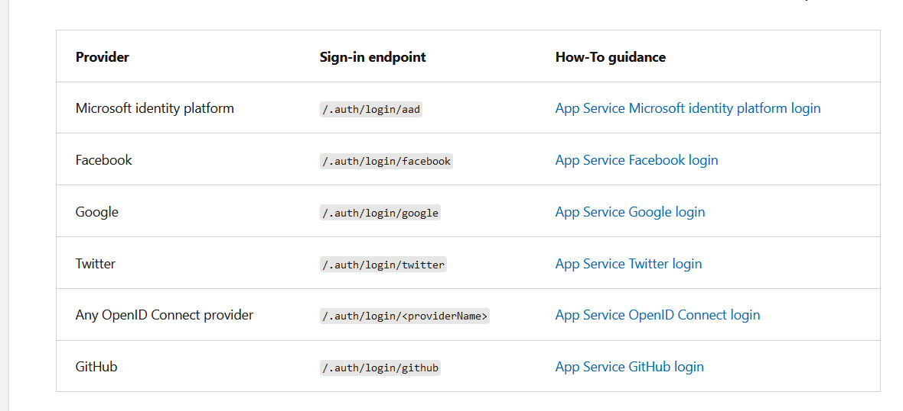
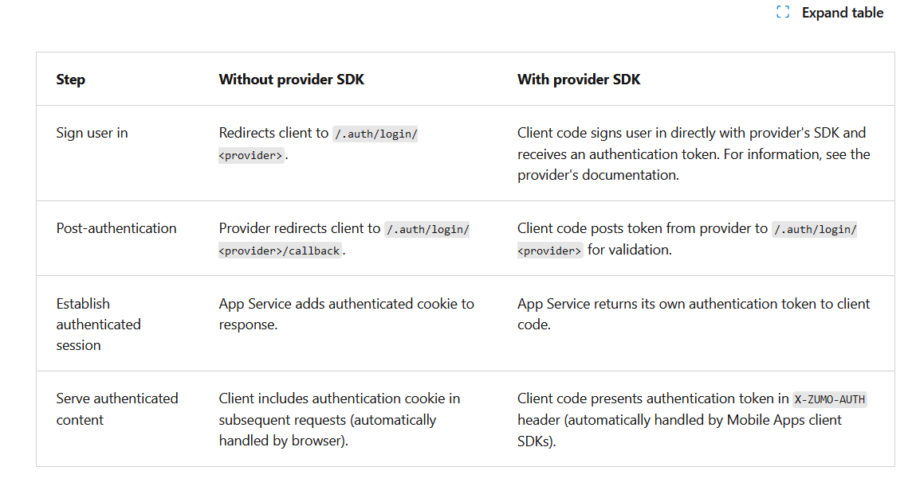

<!-- TOC BEGIN -->

## <a name="p-0">Про що цей блог</a>
## <a name="p-1">1. AZ-204: Implement Azure App Service web apps</a>
## <a name="p2">2. AZ-204: Implement Azure Functions</a>
## <a name="p3">3. AZ-204: Develop solutions that use Blob storage</a>
## <a name="p4">4. AZ-204: Develop solutions that use Azure Cosmos DB</a>
## <a name="p5">5. AZ-204: Implement containerized solutions</a>
## <a name="p6">6. AZ-204: Implement user authentication and authorization</a>
## <a name="p7">7. AZ-204: Implement secure Azure solutions</a>
## <a name="p8">8 AZ-204: Implement API Management</a>
## <a name="p9">9. AZ-204: Develop event-based solutions</a>
## <a name="p10">10. AZ-204: Develop message-based solutions</a>
## <a name="p11">11. AZ-204: Develop message-based solutions</a>
## <a name="p12">12. AZ-204: Troubleshoot solutions by using Application Insights</a>
## <a name="p13">13. AZ-204: Implement caching for solutions</a>

<!-- TOC END -->

## <a name="p-0">Про що цей блог</a>

Мої кроки по вивченню курса azure az-204  базовий курс для розробника.

- Головний лінк [Exam AZ-204: Developing Solutions for Microsoft Azure](https://learn.microsoft.com/en-us/credentials/certifications/exams/az-204/?source=learn&tab=tab-learning-paths). 

- Зайти на портал azure за лінком: [https://portal.azure.com](https://portal.azure.com).

- Явсто прийдеться використовувати AZURE CLI, то читати за лінком  [What is the Azure CLI?](https://learn.microsoft.com/en-us/cli/azure/what-is-azure-cli?wt.mc_id=searchAPI_azureportal_inproduct_rmskilling&sessionId=697de98bd3d345f78945961d8f1d1cdc).


    - Особисто я покищо спробую AZ CLI **в варіанті docker** [Start the Docker container with Azure CLI preinstalled](https://learn.microsoft.com/en-us/cli/azure/run-azure-cli-docker)

    ```bash
    docker run -it mcr.microsoft.com/azure-cli
    ```


Тут багато прийдеться робити викристовуючи azure CLI.
Як використовувати читати тута [What is the Azure CLI?](https://learn.microsoft.com/en-us/cli/azure/)


## <a name="p-1">1. AZ-204: Implement Azure App Service web apps</a>

Лінк на модуль: [AZ-204: Implement Azure App Service web apps](https://learn.microsoft.com/en-gb/training/paths/create-azure-app-service-web-apps/)


Отримати список можливих контейнерів для linux, куди можна встановлювати свої web app: 

```bash
# az webapp list-runtimes --os-type linux

21e74f2efcf2:/# az webapp list-runtimes --os-type linux
[
  "DOTNETCORE:8.0",
  "DOTNETCORE:7.0",
  "DOTNETCORE:6.0",
  "NODE:20-lts",
  "NODE:18-lts",
  "NODE:16-lts",
  "PYTHON:3.12",
  "PYTHON:3.11",
  "PYTHON:3.10",
  "PYTHON:3.9",
  "PYTHON:3.8",
  "PHP:8.2",
  "PHP:8.1",
  "PHP:8.0",
  "JAVA:17-java17",
  "JAVA:11-java11",
  "JAVA:8-jre8",
  "JBOSSEAP:7-java17",
  "JBOSSEAP:7-java11",
  "JBOSSEAP:7-java8",
  "TOMCAT:10.0-java17",
  "TOMCAT:10.0-java11",
  "TOMCAT:10.0-jre8",
  "TOMCAT:9.0-java17",
  "TOMCAT:9.0-java11",
  "TOMCAT:9.0-jre8",
  "TOMCAT:8.5-java11",
  "TOMCAT:8.5-jre8"
]

```
> **Limitations**

> App Service on Linux does have some limitations:
    App Service on Linux isn't supported on Shared pricing tier.
    The Azure portal shows only features that currently work for Linux apps. As features are enabled, they're activated on the portal.
    When deployed to built-in images, your code and content are allocated a storage volume for web content, > backed by Azure Storage. The disk latency of this volume is higher and more variable than the latency of the ?> container filesystem. Apps that require heavy read-only access to content files may benefit from the custom > > container option, which places files in the container filesystem instead of on the content volume.


- Провайдери аутнетифікації:

<kbd></kbd>
<p style="text-align: center;"><a name="pic-01">pic-01</a></p>

- The following table shows the steps of the authentication flow

<kbd></kbd>
<p style="text-align: center;"><a name="pic-02">pic-02</a></p>


## <a name="p2">2. AZ-204: Implement Azure Functions</a>

Лінк на модуль: [AZ-204: Implement Azure Functions](https://learn.microsoft.com/en-us/training/paths/implement-azure-functions/)

- Azure functuins on ARM PROCESSOR  (**azure function core tools**)

Проблема в тому, що azure CLI давно існує і нормлаьно встановлюється на arm процесори. 
А от  **azure function core tools** на arm процесори не встановлюється - тому поганенько.
З цього приводу є issue: https://github.com/Azure/azure-functions-core-tools/issues/3112 , але так воно і не вирішено.
Я пробував їх рекомендації:

```text
 mohsinonxrm commented Aug 10, 2023 •

I've just built the binaries myself, you can try from here:
https://github.com/mohsinonxrm/azure-functions-core-tools/releases/tag/4.23_arm64

Otherwise you can build it yourself as well but dotnet release -r linux-arm64

Next, you can use the azure function dotnet docker images:
https://hub.docker.com/r/mohsinonxrm/azure-functions-dotnet/tags

```
але docker image теж не допомагає. Особливо коли розробка фунцій ведеться локально. Поки рішення немає

Ну, в тому ж таки issue написано отаке

```text

ross-p-smith commented Apr 8, 2024

We have had a little success forcing our devcontainers to be amd64

FROM --platform=linux/amd64

https://github.com/Azure-Samples/chat-with-your-data-solution-accelerator/blob/a16c5107062573403490f01819dd5bbde1b41cb1/.devcontainer/Dockerfile#L1
```

але поки що я цим займатися не буду. 
Спробую дtсь на hyper-v віртуалку на ubuntu і спробую туди перенсення вивчення циф функцій.

І ще цікавий пост тута: [running-azure-functions-in-docker-on-a-raspberry-pi-4](https://endjin.com/blog/2019/09/running-azure-functions-in-docker-on-a-raspberry-pi-4)


## <a name="p3">3. AZ-204: Develop solutions that use Blob storage</a>
Лінк на модуль: [AZ-204: Develop solutions that use Blob storage](https://learn.microsoft.com/en-us/training/paths/develop-solutions-that-use-blob-storage/)

В навчальному курсі викладено ну дуже мало. Це, по суті зміст з короткими коментарями, по можливостям BlobStorage.
За цим лінокм знаходиться опис покрокової розробки прототипу, по переміщенню обєктів на (з) BlobStorage [Розробка прототипу використання утілти копіювання файлів azcopy в парі з azure BlobStorage використовуючи авторизацію Service Principal](https://github.com/pavlo-shcherbukha/azlearning/blob/tz-000001/azcopy_p.md). Але для цього прийшлося вивчити ще кучу додаткового матеріалу. Тобто пройти цей курс і зробити щось - то є дві великі різниці. 
Додаткові курси, що потрібні для створення цього прототипу:
- [SC-300: Implement Access Management for Apps](https://learn.microsoft.com/en-us/training/modules/register-apps-use-microsoft-entra-id/2-plan-app-registration)
-[Register an application with Microsoft Entra ID and create a service principal](https://learn.microsoft.com/en-us/entra/identity-platform/howto-create-service-principal-portal#register-an-application-with-microsoft-entra-id-and-create-a-service-principal);
- [Authorize access to blobs and files with AzCopy and Microsoft Entra ID](https://learn.microsoft.com/en-us/azure/storage/common/storage-use-azcopy-authorize-azure-active-directory#verify-role-assignments);


## <a name="p4">4. AZ-204: Develop solutions that use Azure Cosmos DB</a>
Лінк на модуль: [AZ-204: Develop solutions that use Azure Cosmos DB](https://learn.microsoft.com/en-us/training/paths/az-204-develop-solutions-that-use-azure-cosmos-db/)


## <a name="p5">5. AZ-204: Implement containerized solutions</a>
Лінк на модуль: [AZ-204: Implement containerized solutions](https://learn.microsoft.com/en-us/training/paths/az-204-implement-iaas-solutions/)


## <a name="p6">6. AZ-204: Implement user authentication and authorization</a>
Лінк на модуль: [AZ-204: Implement user authentication and authorization](https://learn.microsoft.com/en-us/training/paths/az-204-implement-authentication-authorization/)

## <a name="p7">7. AZ-204: Implement secure Azure solutions</a>
Лінк на модуль: [AZ-204: Implement secure Azure solutions](https://learn.microsoft.com/en-us/training/paths/az-204-implement-secure-cloud-solutions/)


## <a name="p8">8. AZ-204: Implement API Management</a>
Лінк на модуль: [AZ-204: Implement API Management](https://learn.microsoft.com/en-us/training/paths/az-204-implement-api-management/)


## <a name="p9">9. AZ-204: Develop event-based solutions</a>
Лінк на модуль: [AZ-204: Develop event-based solutions](https://learn.microsoft.com/en-us/training/paths/az-204-develop-event-based-solutions/)


## <a name="p10">10. AZ-204: Develop message-based solutions</a>
Лінк на модуль:  [AZ-204: Develop message-based solutions](https://learn.microsoft.com/en-us/training/paths/az-204-develop-message-based-solutions/)


## <a name="p11">11. AZ-204: Develop message-based solutions</a>
Лінк на модуль: [AZ-204: Develop message-based solutions](https://learn.microsoft.com/en-us/training/paths/az-204-develop-message-based-solutions/)


## <a name="p12">12. AZ-204: Troubleshoot solutions by using Application Insights</a>
Лінк на модуль: [AZ-204: Troubleshoot solutions by using Application Insights](https://learn.microsoft.com/en-us/training/paths/az-204-instrument-solutions-support-monitoring-logging/)


## <a name="p13">13. AZ-204: Implement caching for solutions</a>
Лінк на модуль: [AZ-204: Implement caching for solutions](https://learn.microsoft.com/en-us/training/paths/az-204-integrate-caching-content-delivery-within-solutions/)