<!-- TOC BEGIN -->
- [1. Постановка проблеми](#p1)
- [2. Gро коцепцію продукта в моєму зрозумінні](#p2)
- [3. Опис тестового стенду для вичення API-Connect](#p3)
- [4. Розробка бібліотеки API  в API-COnnect](#p4)


- [2.1. Бібіліотека формалізовних описів API](#p2.1)
- [2.2. API-GateWay](#p2.1)
- [2.3. Каталоги опублікованих API](#p2.1)
- [2.4. Система логування та збору статистики використання](#p2.1)
- [2.5. Портал споживачів API](#p2.1)
- [2.6. Система адміністрування користувачів API Connect та порталу Споживачів API](#p2.1)


<!-- TOC END -->

## <a name="p1">1. Постановка проблеми</a>

Про продукт IBM API-Connect я чув давно, десь 3 2017-2018 року. Його характеризували як дуже гнучкий і зручний. Не зважаючи на гнучкість продукту я ні разу не пройшов 
весь процес його викристання. Але цього разу все ж таки пройшов більшість кроків, щоб  надати "гнучкому" продукту "форму" і заставити його гнутися "як треба", тобто пройти 
основні процеси (чи потоки) використання API-Connect. Для вивчення я використав хмарну версію цьго продукта, що була розгорнута в IBM Cloud.  Здається, в рамках *"IBM CloudPack 
for Integration"* існує версія, що розгортається в OpenShift  локального дата-центру, но це не точно. Тому всі мої досліди виконувалися в рамках IBM Cloud. Обговорювати 
які продукти є конкурентами IBM API-Connect  я не хочу. Для цього можна покласти руку на клавіатуру і погуглити. Якщо шукати по youtube
інформацію, як працювати з IBM API-Connect, то в більшості випадків це:
- про застарілі версії продукту;
- показують примітивні приклади, при чому, часто один і той же;
- ну і нігде мені не попадаолс побачити весь процес. Максимум в пісочниці продукту показати, що api працює.
Тому і було прийнто рішення написати цей блог, щоб поділитися своїм досвідом з вивчення IBM API-Connect, ну і самому не забути, і ,якщо потрібно, швидко відновити ці знання.

## <a name="p2">2. Про коцепцію продукта в моєму зрозумінні</a>

Перш за все потрібно сказати кілька слів про концепцію продукта в моєму зрозумінні. IBM API-Connect призначений для того, щоб компанія, яка вирішила виставити свої Web Servise 
як API  "в світ" мала можливість: 
- управляти  API а технічному рівні; 
- управляти різними варіантами захисту ваших API
- управляти API на рівні документації для споживачів цих АПІ та навчанню споживачів використовувати надані їм API; 
- управляти рівнем соціалізаціцї АПІ (тобто отримувати  feed back від спживачів API,  та  оперативно давати їм рекомендаціцї)  
- Отримувати статистику використання API в різних розрізах з подальшою можливістю монетизації 


Робота з API Connect починається з **фази Розробки (Development)**, де визначаються дві сутності:
- **API**;
Тут готується формалізований опис API. На [pic-01](#pic-01) показано головне меню, де шукати.
<kbd>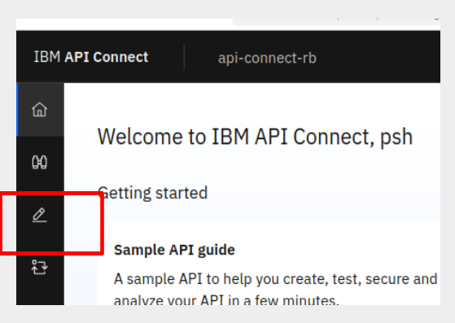</kbd>
<p style="text-align: center;"><a name="pic-01">pic-01</a></p>

На [pic-02](#pic-02) показано головне вікно з каталогом API,  що я створив в  API-Connect.

<kbd>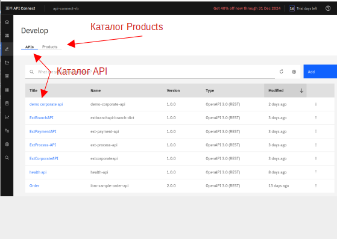</kbd>
<p style="text-align: center;"><a name="pic-02">pic-02</a></p>


На [pic-03](#pic-03) показано головне вікно з каталогом Products,  що створив  в  API Connect.

<kbd>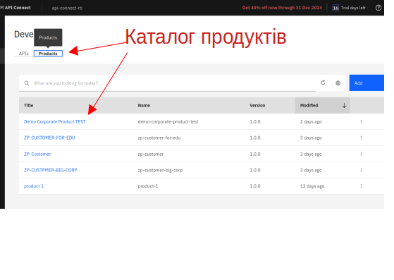</kbd>
<p style="text-align: center;"><a name="pic-03">pic-03</a></p>


- **Product**;
Це формалізована сутність, що поєднує в собі один або кілька API, та додає в нього тарифний план: кількість викликів за одиницю часу [pic-04](#pic-04).

<kbd>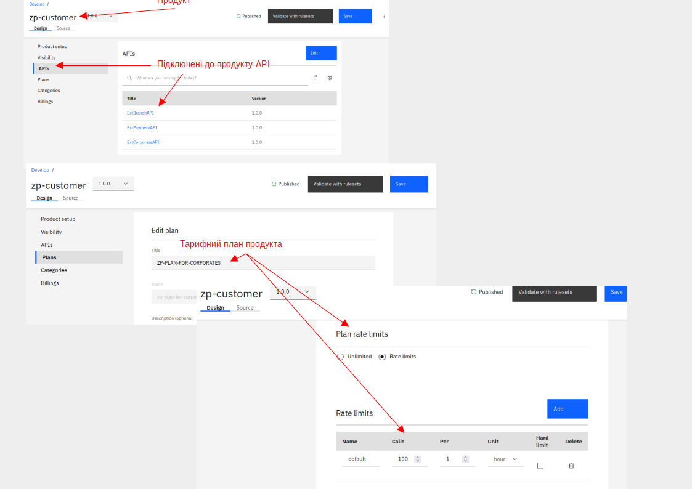</kbd>
<p style="text-align: center;"><a name="pic-04">pic-04</a></p>

Крім того продукт має свій життєвий цикл: 
- версійність;
- публікацію  **Product** для використання або зворотній процес - виведення **Produc** з використання.


Після закінчення фази розробки настає наступна фаза **Публікація продукту** в каталог  **Catalog** (або Catalogs). 
- *Catalog* - це ще одна сутність API Connect в яку публікються **Product**, а відповідно, і **API**, що пов'язані з цим Product.
Catalog має свої (ізольовані) сутності, що забезпечує експулатацію Products  та APIs що входять до цього каталога.
Вже до окремого взятого Catalog  підключаються споживачі API,  ведеться реєстр споживачів API,  ведеться статистика використання API  в різних розрізах, і з Catalog  
можна запустити портал споживача API. Звичайно, в кожному каталозі є адміністратор каталога та інші користувачі, що можуть ним управляти. 
У цих користувачів є чітко обмежений перелік ролей:

- Owner:	Owns and administers the API provider organization	
- API Administrator:  Manages the API product lifecycle
- Community Manager: Manages application developer communities
- Administrator: Administers the API provider organization
- Developer: Authors API and product definitions
- Member: Minimum role
- Viewer: Views the API provider organization


На [pic-05](#pic-05) показано створено каталог Catalogs та як в нього попасти

<kbd>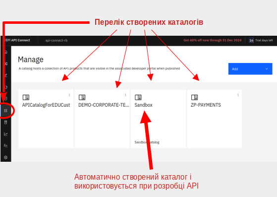</kbd>
<p style="text-align: center;"><a name="pic-05">pic-05</a></p>

А на [pic-06](#pic-06) внутрішні сутності  Catalog

<kbd>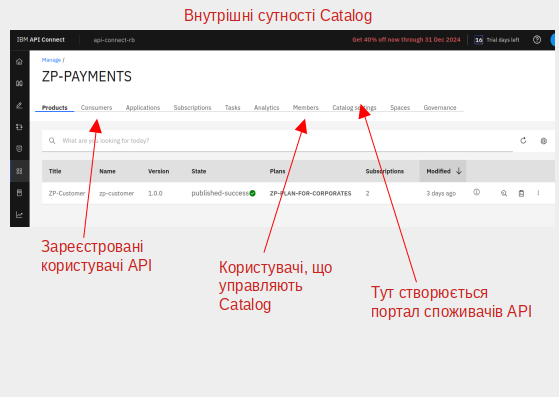</kbd>
<p style="text-align: center;"><a name="pic-06">pic-06</a></p>

- **Portal** споживача  API
По суті це WebSite , що пов'язаний з Catalog.  Через нього споживачі API  модуть прочитати документацію на всі API  що входять в цей каталог, отримати свої credentials (ну якщо API захищені). Є режим Try it  де можнаспробувати виклакати методи API.  
Також є форму, де споживач API  може задати пиання чи написати свої враження про кромео взяти API.  Є блог, в якому можна написати якість там рекомендаціцї чи щось корисне для споживачів API.
Споживач API  теж може перешлянути статистику використання свої[] викликів  API.

Створюється портал через Catalog так, як показано на [pic-07](#pic-07):

<kbd>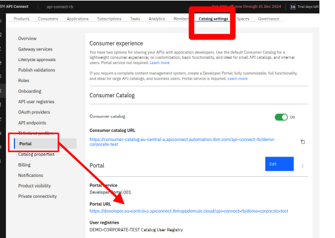</kbd>
<p style="text-align: center;"><a name="pic-07">pic-07</a></p>


А основні елементи порталу, показані на [pic-08](#pic-08)


<kbd>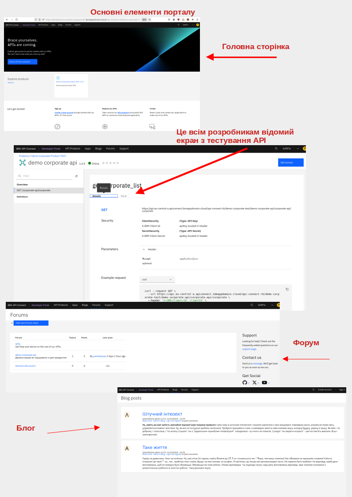</kbd>
<p style="text-align: center;"><a name="pic-08">pic-08</a></p>


Навіть зважаючи на наведене, можна зрозуміти що API-Conect - це не тільки про IT-шників в образі програмістів, чи служби підтримки. 
Це і про спеціалістів про розвитку цифрового бізнесу для управління продуктами та каталогом.
Це і про контент менеджерів для управління порталу.
Ну і адміністратори безпеки якість повинні  розуміти, що і для чого вони адмініструють.
Ну і хтось повинен статистику перетворити в рахунок для клієнта-споживача API.

 
### <a name="p3">3. Опис тестового стенду для вичення API-Connect</a>

Архітектура тестового стенду показана на [pic-09](#pic-09). Для тестування створено два Node.js Web Service: 
- [WebService1](https://github.com/pavlo-shcherbukha/apiconnect-proto/tree/main/branch-srvc);
- WebService2.
<kbd>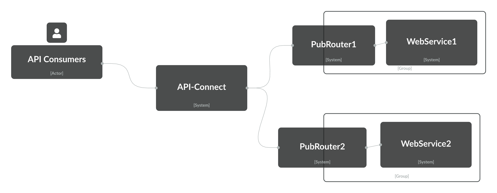</kbd>
<p style="text-align: center;"><a name="pic-08">pic-09</a></p>

Вони задеплоєні на контейненій безсерверній платформі IBM [Code Engine](https://pavlo-shcherbukha.github.io/posts/2023-05-11/ibmcloud-codeengine/) ну і 
на зовні виставлені публічні routs для доступу по http. Публічний роути зроблені тому, щоб порівнювати роботу через API-Connect та без нього.
Ну і в навчальних цілях, щоб не мучитися з прокопуванням каналів. 
На роути WebServises виходить API-Connect. Ну, а споживачі API (API Consumers) вже виходять безпосередньо на API-Connect. Два WebServices зроблено для 
того, що спробувати більш складні варіанти роутінга, а не тільки простеньку proxy.

WebService1 являє собою прототип якогось банківського сервісу що робить пакетні зарахування, наприклад зарахування зарплати від різних компаній.
Реалізовані  такі api:
- [test-corporate-api.pdf](../assets/img/posts/2024-11-15-ibm-api-connect/doc/test-corporate-api.pdf), формалізований опис openapi3.0: [extcorporateapi_1.0.0.yaml](https://github.com/pavlo-shcherbukha/apiconnect-proto/blob/main/api/extcorporateapi_1.0.0.yaml);
- [test-branch-api.pdf](../assets/img/posts/2024-11-15-ibm-api-connect/doc/test-branch-api.pdf), формалізований опис openapi3.0: [extbranchapi-branch-dict_1.0.0.yaml](https://github.com/pavlo-shcherbukha/apiconnect-proto/blob/main/api/extbranchapi-branch-dict_1.0.0.yaml);
- [test-payment-api.pdf](../assets/img/posts/2024-11-15-ibm-api-connect/doc/test-payment-api.pdf), формалізований опис openapi3.0: [ext-payment-api_1.0.0.yaml](https://github.com/pavlo-shcherbukha/apiconnect-proto/blob/main/api/ext-payment-api_1.0.0.yaml);
- [test-process-api.pdf](../assets/img/posts/2024-11-15-ibm-api-connect/doc/test-process-api.pdf), формалізований опис openapi3.0:[ext-process-api_1.0.0.yaml](https://github.com/pavlo-shcherbukha/apiconnect-proto/blob/main/api/ext-process-api_1.0.0.yaml)

WebService2 являє собою модель сервісу перевірки ЕЦП да дешифрації. По факту він нічого не робить, але це допомже зробити складний роутінг через кілька сервісів

В загальному це повинно працювати так:
Організація - клієнт банку є споживачем API. За допомогою API [test-corporate-api.pdf](../assets/img/posts/2024-11-15-ibm-api-connect/doc/test-corporate-api.pdf) 
Оорганізація себе реєструє в банку. Потім організація реєтрує підрозділи, що виплачують зарплату. Якщо організція не має філій то реєструється тільки один підрозділ.
Ця оперція виконується за допомогою  Branch API [test-branch-api.pdf](../assets/img/posts/2024-11-15-ibm-api-connect/doc/test-branch-api.pdf).
За допомогою payment API [test-payment-api.pdf](../assets/img/posts/2024-11-15-ibm-api-connect/doc/test-payment-api.pdf) організація передає в банк 
зарахування зарплати співробітникам. Кожний пакет зарахувань підписаний ЕЦП та зашифрований.
Банк виконує опрацювання платежів, що передав клієнт за допомгою ProcessApi [test-process-api.pdf](../assets/img/posts/2024-11-15-ibm-api-connect/doc/test-process-api.pdf)

WebServic2 являє собою прототип якогось банківського сервісу що робить криптографічні перетворення. При отриманні пакетно зарахування зарплати співробітникам,
цей сервіс виконує перевірку ЕЦП та дешифрацію плоатежу і уже на WebServic1  надходить "чистий"  платіж. Це придумано для "усклаження" завдання роутинга.

Обидва сервіси написані на Node.js  та імплементують Rest API. Параметри запитів типу branchid, corporateid , paymentid -  передаються в path  запиту.

## <a name="p4">4. Розробка бібліотеки API  в API-COnnect</a>

Найскладнішою для мене була частина розробки та тестування API. Тому з нього і почну
Робота з продуктом починається з завантаження (чи підготовки) формалізованого опису API. Можна використовувати OpenApi3.0, OpenAPi2.0, SOAP WSDL.  
Але я використовував тільки OpenApi3. Тому далі, мова буде тільки про OpenApi3.0. Формалізований опис повинен бути виконаний дуже акуратно з 
достатньою кількісю коментарів та деталізації, тому що ним, потім, будуть користуватися споживачі api.  На [pic-01](#pic-01) показано, як зайти в 
меню розробки API. Далі  отримуємо екран з варіантами вибору методу створення API. Я пробував використовувати вбудований UI  для підготовки опису API,
але це виявилося витраченим часом. UI API-COnnect  для підготовки OpenApi  не доопрацьований. Тому рекомендую використовувати якиййсь тертій інструмент,
на приклад [Swagger Editor](https://editor.swagger.io/). Що треба вибрати, щоб імпортувати формалізований опис сервісу openapi3.0  показано на [pic-10](#pic-10).

<kbd>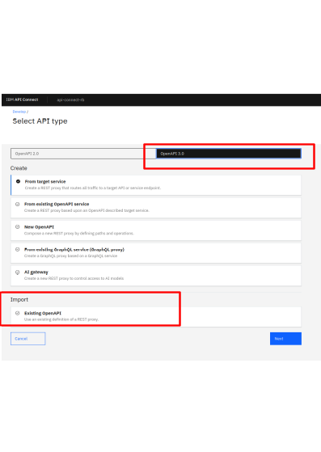</kbd>
<p style="text-align: center;"><a name="pic-10">pic-10</a></p>

Як виявилося UI API Connect не дозволяє описати єлементу масиву об'єктів. І, навіть, якщо у вас описані елементи масива, UI API-Connect іх не відобразить. 
Щоб побачити структуру масива треба переключитися в режим відображення файла, а не дивится через UI. Ну і валідація структури OpenAPI3.0  при імпорті теж 
не повноцінна. То й же приклад: масиви не описані, але файл втягується і валідація проходить успішно. Як прикад, на [pic-11](#pic-11) показано, що 
відображається  в UI на верхньому малюнку  а  що є на справді - на нижньому.  


<kbd>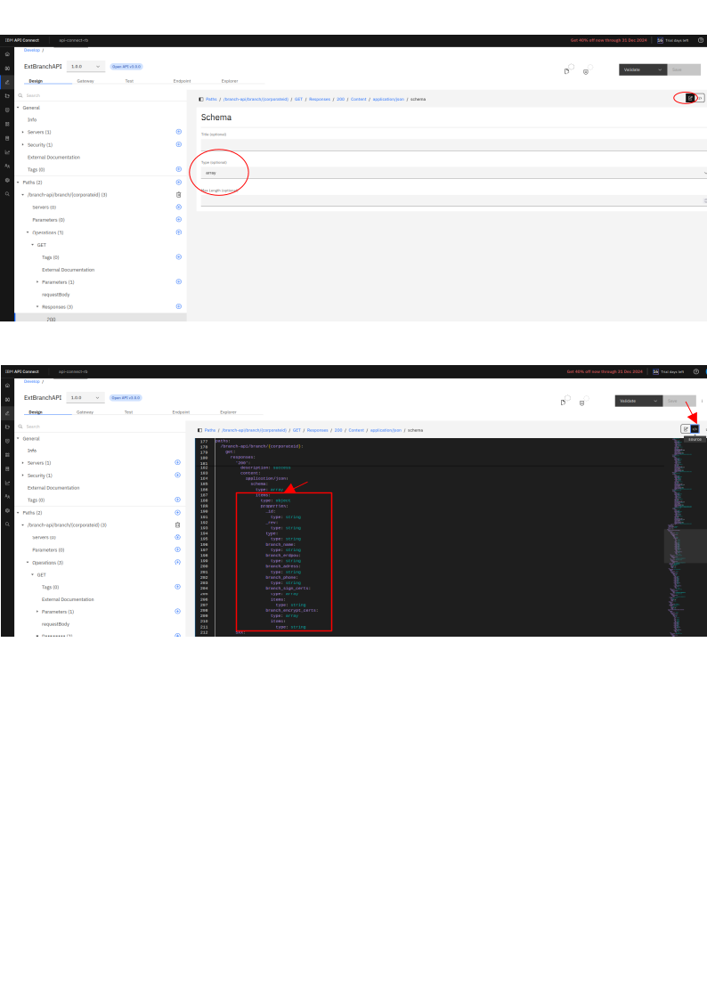</kbd>
<p style="text-align: center;"><a name="pic-11">pic-11</a></p>

Крім того в yaml файлі важливі відступи. Тому, на багатьох інструментах показані вертикальна решітка, що дозволяє легкто побачити кількість відступів. 
А тут, на нижньому малюгку, відступи відсутні - тобто набирати руками в такому редакторі дуже на зручно.  Тому для підготовки формалізованих описів 
API та їх валідації потрібно використовувати сторонні програмні продукти.

В режимі редагування API видно ряд вкладок. На [pic-12](#pic-12) показано призначення основних вкладок.
<kbd>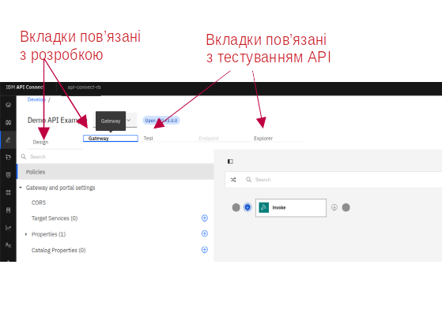</kbd>
<p style="text-align: center;"><a name="pic-12">pic-12</a></p>

У вкладці **Design** відображається опис методів, як в стандартному openapi.
У вкладці **Gateway** відображаються додаткові реквізити, що додає в openapi файл API-Connect, що описують налаштування роутингу та трасфомації запитів.
Все, що додав API-Connect  знаходиться під специфічним заголовком: **x-ibm-configuration**
 
Далі показані відмінності слід знати в порівнянні з базовим [openapi-3.0](https://swagger.io/docs/specification/v3_0/basic-structure/):

- базовий

```yaml
openapi: 3.0.0
info:
  title: Sample API
  description: Optional multiline or single-line description in [CommonMark](http://commonmark.org/help/) or HTML.
  version: 0.1.9

servers:
  - url: http://api.example.com/v1
    description: Optional server description, e.g. Main (production) server
  - url: http://staging-api.example.com
    description: Optional server description, e.g. Internal staging server for testing

paths:
  /users:
    get:
      summary: Returns a list of users.
      description: Optional extended description in CommonMark or HTML.
      responses:
        "200": # status code
          description: A JSON array of user names
          content:
            application/json:
              schema:
                type: string
```

- від API-Connect

```yaml
openapi: 3.0.0
info:
  version: 1.0.0
  title: Demo API Example
  x-ibm-name: demo-api-example
  description: Descriptino For Demo Api Example
# Особливість вказування url сервера. Потрібно вказувати не реальний URL а унікальний 
# аліас вашого сервера. Справа в тому, що є реальний EndPoint DataPower
# а цей аліас буде підставлятися EndPoint DataPower як Base URL
servers:
  - url: /demo-api-example
# -------------- Додатковий розділ, що описує рутинг APIGate, Що є в API-Connect  
x-ibm-configuration:
  properties:
    # Саме тут треба вказати реальний URL вашого сервіса
    target-url:
      value: http://example.com/operation-name
      description: The URL of the target service
      encoded: false
  # для того, щоб парцювали тестові запити cors: enabled: true  повинно бути
  cors:
    enabled: true
  gateway: datapower-api-gateway
  type: rest
  phase: realized
  enforced: true
  testable: true
  # Це розділ, де як раз і конфігурується роутинг в API GateWay
  assembly:
    execute:
      - invoke:
          title: invoke
          version: 2.0.0
          verb: keep
          target-url: $(target-url)
          follow-redirects: false
          timeout: 60
          parameter-control:
            type: allowlist
            values: []
          header-control:
            type: blocklist
            values: []
          inject-proxy-headers: true
          chunked-uploads: true
          persistent-connection: true
# ------------------------------------------------------          
paths:
  /:
    get:
      responses:
        '200':
          description: success
          content:
            application/json:
              schema:
                type: string

```

Щоб розділ **x-ibm-configuration:** знаходився на початку yaml файлу, простіше зробити пустий файл за допомогою API-Connect,
а потім збагатити його описом ваших методів.

Лінки на документацію по конфігурації API Gateway:

- [Built-in policies](https://www.ibm.com/docs/en/api-connect/saas?topic=constructs-built-in-policies)
Тут описані параметри всіх кубиків, що показані на  [pic-13](#pic-13)


<kbd>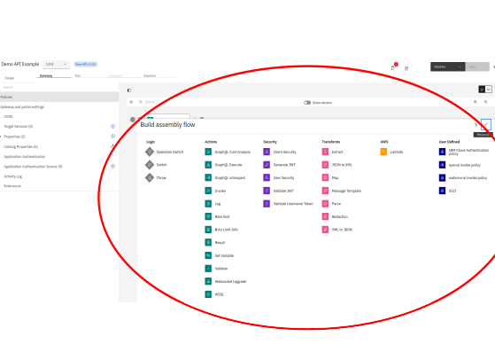</kbd>
<p style="text-align: center;"><a name="pic-13">pic-13</a></p>


- [Lightweight Gateway API assembly commands and policies](https://www.ibm.com/docs/en/api-connect/saas?topic=domain-lightweight-gateway-api-assembly-commands-policies)
- [Lightweight Gateway tutorial](https://www.ibm.com/docs/en/api-connect/saas?topic=domain-lightweight-gateway-tutorial)


IBM API-Connect складається, з  таких основних компонентів:


### <a name="p2.1">2.1. Бібіліотека формалізовних описів API</a>
### <a name="p2.2">2.2. API-GateWay</a>
### <a name="p2.3">2.3. Каталоги опублікованих API</a>
### <a name="p2.4">2.4. Система логування та збору статистики використання</a>
### <a name="p2.5">2.5. Портал споживачів API</a>
### <a name="p2.6">2.6. Система адміністрування користувачів API Connect та порталу Споживачів API</a>


