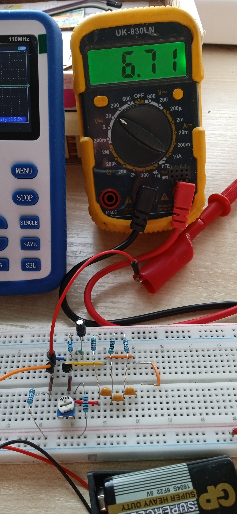

<!-- TOC BEGIN -->

<!-- TOC END -->

## <a name="p1">1. Вступ</a>
На написання цього посту мене надихнув професійний радіо інженер, а зараз просто радіолюбитель [Радиодинозавр: 3.2.Базовый генератор внутрисхемной диагностики. ](https://www.youtube.com/watch?v=hohz248USWc).
В лабораторії електроніки генератор синуса на кількох частотах - річ необхідна і корисна. І на його канал  я наскочив в пошуках, як найпростіше зробити генератор синусоїдальних коливань. 
Мені сподобалася його ідея, і я захотів її використати. Але є нюанс: у мене немає радянських радіодеталей. Ні, ну можна піти на раіоринок, щось найти. 
Але то не наш метод. Для себе я поставив за ціль використовувати тільки сучасну компонентну базу. Колись, в дитинстві, я уже мав проблеми, 
коли випаював компоненти ще з лампових радіоприймачів, але компоненти були не працездатними і я витрачав дуже багато часу на пошук несправностей в зібраних мною схемах. 
Тому мені потрібно було адаптувати його принципову схему під сучасні компоненти. Він теж зробив колись велику роботу по адаптації схеми для германієвих транзисторів до кремнієвого КТ-315.

<HTML>
<HEAD>
<TITLE>Принципова схема генраторів на 1 кГц та 10 кГц  від [Радиодинозавр](https://www.youtube.com/@%D0%A0%D0%B0%D0%B4%D0%B8%D0%BE%D0%B4%D0%B8%D0%BD%D0%BE%D0%B7%D0%B0%D0%B2%D1%80)</TITLE>
</HEAD>
<BODY>
<TABLE BORDER="1">
<TR>
    <TH>Генератор на 1 кГц </TH>
    <TH>Генератор на 10 кГц </TH>
</TR>
<TR>
    <TD><kbd></kbd>

<a name="pic-01">pic-01</a>
</TD>
    <TD><kbd></kbd>

<a name="pic-02">pic-02</a>
</TD>
</TR>
</TABLE>
</BODY>
</HTML>

 От мені захотілося їх повторити, тільки на сучасних електронних компонентах, та ще і тих, що у мене є в наявності.

## <a name="p2">2. Хід моїх роздумів та пошуків</a>

Перше, що я зробив, це поклав руки на клавіатуру  комп'ютера і пошукав такі схеми. Як виявилося їх повно і в російськомвному сегменті і в англомовному. 
Друге, що зробив, глянув свій конспект по електроніці і знайшов там щось дуже схоже:

<kbd></kbd>

<a name="pic-03">pic-03</a>

А далі, раз ячейки Сіффера (правда я їх не знайшов) - значить потрібно шукати в англомовному сегменті інтернета. Але пошук, окрім загальних схем нічого не показав, тому взяв, 
розрахував сам, як розумів, з використанням тих компонентів, що в мене є. 
В процесі пошуків, я прийшов до висновку, що в англомовному сегмент інтернета ця схема генератора досить відома і використовується як для біполярних так і для польових 
транзисторів, а ще використовується і для генераторів на операційних підсилювачах. Якщо узагальнити, то зворотній зв'язок з переворотом фази досить очевидна ідея для інжнера, 
що знайомий з курсом ТОЕ. 

Потім, зважаючи на проблеми, на які натикався [Радиодинозавр](https://www.youtube.com/@%D0%A0%D0%B0%D0%B4%D0%B8%D0%BE%D0%B4%D0%B8%D0%BD%D0%BE%D0%B7%D0%B0%D0%B2%D1%80)  вирішив 
спершу змоделювати роботу схеми за допомогою програми Kicad-8  з використанням SPICE-model. 
Як виявилося SPICE моделі на сайтах розробників компонентів дуже часто лежать поряд з DataSheets на компонент. Тому для транзистора я її і використав. Лише додам, що 
після випуску з університету, я працював з PCAD  та ORCAD,  але в основному для автоматичної розводки друкованих плат. А тут, зайнявся моделюванням роботи аналогових схем. 
Ще я спробував  Online програму [CircuitLab](https://www.circuitlab.com/). Але, там, здається, що транзистор використовує якусь дуже середню модель. Та і при безплатному тарифі
 там багато не намалюєш. Тому я витратив трохи часу ще і на те, як на мою Raspberry встановити більш-менш сучасну версію KiCad-8.
А моделювання в KiCad  мені здалося більше якісним, ніж у CircuitLab, но це не точно.  Ну, я намалював в KiCad  принципову схему. Потім змоделював, підправив під конкретні компоненти,
що в мене є в наявності, знову змоделював.  
Потім зібрав на макеті з реальних компонентів. І воно якось запрацювало, тільки не так, яу мені треба. 
То ж тепер хочу познайомити з отриманими результатми і описати проблеми, на які я натикався і як вирішував.

### <a name="p3">3. Принципові схеми генераторів на 1 кГц та на 10кГц</a>

<TITLE>Принципова схема генраторів на 1 кГц та 10 кГц  на іноземних компонентах</TITLE>
</HEAD>
<BODY>
<TABLE BORDER="1">
<TR>
    <TH>Генератор на 1 кГц </TH>
    <TH>Генератор на 10 кГц </TH>
</TR>
<TR>
    <TD><kbd></kbd>

<a name="pic-04">pic-04</a>
</TD>
    <TD><kbd></kbd>

<a name="pic-05">pic-05</a>
</TD>
</TR>
</TABLE>
</BODY>
</HTML>

Фактично, схеми відрізняються тільки ємністю конденсаторів C1, C2, C3 та конденсатором C4. Потрібно звернути увагу на ємність обхідного  конденсатора  C4. 
Для частоти в 1 kHz він повинен мати ємність 47uF і більше. Для частоти 10kHz він повинен мати ємність  10uF і більше.

За допомогою змінного резистора RV1  вибираємо режим роботи транзистора так, щоб генерація була  стійкою, а синусоїда була синусоїдою з мінімальними викривленнями. 
Транзистор 2N2222  або PN2222  одне і те саме. PN2222 вказує, що корпус транзистора пластмасовий типу TO-92, а 2N2222 випускаються в металевому корпусі. 
ДатаШит на цей транзистор пожна подивитися за лінком: [2N2222](/assets/img/posts/2025-01-16-e-lab-gensin/doc/2n2222_2n2222a.pdf). 
За показниками тестера транзисторів в мультиметрі, коефіцієнт передачі транзисторів по току 242 і 276. 

### <a name="p4">4. Проблеми запуску на налагодження генераторів</a>

Спершу я розірвав зворотній зв'язок що йде від колектора до конденсатора фазо-зміщуючого ланціюжка С1 і  виставив режим  роботи транзистора на постійному струму десь 
в районі 5.1V-6.2V. Потім відновив з'єднання і генерація зразу пішла. Ну може трошки спотворена форма синусу, але за допомогою змінного резистора RV1, я її відкорегував. 
Основною проблемою  при запуску було те, що я не оцінив важливісь конlенсатора С4 і поставив "що було під рукою", а саме неполярний 100nF. В результаті генератор видава 
прекрасний синус на частоті 25-26 kHz, але зміна коненсаторів фазо-зміщуйочого ланціюжка призводила до зриву генерації, а зміна резисторів в ланцюжку могла монизити 
частоту десь до 18kHz. А от як тільки замінив С4 на 100 uF,  так зразу генератори і запрацювали на потрібній частоті. Пізніше, вже дослідним шляхом підібрав найнижчі 
номінали C4,  при яких частота генерації стабільна, звичайно, з того що в мене було. Фактично, отримав частоти генерації: 1,2 kHz  та 13 kHz. Тобто відхилення від номінала 
до 30%, але поки мені це не принципово. Без конденсатора C4  генерація взагалі не запускається. При замалому номіналі C4  частота генерації збільшується. При ємності в 1uF  на 
генераторі 10kHz  частота піднімалася до 16kHz. Чому так відбувається, я пояснення не знайшов. Цей конденсатор повинен обмежувати  низькі частоти. Але чому він так впливає на 
частоту генерації - поки не знаю. 

А ще, у мене нижній сегмент синусоїди був трошки спотворений, незважаючи на всі мої спроби акуратно покрутити резистор RV1.  Цю проблему я виправив, шляхом 
збільшення негативного зворотнього зв'язку по постійному струму, а саме збільшив номінал R6 зі 100 до 150 Om, але зважаючи на модель, то можливо і 200 Ом буде нормально.

Зовнішній вигляд змонтованих генераторів на макетній платі показано на: [pic-06](#pic-06).

<kbd></kbd>

<a name="pic-06">pic-06</a>

Ліворуч змонтовано генератор на 1kHz, а праворуч на 10kHz. Генератори мають роздільне живлення. Так, зараз червоний провід від крони підключений до верхньої шини і 
живить генератор на 1kHz. Для того, щоб заживити генератор на 10kHz червоний провід від крони треба перенсти на нижню черону шину макетної плати.  Правороч темні 
проводки  з'єднали загальну шину. Туди підходить чорний провід від крони. В Збільшеному варіанті монтаж генераторів показано на   [pic-07](#pic-07)

### <a name="p5">5. Тестування генератора 1 kHz</a>

<kbd></kbd>

<a name="pic-07">pic-07</a>

Тепер трошки займемося вимірами генератора на 1 kHz. Далі наведені покази осцилографа для генератора на 1 кГц

<TITLE>Покази осцилографа на 1 кГц</TITLE>
</HEAD>
<BODY>
<TABLE BORDER="1">
<TR>
    <TH><a name="pic-08">pic-08</a> </TH>
    <TH><a name="pic-09">pic-09</a> </TH>
</TR>
<TR>
    <TD><kbd></kbd>

<a name="pic-08">pic-08</a>
</TD>
    <TD><kbd></kbd>

<a name="pic-09">pic-09</a>
</TD>
</TR>
</TABLE>
</BODY>
</HTML>

Як бачимо, синусоїда досить прийнятна, частотою 1.25kHz. Тепер глянемо робочу точку транзистора. При живлені 8.84V [pic-10](#pic-10)
<kbd></kbd>

<a name="pic-10">pic-10</a>

я відключив звортній зв'язок і заміряв напругу на  колекторі транзистора. Як бачиом, 5.1V. 

<kbd></kbd>

<a name="pic-11">pic-11</a>

### <a name="p6">6. Тестування генератора 10 kHz</a>

Зараз я переключив генератор на 10kHz, [pic-12](pic-12).

<kbd></kbd>

<a name="pic-12">pic-12</a>

Як видно,осцилограф підключено до оранжевого виходу, а живлення переключено на нижню шину.
Поглянути, що показує осцилограф  можна на [pic-13](#pic-13)  та [pic-14](#pic-14).

<TITLE>Покази осцилографа на 10 кГц</TITLE>
</HEAD>
<BODY>
<TABLE BORDER="1">
<TR>
    <TH><a name="pic-13">pic-13</a> </TH>
    <TH><a name="pic-14">pic-14</a> </TH>
</TR>
<TR>
    <TD><kbd></kbd>

<a name="pic-13">pic-13</a>
</TD>
    <TD><kbd></kbd>

<a name="pic-14">pic-14</a>
</TD>
</TR>
</TABLE>
</BODY>
</HTML>

Як вдно, при живленні 9.2V (крона трошки відновилася) частота генерації 13.8 kHz. Тепер відключив позитивний зворотній зв'язок і  що на колекторі 
транзистора у мене аж 6.7V  і генератор успішно працює

<kbd></kbd>

<a name="pic-15">pic-15</a>

Але помітив, що із зменшенням напруги на колекторі транзистору збільшуються шуми на синусоїді, але генерація працює стабільно
<TITLE>Покази осцилографа на 10 кГц з шумами</TITLE>
</HEAD>
<BODY>
<TABLE BORDER="1">
<TR>
    <TH><a name="pic-16">pic-16</a> </TH>
    <TH><a name="pic-17">pic-17</a> </TH>
</TR>
<TR>
    <TD><kbd></kbd>

<a name="pic-16">pic-16</a>
</TD>
    <TD><kbd></kbd>

<a name="pic-17">pic-17</a>
</TD>
</TR>
</TABLE>
</BODY>
</HTML>

Хоча, тут я мабуть не правий, бо міряти  напругу постійного струму при генерації якось не правильно. 

### <a name="p7">7. Моделювання</a>

Спершу я спробував змоделювати роботу підсилювача на транзисторі 2N2222 від тестових джерел змінного струму частотою  10kHz і амплітудою 0.01V. 
Ціль була вибрати  лінійний режим роботи транзистора. На pic-20 та pic-21  показано ідельаний режим роботи транзистора, коли амплітуда вихідного  
сигналу десь 1.6V  і ще є запас для росту при цьому значення резистора R3  ідельано мати  близько 25K.   

<TITLE> Ідеальний режим роботи каскаду</TITLE>
</HEAD>
<BODY>
<TABLE BORDER="1">

<TR>
    <TD><kbd></kbd>

<a name="pic-20">pic-20</a>
</TD>
    <TD><kbd></kbd>

<a name="pic-21">pic-21</a>
</TD>
</TR>
</TABLE>
</BODY>
</HTML>

Тепер, якщо збільшити опір R3  десь до 50K  картина буде набагато гірша, є великий ризик обмеження амплітуди зверху і немає запасу по амплітуді

<TITLE>Не ідельаний режим роботи каскаду</TITLE>
</HEAD>
<BODY>
<TABLE BORDER="1">

<TR>
    <TD><kbd></kbd>

<a name="pic-22">pic-22</a>
</TD>
    <TD><kbd></kbd>

<a name="pic-23">pic-23</a>
</TD>
</TR>
</TABLE>
</BODY>
</HTML>

Ну, це очевидні речі. 
Тепер спробуємо змоделювати генератор на 10kHz. На pic-25  зразу показано аналіз схеми по постійному струму.

<kbd></kbd>

<a name="pic-26">pic-26</a>

А тепер глянемо, що відбувається на виході по змінному струму. На pic-24  видно, як запускається генератор.
тобто йому десь близько 1.5 ms  треба, щоб він розкачався. А потім, якщо трошки збільшити масштаб графіка
[pic-25], то можна побачити, що період сигналу десь 74us, що відповідає частоті 13.514 kHz , а повний розмах сигналу складає 8.27V. 
Прицьому видно, що нижня частина синусоїди трошки спотворена.  Але по частоті генерації можна сказати, що теоретичний і практичний результати співпали.

<TITLE>Н</TITLE>
</HEAD>
<BODY>
<TABLE BORDER="1">

<TR>
    <TD><kbd></kbd>

<a name="pic-24">pic-24</a>
</TD>
    <TD><kbd></kbd>

<a name="pic-25">pic-25</a>
</TD>
</TR>
</TABLE>
</BODY>
</HTML>

Спробуємо шляхом зміни R3  позбавитися від цього спотворення [pic-27]. Або ж, підкорегувати 
за допомогою зміни R6 до  190-200 Ом.

<TITLE>Н</TITLE>
</HEAD>
<BODY>
<TABLE BORDER="1">

<TR>
    <TD><kbd></kbd>

<a name="pic-27">pic-27</a>
</TD>
    <TD><kbd></kbd>

<a name="pic-28">pic-28</a>
</TD>
</TR>
</TABLE>
</BODY>
</HTML>

І останнє, якщо конденсатор C4 зменшити з 10uF  до 100nF  то і частота коливань генератора
зміниться до 24kHz (42us). Тобто тут теж модель і практичний результат досить близькі.

<kbd></kbd>

<a name="pic-29">pic-29</a>

Тобто, з приводу моделювання можна зробити висновок, що воно працює і таки досить точно, 
якщо правильно розрахувати схему з самого початку.  Але мозок моделювання не замінить 
і досвід теж.

