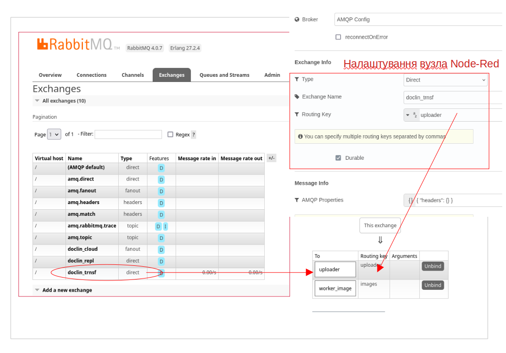
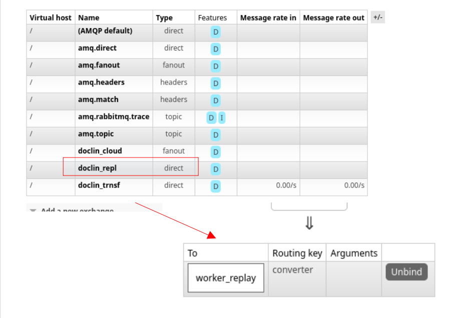
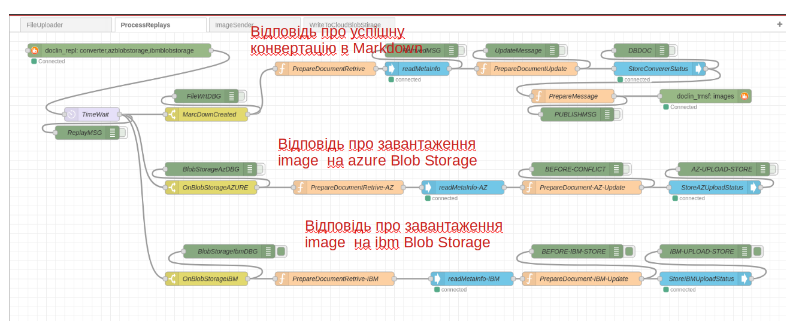

<!-- TOC BEGIN -->

<!-- TOC END -->

## <a name="p1">1. Про що цей блог</a>
 
Після [деяких дослідів по роботі з RabbitMQ](https://pavlo-shcherbukha.github.io/posts/2024-11-15/rabbit-mq/)  виникла необхідність зробити прототип, щоб відчути, 
як працювати з продуктом. Тому, розробив для себе проект такого собі прототипа, що допоможе будудувати великий ланцюжок обробників. 

Додатковим бонусом була ціль спробувати бібліотеку [Docling](https://ds4sd.github.io/docling/). Існує тільки пітонівська бібіліотека 
[docling встанлвдюється з pypi pip install docling](https://pypi.org/project/docling/). Тому вийшов такйи собі конлгомерат: Node-Red, Python, RabbitMq, CouchDB
  

## <a name="p2">2. Перелік корисних лінків</a>

- [Rabbit tutorials](https://www.rabbitmq.com/tutorials)
Це основна документація по Rabbit MQ

- [habre](https://habr.com/ru/articles/434510/)

Тут коротенький огляд про клієнти python для RabbitMq

- [python pika](https://pika.readthedocs.io/en/stable/), [pypi pika](https://pypi.org/project/pika/) 

Документація на клієнт rabbit MQ для Python, **бібліотека pika**

- [Getting Started with RabbitMQ and Python: A Practical Guide. Docker compose](https://dev.to/felipepaz/getting-started-with-rabbitmq-and-python-a-practical-guide-57fi)

Тут цікавий блог, про використання RabbitMQ and Python з практичними рекомендаціями

- [Docker RabbitMQ](https://hub.docker.com/_/rabbitmq/)

Посилання на Docker container для запуску rbbit MQ на робочій станції

- [Node-Red](https://nodered.org/)

інтеграційна шина Node-Red

- [ Node-RED rqbbitmq node @mnn-o/node-red-rabbitmq 1.0.2](https://flows.nodered.org/node/@mnn-o/node-red-rabbitmq)
Нода для інтеграції з RabbitMQ

- [ouchDB:  node-red-contrib-cloudantplus 2.0.6](https://flows.nodered.org/node/node-red-contrib-cloudantplus)
Нода для інтеграції з Apache CouchDB

- [Apache CouchDB® 3.4.2 Documentation](https://docs.couchdb.org/en/stable/)
Документація на CouchDB

- [IBM Cloudant library for Cloudant and CouchDB](https://cloud.ibm.com/apidocs/cloudant?code=python)
Лінк на API  по роботі з CouchDB

- [Docling simplifies document processing, parsing diverse formats — including advanced PDF understanding — and providing seamless integrations with the gen AI ecosystem](https://ds4sd.github.io/docling/)

- [docling встанлвдюється з pypi pip install docling](https://pypi.org/project/docling/)

## <a name="p3">3.1. Опис прототипа</a>

Ідея прототипа полягає в тому, щоб розробити інтеграційний проект, який дозволить завантажити по http  якийсь файл (docx, xlsx, pptx, pdf) 
і конвертувати його в markdown - файл, та окремо виділити з оригінального файла картиник (images)  і завантажити їх кудись в хмару на 
BlobStorage ( в IBM Cloud  чи в AZURE Cloud)  для подальшої обробки "хмарними" інструментами. Контекстна архітектура показана на [pic-01](#pic-01).
Ідея виключно придумана, аби поганяти дані межі додатками в чергах. А, зважаючи на багатство паттернів використання RabbitMQ  хотілося їх спробувати
ну і вивчити можливості різних бібліотек. В моєму випадку це Node-Red  node  та python  бібліотека pika.

<kbd></kbd>
<p style="text-align: center;"><a name="pic-01">pic-01</a></p>

Трансформація  файлів виконується за допомогою бібліотеки [Docling](https://pypi.org/project/docling/) на Python. А всі інші маніпуляції виконуються за допомогою 
потоків на Node-Red. Трансфомрація файлів в [Docling](https://pypi.org/project/docling/) відбувається досить повільно. Тому і виникла необхідність використати 
асинхронну взаємодію через черги RabbitMQ. А на додаток, виявилося, що  [Docling](https://pypi.org/project/docling/)  використовує багато ресурсів.Через це появилася 
база даних CouchDB, щоб спершу зберегти результати в базі даних, а вже потім робити з ними якісь маніпуляції. Це, в деякій мірі, реалізує концепцію "кожному сервісу 
свою базу даних". Томиу результати всяких трансформацій  зберігаються в couchDB: отриманий markdown file, вичіплені з оригінального файла картинки (зображення).
Звичайно, можна було не виклаблучуватися і написати на python main.py в кілька  десятків рядків, і, як монолітна утиліта воно буде працювати, правда дуже довго. 
Але хотілося "погратися" з  rabbitMQ і асинхронними обробниками і з різними моделями Replay в чергу. Replay в виділену чергу, щось на кшталт квитанції чи повідмлення 
типу: "Доповідаю, обробник роботу закінчив, рухайте процес далі!". А, вже, процес, що приймає відповіді, сам вирішує, що і куди даті рухати.

Більш детальна модель додатків та їх зв'язків показана на [pic-02](#pic-02). Вивилося торошки мутно, тому далі просто опублікю потоки Node-Red  з поясненнями

<kbd></kbd>
<p style="text-align: center;"><a name="pic-02">pic-02</a></p>
Ще для себе  зробив висновок, що коли замінити Node-Red  на "чистий" Node.js  чи Python -  то скоріше за все в мене б додалося стільки ж контейнерів - скільки потоків Node-Red 
зроблено.  

### <a name="p3-1">3. Node-Red: File Uploader</a>
Компонент виконує завантаження файлів та збереження їх контенту в базів даних. Потіс показано на [pic-03](#pic-03).
<kbd></kbd>
<p style="text-align: center;"><a name="pic-03">pic-03</a></p>

Бінарний образ файлу зберігається в базі даних десь в такому форматі.
```json
{
  "_id": "18fcf8f58006a7064aa9bb3ad8000d84",
  "_rev": "1-fba9c81f0510e964be8385daa046f048",
  "name": "PN2222A.pdf",
  "content_type": "application/pdf",
  "proc_status": "new",
  "_attachments": {
    "PN2222A.pdf": {
      "content_type": "application/octet-stream",
      "revpos": 1,
      "digest": "md5-Eoy/ELAHcGqhtYJ3eJ1Z3w==",
      "length": 322866,
      "stub": true
    }
  }
}
```
Бінарний образ зберігається як attachment. А кожному  документу присвоюється уникальний id ("ключ _id").
В подальшому цей улюч використовується для ідентифікації об'єктів що відповіднають відношенню 1 до 1.
Не приклад, трансформований Markdown файл записується в іншу базу, але з цим же "_id". А от картинки, коли зберігаються,
то у них в json докумсенті є ключ correlation_id, що вказує на "_id" докумсента (файлу), до якого ці картинки належать.
При розробці виявив недолік ноди, що працює з CouchDB. При вкладенні файлу, там завжди:

```text
 "content_type": "application/octet-stream"
 ```

 тому прийшлося додати до метаданих файлу ще додатковий ключ:

```text
     "content_type": "application/pdf"
```
В результаті створення документу (node "StoreDocument") повретає уникальний id докумсенту ("_id")  та його редакцію "_rev". Це правило справедливе для 
будь яких API,  що працуюють з CoachDB (http, node.js, python). 
Після запису в базу даних за допомогою node "PrepareQueueMsg" формуємо повідомлення в чергу наступному вузлу:

-код вузла

```js
let msgq ={}
msgq.payload = {
    "document_id": msg.payload.result.id,
    "document_rev": msg.payload.result.rev

}
return msgq;

```
- чисте повідмолення

```json

{"payload":{"document_id":"18fcf8f58006a7064aa9bb3ad80026de","document_rev":"1-fba9c81f0510e964be8385daa046f048"}}


```
і публікуємо повідомлення в чергу для подальшої обробки трансформатором файлів. Це паттерн обміну типу "direct" тому потрібні специфічні налаштування покказані на [pic-04](#pic-04)


<kbd></kbd>
<p style="text-align: center;"><a name="pic-04">pic-04</a></p>


Як видно, спершу налаштовуємо в rabbitMQ exchange, а потім зв'язуємо чургу з routing key.
На самій Node-Red node вказуються тільки exchange   і routing key.

Тобто, в даному випадку відправлено в чергу не бінарний образ файла, а тільки посилання на нього.
Це не зовсім конуептуально правильно, тому що наступний обробник буде читати дані з 
одної бази даних (яка,так би мовити, не його), а писати в іншу (свою базу даних).
Але на той момент, я ще не розубрався як програмно задати заголовки повідомлення
в Node-Red node для RabbitMQ.
Якби розібрався, то передав би просто бінароний образ файлу і message_id  присвоїв 
значення ключа "_id".


### <a name="p3-2">3.2 Python: Docler. Трансформація в Markdown </a>

Це звичайний Python скрипт, який використовує бібліотеку docling.
Там всього кілька сот рядків коду, а якщо прибрати щзапис в логн - то ще менше.

Основна особливість в тому, що  тут витримується свого роду транзакційна цілцсність.
Тобто, обробник вичитав повідомлення з черги. Потім почяав обробку і отримав поимлку.
І обробник пішов на перезавантаження. В цьому випадку повідомлення залишаєтьсмя в черзі
до тих пір, доки обробник не підтвердить, що обробка закінчена і можна видлати повідормлення.

``

В пітонічеському кодуі за видалення з черги відповідає рядок:

```py
  ch.basic_ack(delivery_tag=method.delivery_tag)
```  

Ще одною особливістю бібіліотеки є елемент експорту зображень з оригінального файлу. зображення вичитуються в форматі PIL від бібліотеки [pillow](https://pypi.org/project/pillow/)
Тому, що перетворити image в масив байт потрібно троши постаратися:

```py
def pil_image_to_byte_array(image):
  imgByteArr = io.BytesIO()
  image.save(imgByteArr, format=image.format)
  imgByteArr = imgByteArr.getvalue()
  return imgByteArr  
  ```

  І остання особливість, це якимось чином треба узнати, що конвертор обробку закінчив і модна продовжувати інші, залежні від цього обробника роботи. 
  Тут модна зробити кількома шляхами:
   - Використати direct exchange і послатит повыдомлення наступному обробнику;
   - використати вьудований в rabbutMQ механізм ReplayToQueue;
   - придумати щось своє, містечкове.

   От я пішов своїм шляхом, моржливо і не правильним. Я створив собі окремий exchange **doclin_repl** і окрему чергу **worker_replay** і всі обробники в неї вілпровідаю своїми повідомленнями.
   А вже Flow-Consumer розбирається що далі з цими повідомленнями робити. Структура повідомлення в чергу має вуигляд:

   ```json
     {"document_id": "18fcf8f58006a7064aa9bb3ad80026de", "dbname": "dbmd", "mdname": "PN2222A.md", "status": "MarkDownCreated"}

   ```
   тобто в повідомленні є прамі координати, на згенерований Markdown файл і статус обробки. А на додаток в заголовки повідомлення додано інформації, можливо і дублюючої.
   Над  питанням дублювання треба попрацювати. 

   ```text
        content_encoding="utf-8"  /* Кодування повідомлення */
        content_type="application/json" /* mime type повідомлекння */
        headers={"document_id": msgo.get('document_id'), "dbname": "dbmd"} /* прикладні загловки. В даному випадку повторили саме повідомлення */
        delivery_mode=2 /* Повідомлення durable */
        correlation_id=msgo.get('document_id') /* id документу, знову повтор */
        app_id= "docling_weber" /* назва додатку обробника */

   ```
  Ну і в **worker_replay** повідомлення записується з **routing_key='converter'**


<kbd></kbd>
<p style="text-align: center;"><a name="pic-05">pic-05</a></p>
               
Ну а далі  потрібно розглянути як обробляються відповіді.


### <a name="p3-3">3.3 Node-Red: ReplayProcessor </a>


Цей компонент "слухає" чергу  **worker_replay** та, в залежності від вказаного 
routing key виконує маршрутизацію повідомлень і їх обробку. В випадку отримання 
повідомлення з **routing key="converter"** - в метадані оригінального файлу
вноситься інформація про сформований markdown  файл. Потім публікується 
повідомлення в чергу.

<kbd></kbd>
<p style="text-align: center;"><a name="pic-06">pic-06</a></p>