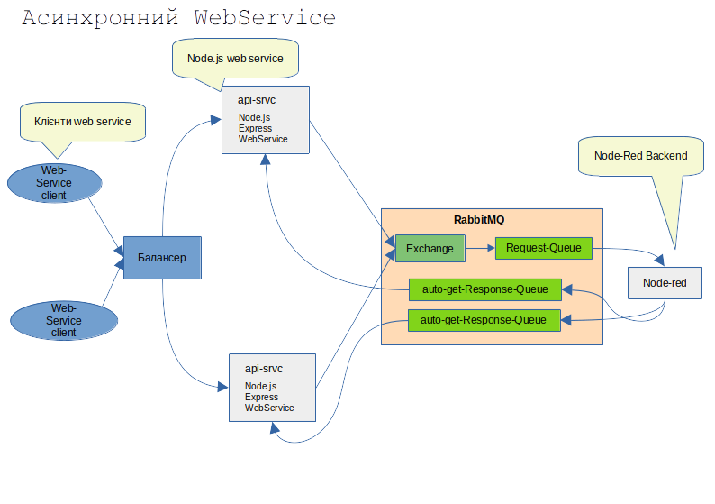

<!-- TOC BEGIN -->
- [1. Про що цей блог](#p1)
- [2. Опис архітектури прототипа та міркування з приводу надійності та масштабування](#p2)
- [2.1. Побудова WebService  на Node.js  та Backend  на Node-Red](#p2.1)

<!-- TOC END -->

## <a name="p1">1. Про що цей блог</a>

Цей блог про шаблонні архітектури з використанням RabbitMQ. 
В даному випадку мова піде про те як за допомогою черг побудувати синхронний Web Service, що в середині має асинхронні обробники. Тобто сам WebService  дуже легенький. Його основне завдання  - прийняти запит, перевірити синтаксис і покласти його в чергу. А вже асинхронний  бакенд прочитає повідомлення з черги виконає обробку запиту та сформує відоповідь, поклавши її вчергу відповідей. А WebService  просто вичитає з черги результат передасть його запитувачу.

Як на мене то цей шаблон може використовуватися у випадках
- висого навантаження на web service. Тобто коли webservice виконує обробку дуже довго, а інші запити можуть просто "відвалюватися" в процесі очікування. В такій архітектурі можна запустити кілька паралельних бакендних обробників, маючи всього один фронтальний WebService;
- коли треба викликати  деяку кількість інших WebService по http. Http  взаємодія за визначенням є не надійною. І тому, коли у вас один WebService  викликає кілька інших - то  він стає дуже "важким" ну і залежним від працездатності інших сервісів. А в цій архітектурі всю "важку" обробку можна винести на бакенд і можна зробити складну обробку повідмолень або побудуваnи якийсь паралелізм та агрегацію відповідей від "третіх" WebServices.
- Коли сам WebService  "стирчить у світ" - фронт, а обробники працюють уже в "ізольованому" та "захищеному" перимерті. І взаємодіють вони тільки через черги.
- Коли є кілька різнорідних обробників (написаних на різних мовах, фреймворках та ін.) і за допомогою цієї архітектури їх можна об'єднати в один web service.

## <a name="p2">2. Опис архітектури прототипа та міркування з приводу надійності та масштабування</a>


### <a name="p2.1">2.1. Побудова прототипа WebService на Node.js та Backend на Node-Red</a>

Припустимо, вам треба приймати запити від клієнтів Web-Service велику кількість запитів та ще і частина з них важкі (виконуються значний відрізок часу). І вплинути на клієнтів, щоб вони якимось чином доопрацювали свої сервіси чи змінили протокол передачі немає можливості. 
Відповідно, вам треба змінити внутрішню архітектру своїх сервісів, не зміньючи "зовнішнього" протоколу обміну.  Не зміньючи "зовнішнього" протоколу обміну означає те що:
- ми не можемо використати шаблон web pooling;
- ми не можемо вокристати шаблон web hook;
- ми не можемо використати асинхронний протокол обміну в web service, коли отримавши запит від клієнта сервер повертає у віддповідь http status code **202 Accepted**, а вже пізніше, коли оборобка закінчиться, повернуть дані на endpoint клієнта.

В нашому випадку ми не повинні закривати http з'єднання до тих пір, пок обробка не закінчиться. По закінчинню обробки повинні повернути http status 200 або помилку.


<kbd></kbd>
<p style="text-align: center;"><a name="pic-01">pic-01</a></p>


Розглянемо ключові аспекти цієї архітектури та можливі рішення для її реалізації:

1. Node.js REST API (Producer в термінах RabbitMQ):

    Прийом HTTP-запитів: Node.js API приймає вхідні HTTP-запити від зовнішніх клієнтів.
    Валідація та обробка запиту: Після отримання запиту потрібно буде його валідувати, можливо, трансформувати дані у формат, який очікує Backend на Node-RED.
    Публікація повідомлення в RabbitMQ: Замість безпосередньої обробки, API публікує отриманий запит як повідомлення в певну чергу RabbitMQ. Важливо правильно серіалізувати дані (наприклад, у форматі JSON) перед відправко та додати службові заголовки повідомлення, щоб backend зміг "зрозуміти" повідомлення без додаткових модифікацій самого інформаційного повідмолення. Node.js API тримає HTTP-з'єднання відкритим і відправляє відповідь лише після отримання даних з RabbitMQ або таймауту.

2. RabbitMQ (Message Broker):

    Черги: Знадобляться принаймні дві черги:
        Черга запитів (Request Queue): Для отримання повідомлень від Node.js API. Node-RED буде підписана на цю чергу.
        Черга відповідей (Response Queue): Для отримання оброблених повідомлень від Node-Red. Node.js API буде підписана на цю чергу.
    Exchange та Binding: Зазвичай використовують Exchange для маршрутизації повідомлень до черг. В даному прототипі не передбачається якихось розпаралелювань та агрегацій, тому можемо використовувати Direct Exchange, де повідомлення з певним ключем маршрутизації потрапляють у чергу з таким самим ключем прив'язки (binding key).
    Гарантія доставки: RabbitMQ пропонує різні механізми для забезпечення надійної доставки повідомлень (наприклад, durable queues, persistent messages, publisher confirms, consumer acknowledgements). Використаємо найбільш традиційне **durable queues**.

3. Node-RED (Consumer та Producer):

    Підписка на чергу запитів: Node-RED підписується на чергу запитів у RabbitMQ і отримує повідомлення для обробки.
    Обробка запиту: Node-RED виконує необхідну бізнес-логіку для обробки отриманого запиту.
    Публікація відповіді в RabbitMQ: Після обробки Node-RED публікує результат у чергу відповідей. Важливо включити в повідомлення відповіді ідентифікатор вихідного запиту, щоб Node.js міг правильно зіставити відповідь із початковим запитом.

4. Node.js REST API (Consumer):

    Підписка на чергу відповідей: Node.js API також підписується на чергу відповідей у RabbitMQ.
    Отримання та обробка відповіді: Коли в черзі з'являється нове повідомлення, Node.js отримує його, десеріалізує дані.
    Зіставлення відповіді з оригінальним запитом: Використовуючи ідентифікатор запиту, що був переданий у повідомленні відповіді, Node.js знаходить відповідний HTTP-запит, що очікує на відповідь.
    Відправка HTTP-відповіді клієнту: Node.js відправляє отриману від Node-RED оброблену інформацію як HTTP-відповідь клієнту, який ініціював запит, і закриває HTTP-з'єднання.    

**Рекомендації та ключові моменти:**

- **Ідентифікація запитів:** Для коректного зіставлення відповідей з оригінальними запитами необхідно генерувати унікальний ідентифікатор для кожного запиту на стороні Node.js API. Цей ідентифікатор повинен передаватися в службових заголовках повідомлення в чергу запитів і повертатися в повідомленні відповіді від Node-RED. 
В наведеному нижче прикладі публікація повідомелння в чергу на стороні Node.js API генерується унікальний ідентифікатор **correlationId**:  const correlationId = uuidv4();.
В службових заголовках повідомлення в RabbitMQ  навіть виділено відповілний заголовок. Ось в цьому рядку і присвоюємо: **correlationId: correlationId**. В цьому прикладі ключ *headers: {* вказує на прикладні заголовки (не службові) і заповнюються додатком самостійно. В даному випадку вони заповнені в демонстарційних цілях.

```js
async publishRequestReport( payload) {
        const log = this.app.get('logger').child({ hostname: process.env.HOSTNAME||'localhost', label: 'srvc-rabbitmq:request report' });
        const correlationId = uuidv4();
        
        const exchangeName= "syncws_exchange";
        const routingKey = "req";


        await this.channel.assertExchange(exchangeName, 'direct', { durable: true });
        log.debug(`Exchange '${exchangeName}' asserted`);
        const messageBuffer = Buffer.from(JSON.stringify(payload));
        const published = this.channel.publish(
            exchangeName,
            routingKey,
            messageBuffer,
            { 
                persistent: true,
                correlationId: correlationId,
                contentType: 'application/json',
                headers: {
                    'x-cerrelation-id': correlationId,
                    'x-request-id': correlationId

                }
            } 
            
                                
        );
        if (published) {
            log.debug(`Message published to exchange '${exchangeName}' with routing key '${routingKey}':`);
           
        } else {
            log.warning('Message was not immediately published (channel might be blocked).');
        }

        return correlationId;
}

```


- **Кореляція відповідей:** У Node.js API потрібно зберігати інформацію про відправлені запити та їхні ідентифікатори, щоб мати можливість зіставити отриману відповідь з відповідним запитом. Можна використовувати [Map](https://www.w3schools.com/js/js_maps.asp). Тут, за звиичай, можна зразу захейтити і сказати: "Треба використовувати Redis inMemory DB  для збереження інформації про відправлені запити, бо в іншому разі у вас не буде горизонтального масштабування. Все буде сконцентровоно тільки в одному екземплярі Node.js API".
Але є непереборні обставини щодо використання Redis для цього: Response клас Node.js є невід'ємною частиною http запиту і "живе" до тих пір, поки живе http  запит, тому response  не підлягає серилізації і не може бути створений окремо від http  запиту. А так як за умовами постановки задачі ми не закриваємо http з'єднання, то на кожному екземплярі Node.js API повинен бути свій список не закритих http з'єднань і глобалізувати його немає сенсу взагалі. 

Наприклад в модулі сервера server.js можна мати глобальний об'єкт:

```js
const responseCallbacks = new Map();
app.set('rescallb',responseCallbacks);
```
В роуетрі записуємо дані про відкрите з'єднання:            

```text
 log.debug(`Store resp as callback for correlationId: ${correlationId}`);
 res_callb.set(correlationId, { res, timeoutId });
```

```js
export default function report_router (app) {
    const router = express.Router();
    const logger = app.get('logger');
    const res_callb = app.set('rescallb');
    const rmq = app.get('rmq');


    router.post('/', async function(req, res, next) {
        const log = logger.child({ hostname: process.env.HOSTNAME||'localhost', label: 'http-post-report' });
        try{
            let reqb=req.body;   
            log.debug("=========Report API========");
            log.debug('Request: ' + JSON.stringify(reqb)) ;
            log.debug("=========Report API========");
        
            const payload = req.body;
            const correlationId = await rmq.publishRequestReport(payload);
            // Зберігаємо об'єкт res та встановлюємо таймаут
            log.debug(`Correlation ID: ${correlationId}`);
            const timeoutId = setTimeout(() => {
                if (res_callb.has(correlationId)) {
                    res_callb.delete(correlationId);
                    log.error(`Request timeout for correlationId: ${correlationId}`);
                    res.status(408).send({ error: 'Request timeout: No response received from IBM ACE.' });
                }
            }, 30000); // 30 секунд таймаут
            log.debug(`Store resp as callback for correlationId: ${correlationId}`);
            res_callb.set(correlationId, { res, timeoutId });

        }
        catch( err){
            let res_status_code=422
            let res_err;
            if( err instanceof ValidationError){
                res_status_code=err.status_code
                res_err=ErrorHandler(err)
            } else if(err instanceof ApplicationError){
                res_status_code=err.status_code
                res_err=ErrorHandler(err)
            } else if(err instanceof ServerError){
                res_status_code=err.status_code 
                res_err=ErrorHandler(err)
            } else if( err instanceof AxiosError){
                res_status_code=err.status
                res_err=ErrorHandler(err)
            } else {
              res_err= ErrorHandler(err)
              res_err.Error.code="InternalError"
              res_err.Error.target="branch api"
            }  
            log.error(res_err)
            res.status(res_status_code).json( res_err );
        }    


    });
    app.use('/api/report', router);
}
```
Але коли кожний кожний екземпляр  Node.js API матимие свій окремий список відкритих з'єднань, виникає питання, як буде відбуватися маршрутизація відповідей між екземплярами. Можливі варіанти будуть розглянуті трошки нижче в розділі: **маршрутизації відповідей в асинхронних системах з RabbitMQ**.

- **Обробка помилок:** Необхідно передбачити механізми обробки помилок на кожному етапі:
        Помилки при публікації в RabbitMQ (наприклад, проблеми зі з'єднанням).
        Помилки обробки на стороні Node-RED (потрібно визначити, як ці помилки будуть передаватися назад).
        Помилки при отриманні та обробці відповідей у Node.js.
        Можливість таймаутів, якщо відповідь від Node-RED не надходить протягом очікуваного часу.
    Повторні спроби (Retries): Залежно від характеру можливих помилок, може знадобитися реалізувати механізми повторних спроб відправки повідомлень або обробки відповідей.
    Моніторинг та логування: Важливо мати ефективну систему моніторингу черг RabbitMQ, продуктивності Node-RED та Node.js API, а також деталізоване логування для відстеження потоку запитів та виявлення проблем. Так, в показаному вище роутері в об'єкті **map**  зберігаються не тільки response  а і id  таймера, що контролює час отримання відповіді. При отриманні відповіді, як показано нижче:


```js
    const rmq = new ServiceRabbitMQ( app );
    app.set('rmq', rmq);
    await rmq.connectToRabbitMQ();


    let responseQueueName = 'wsq_responses';
    await rmq.channel.assertQueue(responseQueueName, { durable: true });

    rmq.channel.consume(responseQueueName, (msg) => {
        applogger.debug(`RabbitMQ consume messages from ${responseQueueName}`);
        if (msg) {
            applogger.debug(`Received message: ${msg.content.toString()}`);
            const response = JSON.parse(msg.content.toString());
            const correlationId = msg.properties.correlationId;
            applogger.debug(`Correlation ID: ${correlationId}`);
            const pending = responseCallbacks.get(correlationId);
            if (pending) {
                const { res, timeoutId } = pending;
                clearTimeout(timeoutId); // Очищаємо таймаут, оскільки відповідь надійшла
                applogger.debug(`Sending response for correlationID: ${correlationId}`);
                applogger.debug(`Response: ${JSON.stringify(response)}`);
                res.status(200).json(response); // Відправляємо позитивну відповідь
                applogger.debug(`Delete responseCallbacks for correlationId: ${correlationId}`);
                responseCallbacks.delete(correlationId); // Видаляємо запис
            } else {
                // Якщо pending == undefined, можливо, таймаут вже спрацював
                applogger.error(`Received response for unknown or timed out request: ${correlationId}`);
            }
            rmq.channel.ack(msg);
        }
    },{ noAck: false });

```
можна побачити як вичитьуються по **correlationId** клас response  та ідентифікатор таймера: const { res, timeoutId } = pending;, потім формується відповідь і закривається http з'єднання:   res.status(200).json(response); та видаляється з реєстру запис з відповідним **correlationId**.


- **маршрутизації відповідей в асинхронних системах з RabbitMQ**    

1. Використання черг з випадковими іменами (Temporary/Exclusive Queues) для кожного екземпляру Node.js API.

Є стандартним способом реалізації так званого "Request/Reply" патерну в RabbitMQ.

Як це працює:

    На стороні Node.js API (Producer of Request, Consumer of Reply):
        Коли Node.js API інстанс стартує і підключається до Rabbit MQ, він створює нову, ексклюзивну (exclusive) чергу в RabbitMQ.
        Ексклюзивна черга:
            Має випадкове (або згенероване) ім'я, гарантуючи унікальність для кожного інстансу Node.js API або навіть для кожного запиту (якщо підключання до rbbitMQ відбувається під час отримання http запиту).
            Доступна тільки для поточного підключення (connection), яке її створило.
            Автоматично видаляється, коли це підключення закривається (або інстанс Node.js API відключається).
        Node.js APIінстанс підписується на цю свою ексклюзивну чергу для отримання відповідей.
        При публікації запиту в чергу request_queue (яку слухає Node-RED), Node.js API додає до властивостей повідомлення (properties, службові заголовки) поле replyTo, вказуючи ім'я цієї своєї ексклюзивної черги.
        Також Node.js API зберігає correlationId (і об'єкт res) у своєму локальному Map для цього інстансу.

    На стороні Node-RED (Consumer of Request, Producer of Reply):
        Node-RED отримує запит з request_queue.
        Після обробки, Node-RED бере ім'я черги з поля replyTo отриманого повідомлення.
        Node-RED публікує повідомлення-відповідь (з correlationId та data) безпосередньо в ту чергу, ім'я якої було в replyTo.

    Зворотна сторона Node.js API (Consumer of Reply):
        Коли повідомлення-відповідь надходить у відповідну ексклюзивну чергу, лише той інстанс Node.js API, який її створив, отримає це повідомлення.
        Він використовує correlationId для зіставлення з локальним Map та відправки HTTP-відповіді клієнту.

Переваги цього підходу:

    Істинна горизонтальна масштабованість Node.js API: Кожен інстанс Node.js API є абсолютно незалежним у плані отримання відповідей. Він не потребує жодного зовнішнього сховища (як Redis) для збереження res об'єктів для кореляції, оскільки відповідь прийде саме йому.
    Простота кореляції: Локальний Map є достатнім, оскільки ми знаємо, що відповідь прийде до того ж інстансу, який створив запит.
    Зниження навантаження на RabbitMQ (для широкомовних сценаріїв): Кожне повідомлення-відповідь надсилається безпосередньо до однієї черги, а не широкомовно в одну спільну чергу, яку фільтрують усі інстанси.
    Автоматичне очищення: Ексклюзивні черги автоматично видаляються, що запобігає "засміченню" RabbitMQ.

2. "Кожен екземпляр повинен з черги відповідей висмикувати тільки відповіді "зі своїм appid""

Це інший, також валідний підхід, який називається селективним споживанням (selective consumption).

Як це працює:

    На стороні Node.js API (Producer of Request):
        Кожен інстанс Node.js API генерує унікальний ідентифікатор для себе (наприклад, instanceId). Це може бути UUID, ім'я хоста + PID, або просто згенерований при старті.
        При публікації запиту в request_queue, Node.js додає до повідомлення властивість, скажімо, replyInstanceId, яка містить цей instanceId.
        Зберігає correlationId та res об'єкт у своєму локальному Map.

    На стороні Node-RED (Consumer of Request, Producer of Reply):
        Отримує запит.
        Після обробки, бере replyInstanceId з отриманого повідомлення.
        Публікує відповідь у одну спільну чергу відповідей (наприклад, all_responses_queue).
        Але в повідомлення-відповідь також додає replyInstanceId.

    Зворотна сторона Node.js API (Consumer of Reply):
        Кожен інстанс Node.js API підписується на all_responses_queue.
        Використовує селектор повідомлень (message selector) або фільтрує повідомлення вручну.
        Якщо RabbitMQ підтримує селектори (деякі клієнти і брокери, як JMS, підтримують це), інстанс Node.js API може вказати: "Давай мені тільки ті повідомлення, де replyInstanceId дорівнює моєму instanceId".
        Якщо селектори не підтримуються (як у стандартному AMQP), кожен інстанс отримуватиме всі повідомлення з all_responses_queue, але буде обробляти лише ті, де replyInstanceId відповідає його власному instanceId. Решту повідомлень він просто ігнорує або відкидає (після ACK, щоб інші інстанси не обробляли те саме повідомлення).

Переваги цього підходу:

    Менше черг у RabbitMQ: Замість багатьох ексклюзивних черг, у вас є лише одна спільна черга відповідей.
    Збереження стану (при відключенні одного інстансу): Якщо один інстанс Node.js впав, а потім піднявся, він може продовжити споживати повідомлення зі спільної черги, якщо вони не були "засмічені" або TTL для них не минув. Однак, якщо повідомлення було для впавшого інстансу, його може забрати інший інстанс, і тоді потрібно, щоб correlationId дозволяв "передати" обробку, що ускладнить логіку. Хоча для нашого випадку ці переваги мабуть сенсу і не мають, все ж треба згадати їх.


Ви знову торкнулися дуже важливого аспекту масштабованості та правильної маршрутизації відповідей в асинхронних системах з RabbitMQ! Ваші ідеї абсолютно вірні і відображають стандартні патерни для вирішення цих проблем.

Давайте детальніше розберемо ваші пропозиції:
1. Використання черг з випадковими іменами (Temporary/Exclusive Queues)

Так, це абсолютно можливо і є стандартним способом реалізації так званого "Request/Reply" патерну в RabbitMQ.

Як це працює:

    На стороні Node.js (Producer of Request, Consumer of Reply):
        Коли Node.js інстанс отримує HTTP-запит, він створює нову, ексклюзивну (exclusive) чергу в RabbitMQ.
        Ексклюзивна черга:
            Має випадкове (або згенероване) ім'я, гарантуючи унікальність для кожного інстансу Node.js або навіть для кожного запиту.
            Доступна тільки для поточного підключення (connection), яке її створило.
            Автоматично видаляється, коли це підключення закривається (або інстанс Node.js відключається).
        Node.js інстанс підписується на цю свою ексклюзивну чергу для отримання відповідей.
        При публікації запиту в чергу request_queue (яку слухає IBM ACE), Node.js додає до властивостей повідомлення (properties) поле replyTo, вказуючи ім'я цієї своєї ексклюзивної черги.
        Також Node.js зберігає correlationId (і об'єкт res) у своєму локальному Map для цього інстансу.

    На стороні IBM ACE (Consumer of Request, Producer of Reply):
        IBM ACE отримує запит з request_queue.
        Після обробки, IBM ACE бере ім'я черги з поля replyTo отриманого повідомлення.
        IBM ACE публікує повідомлення-відповідь (з correlationId та data) безпосередньо в ту чергу, ім'я якої було в replyTo.

    Зворотна сторона Node.js (Consumer of Reply):
        Коли повідомлення-відповідь надходить у відповідну ексклюзивну чергу, лише той інстанс Node.js, який її створив, отримає це повідомлення.
        Він використовує correlationId для зіставлення з локальним Map та відправки HTTP-відповіді клієнту.

Переваги цього підходу:

    Істинна горизонтальна масштабованість Node.js: Кожен інстанс Node.js є абсолютно незалежним у плані отримання відповідей. Він не потребує жодного зовнішнього сховища (як Redis) для збереження res об'єктів для кореляції, оскільки відповідь прийде саме йому.
    Простота кореляції: Локальний Map є достатнім, оскільки ми знаємо, що відповідь прийде до того ж інстансу, який створив запит.
    Зниження навантаження на RabbitMQ (для широкомовних сценаріїв): Кожне повідомлення-відповідь надсилається безпосередньо до однієї черги, а не широкомовно в одну спільну чергу, яку фільтрують усі інстанси.
    Автоматичне очищення: Ексклюзивні черги автоматично видаляються, що запобігає "засміченню" RabbitMQ.

Недоліки/Міркування:

    Стійкість до збоїв Node.js інстансу: Якщо інстанс Node.js, який відправив запит і чекає на відповідь, раптово впаде до отримання відповіді, то:
        HTTP-з'єднання з клієнтом обірветься (клієнт отримає таймаут або помилку з'єднання).
        Ексклюзивна черга буде видалена.
        Відповідь від IBM ACE, хоч і буде відправлена, не знайде свого отримувача і буде втрачена.
        Це потрібно враховувати. Зазвичай, для таких сценаріїв клієнту відправляють 202 Accepted і використовують механізм polling/WebSockets з використанням Redis для збереження кінцевого результату обробки (не res об'єкта, а саме даних відповіді), щоб клієнт міг отримати її пізніше. Або ж, клієнт повинен бути готовий повторити запит.
    Велика кількість черг: Для кожного активного запиту буде створена нова черга. Це може призвести до великої кількості черг у RabbitMQ, але вони короткоживучі.

2. "Кожен екземпляр повинен з черги відповідей висмикувати тільки відповіді "зі своїм appid""

Це інший, також валідний підхід, який називається селективним споживанням (selective consumption).

Як це працює:

    На стороні Node.js (Producer of Request):
        Кожен інстанс Node.js генерує унікальний ідентифікатор для себе (наприклад, instanceId). Це може бути UUID, ім'я хоста + PID, або просто згенерований при старті.
        При публікації запиту в request_queue, Node.js додає до повідомлення властивість, скажімо, replyInstanceId, яка містить цей instanceId.
        Зберігає correlationId та res об'єкт у своєму локальному Map.

    На стороні IBM ACE (Consumer of Request, Producer of Reply):
        Отримує запит.
        Після обробки, бере replyInstanceId з отриманого повідомлення.
        Публікує відповідь у одну спільну чергу відповідей (наприклад, all_responses_queue).
        Але в повідомлення-відповідь також додає replyInstanceId.

    Зворотна сторона Node.js (Consumer of Reply):
        Кожен інстанс Node.js підписується на all_responses_queue.
        Використовує селектор повідомлень (message selector) або фільтрує повідомлення вручну.
        Якщо RabbitMQ підтримує селектори (деякі клієнти і брокери, як JMS, підтримують це), інстанс Node.js може вказати: "Давай мені тільки ті повідомлення, де replyInstanceId дорівнює моєму instanceId".
        Якщо селектори не підтримуються (як у стандартному AMQP), кожен інстанс отримуватиме всі повідомлення з all_responses_queue, але буде обробляти лише ті, де replyInstanceId відповідає його власному instanceId. Решту повідомлень він просто ігнорує або відкидає (після ACK, щоб інші інстанси не обробляли те саме повідомлення).

Переваги цього підходу:

    Менше черг у RabbitMQ: Замість багатьох ексклюзивних черг, у вас є лише одна спільна черга відповідей.
    Збереження стану (при відключенні одного інстансу): Якщо один інстанс Node.js впав, а потім піднявся, він може продовжити споживати повідомлення зі спільної черги, якщо вони не були "засмічені" або TTL для них не минув. Однак, якщо повідомлення було для впавшого інстансу, його може забрати інший інстанс, і тоді потрібно, щоб correlationId дозволяв "передати" обробку, що ускладнить логіку.

Недоліки/Міркування:

    Навантаження на мережу/Node.js: Кожен інстанс Node.js отримуватиме багато повідомлень, які йому не призначені, якщо не використовуються потужні механізми фільтрації на стороні брокера. Це може бути менш ефективно з точки зору використання ресурсів.
    Складність фільтрації: Якщо RabbitMQ не підтримує селектори, вам потрібно реалізувати фільтрацію на стороні вашого Node.js додатка, що додає логіки.
    Перекриття логіки: Якщо один інстанс отримав повідомлення, але воно призначене іншому (і він його ігнорує), вам потрібно бути впевненими, що інший інстанс (якому воно призначене) все ще живий і зможе його забрати.

**Висновок:**

Для нашого сценарію, де Node.js REST API приймає запит і чекає на синхронну (з точки зору клієнта) відповідь через RabbitMQ, патерн з ексклюзивними (тимчасовими) чергами (replyTo) є значно кращим рішенням.

Чому?

    Природна кореляція: Відповідь приходить саме туди, де вона потрібна, без додаткової логіки фільтрації.
    Простота локального Map: Не потрібен Redis для збереження res об'єкта, оскільки кожен екземпляр обробляє свої власні відповіді.
    Ефективність: Кожне повідомлення-відповідь передається лише одному споживачу.
    Це класичний патерн "Request/Reply" через черги.

