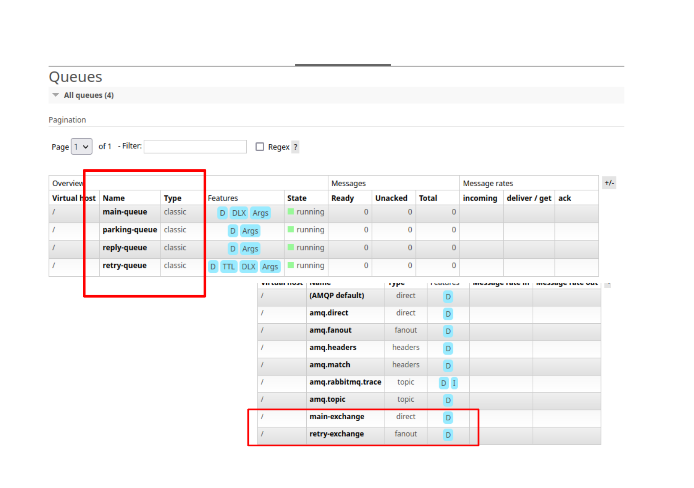

<!-- TOC BEGIN -->
- [1. Про що цей блог](#p1)
- [2. Опис архітектури прототипа та міркування з приводу надійності та масштабування](#p2)
- [3. Побудова WebService  на Node.js  та Backend  на Node-Red](#p3)
- [3.1 Основні ключові моменти цього прототипу](#p3.1)

<!-- TOC END -->

## <a name="p1">1. Про що цей блог</a>

В багатьох мануалах продажників, що продають програмні продукти типу "черги" деінде дуже випирає, що їх продукт відрізняється підтримкою транзакцій. В цьому блозі наведено міркування з приводу корисності чи потрібності транзакційності відносно того, які сценарії обробки нам потрібно реалізувати. 

## <a name="p2">2. Сценарій 1. "Чиста" транзакційність (File Transfer/Data Replication)</a>

Через черги налаштована передача файлів з одного каталога в інший. Або ж  пакет записів бази даних публікується в чергу одним повідмоленням, а при читанні цей пакет зберігається як файл і  записується в каталог. В деяких випадках може бути важливою послідовність файлів. І, в якийсь момент, не вистачило місця, щоб записати файл в каталог. Виникла помилка і транзакція відкотилася, а повідомлення - повернулося в чергу. Весь процес обміну зупинився, до тих пір, поки не додадуть вільного місця для запису файла. Не зважаючи на те, що процес передачі зупинився, не порушилася послідовність надходження даних і, такми чином, дані залишилися цілісними. Такий же сценарій може виникнути, коли через чергу реалізована пакетна реплікація даних. І там теж важлива послідовність надходження та обробки пакетів.

**Тут працює принцип:** Якщо операція (наприклад, запис файлу, або пакетна реплікація) не може бути завершена успішно, то нічого не повинно бути записано або змінено, і стан системи має залишатися незмінним. Повідомлення повертається в чергу, щоб бути обробленим пізніше, коли умови для успішного виконання відновляться.

У таких системах передбачається наявністиь механізми моніторингу, які сигналізують про проблеми (наприклад, відсутність місця на диску). Після усунення проблеми, повідомлення, що повернулося, може бути успішно оброблене.

**Обмеження:** Слід пам'ятати, що така "чиста" транзакційність на рівні черги (тобто, повернення повідомлення) не забезпечує двофазний коміт або розподілені транзакції між кількома системами (наприклад, черга + база даних + файлова система + http). Для цього потрібні складніші патерни, такі як ["Outbox Pattern"](https://microservices.io/patterns/data/transactional-outbox.html) або ["Saga Pattern"](https://microservices.io/patterns/data/saga.html), які повинні гарантувати атомарність між різними сервісами. 
Відверто кажучи, я ці патерни не використовував, бо обходився більш простими рішеннями. 


## <a name="p3">3. Сценарій 2: Асинхронна обробка з можливістю тимчасових помилок (Банківські платежі)</a>

В банківській системі створені платежі: різні, різного типу, різних клієнтів. Між собою платежі не зв'язані. Вони відправляються в чергу і обробляються окремо. Кожний платіж обробляється окремо від інших. Але в цьому процесі велика вірогідність надходження не коректних (не валідних) даних в одному з платежів і тоді платіж не можливо обробити. Тобто завжди виникатиме помилка, доки не зміняться умови: змінять ліміт транзакцій для рахунку, на рахунок списання надійдуть кошти, виконаються якісь додаткові перевірки. Якщо використати **класичну транзакційність** *(Сценарій 1)*, то такий платіж повернеться в чергу і зупинить обробку інших платежів. В такому випадку класична транзакційність шкодить. І тоді використовують інший підхід. А саме метод **Retry queue** та **Dead Letter Queues**. Тобто, повідомлення-платіж відправляється в іншу чергу ( "черги повторних спроб"  **Retry queue**) і через якийсь проміжок часу повідомлення-платіж знову ререкладається в основну чергу для повторної спроби обробки. За час очікування може успішно обробитися багато "нормальних" платежів. Потім знову спробує обробитися платіж з **Retry queue**. Такий підхід зручний, коли ви очікуєте тимчасові помилки відносно одного повідомлення в черзі помилка не повинна зупиняти потік обробки інших. Або ж тимчасова не доступність інфраструктури не повинна зупиняти весь процес обробки повідомлень. В такого роду сценаріях навіть термін такий з'явився "отруйне повідомлення". Якщо таке "отруйне повідомлення" буде безкінечну кількість разів перекладатися в основну чергу (також є велика вірогідність накопичення такого роду повідомлень) то продуктивність системи може різко падати. Тому, зазвичай, кількість спроб **Retry**  обмежують. Іколи всі спроби вичерпані, то таке повідмолення відправляється до "черги мертвих повідомлень" (DLQ - Dead Letter Queues).

**Переваги цього методу:**
- Ізоляція проблем: "Проблемні" повідомлення не блокують обробку інших, коректних повідомлень.
- Автоматизація відновлення: Тимчасові збої (мережеві проблеми, тимчасова недоступність сервісу) можуть бути автоматично виправлені за допомогою механізму повторних спроб.
- Моніторинг: DLQs слугують чудовим місцем для моніторингу повідомлень, які не були оброблені, що дозволяє швидко виявляти та усувати системні проблеми.

Такий сценарій обробки притаманний більше для фонових процесів - обробників. 

## <a name="p4">4. Сценарій 3. Синхронно-асинхронні веб-сервіси (одноразова обробка)</a>

Як побудувати синхронно-асинхронний веб сервіс, описано за лінком [Async Web Service with RabbitMQ](https://pavlo-shcherbukha.github.io/posts/2025-05-08/asyncws-rabbitmq/). 

У сценаріях, де клієнт очікує швидку синхронну відповідь від веб-сервісу, а обробка в черзі є фоновою частиною запиту, транзакційність на рівні черги втрачає сенс. Мета – швидко відповісти клієнту про прийняття запиту (або про помилку у запиті) і не тримати його в очікуванні фонової обробки.

Якщо виникає помилка при обробці повідомлення з черги, її слід зафіксувати (логи, метрики), можливо, відправити повідомлення до DLQ для подальшого аналізу, але ні в якому разі не повертати до основної черги для повторної спроби, оскільки це не має жодного сенсу для кінцевого користувача або веб-сервісу, який вже отримав відповідь.

## <a name="p5">5. Висновки та додаткові міркування</a>

**Таким чином:** необхідність транзакційності (чи то "класичної", чи то з використанням DLQ/Retry) повністю залежить від бізнес-вимог та характеру операції. Не існує єдиного "правильного" підходу.

**Принцип виконання операцій:**  Незалежно від обраного підходу, дуже важливо, щоб операції, які обробляються з черги,відповідали принципу, що повторне виконання тієї ж операції з тим самим повідомленням (наприклад, якщо воно повернулося в чергу або було переоброблено з DLQ) не повинно призводити до небажаних побічних ефектів або подвоєння результатів (наприклад, подвійного списання грошей). Це критично для надійності розподілених систем.

**Моніторинг:** Завжди налаштовуйте моніторинг для ваших черг, особливо для DLQ. Накопичення повідомлень у DLQ є явним індикатором проблем у системі, які потребують уваги.

Особливості в "транзакційності":
- Атомарність обробки повідомлення: повідомлення буде успішно оброблене повністю або не оброблене взагалі.
- Розподілені транзакції: Це складніший патерн, який забезпечує атомарність операцій, що охоплюють кілька систем (наприклад, базу даних, зовнішній API та чергу).

## <a name="p6">6. Прототип реалізацію метод **Retry queue** та **Dead Letter Queues** (Сценарій 2) на базі RabbitMQ</a>

Зробити прототип на базі класичної транзакційності - задача досить очевидна, тому мабуть немає сенсу на неї витрачати час. А сценарій синхронно-асинхронного web service описано в попередньому блозі і там уже є прототип. Тому залишається **Retry queue**.

Зразу потрібно зауважити, що на Node-Red мені не вдалося зробити такий прототип, тому, що бульшість вузлів: або дуже старі, або є обмеження фукнціональності вузла що не дозволяють це зробити. Проблема в тому, що вузли самі, автоматично створюють чергу, якщо її немає. А якщо ви вже створили конфігурацію черг та обмінників з додатковими аргуентами, то отримаєте помилку підключення, тому що простенька декларація черги у вузлі не співпадає з тим, що на справді створено в RabbitMQ

Так, в каталозі **test**  знаходиться  bash-скрипт для створення конфігурації **create-cfg.sh**. Нижче показано його фрагмент для створення черги **main-queue**. 

```bash
curl -u $XUSR:$XPSW -X PUT \
-H "Content-Type: application/json" \
-d '{"auto_delete":false,"durable":true,"arguments":{"x-dead-letter-exchange": "retry-exchange"}}' \
http://$XHOST:$XPORT/api/queues/%2F/main-queue
```
В цьому фрагменті заповнено ключ **"arguments"**. А ноди для Node-Red  не передбачають його заповення. В цей момент і виникає помилка. На додаток в багатьох комплекатх нод відсутнє ручен управління транзакцією. 
В реальрному ж житті мені приходилося дуже часто використовувати саме цей шаблон, правда на чергах IBM MQ. Тому я змушений був написати прототип на Node.JS.


### Створення конфігурації **Retry**  на прикладі RabbitMQ

Конфігурація показана на [pic-101](#pic-101)

<kbd></kbd>
<p style="text-align: center;"><a name="pic-101">pic-101</a></p>


По суті є основна черга **main_queue** та exchange **main_exchange** через який в **main_queue**  потрапляють повідомлення. 

- **якщо повідомлення оброблено успішно**, то відповідь публікується в чергу **reply-queue**. Публікація повідмолення відбувається таким чином:

```js
    // Якщо треба відправити відповідь у replyTo:
    if (msg.properties.replyTo) {
        channel.sendToQueue(
            msg.properties.replyTo,
            Buffer.from('{"status":"ok"}'),
            { correlationId: msg.properties.correlationId, contentType: 'application/json' }
        );
    }
```
Я бачимо, тут exhange  не вказується (або вказується пусьитй рядок), а в якості routing key вказується назва черга. При такій публікації повідомлення пройде через exchange: (AMQP default). По суті, до цього  exchange "прив'язуються" всі черги з routing key який співпадає з назвою черги.

- ****

Є черга **retry_queue** в яку повідомлення попадають у випадку помилки обробки. 


Далі consumer  читає повідомлення, одне за одним і обробляє його. У випадку успішної обробки ми закриваємо транзакцію, даючи підтвредження **ACK** (ну деякий аналог commit). У випадку, коли повідомлення обробилося з помилкою, ми сигналізуємо про помилку сигналом **NACK** ( щось на кшталт **rollback**). Але при цьому повідомлення переноситься в     


