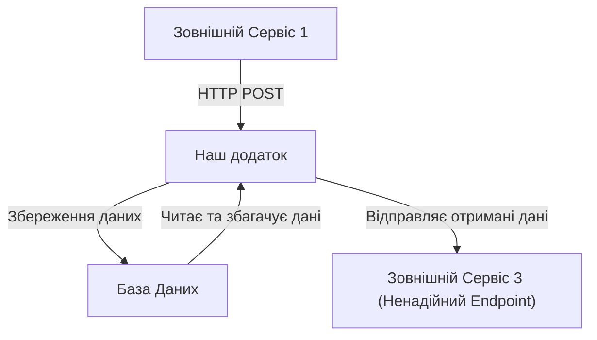
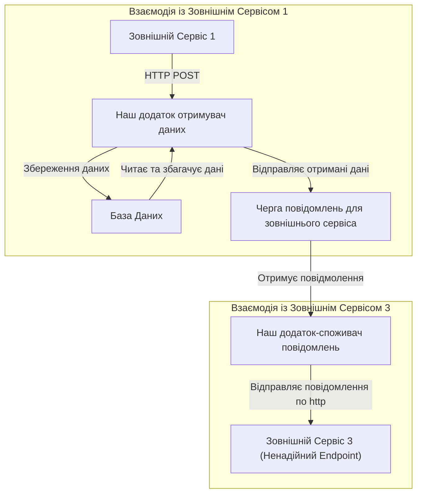
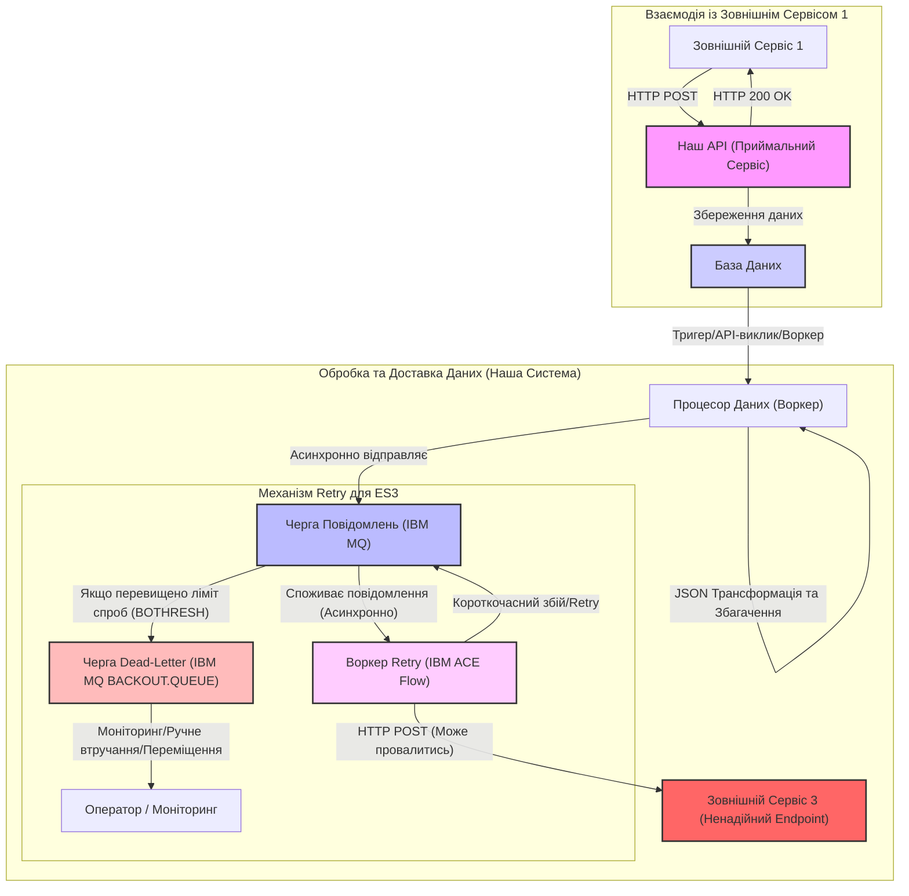
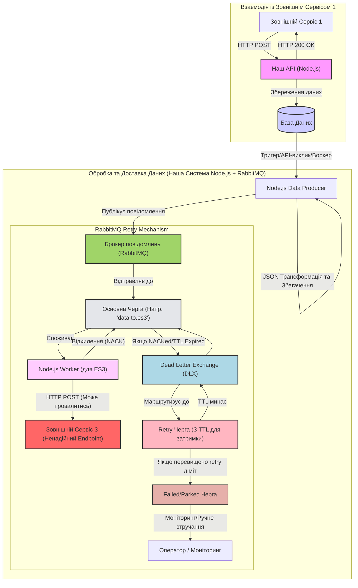

<!-- TOC BEGIN -->
- [1. Про що цей блог](#p1)
- [2. Сценарій 1. "Чиста" транзакційність (File Transfer/Data Replication)](#p2)
- [3. Сценарій 2: Асинхронна обробка з можливістю тимчасових помилок (Банківські платежі)](#p3)
- [4. Сценарій 3. Синхронно-асинхронні веб-сервіси (одноразова обробка)](#p4)
- [5. Висновки та додаткові міркування](#p5)
- [6. Прототип реалізацію метод **Retry queue** та **Dead Letter Queues** (Сценарій 2) на базі RabbitMQ](#p6)
- [6.1 Створення конфігурації **Retry**  на прикладі RabbitMQ](#p6.1)
- [6.2 Створеня прототипу на Node.js](#p6.2)
- [6.3 Node-Red: Невдала спроба створеня прототипу](#p6.3)
<!-- TOC END -->

## <a name="p1">1. Про що цей блог</a>

Виникла цікава оптимізаційна архітектурна задачка. Може я дарма над нею задумався. Сама задачка полягає в тому що:
- Від одного зовнішнього сервісу ви отримали дані. Ви їх успішно обробили: записали в базу даних і відправили тому зовнішньому сервісу http status code 200 і ви з ним успішо розпрощался.
- Але, вам  потрібно ці ж дані, з деяким збагаченням і якоюсь трансформацією тут же вичитати з бази даних і відправити їх по http  на endpoint  третьому  сервісу.  
- Відповідно, потрібен воркер, який,с формує повідомленя і відправить його по http. Але з третім сервісом є нюанс: 
    - третій сервіс дуже "вередливий" з точки зору короткочасних пропадань мережі, тобто дуже часто до нього не можан достукатися, а через секунду можна. Або перший запит він не прийме, а другий, третій прийме (довго запускаєтья)
    - З завидною регулярністю кілька разів на місяць він стає не доступним з різних причин: то оновлення розтяглося на три дні, то він "ліг відпочити" і ніхто не помітив. Коротше часто сервіс "unavailable".
Питання полягає в тому, як побудувати архітектуру нашого ворекера так, щоб компенсувати  неприємності з короткочасними та довготривалими  проблемами третього сервісу. При цьому приускаємо, що сервіс толерантний до даних, що надійшли повторно (ну, або це не критично). От пошук рішення для цієї задачки з використанням різних типів інстументів  є змістом цього блогу. Тут необхідно наголосити, що використання одного ж і того архутектруного шаблону на різних інструментах одного і того ж типу виглядає настільки невпізнанно - що, якщо ти хлочеш зробити (намалювати) якийсь архітектурний шаблон -то вивчи той інстумент, який ти хочеш використовувати.

## <a name="p2">2. Короткий огдяд рішень від "великих квадратів"</a>

Якщо намалювати діаграму "великів квадартів", що за звичай розглядають на великих екранах за довгими столами, то виглядадтиме це приблизно так. І НЕ ПРАВИЛЬНО. ВОНО НЕ ПРАЦЕЗДАТНЕ. Це стиль думання монолітом.

Виникає питання чому?  

На цій діаграмі відстні елементи взаємодії пор http. 
- коли "Наш додаток" відправить підтвердження що обробив (або не обробив запит)
- коли наш додатко ініціює запит по http до "Зовнішній Сервіс 3"

Якщо  "Наш додаток"  почне http  взаємодію з "Зовнішній Сервіс 3" не закривши з'єднання з "Зовнішній Сервіс 1", то "Зовнішній Сервіс 1" отримає помилку, що іеіційована  http  взаємодією з "Зовнішній Сервіс 3".

Якщо "Наш додаток" почне http  взаємодію закривши з'єднання з "Зовнішній Сервіс 1", але  отримає помилку - то вона запишеться десь в логи і ми будемо решгулярно дивитися в ті логи і казати, що: "у вас сервіс не достпний". А знайти причину не доступності буде досить складно - тому що вона часто криється  на мережевому рівні.

А кщо у вас "Зовнішній Сервіс 3" взагалі "ліг" на кілька днів, то  треба або зупинити додаток "Наш додаток", або бути готовим читати велику кількість логів з помилками, взагалі то і не портібних. Але вони будуть споживати дисковий простір, пам'ять та процесорний ресурс. Але, якщо ви зупините додаток, то буде не заслужено страждати  "Зовнішній Сервіс 1", тому що він стукається до  "Наш додаток", а тм нічого немає.

І так складається такий собі ланцюжок неприємностей. Тому на великих екранах за довгими столами вже навчилися малювати жирну лінію і казати що отут буде черга.

На цій діаграмі моноліт ""Наш додаток" розбито на два компоненти:
- "Наш додаток отримувач даних";
- "Наш додаток-споживач повідомлень".

По суті це два не залежні компоненти. Вони зв'язані між собою "м'яким зв'язком". Тобто, зупинка компонента "Наш додаток-споживач повідомлень" - ніяким чином не вплине на "Наш додаток отримувач даних". Просто в черзі будуть накопичуватися повідомлення для 
"Зовнішній Сервіс 3". А от коли "Наш додаток-споживач повідомлень"запустять, то "Зовнішній Сервіс 3" отримає всі повідмолення, що накопичилися за час простою.
Вже трошки краще, але всерівно не зрозуміло, коли даємо відповідь "Зовнішній Сервіс 1" по http. Так як "Зовнішній Сервіс 3" є за визначенням не надійним, то при короткострокових проблемах інфраструктури, чи "Зовнішній Сервіс 3"  раптом "втомиться" - то всі ці повідомлення вилетять тільки в лог з помилками. Знову ж таки хорошого в цьому мало, тому, що копирасатися в логах і пояснювати власникам "Зовнішній Сервіс 3", чому по таймаут (проблеми мережі) нічого не дішло - теж справа безнадійна, особливо коли немає впливу на інфраструктуру. І по діаграмі не зрозуміло, а що робити коли Зовнішній Сервіс 3" почне відповідати помилками.

Отут і настає привід для вивчення і використання архітектурних шаблонів, а саме для цього і використовують [3. Сценарій 2: Асинхронна обробка з можливістю тимчасових помилок (Банківські платежі)](https://pavlo-shcherbukha.github.io/posts/2025-06-01/queue-transaction/).

### <a name="p1.1">1.1. Приблизна архітектура рішення на ACE та IBM MQ </a>
Якщо  зобразити архітектуру графічно, що зазвичай покажуть на великому екрані за довгим столом засідання, (архітектуру "великих квадартів"), то виглядати вона буде зазвичай так:

Пояснення архітектурної діаграми ("великих квадратів"):

    "External Service 1 Interaction" (Взаємодія із Зовнішнім Сервісом 1):

        Зовнішній Сервіс 1 (ES1): Відправляє дані на наш API.

        Наш API (Приймальний Сервіс): Отримує дані, успішно їх обробляє (зберігає в базу даних) і негайно відповідає ES1 зі HTTP 200 OK. Це робить взаємодію з ES1 синхронною та швидкою, незважаючи на подальшу обробку.

        База Даних (DB): Зберігає отримані дані. Це перше місце, де дані стають "безпечними" і зберігаються.

    "Data Processing & Delivery (Our System)" (Обробка та Доставка Даних - Наша Система):

        Процесор Даних (Воркер): Цей компонент відповідає за вичитування щойно збережених даних з бази даних, їх збагачення та трансформацію. Це може бути окремий мікросервіс, функція бази даних (тригер), або інший воркер, який активується після запису в DB.

        Черга Повідомлень (Напр. IBM MQ): Це ключовий елемент архітектури. Замість прямого виклику ненадійного сервісу 3, процесор даних асинхронно відправляє підготовлене повідомлення до черги.

            Перевага: Якщо Сервіс 3 недоступний, повідомлення просто чекає в черзі, не блокуючи процесор даних і не змушуючи його повторювати спроби відправки. Черга виступає як буфер.

        Воркер Retry (Напр. IBM ACE Flow): Це окремий компонент (у вашому випадку, це ваш ACE Flow), який споживає повідомлення з черги. Він відповідає за фактичну відправку повідомлення на Зовнішній Сервіс 3.

            Оскільки він працює асинхронно, він може мати власну внутрішню логіку retry.

        Зовнішній Сервіс 3 (Ненадійний Endpoint): Це той самий "вередливий" сервіс, який може мати короткочасні та довготривалі проблеми.

    "Retry Mechanism for ES3" (Механізм повторних спроб для Сервісу 3):

        Короткочасний збій/Retry: Якщо RetryWorker не може достукатися до ES3 (мережа, таймаут, перший запит не прийнятий), він відкатує транзакцію (викидає виняток, як ми обговорювали). Повідомлення повертається до тієї ж Черги Повідомлень, але з лічильником відкатів, і чекає на BOINTERVAL перед наступною спробою.

        Черга Dead-Letter (DLQ - Напр. IBM MQ BACKOUT.QUEUE): Якщо повідомлення перевищує заданий ліміт спроб (ваші BOTHRESH), воно автоматично переміщується до DLQ.

        Оператор / Моніторинг: DLQ є сигналом про серйозніші проблеми. Оператори або системи моніторингу повинні стежити за цією чергою, щоб виявляти постійно проблемні повідомлення та втручатися вручну (наприклад, виправити дані, перевірити доступність ES3, перемістити повідомлення для повторної обробки вручну).

Ця архітектура чітко розділяє синхронну відповідь першому сервісу від асинхронної, стійкої доставки даних третьому сервісу, компенсуючи його ненадійність за рахунок буферизації та механізмів retry в черзі повідомлень. Це класичний приклад шаблону "Producer-Consumer" з додатковими шарами стійкості.

### <a name="p1.2">1.2. Приблизна архітектура рішення на Node.js  та RabbitMQ </a>

Пояснення архітектурної діаграми (Node.js + RabbitMQ):

    "Взаємодія із Зовнішнім Сервісом 1":

        Наш API (Node.js): Залишається аналогічним, приймає запит, зберігає в базу даних і відповідає HTTP 200 OK. Node.js тут виступає як ефективна платформа для швидких I/O операцій.

        База Даних (DB): Зберігає дані.

    "Обробка та Доставка Даних (Наша Система Node.js + RabbitMQ)":

        Node.js Data Producer: Цей Node.js воркер читає дані з DB (або активується тригером), збагачує та трансформує їх.

        Брокер повідомлень (RabbitMQ): Замість IBM MQ, тут використовується RabbitMQ. Producer публікує повідомлення в RabbitMQ.

    "RabbitMQ Retry Mechanism" (Механізм Retry в RabbitMQ):

        Основна Черга ('data.to.es3'): Повідомлення спочатку надходить сюди.

        Node.js Worker (для ES3): Це Node.js додаток (споживач), який читає повідомлення з 'Основної Черги'. Він виконує HTTP POST запит до Зовнішнього Сервісу 3.

        Зовнішній Сервіс 3 (Ненадійний Endpoint): Той самий проблемний сервіс.

        Механізм Retry в RabbitMQ (основна відмінність):

            Відхилення (NACK): Якщо 'Node.js Worker' не може доставити повідомлення до ES3 (через збій, таймаут тощо), він відхиляє повідомлення (NACK) з опцією requeue: false. Це запобігає негайному поверненню повідомлення в оригінальну чергу.

            Dead Letter Exchange (DLX) і Dead Lettering: 'Основна Черга' конфігурується з аргументом x-dead-letter-exchange. Коли повідомлення відхиляється, воно автоматично перенаправляється в DLX.

            Retry Черга (З TTL для затримки): DLX маршрутизує повідомлення до спеціальної 'Retry Черги'. Ця 'Retry Черга' налаштована з x-message-ttl (Time-To-Live) та x-dead-letter-exchange, що вказує на той самий DLX, з якого повідомлення прийшло.

                Як це працює: Повідомлення перебуває в 'Retry Черзі' протягом встановленого TTL. Після закінчення TTL, воно "dead-lettered" назад у DLX, який потім маршрутизує його назад до 'Основної Черги'. Це створює цикл повторних спроб із затримкою.

            Якщо перевищено retry ліміт: 'Node.js Worker' (або логіка в 'Retry Черзі' через x-max-length) може вести власний лічильник спроб (наприклад, у заголовках повідомлення). Якщо лічильник досягає певного порогу, повідомлення переміщується до 'Failed/Parked Черги'.

            Failed/Parked Черга: Це аналог BACKOUT.QUEUE в IBM MQ. Сюди потрапляють повідомлення, які не вдалося обробити після всіх спроб.

            Оператор / Моніторинг: Як і раніше, ця черга потребує моніторингу та, можливо, ручного втручання.

Ключові відмінності порівняно з IBM MQ + ACE:

    Розподіл функціоналу Retry: У RabbitMQ механізм затримки та перенаправлення для retry (через TTL, DLX та окрему Retry Queue) є більш явним і налаштовується на рівні RabbitMQ. В IBM MQ це відбувається через BOINTERVAL та BOTHRESH на самій вхідній черзі.

    Управління лічильником спроб: У RabbitMQ часто доводиться реалізовувати логіку лічильника спроб (наприклад, у заголовках повідомлення) у самому воркері Node.js. У IBM MQ MQMD.BackoutCount є вбудованим і автоматично підтримується менеджером черг.

    Гнучкість Retry-сценаріїв: RabbitMQ, з його DLX/TTL механізмом, надає більшу гнучкість для створення складних retry-графіків (наприклад, експоненціальна затримка) без потреби в окремих воркерах, які постійно повертають повідомлення.

    Стек технологій: Відхід від корпоративного стеку IBM до більш "легковажних" рішень Node.js та RabbitMQ.

## <a name="p2">2. Міркування з приводу  можливих архітектур</a>

Через черги налаштована передача файлів з одного каталога в інший. Або ж  пакет записів бази даних публікується в чергу одним повідмоленням, а при читанні цей пакет зберігається як файл і  записується в каталог. В деяких випадках може бути важливою послідовність файлів. І, в якийсь момент, не вистачило місця, щоб записати файл в каталог. Виникла помилка і транзакція відкотилася, а повідомлення - повернулося в чергу. Весь процес обміну зупинився, до тих пір, поки не додадуть вільного місця для запису файла. Не зважаючи на те, що процес передачі зупинився, не порушилася послідовність надходження даних і, такми чином, дані залишилися цілісними. Такий же сценарій може виникнути, коли через чергу реалізована пакетна реплікація даних. І там теж важлива послідовність надходження та обробки пакетів.

## <a name="p3">3. Сценарій 2: Асинхронна обробка з можливістю тимчасових помилок (Банківські платежі)</a>

