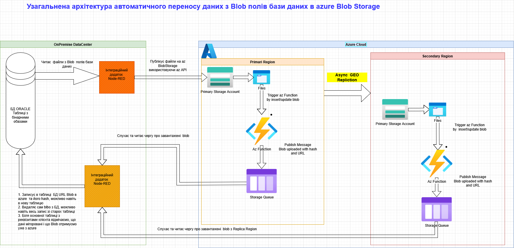
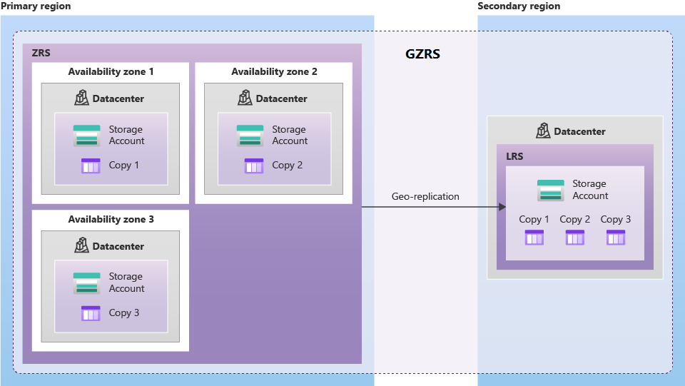
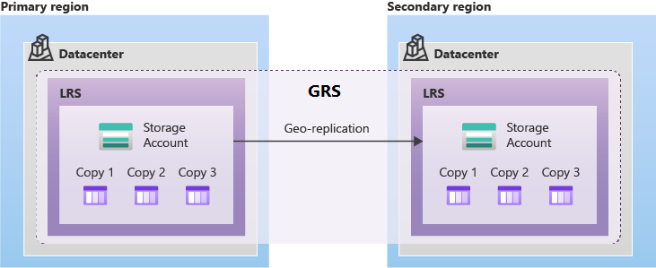
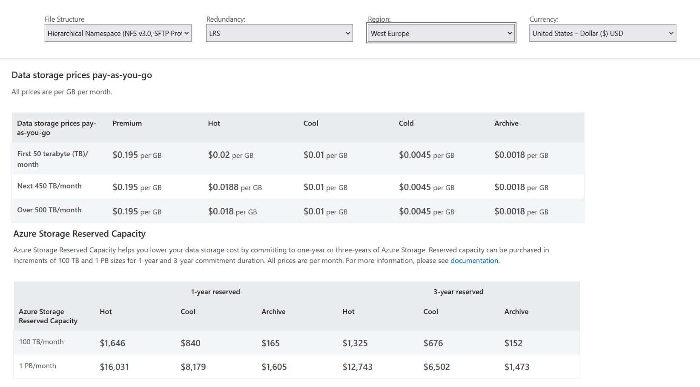
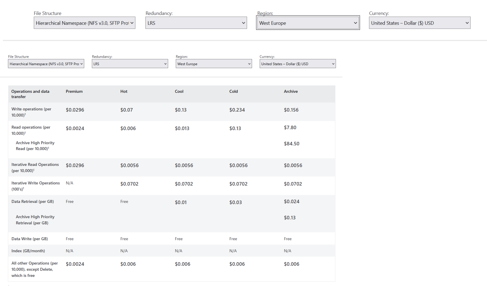
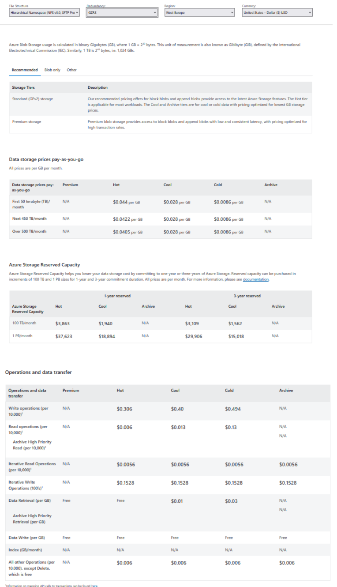

<!-- TOC BEGIN -->

- [1. Про що цей блог](#p-1")
- [2. Обгрунтування, чому це правильно](#p-2)
- [3. Ключові моменти, які будуть нівелювати розробку такого аналізу](#p-3)
- [3.1. Заперечення: "Документи клієнтів у хмарі зберігати не можна (Безпека/Нормативні вимоги)"](#p-3.1)
- [3.2. Заперечення: "Тарифи хмари непідйомні"](#p-3.2)
- [3.3. Заперечення: "Ми вже купили сервери і платимо за їх обслуговування"](#p-3.3)
- [3.4. Заперечення: "Є варіанти власного, локального об'єктового сховища і безкоштовного - для чого нам хмара"](#p-3.4)
- [3.5. Порівняльний Аналіз Вартість vs. Складність (TCO)](#-p3.5)
- [4. Лінки на документацію по Azure Blob Storage](#p-4)
- [5. Міркуваня з приводу вибору хманих інструментів azure](#p-5)
- [5.1. Характеристика бінарних даних, з якими працюємо](#p-5.1)
- [5.2. Azure Blob Storage](#p-5.2)
- [5.3. Azure Functions](#p-5.3)
- [5.4. Azure Queue Storage](#p-5.4)
- [5.5. Azure Static Web Apps](#p-5.5)

<!-- TOC END -->

## <a name="p-1">1. Про що цей блог</a>

Вивчаючи інструенти в хмарі azure, що можуть використовувати розробники для розробки прикладних додатків шукав якусь цікаву реалістичну задачу для навчання, яка б використовувала Azure Blob Storage. Я вже, використовую  api для роботи з BlobStorage, використовую утиліту azcopy.  Але все це були виключно теоретичні та практичні цеглинки, з яких можна побудувати додаток, як за вказаним лінками:
-  [az-204-funcs](https://github.com/pavlo-shcherbukha/az-204-funcs);
-  [Розробка прототипу використання утілти копіювання файлів azcopy в парі з azure BlobStorage використовуючи авторизацію Service Principal](https://github.com/pavlo-shcherbukha/azlearning/blob/tz-000001/azcopy_p.md).  

Потім, почав шукати бізнесову задачу, яка б якось мотивувати клієнта використати хмару azure, а мені б слугувала підставою для розробки навчального проекту. Задача якось виникла сама собою в процесі спілкування зі своїми клегами. Задача ця не стосується якогось окремого клієнта.  Це досить середньозважене формулювання проблеми, що, як мені здається, досить часто можна занйти в організаціях, що мають "довгу" історію програмного забезепечення, для прикладу, використовують  одні і ті ж бази даних ще з епохи клієнт-серверних архітектур, переробляючи тільки самі програми-клієнти.

В таких організаціях часто використовується підхід, коли великі бінарні файли зберігаються в BLOB  полях бази даних. За звичай, це стосується великих корпоративних баз даних типу ORACLE, MSSQL, може DB2. Але в останній час, тенденція стала такою, що кількість і об'єм файлів, що треба зберігати росте в геомертичній прогресії. І з цим щось треба робити.

Що це можуть бути за  файли? Це можуть бути:

- особисті документи клієнтів-фізичних осіб, такі як паспорти, свідоцтва про народження чи одруження, договори, страховки;
- установчі документи юридичних осіб, такі як реєстраційні докумети, устави прідприємства, податкова інформація, договори, страховки;
- медичні документи (лікарські висновки, діагностичні фото МРТ, УЗІ, рентгенів);
- фотографії продуктів;
- різні постанови, виконавчі документи, платіжні документи -
і таке  перелічувати можна довго.

**Ідея полягає в тому, щоб винести BLOB-дані (файлі-документів) з реляційної бази даних Oracle (MSSQL, DB2)  на об'єктне сховище (наприклад, Azure Blob Storage)**.

    Далі по тексту, я  буду використовувати реляційну БД ORACLE,  так як, на мій погляд, це найчастіший приклад. Та і досвід її використання у мене найбільший.

    Я не буду детально порівнювати разні варіанти об'єктових сховищ типу: [AWS S3](https://docs.aws.amazon.com/AmazonS3/latest/userguide/Welcome.html), [IBM Cloud Object Storage](https://www.ibm.com/products/cloud-object-storage), [Azure Blob Storage](https://learn.microsoft.com/en-us/azure/storage/blobs/storage-blobs-introduction). Моя ціль - вивчення azure cloud.

Графічно, ідею можна зобразити таким чином [pic-03](#pic-03): 
На pic-03 показано, як би могла виглядати узагальнена архітектура для міграції з бази даних в хмарне azure Blob Storage з мультизонною реплікацією.
<kbd></kbd>

<a name="pic-03">pic-03</a>

На малюнку зображено два Дата центри:
- On Premise (1)
- On Azure Cloud (2).
Допустимо у нас велика база даних і потрібно виконати автоматичну міграцію з бази даних (1.2) в хмарний Blob Storage.
В якості міграційного інструмента, що читає і відправляє дані в хмару вибрана інтеграційна шина Node-Red, хоча підійде що завгодно (Node.js, Python, Java), тобто підійде все, що підключається до бази даних і до якого є API бібіліотека для azure Blob Storage. За допомгою цього додатку вичитані з БД файли записуються на blob storage (2.2.1) в хмарі Azure. А далі, автомтично відбувається реплікація на інший віддалений сайт з Blob Storage (2.2.1).  
При додаванні або оновленні файлу на Blob Storage  безсерверна azure функція тригериться цією подією і публікує в чергу повідомлення, про доданий Blob з його url  та hash (2.2.2, 2.2.3, 2.2.4).
Вже інший Node-Red workflow читаэ повідомлення з Storage Que  і реєструє  нові дані для отримання blob, відмічає, що для цього клієнта і типу документа дані лежать уже в хмарі, а запис зі старим Blob  видаляємо. Тобто в цьому підіході отримується підтвердження, що запис уже мігрував і тільки тоді відаляється старий запис.
В цій оархітектурі отримуємо 2 квитанції: з primary site (2.1) та з secondary site (2.2) (реплікаційний сайт). Тобто, ми можем бути впевнені, що дані є на двох сайтах.
Ну і на додаток, ми можемо розгорнути Web додатки в Azure або OnPremise і використати один і той же backend для фронта. Авторизацію можна зробити через Azure EntraID. А backend можна зробити теж через azure функції.

**Зауваження:**

1. Можна, звичайно, прочитати відповдіний розділ :
[ Develop solutions that use Blob storage](https://learn.microsoft.com/en-us/training/paths/develop-solutions-that-use-blob-storage/)  або навіть отримати сертифікат з "AZ-204 Developing Solution for Microsoft Azure". Або ж знайти відповдіний розділ в "AZ-900: Microsoft Azure Fundamentals" чи теж, отримати сертифікат. Їх читання та вивчення не буде лишнім. Але ж фактично зробити руками чи головою нічно не зможемо, тому що це виключно описові курси, що не дають можливості ні архітектору ні розробнику виконувати свою роботу. Як на мене, то ці курси загального знання і їх повнні пройти всі хто збираться артикулювати з приводу хмари azure: від менеджера по продажах, та менеджерів і до інженерів підтримки. Якщо це вивчать тільки  технічні спеціалісти, то ті, хто в харчовому лагцюжку знаходяться перед ними (менеджери та продажники) їх не будть розуміти і не зможуть приймати адекватних рішень, тому що нічого не зрозумію. 
А досвід спідкуваня в режимі, коли продажник обіцяє клієнту: "Я вам приведу зараз класних пацнів, вони вам все порішають" - показує, що шлях в нікуди.

2. Для графічного опису архітектур використано [drawio](https://www.drawio.com/) тому, що в своєму складі він має вбудовані іконки компонентів Azure. Хоча  для себе я давно віддав перевагу mermaid діаграмам.

## <a name="p-2">2. Обгрунтування, чому це правильно</a>

**Продуктивність РБД:**

- Збільшення розміру таблиць/індексів: Великі BLOBи ускладнюють кешування даних у пам'яті (buffer cache) РБД.

- Уповільнення резервного копіювання/відновлення (Backup/Recovery): Копіювання величезної бази даних, більша частина якої — статичні документи, займає надзвичайно багато часу та ресурсів.

- Роздуття бази даних: Зростання розміру БД вимагає дорожчих ліцензій Oracle (які часто залежать від обсягу або використання ресурсів) та потужнішого обладнання.

**Вартість зберігання:**

- Вартість зберігання 1 ТБ даних у РБД Oracle (особливо з урахуванням ліцензій та необхідної продуктивності) на порядки вища, ніж вартість зберігання того ж обсягу в Azure Blob Storage (особливо на холодному/архівному рівні, якщо документи рідко використовуються).

**Масштабованість:**

- Об'єктне сховище, як Azure Blob Storage, надає практично необмежену та горизонтальну масштабованість, на відміну від вертикально масштабованої (і дорогої) РБД.

## <a name="p-3">3. Ключові моменти, які будуть нівелювати розробку такого аналізу</a>

### <a name="p-3.1">3.1. Заперечення: "Документи клієнтів у хмарі зберігати не можна (Безпека/Нормативні вимоги)"</a>

1. Шифрування: Дані завжди шифруються як під час передачі (TLS/SSL), так і у стані спокою (Azure Storage Service Encryption). 
2. Контроль доступу: Використання Shared Access Signatures (SAS) та Azure Active Directory для доступу дає гранульований контроль, на відміну від часто неоптимальних налаштувань у РБД. 
3. Комплаєнс (Норми): Azure має тисячі сертифікатів відповідності (ISO, SOC, GDPR тощо), які підтверджують, що вона відповідає або перевищує вимоги більшості регуляторів, на відміну від локального ДЦ. 
4. Фізична безпека: Дата-центри Azure захищені набагато краще, ніж локальні серверні приміщення.
5. Ми зберігатимемо в БД лише метадані (ім'я файлу, хеш, посилання на Blob) та видалимо самі конфіденційні BLOBs, зменшуючи ризики компрометації РБД.

**Висновок:**
  Навпаки, ми підвищуємо безпеку. Хмара забезпечує рівень захисту, який важко досягти в локальному ДЦ.

### <a name="p-3.2">3.2. Заперечення: "Тарифи хмари непідйомні"</a>

Тут потрібно зауважити з власного досвіду, що я таке зауваження чув не раз, а от внятного економічного розрахунку ніколи не бачив. Його навіть не хотіли проводити.

1. Зберігання статичних  об'ємних  даних в ліцензованій РБД - це зберігання  в найдорожчому місці. Перенесення BLOBs зменшує розмір БД, що може знизити майбутні ліцензійні/апаратні вимоги до Oracle. 
2. Економія на операціях (OpEx): Вартість Azure Blob Storage ($/ГБ) у десятки разів нижча за вартість зберігання в Oracle. 
3. Рівні зберігання: Документи, які старші за 6 місяців, можна перемістити з рівня Hot на Cool або Archive (за $0.001 на місяць за ГБ!), автоматизувавши економію. А в базі даних вони будуть "лежати" за однаковою ціною
4. Надійність: Висока географічна/зонна реплікація (3-12 копій) входить у вартість, замінюючи необхідність купувати дороге обладнання для локального бекапу.

**Висновок:**
  Ми не просто купуємо зберігання, ми купуємо економію на найдорожчих компонентах системи.

### <a name="p-3.3">3.3. Заперечення: "Ми вже купили сервери і платимо за їх обслуговування"</a>

1. Зменшуючи навантаження на Oracle Server (менше операцій введення/виведення, менші таблиці) -  подовжує термін служби наявного обладнання та відтерміновує необхідність дорогого апгрейду. 
2. Сервери повинні займатися обробкою транзакцій (чим Oracle займається найкраще), а не обслуговуванням статичного файлового сховища. 
3. За звичай Клієнт вже платить за Azure (Office 365 часто надає доступ до деяких ресурсів або клієнт вже маєте підписку). Використання наявного інструменту є логічним кроком. 
4. Замість витрачати час на адміністрування/доопрацювання/оптимізацію зростаючого файлового сховища в БД, співробітники можуть сфокусуватися на більш критичних бізнес-задачах чи освоїти щось нове.

### <a name="p-3.4">3.4. Заперечення: "Є варіанти власного, локального об'єктового сховища і безкоштовного - для чого нам хмара"</a

Так, є варінти організації власного об'єктного сховища, найвідоміше ["MinIO"](https://github.com/minio/minio)
Сховище жешевше за Oracle, але все одно вимагає купівлі серверів, дискових полиць, мережевого обладнання та оплати електроенергії/оренди ДЦ. Але складгість організації такого сховища, особливо територіально розподіленого надвисока.

- Проблеми з документацією та налаштуванням (MinIO EC).
- Проблеми з масштабуванням (не можна просто розширити поточний кластер, потрібен повний перезапуск всіх вузлів при розширенні/оновленні ).
- Критичні помилки при експлуатації та оновленнях (втрата користувачів/політик , збої кешування, пошкодження стиснутих файлів).
- Непередбачуваний час відновлення після збоїв (1.2 ТБ відновлювалися 9 днів, з прогнозом на місяці).
- Необхідність самостійно створювати систему моніторингу (Prometheus/Grafana) та вручну відключати повільні диски, щоб не "гальмував весь кластер".
- Для адекватної підтримки від вендора всеріно треба оплатити підписку.

Для підтвердження ось лінк на відео (хоч воно і російське, але всеж таки достатьно ілюстративне): https://www.youtube.com/watch?v=XiJVC9nzAW4 .

### <a name="p-3.5">3.5. Порівняльний Аналіз Вартість vs. Складність (TCO)</a>

1. Локальне Сховище (Oracle + SSD)

    Висока вартість: Найдорожча вартість зберігання за 1 ГБ через ліцензії Oracle, високопродуктивне обладнання та необхідність локального резервування (RAID, Data Guard).

    Складність: Обслуговування БД, управління збільшенням її розміру, довгі бекапи.

2. Власне Об'єктне Сховище (MinIO) 

    Середня вартість: Дешевше за Oracle, але все одно вимагає купівлі серверів, дискових полиць, мережевого обладнання та оплати електроенергії/оренди ДЦ.

    Складність: Надзвичайно висока:

        Проблеми з документацією та налаштуванням (MinIO EC).

        Проблеми з масштабуванням (не можна просто розширити поточний кластер, потрібен повний перезапуск всіх вузлів при розширенні/оновленні ).

        Критичні помилки при експлуатації та оновленнях (втрата користувачів/політик [01:18:00], збої кешування, пошкодження стиснутих файлів ).

        Непередбачуваний час відновлення після збоїв (1.2 ТБ відновлювалися 9 днів, з прогнозом на місяці ).

        Необхідність самостійно створювати систему моніторингу (Prometheus/Grafana) та вручну відключати повільні диски, щоб не "гальмував весь кластер".

3. Хмарне Об'єктне Сховище (Azure Blob Storage)

    Низька вартість: Найдешевше зберігання за ГБ (особливо Cool/Archive). Немає витрат на "залізо" та електроенергію.

    Складність: Низька. Це керована послуга. Замовник не турбується про:

        RAID/EC, ZFS (це забезпечує Microsoft).

        Оновлення (це прозоро робить Microsoft).

        Масштабованість (вона необмежена).

        Резервування (воно вбудоване — LRS, ZRS, GRS).

**Підсумовуючи:**
Розглядаємо перехід з Oracle на об'єктне сховище. Є два шляхи: власне рішення (наприклад, MinIO) або керована хмарна послуга (Azure Blob Storage).

Власне рішення, хоч і має низьку ліцензійну вартість, вимагає надзвичайно високих операційних витрат та ризиків, про що свідчить [досвід інших компаній](https://www.youtube.com/watch?v=XiJVC9nzAW4) (наприклад, MinIO є дуже 'сирим' для продуктиву).

Натомість, Azure Blob Storage пропонує:
    Найдешевшу вартість за ГБ, порівняно як з Oracle, так і з TCO власного MinIO.
    Гарантовану надійність і безпеку від Microsoft.
    Нульові операційні витрати на обслуговування, оновлення та вирішення проблем, описаних у відео (втрата даних при оновленні, повільне відновлення).

Перехід на Azure дозволяє нам значно заощадити кошти на Oracle, отримати необмежену масштабованість і уникнути ризиків, пов'язаних із підтримкою складного георозподіленого сховища власними силами."

Таким чином, wt не просто "переїзд", а перехід до надійної, економічно вигідної та зрілої архітектури, уникаючи підводних каменів, які ілюструє доповідь про самостійну підтримку від іншх компаній.

## <a name="p-4">4. Лінки на документацію по Azure Blob Storage</a>

[Azure Blob Storage documentation](https://learn.microsoft.com/en-us/azure/storage/blobs/)
- [Plan and manage costs for Azure Blob Storage](https://learn.microsoft.com/en-us/azure/storage/common/storage-plan-manage-costs?toc=%2Fazure%2Fstorage%2Fblobs%2Ftoc.json&bc=%2Fazure%2Fstorage%2Fblobs%2Fbreadcrumb%2Ftoc.json)

- [Azure Blob Storage price](https://azure.microsoft.com/en-us/pricing/details/storage/blobs/)

## <a name="p-5">5. Міркуваня з приводу вибору хмарних інструментів azure</a>

### <a name="p-5.1">5.1. Характеристика бінарних даних, з якими працюємо</a>

Надходження бінарних документів можна охарактеризувати наступним чином.

- Надходять нові документи рідко, тобто кілька разів на день. Інколи може бути і не кожний день.
- Частота читання даних не дуже перевищує частоту надходження даних.
- Інколи дані можуть оновлюватися, тому має значення збереження версійності документів. Але основну операціну цінність має остання версія документу.
- Доступ до попередніх версій документів має значення, але рідко, у випдках  надходження та виконання запитів від регуляторних органів.

Таким чином, в оперативному доступі мають бути останні версії документів. В архівному доступі можна тримати попередні версії документів.
У випадку, коли дані не можуть бути записані з технічних причин, достатньо повідомити користувача, про не можливість запису і попросити спробувати пізніше. Тобто не має високої критичності по часу надходження файлів
Читання даних  бажано забезпечувати більш надійно, щоб обробляти запити регуляторних органів без затримки.

### <a name="p-5.2">5.2. Azure Blob Storage</a>

Для вибору архутектури конфігурації Blob Storage використані корисні перелічені нижче документи:

- [Architecture best practices for Azure Blob Storage](https://learn.microsoft.com/en-us/azure/well-architected/service-guides/azure-blob-storage?toc=%2Fazure%2Fstorage%2Fblobs%2Ftoc.json&bc=%2Fazure%2Fstorage%2Fblobs%2Fbreadcrumb%2Ftoc.json)
- [Reliability in Azure Blob Storage](https://learn.microsoft.com/en-us/azure/reliability/reliability-storage-blob?toc=%2Fazure%2Fstorage%2Fblobs%2Ftoc.json&bc=%2Fazure%2Fstorage%2Fblobs%2Fbreadcrumb%2Ftoc.json)

Потрібно забезпечити максимальну надійність зберігання і максимальну доступність  читання даних. Значить, у відповідності до:

- [Azure Storage redundancy](https://learn.microsoft.com/en-us/azure/storage/common/storage-redundancy?toc=%2Fazure%2Fstorage%2Fblobs%2Ftoc.json&bc=%2Fazure%2Fstorage%2Fblobs%2Fbreadcrumb%2Ftoc.json),

Максимально підійде GRS/RA-GRS [Geo-zone-redundant storage](https://learn.microsoft.com/en-us/azure/storage/common/storage-redundancy?toc=%2Fazure%2Fstorage%2Fblobs%2Ftoc.json&bc=%2Fazure%2Fstorage%2Fblobs%2Fbreadcrumb%2Ftoc.json#geo-zone-redundant-storage).

<kbd></kbd>

<a name="pic-02">pic-02</a>

Мінімально, можна зупинитися і на GRS [Replication across paired regions](https://learn.microsoft.com/en-us/azure/reliability/reliability-storage-blob?toc=%2Fazure%2Fstorage%2Fblobs%2Ftoc.json&bc=%2Fazure%2Fstorage%2Fblobs%2Fbreadcrumb%2Ftoc.json#replication-across-paired-regions)

<kbd></kbd>

<a name="pic-01">pic-01</a>

Тут я процитую, як працює  "Zone-redundant storage"

    A write request to a storage account that is using ZRS happens synchronously. The write operation returns successfully only after the data is written to all replicas across the three availability zones. If an availability zone is temporarily unavailable, the operation returns successfully after the data is written to all available zones.

    Microsoft recommends using ZRS in the primary region for scenarios that require high availability. ZRS is also recommended for restricting replication of data to a particular region to meet data governance requirements.

    Microsoft recommends using ZRS for Azure Files workloads. If a zone becomes unavailable, no remounting of Azure file shares from the connected clients is required.

Ну а на додаток маємо реплікацію в інший регіон згідно [Geo-redundant storage](https://learn.microsoft.com/en-us/azure/storage/common/storage-redundancy?toc=%2Fazure%2Fstorage%2Fblobs%2Ftoc.json&bc=%2Fazure%2Fstorage%2Fblobs%2Fbreadcrumb%2Ftoc.json#geo-redundant-storage), яка доступна тільки для читання:

    A write operation is first committed to the primary location and replicated using LRS. The update is then replicated asynchronously to the secondary region. When data is written to the secondary location, it also replicates within that location using LRS.

А зважаючи на розділ [Use geo-redundancy to design highly available applications](https://learn.microsoft.com/en-us/azure/storage/common/geo-redundant-design) можна зробити висновок про те, як будувати прикладну архітектуру додатків

    A write operation is first committed to the primary location and replicated using LRS. The update is then replicated asynchronously to the secondary region. When data is written to the secondary location, it also replicates within that location using LRS.

А зважаючи на розділ [Use geo-redundancy to design highly available applications](https://learn.microsoft.com/en-us/azure/storage/common/geo-redundant-design) можна зробити висновок про те, як будувати прикладну архітектуру додатків. Наведу цитати зі згаданого документу:

    Azure Storage offers two options for geo-redundant replication: Geo-redundant storage (GRS) and Geo-zone-redundant storage (GZRS). To make use of the Azure Storage geo-redundancy options, make sure that your storage account is configured for read-access geo-redundant storage (RA-GRS) or read-access geo-zone-redundant storage (RA-GZRS). If it's not, you can learn more about how to change your storage account replication type.

    You can design your application to handle transient faults or significant outages by reading from the secondary region when there's an issue that interferes with reading from the primary region. When the primary region is available again, your application can return to reading from the primary region.

    Keep in mind these key considerations when designing your application for availability and resiliency using RA-GRS or RA-GZRS:

    A read-only copy of the data you store in the primary region is asynchronously replicated in a secondary region. This asynchronous replication means that the read-only copy in the secondary region is eventually consistent with the data in the primary region. The storage service determines the location of the secondary region.

    You can use the Azure Storage client libraries to perform read and update requests against the primary region endpoint. If the primary region is unavailable, you can automatically redirect read requests to the secondary region. You can also configure your app to send read requests directly to the secondary region, if desired, even when the primary region is available.

    If the primary region becomes unavailable, you can initiate an account failover. When you fail over to the secondary region, the DNS entries pointing to the primary region are changed to point to the secondary region. After the failover is complete, write access is restored for GRS and RA-GRS accounts. For more information, see Disaster recovery and storage account failover.

Також важливо врахувати інформацію, наведену в перелічених розділах з приводу архітектури прикладних додатків:

- [Running your application in read-only mode](https://learn.microsoft.com/en-us/azure/storage/common/geo-redundant-design#running-your-application-in-read-only-mode).
- [Handling updates when running in read-only mode](https://learn.microsoft.com/en-us/azure/storage/common/geo-redundant-design#handling-updates-when-running-in-read-only-mode).

- [Read requests](https://learn.microsoft.com/en-us/azure/storage/common/geo-redundant-design#read-requests)
- [Update requests](https://learn.microsoft.com/en-us/azure/storage/common/geo-redundant-design?toc=%2Fazure%2Fstorage%2Fblobs%2Ftoc.json&bc=%2Fazure%2Fstorage%2Fblobs%2Fbreadcrumb%2Ftoc.json#update-requests)
- [How to implement the Circuit Breaker pattern](https://learn.microsoft.com/en-us/azure/storage/common/geo-redundant-design?toc=%2Fazure%2Fstorage%2Fblobs%2Ftoc.json&bc=%2Fazure%2Fstorage%2Fblobs%2Fbreadcrumb%2Ftoc.json#how-to-implement-the-circuit-breaker-pattern)
- [Handling eventually consistent data](https://learn.microsoft.com/en-us/azure/storage/common/geo-redundant-design?toc=%2Fazure%2Fstorage%2Fblobs%2Ftoc.json&bc=%2Fazure%2Fstorage%2Fblobs%2Fbreadcrumb%2Ftoc.json#handling-eventually-consistent-data)

- [Testing](https://learn.microsoft.com/en-us/azure/storage/common/geo-redundant-design?toc=%2Fazure%2Fstorage%2Fblobs%2Ftoc.json&bc=%2Fazure%2Fstorage%2Fblobs%2Fbreadcrumb%2Ftoc.json#testing)

- [ Azure Samples – Using the Circuit Breaker Pattern with RA-GRS storage](https://github.com/Azure-Samples/storage-dotnet-circuit-breaker-ha-ra-grs)

Тарифи використання BlobStorage в використанны LRS показані на [pic-04](#pic-04) та [pic-05](#pic-05) :

<kbd></kbd>

<a name="pic-04">pic-04</a>

<kbd></kbd>

<a name="pic-05">pic-05</a>

Тарифи використання BlobStorage в використанны ZRS показані на [pic-06](#pic-06)

<kbd></kbd>

<a name="pic-06">pic-06</a>

### <a name="p-5.3">5.3. Azure Functions</a>

Чому я використав Server less Azure Function?
По перше -  це найдешевший обчислювальний ресурс і більшості хмарних провайдерів і Azure тут нічого нового не відкрив.
По друге - я вже третій раз впевнився:  якщо хочеш зрозуміти "філосовію" окремо взятої хмари -  почни з їх безсерверної платформи. По багатству і зручності безсерверної платфоми можна зробити висновок про всю хмару. 
По третє - безсерверна платформа завжди інтегрована з основними хмарними продуктами - тому з ними легко познайомитися і вивчити.

Якщо кортко, то про Server Less  можна почитити за лінком: [AZ-204: Implement Azure Functions](https://learn.microsoft.com/en-us/training/paths/implement-azure-functions/). Але мені більше подобається оцей матеріал: [What is Azure Functions?](https://learn.microsoft.com/en-us/azure/azure-functions/functions-overview).

При запису файлів на blob storage можна використовувати функцію, що запускається BLOB-об'єктами, для перевірки, перетворення та обробки файлів в основній системі під час їх завантаження: [Process file uploads](https://learn.microsoft.com/en-us/azure/azure-functions/functions-scenarios?pivots=programming-language-python).

При аналізу поведінки даних було визначно, що не передбачається великої інтенсивності надходження чи читання даних. Таким чином, буль який хмарний бакед чи API  не має сенсу запускати на окремо вибраній віртуаці (це найдорожчв опція) чи на хмарному kubernetes чи навіть на [App Service](https://learn.microsoft.com/en-gb/training/paths/create-azure-app-service-web-apps/). Достатньо запустити бакенд на звичайних, класичних безсрверних функціях.

Та і взагалі для розробки прототипів чи навчальних проектів - це найпростіша платформа.

### <a name="p-5.4">5.4. Azure Queue Storage</a>

Azure Queue Storage використано для організації простого асинхронного обміну, для балансування навантаження на локальну систему та для мінімізації втрат даниї при проблемах в OnPremise дата центрі. Прочитати про них можна за лінком:
[What is Azure Queue Storage](https://learn.microsoft.com/en-us/azure/storage/queues/storage-queues-introduction) або ж
[az-204 Explore Azure Queue Storage](https://learn.microsoft.com/en-us/training/modules/discover-azure-message-queue/7-azure-queue-storage-overview?ns-enrollment-type=learningpath&ns-enrollment-id=learn.wwl.az-204-develop-message-based-solutions).

Якщо, коротко, то  Azure Queue Storage – це сервіс для зберігання великої кількості повідомлень. Можна отримати доступ до повідомлень з будь-якої точки світу через автентифіковані виклики за допомогою HTTP або HTTPS. Повідомлення черги може мати розмір до 64 КБ. Черга може містити мільйони повідомлень, аж до загального ліміту ємності облікового запису сховища. Черги зазвичай використовуються для створення журналу робіт для асинхронної обробки, як-от в архітектурному стилі Web-Queue-Worker. Черги підтимують просту тарнзакційність.

Ну і Azure Queue Storage прив'язані до Storage account. А структра повідомлення має json формат. Тобто, бінарні дані не передаються. Але, для чого передавати бінарні дані, якщо можна просто передати URL  на Blob об'єк  на Blob Storage.

### <a name="p-5.5">5.5. Azure Static Web Apps</a>

Статичні веб-програми зазвичай створюються за допомогою бібліотек та фреймворків, таких як Angular, React, Svelte або Vue. Ці програми містять HTML, CSS, JavaScript та ресурси зображень, які складають програму. У традиційній архітектурі веб-сервера ці файли обслуговуються з одного сервера разом із будь-якими необхідними кінцевими точками API.

За допомогою Azure Static Web Apps статичні ресурси відокремлені від традиційного веб-сервера та натомість обслуговуються з точок, розподілених по всьому світу. Такий розподіл пришвидшує обслуговування файлів, оскільки файли фізично розташовані ближче до кінцевих користувачів. Кінцеві точки API, які є необов'язковими, розміщуються за допомогою безсерверної архітектури, що повністю усуває необхідність використання повноцінного серверного сервера.

<kbd></kbd>

<a name="pic-07">pic-07</a>

Тут я процитую документацію Azure

        Key features

            Globally distributed web hosting puts static content like HTML, CSS, JavaScript, and images closer to your users.
            Integrated API support provided by Azure Functions.
            First-class GitHub and Azure DevOps integration changes to your repository trigger builds and deployments.
            Free SSL certificates, which are automatically renewed.
            Unique preview URLs for previewing pull requests.

І використання цього продукту для розгортання Web UI  буде дешевше ніж піднімати його на віртуалці чи в app service  чи на хмарному kubernetis.

## <a name="p-6">6. Елементи прототипування, що створюються програмно</a>