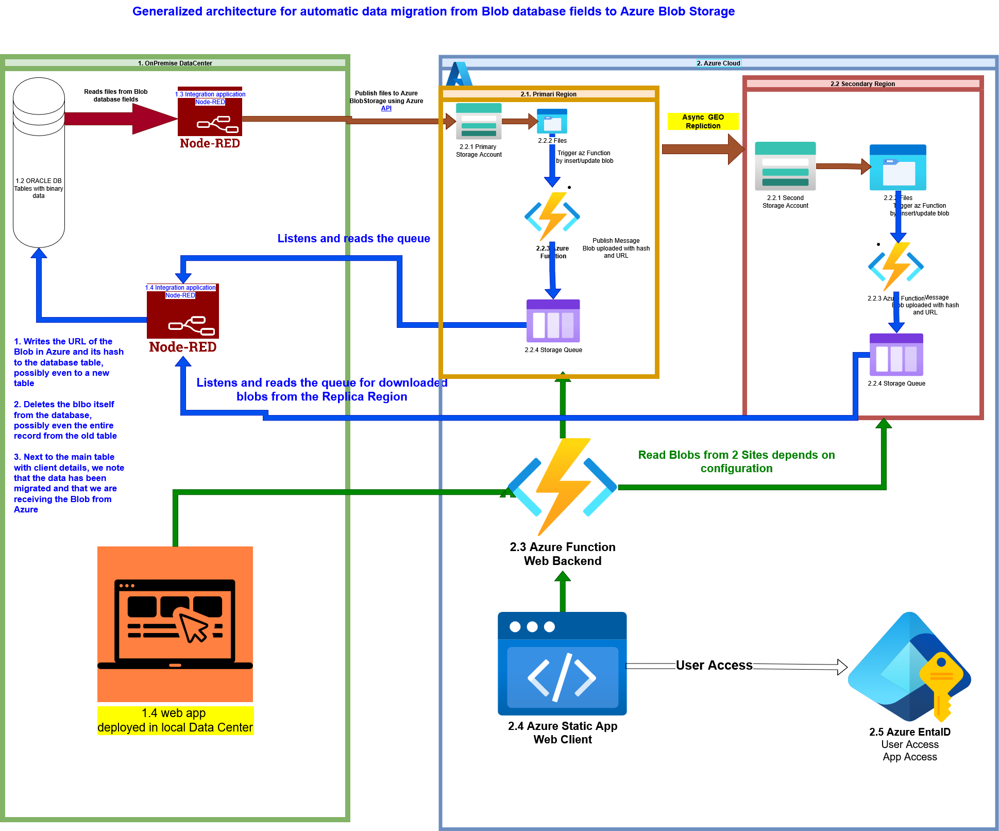
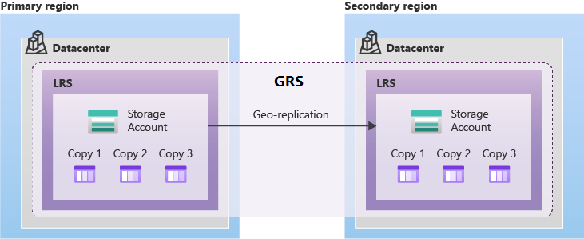
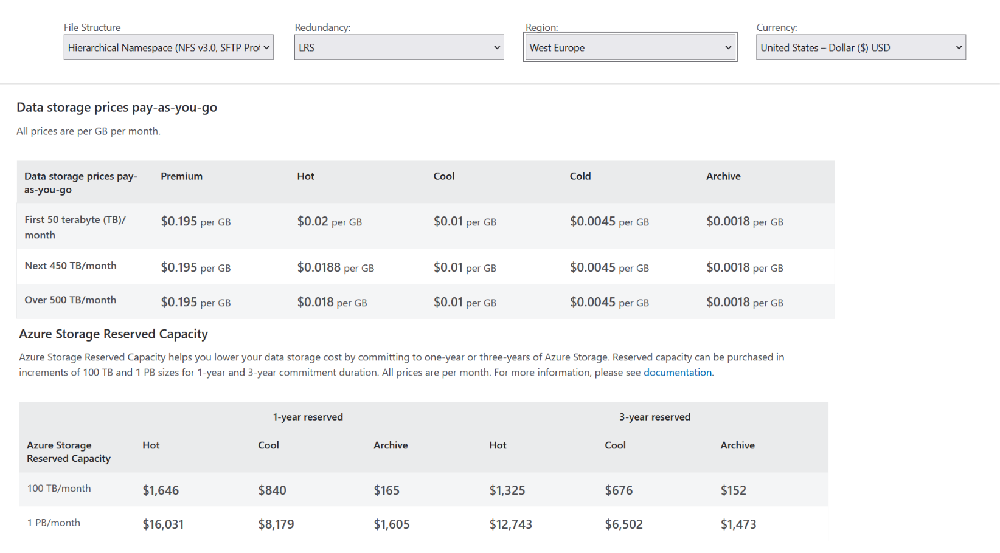
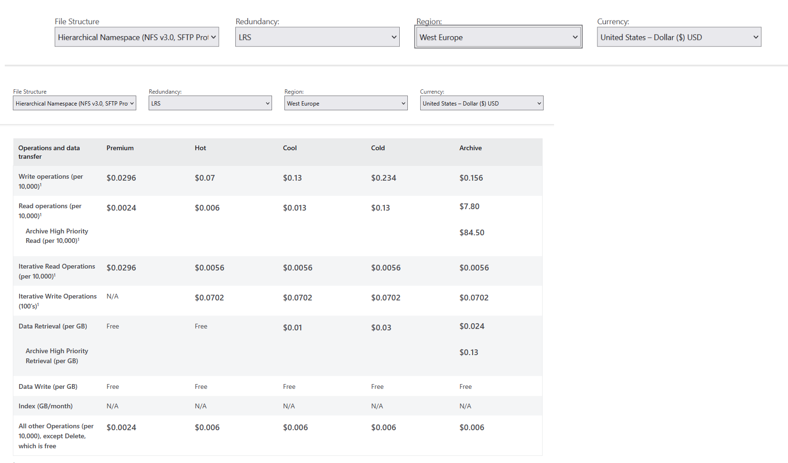
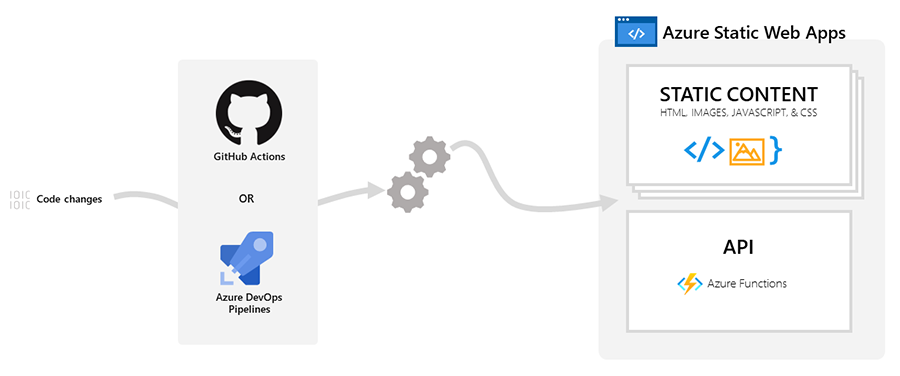
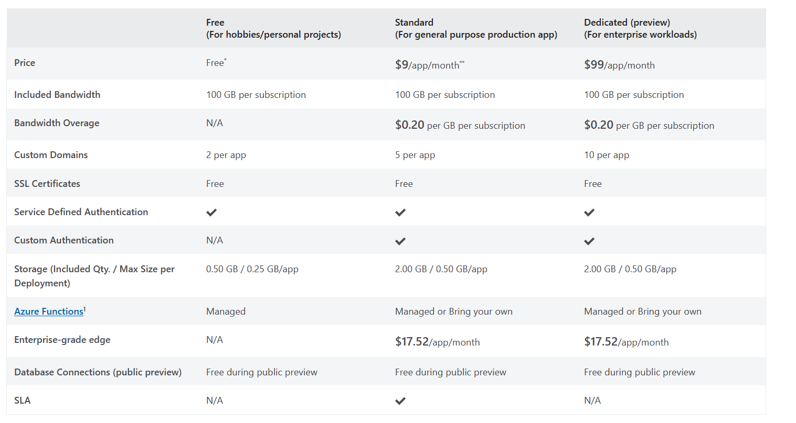

<!-- TOC BEGIN -->
- [1. **What this blog is about**](#p-1")
- [2. **Justification of why this is correct**](#p-2)
- [3. **Key points that will negate the development of such an analysis**](#p-3)
- [3.1. **Objection: "Client documents cannot be stored in the cloud (Security/Regulatory requirements)**](#p-3.1)
- [3.2. **Objection: "Cloud tariffs are prohibitive (unaffordable)"**](#p-3.2)
- [3.3. **Objection: "We have already bought servers and are paying for their maintenance**](#p-3.3)
- [3.4. **Objection: "There are options for own, local object storage and free ones - why do we need the cloud**](#p-3.4)
- [3.5. **Comparative Analysis: Cost vs. Complexity (TCO)**](#p-3.5)
- [4. **Links to Azure Blob Storage documentation**](#p-4)
- [5. **Considerations regarding the choice of Azure cloud tools**](#p-5)
- [5.1. **Characteristics of the binary data we work with**](#p-5.1)
- [5.2. **Azure Blob Storage**](#p-5.2)
- [5.3. **Azure Functions**](#p-5.3)
- [5.4. **Azure Queue Storage**](#p-5.4)
- [5.5. **Azure Static Web Apps**](#-p5.5)
- [6. **Elements of prototyping created programmatically (in software)**](#p-6)
<!-- TOC END -->

## <a name="p-1">1. What this blog is about</a>

While studying the Azure cloud tools that developers can use for building application software, I was looking for an interesting, realistic learning task that would utilize Azure Blob Storage. I am already using the API for working with Blob Storage and the azcopy utility. However, all of this consisted solely of theoretical and practical building blocks from which an application could be constructed, as shown in the links:
-  [az-204-funcs](https://github.com/pavlo-shcherbukha/az-204-funcs);
-  [Developing a prototype for using the azcopy file copying utility with Azure Blob Storage via Service Principal authorization.](https://github.com/pavlo-shcherbukha/azlearning/blob/tz-000001/azcopy_p.md).  

Then, I started looking for a business task that would somehow motivate a client to use the Azure cloud and would serve as the basis for developing a training project for myself. The issue somehow arose by itself during a conversation with my colleagues. This problem does not concern any specific client. It is a fairly representative formulation of a problem that, as I believe, can often be found in organizations with a "long" software history—for example, those that have been using the same databases since the client-server architecture era, only re-engineering the client applications themselves.

In such organizations, an approach is often used where large binary files are stored in BLOB fields of a database. Typically, this applies to large corporate databases like ORACLE, MSSQL, or perhaps DB2. However, recently, the trend has been that the number and volume of files that need to be stored are growing exponentially. And something needs to be done about this.

What kind of files might these be? They could include:

* **Personal documents of individual clients**, such as passports, birth or marriage certificates, contracts, insurance policies;
* **Founding/Statutory documents of legal entities**, such as registration documents, company statutes, tax information, contracts, insurance policies;
* **Medical documents** (medical reports, diagnostic images from MRI, ultrasound, X-rays);
* **Product photographs**;
* **Various resolutions, enforcement documents, payment documents** —
    and the list can go on for a long time.

**The idea is to offload BLOB data (file-documents) from the Oracle (MSSQL, DB2) relational database to object storage (for example, Azure Blob Storage).**

    Further in the text, I will use the **ORACLE relational database**, as, in my opinion, it is the most frequent example. I also have the most experience using it.

    I will not be comparing different object storage options in detail, such as [AWS S3](https://docs.aws.amazon.com/AmazonS3/latest/userguide/Welcome.html), [IBM Cloud Object Storage](https://www.ibm.com/products/cloud-object-storage), or [Azure Blob Storage](https://learn.microsoft.com/en-us/azure/storage/blobs/storage-blobs-introduction). My goal is to **study the Azure cloud**.

Graphically, the idea can be represented as follows : Pic-03 shows what a generalized architecture for migration from a database to cloud Azure Blob Storage with multi-zone replication could look like.
<kbd></kbd>

<a name="pic-03">pic-03</a>

The figure are shown two Data Centers:

    On-Premise (1)

    On Azure Cloud (2).

Assume we have a large database and need to perform an automated migration from the database (1.2) to cloud Blob Storage.

The Node-Red integration bus was chosen as the migration tool that reads and sends data to the cloud, although anything suitable would work (Node.js, Python, Java) — essentially, anything that connects to the database and has an API library for Azure Blob Storage. With the help of this application, files read from the DB are written to the Blob Storage (2.2.1) in the Azure cloud. Furthermore, automatic replication to another remote site from Blob Storage (2.2.1) occurs.

When a file is added or updated in the Blob Storage, a serverless Azure Function is triggered by this event and publishes a message to a queue about the added Blob, including its URL and hash (2.2.2, 2.2.3, 2.2.4).

A different Node-Red workflow then reads the message from the Storage Queue and registers the new data for retrieving the blob, marks that the data for this client and document type is now located in the cloud, and the record with the old Blob is deleted. That is, this approach ensures confirmation that the record has migrated, and only then is the old record deleted.

In this architecture, we receive two receipts: from the primary site (2.1) and from the secondary site (2.2) (the replication site). This means we can be confident that the data is present on both sites.

Additionally, we can deploy Web applications in Azure or On-Premise and use the same backend for the frontend. Authorization can be done via Azure Entra ID. The backend can also be built using Azure Functions.

**Remarks:**

1. Of course, one can read the corresponding section: [Develop solutions that use Blob storage](https://learn.microsoft.com/en-us/training/paths/develop-solutions-that-use-blob-storage/) or even get a certificate in 'AZ-204 Developing Solutions for Microsoft Azure,' or find the relevant section in 'AZ-900: Microsoft Azure Fundamentals' and get that certificate. Reading and studying them won't be зointless. **However, we won't actually be able to do anything with our hands or minds**, because these are purely descriptive courses that don't enable either an architect or a developer to perform their job. **In my opinion, these are general knowledge courses and should be taken by everyone who is going to articulate anything about the Azure cloud**: from sales managers and general managers to support engineers. If only the technical specialists study this, then those who are higher up in the food chain (managers and salespeople) won't understand them and won't be able to make adequate decisions, because they won't understand anything.

And the experience of communication where a salesperson promises a client: 'I'll bring you some great guys right now, and they'll sort everything out for you' — shows that this is a **path to nowhere**."

2. For the graphical description of the architectures, drawio was used because it has built-in icons for Azure components. Although, personally, I've long preferred Mermaid diagrams.

## <a name="p-2">2. Justification of why this is correct</a>

**Relational Database Performance:**

- Increased Table/Index Size: Large BLOBs complicate the caching of data in the Relational Database's memory (buffer cache).

- Slower Backup/Recovery: Copying a massive database, the majority of which consists of static documents, takes an extraordinarily long time and consumes significant resources.

- Database Bloat: The growth in DB size necessitates more expensive Oracle licenses (which often depend on volume or resource usage) and more powerful hardware.

**Storage Cost:**

- The cost of storing 1 TB of data in an Oracle RDB (especially considering licensing and required performance) is orders of magnitude higher than the cost of storing the same volume in Azure Blob Storage (especially on the Cool/Archive tier, if the documents are rarely accessed).

**Scalability:**

- Object storage, such as Azure Blob Storage, provides practically unlimited and horizontal scalability, unlike the vertically scaled (and expensive) Relational Database (RDB).

## <a name="p-3">3. Key points that will negate the development of such an analysis</a>

### <a name="p-3.1">3.1. Objection: "Client documents cannot be stored in the cloud (Security/Regulatory requirements)"</a>

1. **Encryption:** Data is always encrypted both **in transit (TLS/SSL)** and **at rest (Azure Storage Service Encryption)**.
2. **Access Control:** Using **Shared Access Signatures (SAS)** and **Azure Active Directory** for access provides **granular control**, unlike the often suboptimal settings in an RDB.
3. **Compliance (Regulations):** Azure holds thousands of compliance certifications (**ISO, SOC, GDPR**, etc.), confirming that it meets or exceeds the requirements of most regulators, unlike a local data center (DC).
4. **Physical Security:** Azure data centers are protected far better than local server rooms.
5. **We will store only metadata** (filename, hash, Blob link) in the DB and **delete the confidential BLOBs themselves**, thereby reducing the risk of RDB compromise.

**Conclusion:**
  On the contrary, **we are increasing security**. The cloud provides a level of protection that is difficult to achieve in a local Data Center (DC).

### <a name="p-3.2">3.2. Objection: "We have already bought servers and are paying for their maintenance"</a>

Here it's important to note from my own experience that I've heard this observation more than once, but I've **never seen a clear economic calculation** for it. They didn't even want to conduct one.

1. Storage of static, voluminous data in a licensed RDB is storage in the most expensive location. Transfering BLOBs reduces the size of the DB, which can lower future licensing/hardware requirements for Oracle.

2. Savings on Operational Expenses (OpEx): The cost of Azure Blob Storage ($/GB) is tens of times lower than the cost of storage in Oracle.

3. Storage Tiers: Documents older than 6 months can be moved from the Hot tier to the Cool or Archive tier (for $0.001 per month per GB!), automating savings. In the database, they would "lie" at the same price.

4. Reliability: High geographic/zone replication (3-12 copies) is included in the cost, replacing the need to purchase expensive hardware for local backup.

**Conclusion:**
  We are not just buying storage; we are buying savings on the most expensive components of the system.

### <a name="p-3.3">3.3. Objection: "We have already bought servers and are paying for their maintenance</a>

1. Reducing the load on the Oracle Server (fewer I/O operations, smaller tables) extends the lifespan of existing hardware and postpones the need for expensive upgrades.

2. Servers should be focused on transaction processing (which Oracle does best), not on maintaining static file storage.

3. Typically, the client is already paying for Azure (Office 365 often provides access to some resources, or the client already has a subscription). Utilizing an existing tool is a logical step.

4. Instead of spending time administering/refining/optimizing a growing file storage within the DB, employees can focus on more critical business tasks or learn something new.

### <a name="p-3.4">3.4. Заперечення: "Є варіанти власного, локального об'єктового сховища і безкоштовного - для чого нам хмара"</a

Так, є варінти організації власного об'єктного сховища, найвідоміше ["MinIO"](https://github.com/minio/minio)
Сховище жешевше за Oracle, але все одно вимагає купівлі серверів, дискових полиць, мережевого обладнання та оплати електроенергії/оренди ДЦ. Але складгість організації такого сховища, особливо територіально розподіленого надвисока.

- Проблеми з документацією та налаштуванням (MinIO EC).
- Проблеми з масштабуванням (не можна просто розширити поточний кластер, потрібен повний перезапуск всіх вузлів при розширенні/оновленні ).
- Критичні помилки при експлуатації та оновленнях (втрата користувачів/політик , збої кешування, пошкодження стиснутих файлів).
- Непередбачуваний час відновлення після збоїв (1.2 ТБ відновлювалися 9 днів, з прогнозом на місяці).
- Необхідність самостійно створювати систему моніторингу (Prometheus/Grafana) та вручну відключати повільні диски, щоб не "гальмував весь кластер".
- Для адекватної підтримки від вендора всеріно треба оплатити підписку.

Для підтвердження ось лінк на відео (хоч воно і російське, але всеж таки достатьно ілюстративне): https://www.youtube.com/watch?v=XiJVC9nzAW4 .

### <a name="p-3.5">3.5. Порівняльний Аналіз Вартість vs. Складність (TCO)</a>

1. Локальне Сховище (Oracle + SSD)

    Висока вартість: Найдорожча вартість зберігання за 1 ГБ через ліцензії Oracle, високопродуктивне обладнання та необхідність локального резервування (RAID, Data Guard).

    Складність: Обслуговування БД, управління збільшенням її розміру, довгі бекапи.

2. Власне Об'єктне Сховище (MinIO) 

    Середня вартість: Дешевше за Oracle, але все одно вимагає купівлі серверів, дискових полиць, мережевого обладнання та оплати електроенергії/оренди ДЦ.

    Складність: Надзвичайно висока:

        Проблеми з документацією та налаштуванням (MinIO EC).

        Проблеми з масштабуванням (не можна просто розширити поточний кластер, потрібен повний перезапуск всіх вузлів при розширенні/оновленні ).

        Критичні помилки при експлуатації та оновленнях (втрата користувачів/політик [01:18:00], збої кешування, пошкодження стиснутих файлів ).

        Непередбачуваний час відновлення після збоїв (1.2 ТБ відновлювалися 9 днів, з прогнозом на місяці ).

        Необхідність самостійно створювати систему моніторингу (Prometheus/Grafana) та вручну відключати повільні диски, щоб не "гальмував весь кластер".

3. Хмарне Об'єктне Сховище (Azure Blob Storage)

    Низька вартість: Найдешевше зберігання за ГБ (особливо Cool/Archive). Немає витрат на "залізо" та електроенергію.

    Складність: Низька. Це керована послуга. Замовник не турбується про:

        RAID/EC, ZFS (це забезпечує Microsoft).

        Оновлення (це прозоро робить Microsoft).

        Масштабованість (вона необмежена).

        Резервування (воно вбудоване — LRS, ZRS, GRS).

**Підсумовуючи:**
Розглядаємо перехід з Oracle на об'єктне сховище. Є два шляхи: власне рішення (наприклад, MinIO) або керована хмарна послуга (Azure Blob Storage).

Власне рішення, хоч і має низьку ліцензійну вартість, вимагає надзвичайно високих операційних витрат та ризиків, про що свідчить [досвід інших компаній](https://www.youtube.com/watch?v=XiJVC9nzAW4) (наприклад, MinIO є дуже 'сирим' для продуктиву).

Натомість, Azure Blob Storage пропонує:
    Найдешевшу вартість за ГБ, порівняно як з Oracle, так і з TCO власного MinIO.
    Гарантовану надійність і безпеку від Microsoft.
    Нульові операційні витрати на обслуговування, оновлення та вирішення проблем, описаних у відео (втрата даних при оновленні, повільне відновлення).

Перехід на Azure дозволяє нам значно заощадити кошти на Oracle, отримати необмежену масштабованість і уникнути ризиків, пов'язаних із підтримкою складного георозподіленого сховища власними силами."

Таким чином, wt не просто "переїзд", а перехід до надійної, економічно вигідної та зрілої архітектури, уникаючи підводних каменів, які ілюструє доповідь про самостійну підтримку від іншх компаній.

## <a name="p-4">4. Лінки на документацію по Azure Blob Storage</a>

[Azure Blob Storage documentation](https://learn.microsoft.com/en-us/azure/storage/blobs/)
- [Plan and manage costs for Azure Blob Storage](https://learn.microsoft.com/en-us/azure/storage/common/storage-plan-manage-costs?toc=%2Fazure%2Fstorage%2Fblobs%2Ftoc.json&bc=%2Fazure%2Fstorage%2Fblobs%2Fbreadcrumb%2Ftoc.json)

- [Azure Blob Storage price](https://azure.microsoft.com/en-us/pricing/details/storage/blobs/)

## <a name="p-5">5. Міркуваня з приводу вибору хмарних інструментів azure</a>

### <a name="p-5.1">5.1. Характеристика бінарних даних, з якими працюємо</a>

Надходження бінарних документів можна охарактеризувати наступним чином.

- Надходять нові документи рідко, тобто кілька разів на день. Інколи може бути і не кожний день.
- Частота читання даних не дуже перевищує частоту надходження даних.
- Інколи дані можуть оновлюватися, тому має значення збереження версійності документів. Але основну операціну цінність має остання версія документу.
- Доступ до попередніх версій документів має значення, але рідко, у випдках  надходження та виконання запитів від регуляторних органів.

Таким чином, в оперативному доступі мають бути останні версії документів. В архівному доступі можна тримати попередні версії документів.
У випадку, коли дані не можуть бути записані з технічних причин, достатньо повідомити користувача, про не можливість запису і попросити спробувати пізніше. Тобто не має високої критичності по часу надходження файлів
Читання даних  бажано забезпечувати більш надійно, щоб обробляти запити регуляторних органів без затримки.

### <a name="p-5.2">5.2. Azure Blob Storage</a>

Для вибору архутектури конфігурації Blob Storage використані корисні перелічені нижче документи:

- [Architecture best practices for Azure Blob Storage](https://learn.microsoft.com/en-us/azure/well-architected/service-guides/azure-blob-storage?toc=%2Fazure%2Fstorage%2Fblobs%2Ftoc.json&bc=%2Fazure%2Fstorage%2Fblobs%2Fbreadcrumb%2Ftoc.json)
- [Reliability in Azure Blob Storage](https://learn.microsoft.com/en-us/azure/reliability/reliability-storage-blob?toc=%2Fazure%2Fstorage%2Fblobs%2Ftoc.json&bc=%2Fazure%2Fstorage%2Fblobs%2Fbreadcrumb%2Ftoc.json)

Потрібно забезпечити максимальну надійність зберігання і максимальну доступність  читання даних. Значить, у відповідності до:

- [Azure Storage redundancy](https://learn.microsoft.com/en-us/azure/storage/common/storage-redundancy?toc=%2Fazure%2Fstorage%2Fblobs%2Ftoc.json&bc=%2Fazure%2Fstorage%2Fblobs%2Fbreadcrumb%2Ftoc.json),

Максимально підійде GRS/RA-GRS [Geo-zone-redundant storage](https://learn.microsoft.com/en-us/azure/storage/common/storage-redundancy?toc=%2Fazure%2Fstorage%2Fblobs%2Ftoc.json&bc=%2Fazure%2Fstorage%2Fblobs%2Fbreadcrumb%2Ftoc.json#geo-zone-redundant-storage).

<kbd></kbd>

<a name="pic-02">pic-02</a>

Мінімально, можна зупинитися і на GRS [Replication across paired regions](https://learn.microsoft.com/en-us/azure/reliability/reliability-storage-blob?toc=%2Fazure%2Fstorage%2Fblobs%2Ftoc.json&bc=%2Fazure%2Fstorage%2Fblobs%2Fbreadcrumb%2Ftoc.json#replication-across-paired-regions)

<kbd></kbd>

<a name="pic-01">pic-01</a>

Тут я процитую, як працює  "Zone-redundant storage"

    A write request to a storage account that is using ZRS happens synchronously. The write operation returns successfully only after the data is written to all replicas across the three availability zones. If an availability zone is temporarily unavailable, the operation returns successfully after the data is written to all available zones.

    Microsoft recommends using ZRS in the primary region for scenarios that require high availability. ZRS is also recommended for restricting replication of data to a particular region to meet data governance requirements.

    Microsoft recommends using ZRS for Azure Files workloads. If a zone becomes unavailable, no remounting of Azure file shares from the connected clients is required.

Ну а на додаток маємо реплікацію в інший регіон згідно [Geo-redundant storage](https://learn.microsoft.com/en-us/azure/storage/common/storage-redundancy?toc=%2Fazure%2Fstorage%2Fblobs%2Ftoc.json&bc=%2Fazure%2Fstorage%2Fblobs%2Fbreadcrumb%2Ftoc.json#geo-redundant-storage), яка доступна тільки для читання:

    A write operation is first committed to the primary location and replicated using LRS. The update is then replicated asynchronously to the secondary region. When data is written to the secondary location, it also replicates within that location using LRS.

А зважаючи на розділ [Use geo-redundancy to design highly available applications](https://learn.microsoft.com/en-us/azure/storage/common/geo-redundant-design) можна зробити висновок про те, як будувати прикладну архітектуру додатків

    A write operation is first committed to the primary location and replicated using LRS. The update is then replicated asynchronously to the secondary region. When data is written to the secondary location, it also replicates within that location using LRS.

А зважаючи на розділ [Use geo-redundancy to design highly available applications](https://learn.microsoft.com/en-us/azure/storage/common/geo-redundant-design) можна зробити висновок про те, як будувати прикладну архітектуру додатків. Наведу цитати зі згаданого документу:

    Azure Storage offers two options for geo-redundant replication: Geo-redundant storage (GRS) and Geo-zone-redundant storage (GZRS). To make use of the Azure Storage geo-redundancy options, make sure that your storage account is configured for read-access geo-redundant storage (RA-GRS) or read-access geo-zone-redundant storage (RA-GZRS). If it's not, you can learn more about how to change your storage account replication type.

    You can design your application to handle transient faults or significant outages by reading from the secondary region when there's an issue that interferes with reading from the primary region. When the primary region is available again, your application can return to reading from the primary region.

    Keep in mind these key considerations when designing your application for availability and resiliency using RA-GRS or RA-GZRS:

    A read-only copy of the data you store in the primary region is asynchronously replicated in a secondary region. This asynchronous replication means that the read-only copy in the secondary region is eventually consistent with the data in the primary region. The storage service determines the location of the secondary region.

    You can use the Azure Storage client libraries to perform read and update requests against the primary region endpoint. If the primary region is unavailable, you can automatically redirect read requests to the secondary region. You can also configure your app to send read requests directly to the secondary region, if desired, even when the primary region is available.

    If the primary region becomes unavailable, you can initiate an account failover. When you fail over to the secondary region, the DNS entries pointing to the primary region are changed to point to the secondary region. After the failover is complete, write access is restored for GRS and RA-GRS accounts. For more information, see Disaster recovery and storage account failover.

Також важливо врахувати інформацію, наведену в перелічених розділах з приводу архітектури прикладних додатків:

- [Running your application in read-only mode](https://learn.microsoft.com/en-us/azure/storage/common/geo-redundant-design#running-your-application-in-read-only-mode).
- [Handling updates when running in read-only mode](https://learn.microsoft.com/en-us/azure/storage/common/geo-redundant-design#handling-updates-when-running-in-read-only-mode).

- [Read requests](https://learn.microsoft.com/en-us/azure/storage/common/geo-redundant-design#read-requests)
- [Update requests](https://learn.microsoft.com/en-us/azure/storage/common/geo-redundant-design?toc=%2Fazure%2Fstorage%2Fblobs%2Ftoc.json&bc=%2Fazure%2Fstorage%2Fblobs%2Fbreadcrumb%2Ftoc.json#update-requests)
- [How to implement the Circuit Breaker pattern](https://learn.microsoft.com/en-us/azure/storage/common/geo-redundant-design?toc=%2Fazure%2Fstorage%2Fblobs%2Ftoc.json&bc=%2Fazure%2Fstorage%2Fblobs%2Fbreadcrumb%2Ftoc.json#how-to-implement-the-circuit-breaker-pattern)
- [Handling eventually consistent data](https://learn.microsoft.com/en-us/azure/storage/common/geo-redundant-design?toc=%2Fazure%2Fstorage%2Fblobs%2Ftoc.json&bc=%2Fazure%2Fstorage%2Fblobs%2Fbreadcrumb%2Ftoc.json#handling-eventually-consistent-data)

- [Testing](https://learn.microsoft.com/en-us/azure/storage/common/geo-redundant-design?toc=%2Fazure%2Fstorage%2Fblobs%2Ftoc.json&bc=%2Fazure%2Fstorage%2Fblobs%2Fbreadcrumb%2Ftoc.json#testing)

- [ Azure Samples – Using the Circuit Breaker Pattern with RA-GRS storage](https://github.com/Azure-Samples/storage-dotnet-circuit-breaker-ha-ra-grs)

Тарифи використання BlobStorage в використанны LRS показані на [pic-04](#pic-04) та [pic-05](#pic-05) :

<kbd></kbd>

<a name="pic-04">pic-04</a>

<kbd></kbd>

<a name="pic-05">pic-05</a>

Тарифи використання BlobStorage в використанны ZRS показані на [pic-06](#pic-06)

<kbd></kbd>

<a name="pic-06">pic-06</a>

### <a name="p-5.3">5.3. Azure Functions</a>

Чому я використав Server less Azure Function?
По перше -  це найдешевший обчислювальний ресурс і більшості хмарних провайдерів і Azure тут нічого нового не відкрив.
По друге - я вже третій раз впевнився:  якщо хочеш зрозуміти "філосовію" окремо взятої хмари -  почни з їх безсерверної платформи. По багатству і зручності безсерверної платфоми можна зробити висновок про всю хмару. 
По третє - безсерверна платформа завжди інтегрована з основними хмарними продуктами - тому з ними легко познайомитися і вивчити.

Якщо кортко, то про Server Less  можна почитити за лінком: [AZ-204: Implement Azure Functions](https://learn.microsoft.com/en-us/training/paths/implement-azure-functions/). Але мені більше подобається оцей матеріал: [What is Azure Functions?](https://learn.microsoft.com/en-us/azure/azure-functions/functions-overview).

При запису файлів на blob storage можна використовувати функцію, що запускається BLOB-об'єктами, для перевірки, перетворення та обробки файлів в основній системі під час їх завантаження: [Process file uploads](https://learn.microsoft.com/en-us/azure/azure-functions/functions-scenarios?pivots=programming-language-python).

При аналізу поведінки даних було визначно, що не передбачається великої інтенсивності надходження чи читання даних. Таким чином, буль який хмарний бакед чи API  не має сенсу запускати на окремо вибраній віртуаці (це найдорожчв опція) чи на хмарному kubernetes чи навіть на [App Service](https://learn.microsoft.com/en-gb/training/paths/create-azure-app-service-web-apps/). Достатньо запустити бакенд на звичайних, класичних безсрверних функціях.

Та і взагалі для розробки прототипів чи навчальних проектів - це найпростіша платформа.

Ціни на використання пдатформи показані на [pic-08](#pic-08)

<kbd></kbd>

<a name="pic-08">pic-08</a>

Для порівняння наведені ціни на використання платформи AppService.

<kbd></kbd>

<a name="pic-10">pic-10</a>

### <a name="p-5.4">5.4. Azure Queue Storage</a>

Azure Queue Storage використано для організації простого асинхронного обміну, для балансування навантаження на локальну систему та для мінімізації втрат даниї при проблемах в OnPremise дата центрі. Прочитати про них можна за лінком:
[What is Azure Queue Storage](https://learn.microsoft.com/en-us/azure/storage/queues/storage-queues-introduction) або ж
[az-204 Explore Azure Queue Storage](https://learn.microsoft.com/en-us/training/modules/discover-azure-message-queue/7-azure-queue-storage-overview?ns-enrollment-type=learningpath&ns-enrollment-id=learn.wwl.az-204-develop-message-based-solutions).

Якщо, коротко, то  Azure Queue Storage – це сервіс для зберігання великої кількості повідомлень. Можна отримати доступ до повідомлень з будь-якої точки світу через автентифіковані виклики за допомогою HTTP або HTTPS. Повідомлення черги може мати розмір до 64 КБ. Черга може містити мільйони повідомлень, аж до загального ліміту ємності облікового запису сховища. Черги зазвичай використовуються для створення журналу робіт для асинхронної обробки, як-от в архітектурному стилі Web-Queue-Worker. Черги підтимують просту тарнзакційність.

Ну і Azure Queue Storage прив'язані до Storage account. А структра повідомлення має json формат. Тобто, бінарні дані не передаються. Але, для чого передавати бінарні дані, якщо можна просто передати URL  на Blob об'єк  на Blob Storage.

### <a name="p-5.5">5.5. Azure Static Web Apps</a>

Статичні веб-програми зазвичай створюються за допомогою бібліотек та фреймворків, таких як Angular, React, Svelte або Vue. Ці програми містять HTML, CSS, JavaScript та ресурси зображень, які складають програму. У традиційній архітектурі веб-сервера ці файли обслуговуються з одного сервера разом із будь-якими необхідними кінцевими точками API.

За допомогою Azure Static Web Apps статичні ресурси відокремлені від традиційного веб-сервера та натомість обслуговуються з точок, розподілених по всьому світу. Такий розподіл пришвидшує обслуговування файлів, оскільки файли фізично розташовані ближче до кінцевих користувачів. Кінцеві точки API, які є необов'язковими, розміщуються за допомогою безсерверної архітектури, що повністю усуває необхідність використання повноцінного серверного сервера.

<kbd></kbd>

<a name="pic-07">pic-07</a>

Тут я процитую документацію Azure

        Key features

            Globally distributed web hosting puts static content like HTML, CSS, JavaScript, and images closer to your users.
            Integrated API support provided by Azure Functions.
            First-class GitHub and Azure DevOps integration changes to your repository trigger builds and deployments.
            Free SSL certificates, which are automatically renewed.
            Unique preview URLs for previewing pull requests.

І використання цього продукту для розгортання Web UI  буде дешевше ніж піднімати його на віртуалці чи в app service  чи на хмарному kubernetis.

Ціни на використання ціє ї платформи показані на [pic-09](#pic-09).

<kbd></kbd>

<a name="pic-09">pic-09</a>

Для порівняння наведені ціни на використання платформи AppService.

<kbd></kbd>

<a name="pic-10">pic-10</a>

та ціни на аренду віртуальних машин [pic-11](#pic-11)

<kbd></kbd>

<a name="pic-11">pic-11</a>

## <a name="p-6">6. Елементи прототипування, що створюються програмно</a>