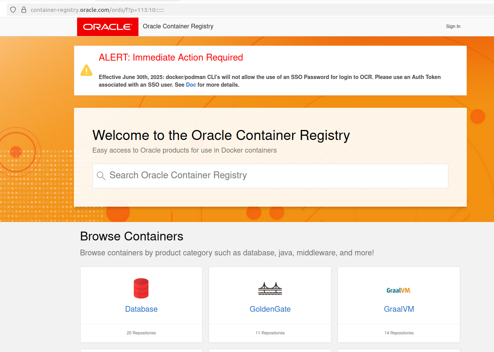

<!-- TOC BEGIN -->

- [1. Про що цей блог](#p-1")
- [2. Отримання образу ORACLE DB з офіційного сайту ORACLE](#p-2)
- [3. Налаштування бази даних, що запустилася в контейнері](#p-3)
- [3.1. Встановлення паролів адміністратора](#p-3.1)
- [3.2. Створення  локальних користувачів бази даних](#p-3.2)
- [3.3. Виконання DDL/SQL скриптів на базі даних](#p-3.3)
- [4. Підключення до бази даних за допомогою  Jupyter Notebook](#p-4)
<!-- TOC END -->

# Запуск бази даних ORACLE в  docker контейнері

## Про що цей блог

В цьому блозі описано, як отримати  **офіційний docker image** бази даних ORACLE  та запустити його в контейнері на локальній робоій станції (справедливо тільки для linux 64). Досліди проводилися на UBUNTU. 
Також описано як встановити  службові паролі та як працювати з DDL  скрипатми.

Тестування підключення ззовні контенера на host-машині де запущений і сам контейнер виконувалося на Jupyter notebook.


## Отримання образу ORACLE DB з офіційного сайту ORACLE

Отримати образ БД ORACLE  можна, настільки я знайшов, тільки з офіційного ORACLE docker registry.
На Docker HUB я не знайшов офіційних образів бази даних ORACLE.  А не офіційні були віком в 5-7 років, тобто, застарілі
Тому, перш ніж розмовляти про отримання БД потрібно завести собі обліковий запис на [ORACLE CLOUD](https://cloud.oracle.com). Коли зареєструєтся, то ORACLE  буде вимагати поставити додаток **Oracle Authentificator**  на мобільний пристрій для багатофакторної автентифікації.

Коли вже є обліковка в ORACLE CLOUD можна підключатися до oracle docker registry.
Для цього треба зайти на https://container-registry.oracle.com  [pic-01](#pic-01).

<kbd></kbd>
<p style="text-align: center;"><a name="pic-01">pic-01</a></p>


В розділі Databases можна побачити занйомі бази дниах:
- **adb-free**	Oracle Autonomous Database Free;
- **express** Oracle Database Express Edition;
- **free**	Oracle Database Free.

<kbd></kbd>
<p style="text-align: center;"><a name="pic-02">pic-02</a></p>


Але для доступу до  репозиторію, потрібно зайти в свій профіль і згенерувати  собі токен, що буде використовуватися як пароль при логіні в репозиторій і вже потім можна підключатися до репозиторію і отримувати image

Я буду для дослідів використовувати racle Database Express Edition - як найпростішу і найменшу.

- **Підключення до  репозиторію**


```bash
$ docker login container-registry.oracle.com
# побачмо зап в консолі і вводимо облікові дані? логін та токен, що згенерували в профілі
login: <your repo login>
password: <your repo  auth token>

```

І вже потім отримуємо образ бази даних локально. Образ досить об'ємний, тому простіше сперщу отримати його локально, а вже потім  створвати контейнер.

**Отримання образа бази даних**

```bash

# отримуємо
$ docker pull container-registry.oracle.com/database/express:latest

# перевіряємо , що отримали
$ docker image ls
REPOSITORY                                       TAG              IMAGE ID       CREATED         SIZE
container-registry.oracle.com/database/express   latest           8da8cedb7fbf   2 years ago     11.4GB
$ 
```


- **Запуск контейенра**

Щоб підготувати каталог, де будуть зберігатися дані бази даних пішов  по  рекомендаціях, але в спрощеному вигляді

```bash
$ sudo mkdir oracle 
$ cd oracle
$ sudo mkdir oradata 

$ sudo chmod -R 777 /opt/oracle
$ sudo chmod -R 777 /opt/oracle/oradata
```

```bash
# створюємо volume для збереження даних БД. Це дасть можливість уникнути проблем з вільним місцем в /var/lib.
docker volume create oracle_db_data

# запускаємо контейнер
docker run -d --name shodcldb 
 -p 1521:1521 -p 5500:5500 
 -v oracle_db_data:/opt/oracle/oradata 
 -e ORACLE_CHARACTERSET=AL32UTF8 
 container-registry.oracle.com/database/express

```

- **Перегляд логу роботи контейенра**

Перший запуск Oracle Express Edition всередині Docker-контейнера виконує налаштування, яке може зайняти час. Перегляньте логи, щоб переконатися, що база даних готова до використання:

```bash
docker logs -f shodcldb

```

Подальшу роботу з базою даних можна продовжувати, коли вдасться знайти  повідомлення, подібні до:

    DATABASE IS READY TO USE!

    Setup complete. Database ready to use.

Після появи цього повідомлення  можна підключатися до бази даних за портами 1521 (SQL*Net) та 5500 (Enterprise Manager PDB).


- **Зупинка  контейнера**

```bash
docker stop shodcldb 

```

- **Повторний запуск  контейнера**

```bash
docker start shodcldb 

```


## Налаштування бази даних, що запустилася в контейнері

Перш за все треба встановити пароль для SYS, SYSTEM. Для цього терба зайти в контрейнер та запустити вже наявний sh-скрипт

### **Встановлення паролів адміністратора**

```bash
# Узагальнена команда
# docker exec <oracle-db> ./setPassword.sh <your_password>

# команда у відповідності до імені запущеного контейнера

docker exec  shodcldb ./setPassword.sh <пароль адміністраторо>

# перевіряемо можливість підключення до бази даних з середини контейнера

docker exec -it shodcldb sqlplus system/<пароль адміністратора>@XE


```

### **Створення  локальних користувачів бази даних**

Тут, є відмінності, від звичного для розробників enterprise підходу. Ну, або ж, їх DBA  давно знають, але розроники відділені за звичай від  бази даних (як і користувачі ) тому їх не відчували. Тут більше я себе маю на увазі ніж загальну практику.

Коли ви підключитеся до ORACLE оцією командою 

```bash
docker exec -it shodcldb sqlplus system/<пароль адміністратора>@XE
```

і спробуєте створити користувача бази даних, на приклад оцим скриптом,


```sql
CREATE USER NODEREDAPP1 IDENTIFIED BY "<password>";
GRANT CONNECT            TO NODEREDAPP1;
GRANT ALTER SESSION      TO NODEREDAPP1;

```


то отримаєте помилку **ORA-65096: invalid common user or role**. Помилка  виникає тому, що ви намагаєтеся створити локального користувача (не загального) в CDB (Container Database) або в Root Container (CDB\$ROOT) замість того, щоб створити його у PDB (Pluggable Database). Починаючи з Oracle 12c, архітектура Multi-tenant (CDB/PDB) вимагає дотримання наступних правил:
1. Місце підключення (Підключіться до PDB)
Ви повинні бути підключені до Pluggable Database (PDB), а не до кореневого контейнера (CDB\$ROOT).
Якщо ви використовуєте **Oracle XE** або **Free**, то **PDB** зазвичай називається **XEPDB1** або **FREEPDB1**.
І перед створенням користувача чи виконання інших DDL скрптів треба підключитися (переконатися, що підключилися), до потрібної PDB. Якщо не переклчитися до PDB  то не побачите ні ваших об'єктів бази даних, ні створених вам користувачів. Теоретично, вимога перемкнутися на PDB звучить  зрозуміло, але виникає закономірне питання: "Як підключитися до бази даних звичайним корситувачем?".
Справа в тому, що  PDB виступає свого роду як **Service Name**  бази даних і в рядку підключення замість Service Name треба ставити PDB тому ось приклади: 


- приклад запуску sqlplus з підключенням до бази даних (для ORACLE XE).
```bash
sqlpus username/password@localhost:1521/XEPDB1

```

Або ж

```bash
sqlplus system/ваш_пароль@XE/XEPDB1

```

- приклад підключеня до бази даних з уже запущеного sqlplus (для ORACLE XE).

```sql
connect username/password@localhost:1521/XEPDB1
```

або ж

```bash

SQL> CONNECT system/password@XE
SQL> ALTER SESSION SET CONTAINER = XEPDB1;
SQL> SHOW CON_NAME;
-- XEPDB1

```

### Виконання DDL/SQL скриптів на базі даних

Якщо я запустив базу даних в контейнері то у мене немає ніякої мотивації розгортати клієнта oracle та налаштовувати TNS NAME. Один з методів робти, і досить комвортний, це скопіювати скрипти на контерйнер, а потім зайти в контейнер і запустити SQL і з ним скрипти на виконання.

Для приклау тут DDL скрипти знаходяться в каталоз **oracle-ddl** і скрпти розклажені по підкаталогах. Все запускається через единий **run.sql**

- копіювання скриптів на файлов систему контейенра

```bash
# Тут вказується повний шлях ло каталогу
docker cp -a /home/.../oracle-ddl/. shodcldb:/home/oracle/

```

- запуск скрптиів на виконання

```bash
docker exec -it shodcldb /bin/bash -c "sqlplus SYSTEM/1Qazxsw2@localhost:1521/XEPDB1 @/home/oracle/run.sql"

```

Хоча, хвилиночку!
Перед запском скриптів треба: 

1. створити власника схеми і наділити його правами:

```bash
docker exec -it shodcldb /bin/bash -c "sqlplus SYSTEM/1Qazxsw2@localhost:1521/XEPDB1 @/home/oracle/SCHEMA.SQL"

```

2. створити прикладних користувачів та надати їм правльні ролі:

```bash
docker exec -it shodcldb /bin/bash -c "sqlplus SYSTEM/1Qazxsw2@localhost:1521/XEPDB1 @/home/oracle/APPUSERS.sql"

```

Після виконання скрипта ви залишаєетеся в SQLPLUS і можна зробити SQL-запити до бази даних, а потім по **EXIT** вийти з контейнера та sqlplus. 


А просто, зайти в контейнер і подивитися лог вконання скриптів, або видалити їх , можна виконавши тражиційну команду:

```bash
docker exec -it shodcldb /bin/bash

```

## Підключення до бази даних за допомогою  Jupyter Notebook

- **Створення віртуального середовища**

```bash
python3 -m venv env

```

- **Активація віртуального середовища**

```bash
source env/bin/activate
```

- **Установка необхідних пакетів**

```bash

pip install -r requirements.txt
```

- **Запустити  Jupyter NoteBook**

```bash
jupyter notebook
```

