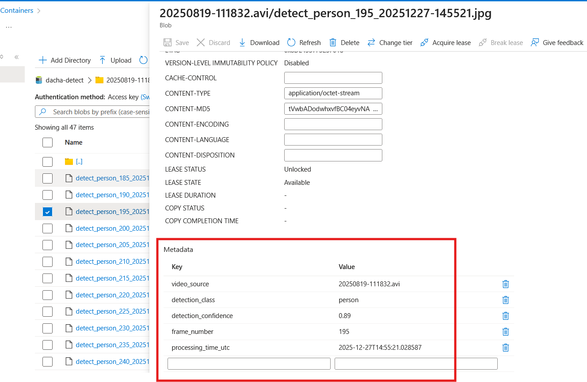
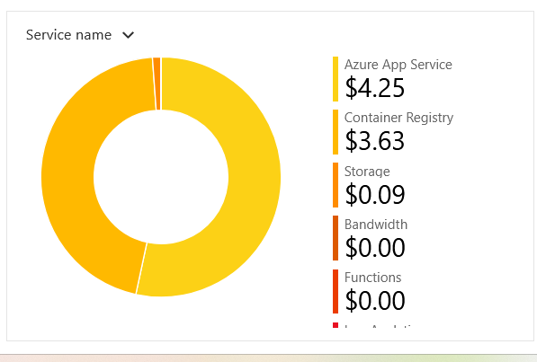

<!-- TOC BEGIN -->

- [1. Про що цей блог](#p-1")
- [2. Edge Layer (Межа): Розумна детекція на Raspberry Pi 5](#p-2)
- [3. Обробка відео-файлі в хмарі](#p-3)
- [3.1. Реакція хмари на завантажений файл](#p-3.1)
- [3.2. Orchestration (Диригент) обчислень: Durable Functions](#p-3.2)
- [3.3. Heavy Lifting (Обробка): AI в контейнерах](#p-3.3)
- [3.4. Feedback Loop: Результат та сповіщення](#p-3.4)
- [4. Оцінка вартості рішення](#p-4)
- [5. Підсумкові думки](#p-5)


<!-- TOC END -->

## <a name="p-1">1. Про що цей блог</a>

Це продовження блогів про сервіси azure:
- [AZURE AZ-204 AZ BLOB STORAGE - навчальний проект](https://pavlo-shcherbukha.github.io/posts/2025-10-16/az-204-blob-strg-ua/);
- [AZURE AZ-204 FOR DEVELOPERS](https://pavlo-shcherbukha.github.io/posts/2024-01-30/az-204-dev/),

що проходять по курсу az-204. Я шукав задачу для прототипа, що дозволить використати azure durable function. Фактично, мені потрібна була ідея для якогось важкого обчислювального процесу. Найбільш очевидною ідеєю, що прийшла в голову, це підключити камеру і обробити відео файл. Іншими словами почати використовувавти елементи computer vision. Назвав я цю ідею: **"Відеоспостереження на дачі"**.  

**Суть ідеї** полягає в тому, щоб камеру чи камери підключити на дачі до raspberry PI. На Raspberry  розгорнути та запустити програму детекцію руху. У випадку детекції писати 30 секунд відео. Потім записане відео завантажується в хмару azure  для подальшого аналізу вже "важкими" інстументами, а саме: пропустити відео через нейромережу для детекції об'єктів, що є на  кадрах. А всі детектовані кадри зберегти в окремому розділі (container  на azure BlobStorage), що пов'заний з цим відео.
Якщо подивитися зі сторони оцінки вкладеної праці і часу, то ідея надто складна. Набагато простіше купити роутер, tplink tapo камеру. Підключити камеру до мобільного додатку tapo і якоїсь китайської хмари і за умовних 200 гривень у вас працює відеоспостереження, причому, в залежності від камери, там і звук в обидва напрямки працює. 

Але якщо ціль в тому щоб:

- навчитися проектувати і розробляти розподілені додатки в хмарі,
- підготувати шаблон надійного прикладного data pipeline  для роботи зі штучним інтелектом,
- підготувати шаблон  архітектури для подальшого розвитку типу "розумний будинок" чи "цифрові двійники" -  то на мій особитсий погляд,  така робота має сенс.

Але знову ж, так як це навчальний проект, то вийшов такий собі  «Проект-флюгер»  чи пороект "Гопак на граблях".

Узагальнена архітектура додатку показана на [pic-01](#pic-01)

<kbd></kbd>
<p style="text-align: center;"><a name="pic-01">pic-01</a></p>

## <a name="p-2">2. Edge Layer (Межа): Розумна детекція на Raspberry Pi 5</a>

Для інтеграції камери та  edge обчислювального пристрою вибрав rtsp протокол. Це досить не залежний протокол, через який можна підключити камеру, чи мобільний телефон з додатком wifi-камера (ip-камера). Цей протокол не дає використати всі можливості камер якогось виробника. Але мені не вдалося знайти відкритих бібліотек по управлінню тими ж камерами tp-link tapo. Тому я викорастав той протокл, що добре відомий і до якого є бібліотеки.
В якості Edge комп'ютера використав Raspberry PI 5 з 8 мегабайтами пам'яті та SD-картиою на 64 ГБ. Для обробки трафіку від камери на Raspberry PI написана програма на Python з використанням бібліотеки open-cv.  Для швидкої обробки кадрів відео Raspberry PI 5  підходить ідеально. Ну і для підтримки роботи ком'ютера при відключеннях світла використав ДБЖ 5V/5A UPS Module 3S.
Детекція руху виконується програмно за допомогою бібліотеки open-cv. Якщо рух виявлено, то виконується запис відео на диск протягом 30 секунд. Коли  запис закінчено, файл з відео завантажено в хмару azure на мій BlobStorage. На цьому, робота Edge ком'ютера завершується, а подальша обробка відео виконується вже у хмарі.
Так як Raspberry 5  має багато зовнішніх портів - функціональність Edge комп'ютера можна легко розширити підключивши датчики чи якісь інші прилади, для  отримання даних та передачу їх в хмару.


## <a name="p-3">3. Обробка відео-файлі в хмарі</a>

### <a name="p-3.1">3.1. Реакція хмари на завантажений файл</a>

    Як тільки завантаження файлу завершено, Azure Event Grid автоматично «підхоплює» цю подію.
    Він відправляє сигнал (HTTP trigger) до нашого оркестратора — Azure Durable Function. Але на цьому етапі я ще не реалізував роботу з EventGriid, хоча я уже і використовуав її в  проекті "Перенесення Blob- полів з OracleDB на azure blob storage":  [Function eventGridTrigger1 - process events triggered by Azure Blob Storage when a new file is created](https://github.com/pavlo-shcherbukha/oracle-to-blobstorage-azfunc#function-eventgridtrigger1---process-events-triggered-by-azure-blob-storage-when-a-new-file-is-created). 

    На поточний момент я запускаю обробку вручну.  

### <a name="p-3.2">3.2. Orchestration (Диригент) обчислень: Durable Functions</a>

Це серце системи. Функція не просто виконує код, вона керує складним процесом:
- Вона запускає Azure Container Instance (ACI).
- Вона передає параметри (URL відео) у контейнер.
- Вона переходить у стан «очікування», не споживаючи ресурси (і ваші гроші), поки контейнер працює.

По архітектурі, оркестратор durable функції повинен запускатися за допомогою події в EventGrid. ПОки що, для поглибленого тестування, я запукаю оркестратор шляхом http - виклику. Особливість durablr function така, що вони state full, на відміну від регулярних функцій. Крім того, durablr function дозволяють легко будувати послідовно-паралельну обробку  задач, та системи, що управляються подіями. Тобто, це такий собі **BPM** що описується програмним кодом. 
В поточній архітектурі функція працює як  оркестратор, що реагує на події:

- Стартує роботу по триманні http-запиту. Вона не тримає http  з'єднання поки працює функція. Вона отримала запит, запустила процес, дала відповідь з параметрами управління процесом і "засинає". 

Ось приклад відповіді з параметрами управління:
```json
{
    "id": "1........9",

    "statusQueryGetUri": "http://localhost:7071/.../instances/....?...",
    "sendEventPostUri": "http://localhost:7071/..../instances/''''/raiseEvent/{eventName}?...",
    "terminatePostUri": "http://localhost:7071/..../instances/..../terminate?reason={text}&...",
    "rewindPostUri": "http://localhost:7071/......./instances/..../rewind?reason={text}&...",
    "purgeHistoryDeleteUri": "http://localhost:7071/..../stances/..?...",
    "restartPostUri": "http://localhost:7071/...../instances/1....../restart?...",
    "suspendPostUri": "http://localhost:7071/.....instances/1..../suspend?reason={text}&...",
    "resumePostUri": "http://localhost:7071/....../instances/../resume?reason={text}&..."

}
```

    - "id": " instance_id ідентифікатор екземпляра запущеної функції і він повторюється в path після  /instances/...",
    - "statusQueryGetUri": "url  за яким можна моніторити стан виконання завдання і отримати результат, якщо виконання звершилося",
    -  "sendEventPostUri": "url куди можна відправити зовнішню подію по  http. При цьому в URL {eventName} потрібно замінити на назву вашого event /raiseEvent/{eventName}?taskHub= , а instance_id треба передати в тілі запиту, щоб перенаправити саме на потрібний інстансе",
    - "terminatePostUri": "За цим url  відбувається припинення виконання завдання",
    - "rewindPostUri": " ??? не пом'ятаю",
    - "purgeHistoryDeleteUri": "Url очистити історію виконання завдань",
    - "restartPostUri": "Url перезапуску завдання",
    - "suspendPostUri": "Url  призупинити завдання",
    - "resumePostUri": ""Url продовження виконання завдання"qD0%B0%D1%80%D1%96-azure) докладно описано процес розгортання в хмарі.

В деякх url  треба хзвернути увагу на параметр **reason={text}**, де замість {text}  прописується реальний текст - причина 

Потрібно звернути увагу на обробку помилок в оркестраторі. В наведеному фрагменті кода оркестратора в блоці **Exception** для обробки помилки  викликає таке ж **Activity**,  як і для основної бізнес логіки. Код самого Activity  наведено після фрагмента оркетратора.

```py
# Orchestrator
@app.orchestration_trigger(context_name="context")
def video_orchestrator(context):
    try:
        ....
        ....
    except Exception as e:
        logging.error( f"Orchestration failed with error: {e}")        
        error_r = yield context.call_activity("SendFailureNotification", str(e))
        error_r["error_type"] = type(e).__name__
    return [error_r]


# Activity
@app.activity_trigger(input_name="error")
def SendFailureNotification(error: str):
    """
        Функція  обробки помилки оркестратора
    """
    resp_data = {
        "ok": False,
        "activity": "SendFailureNotification",
        "code": 404,
        "message": f"video_orchestrator completed with error = {error}"
       
    }
    return resp_data    

```

Така обробка гарантує те, що у випадку помилки, оркестратор  коректно завершить свою роботу і збереже результат, навіть з помилкою. В прикладних Activity просто логуємо помилку і викидуємо **Exception** на вищий рівень (на ріваень оркестратора)


```py
# Activity
@app.activity_trigger(input_name="blobMessage")
def send_processing_request(  blobMessage: object):
    """Відправити в чергу запит на  обробку відеофайлу"""
    q_srvc_connect = os.getenv("AzureWebJobsStorage","")
    q_name = "video-to-processing"
    json_message = json.dumps(blobMessage)
    logging.debug( f"Відправляю повідомлення в чергу {q_name} запит на обробку відео {json_message}" )
    try:
        request_queue_client = QueueClient.from_connection_string(
            conn_str = q_srvc_connect, 
            queue_name = q_name
        )

        msgsend_result=request_queue_client.send_message(
            json_message
        )
        
        logging.debug(f"✅ Повідомлення про завершення обробки відправлено до черги { q_name}.")
        logging.debug(f" ID повідомлення: {msgsend_result.id}, Попередній перегляд: {msgsend_result.pop_receipt}")

        resp_data = {
            "ok": True,
            "activity": "send_processing_request",
            "code": 200,
            "message": "Activity processed successfully",
            "data":  {"message_id":msgsend_result.id, "blobMessage": blobMessage}
        }
        return  resp_data        

    except Exception as e:
        logging.error(f"❌ Помилка  публікації повідомлення до черги: {e}")
        raise       
    finally:
        request_queue_client .close()

```

Я вже писав про те, що оркестратор управляється подіями. А поки подія не настала, то оркестратор "спить" не споживаючи процесорного часу. Наведений нижче фрагмент коду показує, як перевести оркестратор в стан очікування

```py
        # Запукс завдання на обробку відео
        result5 = yield context.call_activity("send_processing_request", blobMessage)
        
        # виставляємо час очікування події в секундах
        due_time = context.current_utc_datetime + timedelta(seconds=360)
        # запускаємо таймер очікування на розрахований інтерва
        durable_timeout_task = context.create_timer(due_time)
        # реєструємо зовнішню подію, що очікує функція, протягом встановленого періоду
        eventName = "PROCESSING_VIDEO_COMPLITED"
        eventBody = context.wait_for_external_event(eventName)
        # Очікування, яка з подій настане ранше: пройде зовнішня, чи закінчиться часовий інтервал
        winning_task = yield context.task_any([eventBody, durable_timeout_task])
        result6 = None 
        if eventBody == winning_task:
            # якщо прийшла зовнішня подія, то зберігаємо результат з успішною відповіддю про обробку відеофайла
            durable_timeout_task.cancel()
            result6 = yield context.call_activity("SendVideoComplited", eventBody.result)
        else:
            # якщо ж відповідь вчасно не надійшла, то зберігаємо результат обробки з відповіддню timeout 
            result6 = yield context.call_activity("Escalate", "ESCALATE DUE TO TIMEOUT")
```

Тепер розглянемо як обробляти зовнішню подію, як налаштувати відповідні тригери. На наведеному нижче фрагменті коду показано тригер, що слухає чергу Storage Queue за назвою **"video-processed**. Як можна помітити, **client.raise_event(....)** приймає досить специфічні параметри:

- **instance_id** вказує на екземпляр  запущеної функції. Він появляється в оркестраторі при запуску і його потрібно передати в той обробник, що запускається. Тоді обробник зможе повернути це значення у відповіді. В оркестраторі в  **Activity** це значення передається. А в наведеному фрагменті ми вже вичитуємо його з повідомлення.

- **event_name** Повинен відповідати тому, що зареєстровано в оркестраторі

- **event_data** це вже прикладні дані.

Ще треба звернути увагу, що тригер на Storage Queue параметризується (тобто він уже існує і працює якась factory). Цей тригер очікує, що повідомлення в StorageQueue  публікується як base64 encoded. Відповідно, цей формат повинен наслідуватися і обробником, що публікує повідомлення в чергу. В іншому разі отримаємо помилку читання повідомлення з чеги. 

```py

#----------------------------------------------------
# Налаштування функції за допомогою декораторів Python V2
# ----------------------------------------------------

@app.queue_trigger(
    arg_name="msg",
    queue_name="video-processed",
    connection="AzureWebJobsStorage"
)
@app.durable_client_input(client_name="client")
async def client_function(msg: func.QueueMessage, client: df.DurableOrchestrationClient):
    #instance_id = "MyTargetOrchestratorInstance" 
    #event_name = "QueueMessageReceived"
    try:
        event_data_str = msg.get_body().decode("utf-8")
        event_data = json.loads(event_data_str)
        ## вичитуємо з повідомлення, що опублікував worker.
        instance_id = event_data["instance_id"]
        event_name = "PROCESSING_VIDEO_COMPLITED"
        logging.info(f"Received message: {event_data}")
        # -------------------------------------------------------------
        # Саме функція  послати відповідний event
        await client.raise_event(instance_id, event_name, event_data)
        # ---------------------------------------------------------------
        logging.info(f"Successfully raised external event '{event_name}' for instance '{instance_id}'.")

        return None
    except Exception as e:
        logging.error(f"❌ Помилка  обробки повідомлення з черги video-processed: {e}")
        raise     


```

Крім показаного тригера для Storage Queue  оркестратори Durable Functions  мають вбудований http слухач подій. При запуску оркестратора він повертає URL  цього слухача, де event Name  треба передати в елементі URL, а в тілі передати прикладні дані.

**І на останок, треба додати кілька слів про відладку і тестування.**

Durable функції досить важко відлагоджувати і тестувати за допомогою традиційних інсрументів тестування. По перше  вони state full і відповідно, інструмент для тестуванняі відладки повинен бути теж state full.  По друге - кожний запуск функції дає набір своїх унікальних URL і доадткових даних, які потім будуть використовуватися для моніторингу чи отримання результатів. Ну і вони інтегруються з різними midleware інструментами, що вимагають підключення їхнії API. Ну і durable function управляються подіями, які потрібно генерува чи моделювати чи емулювати і, часто, інтерактивно.

Тому для відладки і тестування я використав Jupyter notebook  і залишився дуже нею задоволений.
Детально про  організацію тестування я описав за лінком: [Тестування оркестратора](https://github.com/pavlo-shcherbukha/sh-py-ml-orchestrator-p/tree/master#%D1%82%D0%B5%D1%81%D1%82%D1%83%D0%B2%D0%B0%D0%BD%D0%BD%D1%8F-%D0%BE%D1%80%D0%BA%D0%B5%D1%81%D1%82%D1%80%D0%B0%D1%82%D0%BE%D1%80%D0%B0). 
Саму Notebook можна подивитися за лінком [durable-func-test.ipynb](https://github.com/pavlo-shcherbukha/sh-py-ml-orchestrator-p/blob/master/tests/notebooks/durable-func-test.ipynb), 
та helper  до неї: [test_utils.py](https://github.com/pavlo-shcherbukha/sh-py-ml-orchestrator-p/blob/master/tests/test_utils.py)


### <a name="p-3.3">3.3. Heavy Lifting (Обробка): AI в контейнерах</a>

    Для обробки даних я вибрав платформу для запуску контейнерів в Azure: **Azure Container Instance**
    Використання Azure Container Instances, обумовлений можливістю  запустити додаток з "важкою" моделлю (наприклад, YOLOv8) для розпізнавання об'єктів. 
    **Azure Container Instance** - це легка платформа управління контейнерами, що не вимагає встановлення та використання "важкого" K8s. Можливо, під капотом там теж є якийсь k8-micro чи k3s. Але суть в тому, що можна розгорнути кілька контейнеризованих додатків, не розгортаючи  важкої платформи для управління контейенрами. 

    Контейнеризований додаток завантажує відео, аналізує його (хто в кадрі: людина, машина ,  собака  або кіт ) і записує результат  у  сховище ( вспеціальний контейнер  azure blob storage ). Контейнер  azure blob storage це сутність, що аналогічна розділу диска, а не в значенні docker-container. Репозиторій додатку опубліковано за лінком [sh-py-ml-worker-p](https://github.com/pavlo-shcherbukha/sh-py-ml-worker-p/tree/master)

    Звичайно, для побудови контейнеризованого додатку потрібно  написати Dockerfile  і зібрати відповідний образ. В якості базового docker-container використано маленький **python:3.11-slim**. Одною з проблем, яку прийшлося вирішувати виявилася збірка образу та встановлення залежностей. Так, окремі версії бібліотек Ultralitics  працюють з чітко визначеними версіями бібліотек torch. Дотого ж так як додаток буде працювати в контейнері, порібно ставити бібліотеки torch, що використовують тільки CPU  і не використовують відеокарти. А вони ставляться не з загального репозиторію Pypi а з репозиторію розробників pytorch.org і, відповідно, їх не можна вписати в файл requremets.txt,  а треба ставити окремо. І, нарешті, ставиться воно хвилин 20-30, що при розробці та відлагодженні просто не комфортно. Тому збірка образів була розділена на 2 етапи.
    
    - На першому етапі збирається базовий образ з усіма "важкими" бібліотекам, як згадував раніше, хвилин 20-30. За це відповіає файл: [Dockerfile.base.dockerfile](https://github.com/pavlo-shcherbukha/sh-py-ml-worker-p/blob/master/Dockerfile.base.dockerfile).
    
    - На другому етапі створюємо фінальний образ додатку, який практично бере базовий і копіює на нього тільки файли програмного коду: [Dockerfile](https://github.com/pavlo-shcherbukha/sh-py-ml-worker-p/blob/master/Dockerfile).

    Для локальної розробки, відладки та тстування використано емулятор storage Azurite. Там є всі потрібні мені сутності: BlobStorage  та  Storage Queue. Для взаємодії контейнеризованого додатку з Azurite  використав контейнеризовану версію Azurite  ну і об'єднав ці два  контейнери в **Docekr Compse**: [docker-compose.yml](https://github.com/pavlo-shcherbukha/sh-py-ml-worker-p/blob/master/docker-compose.yml).  Для Azurite зразу відкриваються порти для Blob та для Queue. На це потрібно звернути увагу.  

    ```yaml
    # 2. Сервіс для Azurite
    azurite:
        image: mcr.microsoft.com/azure-storage/azurite
        container_name: azurite-container
        ports:
        # Виставляємо порти, щоб Azurite був доступний з вашої Windows-машини
        - "10000:10000" # Blob
        - "10001:10001" # Queue
        
        # Зберігання даних Azurite на хост-машині (опціонально)
        volumes:
        - azurite_data:/data
        
        networks:
        - azure-net

    # Визначення зовнішньої мережі та томів

    ```

Програмна частина контейнеризованого додатку має такі особливості

- Додаток працює через пакети Azure  зі BlobStorage та зі Storage Queue. Тобто, читає з storage і записує на storage та читає повідомлення з черги і публікує повідомлення в чергу.
- Потрібно звернути увагу на те, що в linux контейнерах обробляти файли локально (тобто записувати в них щось) потрібно в temporary каталозі, щоб не надавати спеціальних прав на каталоги додатку. Отрмання поточного temp dir показано в цьому фрагменті.

    ```py

    import tempfile
    temp_dir = tempfile.gettempdir()
    cv2.imwrite(f"{temp_dir}/{local_screenshot_name}", frame)

    ```
Ще одною особливістю є те, при збереженні кадрів з детектованими об'єктами не просто файл завантажується на BlobStorage, в до нього додається ще ряд кастомних метаданих:

    ```py

                # Логіка для тварин
                            logger.debug(f"DOG OR CAT DETECTED")
                            timestamp = datetime.now().strftime("%Y%m%d-%H%M%S")
                            local_screenshot_name = f"{fblob}_detect_dogcat_{frame_number}_{timestamp}.jpg"
                            # Формування імені блобу з префіксом каталогу
                            screenshot_name = f"{fblob}/detect_dogcat_{frame_number}_{timestamp}.jpg"

                            # 1. Визначення метаданих у вигляді словника
                            video_name_prefix = os.path.splitext(fblob)[0]
                            custom_metadata = {
                                "video_source": fblob,      
                                "detection_class": class_name,
                                "detection_confidence": f"{confidence:.2f}",
                                "frame_number": str(frame_number),     
                                "processing_time_utc": datetime.utcnow().isoformat()
                            }

                            logger.debug(f"metadata for blob " + json.dumps( custom_metadata ))

                            cv2.imwrite(f"{temp_dir}/{local_screenshot_name}", frame)
                            
                            #Завантаження скріншоту в Blob Storage
                            screenshot_blob_client = container_client.get_blob_client(screenshot_name)
                            logger.debug(f"Uploading screenshot to blob: {temp_dir}/{local_screenshot_name} to {screenshot_name} ")
                            with open(f"{temp_dir}/{local_screenshot_name}", "rb") as data:
                                screenshot_blob_client.upload_blob(data, metadata=custom_metadata, overwrite=True)
                                logging.info(f"Скріншот завантажено: {local_screenshot_name} в {screenshot_name}")
                            logger.debug(f"Remove processed screenshot: {temp_dir}/{local_screenshot_name}")
                            os.remove(f"{temp_dir}/{local_screenshot_name}")

    ```
 На Blob Storage  можна створювати віртуальні папки. І тоді файли будуть групуватися за віртуальними паками. Ось приклад створення імені блоба з віртуальною папкою:

    ```py
        # Формування імені блобу з префіксом каталогу {fblob}
        screenshot_name = f"{fblob}/detect_car_{frame_number}_{timestamp}.jpg"

    ```

З приводу YOLO8 моделі. Я використовую мінімальну **"yolov8n.pt"**. Щоб модель не скачувалась кожного разу з інтернету, що на справді теж дуже довго відбувається, я її один раз скача і поклав у базовий контейнер. На відміну від показаного в документації Ultralitic  найпоширенішого (і найдовшого) способу завантаження моделі я використовую такий:

```py
from ultralytics import YOLO 
MODEL_PATH = "yolov8n.pt"
if os.path.exists(MODEL_PATH):
    yolo_model = YOLO(MODEL_PATH)
    logger.debug("Модель успішно завантажено з локального файлу.")
else:
    logger.debug(f"Помилка: Файл моделі не знайдено за шляхом {MODEL_PATH}")
logger.debug(f"YOLO model ready: {yolo_model.info()}")
```
Тут теж потрібно сказати, що я теж сробив таку ж помилку як і в durable function: Я пдключаюся то storage через connect string  а не через meneged identity. 
Для навчання та розробки це ще прийнятно. А от для продуктива такий підхід не прийнятний.

Я тут не будував ніякого devops  процеса. Мене цікавила частина програмування  а не  процес devops.  Тому підключив  Azure container registry і готовий образ відправляв на нього. А вже з zure container registry  створювавс дконтайнер в Azure Container Instance і стартував додаток. Детально про розгортання написано за лінком [Розгортання додатку в azure](https://github.com/pavlo-shcherbukha/sh-py-ml-worker-p/tree/master#%D1%80%D0%BE%D0%B7%D0%B3%D0%BE%D1%80%D1%82%D0%B0%D0%BD%D0%BD%D1%8F-%D0%B4%D0%BE%D0%B4%D0%B0%D1%82%D0%BA%D1%83-%D0%B2-azure). 

### <a name="p-3.4">3.4. Feedback Loop: Результат та сповіщення</a>

    В таких розроділених системах дуже важливим є розробка структури  обміну повідомлення і чітке визначення шляхів обміну повідмоленнями. Для прикладу, так як у мене проект "Гопах на граблях" і я часто змінвав ідеї та компоненти -то і не міг формалізувати  структуру повідомлень та канали обміну ними. Так, можна помітити, що в розділі durable function обмін повідомленнями можливий як через черги та і по http. А от у обробника відеовайлів  обмін передбачено тільки через черги. Це саме
    тому, що  цей проект розвивається "куди вітер подме". Тому наведу в цьому розділі структуру повідомлень.

#### Запуск оркестаратора

Це повідмолення що стартує  обробку відеофайла у хмарі. Приходить по http. Має таку структуру

```json
{ 
"blobURL": "http://127.0.0.1:10000/devstoreaccount1/dacha-video/20250819-110439.avi",
"blobName": "dacha-video/20250819-111832.avi"
}
```

#### Повідомлення обронику відеофайлів на обробку відео
Оркестратор публікую в чергу обробнику повідомленя обробкнику для обробки відеофайла **20250819-110439.avi** , тут є об'єкт person для детекції

```json
{
    "blobUrl": "http://127.0.0.1:10000/devstoreaccount1/dacha-video/20250819-110439.avi",
    "blobName": "dacha-video/20250819-110439.avi",
    "posted": "2025-06-01T22:03:02",
    "instance_id": "800081000120002"
}

```  

####  Відповідь обробника оркестратора

Після обробки обробник публікує повідомлення в чергу з результатами обробки 

```json
{
        "instance_id": "800081000120002",
        "blobUrl": "http://127.0.0.1:10000/devstoreaccount1/dacha-video/20250819-110439.avi", 
        "blobName": "dacha-video/20250819-110439.avi", 
        "status": "PROCESSED", 
        "start_timestamp": "2025-12-14T18:00:30.761319", 
        "stop_timestamp": "2025-12-14T18:00:37.427266", 
        "details": {}
}

```
і воно вже зупиняє роботу оркестратора.

#### Результат, що збурігає оркестратор про обробку відеофайлу

І вже, коли апросити оркесратор він поверне такий результат у випадку успішного процесу:

```json
[
  {
    "ok": true,
    "activity": "send_processing_request",
    "code": 200,
    "message": "Activity processed successfully",
    "data": {
      "message_id": "b71c1dec-97c2-40eb-9d30-cf0ff1e9703a",
      "blobMessage": {
        "blobUrl": "https://strgdacha.blob.core.windows.net/dacha-video/20250819-111832.avi",
        "blobName": "dacha-video/20250819-111832.avi",
        "posted": "2025-12-27T14:54:53.281962",
        "instance_id": "62e92b342c314a2b8b69caa7be7c618d"
      }
    }
  },
  {
    "ok": true,
    "activity": "SendVideoComplited",
    "code": 200,
    "message": "Activity processed successfully",
    "data": "{\"instance_id\": \"62e92b342c314a2b8b69caa7be7c618d\", \"blobURL\": \"https://strgdacha.blob.core.windows.net/dacha-video/20250819-111832.avi\", \"blobName\": \"dacha-video/20250819-111832.avi\", \"status\": \"PROCESSED\", \"start_timestamp\": \"2025-12-27T14:54:57.447686\", \"stop_timestamp\": \"2025-12-27T14:55:50.384240\", \"details\": {}}"
  }
]

```

#### Метадані, що зберігаються біля кожного детектованого файлу

А на детектованих зображеннях можна побачити такий списко метаданих, що пояснюють, що саме детектовано:


<kbd></kbd>
<p style="text-align: center;"><a name="pic-02">pic-02</a></p>


## <a name="p-4">4. Оцінка вартості рішення</a>

    - Raspberry Pi: Разова інвестиція. якщо пошукати до готовий набрі, що включає саму плату, корпус, блок живлення, sd-карту  можна знайти за 6000  грн.
    - Камера - все залежить від моделі - ну нехай в райні 800-1500 грн.
    - Azure Blob/Functions: Майже безкоштовно на малих об'ємах.
    - Azure Container Instances: Оплата лише за секунди роботи (наприклад, 2-3 центи за один запуск аналізу).
    - Azure Container Registry [pricing](https://azure.microsoft.com/en-us/pricing/details/container-registry/).

Ось фінансова статистика викорстання цієї архітектури за груднь місяць

<kbd></kbd>
<p style="text-align: center;"><a name="pic-03">pic-03</a></p>

<kbd></kbd>
<p style="text-align: center;"><a name="pic-04">pic-04</a></p>


## <a name="p-5">5. Підсумкові  думки</a>

- Чи є це ідельана архітектура та розроблене програмне забезпеченя?
Ні, архітектруа не є ідеальною. Не зважаючи на те, що я уважно, і не раз, прочитав навчадьний курс az-204,  отримані знання не дали мені можливості "от так взяти і розробити правильну чи ідеальну архітектуру додатку" а потім її ще "правильно запрограмувати".

- Які я зробив помилки?

1. Перша і досить вагома помилка це спробувати на Durable Function  покласти велке обчислювальне навантаження. Звичайно, вона може виконувати якесь обчислювальне навантаження. Але як тільки там з'являються якість платформо - залежні бібліотеки чи якість вимоги до файлової системи  - то з велико вірогіднісю у вас нічого не вийже. Durable Function  повинна управляти обчисленнями а не виконувати їх. Хоча в прикладах з документації на Durable Function покладені  обчислення. Тому я і зробив помилку.

2. Обробник відеофайлі я  зробив на [Azure Container Instance](https://learn.microsoft.com/en-us/azure/container-instances/container-instances-overview).

Хоча на справді, економічніше б було використати [Azure Container Apps](https://learn.microsoft.com/en-us/azure/container-apps/overview) тому що в ньому є шаблон "Hosting background processing jobs": [Jobs in Azure Container Apps](https://learn.microsoft.com/en-us/azure/container-apps/jobs?tabs=azure-cli).

Справа в тому, що Azure Container Instance весь час виконує опитування черги, яку слухає - а це споживання процесорного часу. Як варіантом виходу з ситцації використовувати не  чергу, а http  запит хоча б на етпі запуску обробника.

3. Я  зв'язав ресурси зі стораджем через connect string,  що для продуктиву зовсім не бажано і треба використовувати Managed identity

4. Я не  зробив тригер з Blobstorage  на Durable Function (оркестратор) через EventGreed.

5. Я в повідомлення обміну між оркестратором і обробником відеофайлів загубив instance_id — Шукав я його мабуть 2 дні. А якби у мене ці повідомлення були описані ще до початку розробки - то я хочаб мав можливість звірити їх в процесі розробки по полях і біля кожного посавити "галочку" - включив в реальне повідмолення.

6. На початку, я в черги складав повідомлення, як plain text.  Так, це найпростіший підхід, але і найбільш не надійний. Змінити підхід мене змусив вбудваний в Durable Fucntion  тригер, що приймає тільки Base64 Encoded повідмлення.

Чому я зробив ці помилки? Та тому що я навчався і не маю досвіду хмарного архітектора, не зважаючи що я прочитав і частину курсів хмарного архітектора. На диво 😁, у трьох відомих хмарних провайдерів кнавчальні курси архітекторів та розробників спільні відсотків так на 50%. Таким чином я  не розробив детальної архітектури, а вже почав кодити. Тепер уявимо що  це б був релаьний проект. Чим би він закінчився, а особливо при наявності більге ніж один розробник - неприємностями на 100%. Відповідно я зробив висновки і сформулював  **"Маніфест реального системного архітектора, а не просто «малювальника квадратиків» у Visio"**.

- Що корисного я отримав чи знайшов в цьому проекті

1. Сформулював  **"Маніфест реального системного архітектора, а не просто «малювальника квадратиків» у Visio"**.

Ось як має виглядати цей «архітектурний мінімум», який повинен бути підготованицй до початку розробки:

🗺️ 1. Специфікація Контрактів (Data Contracts)

Архітектор повинен зафіксувати не просто «ми шлемо JSON», а чітку схему для кожної черги та API:
    Обов’язкові поля: (наприклад, instance_id — це «паспорт» повідомлення).
    Типи даних: (рядок, число, формат дати ISO 860)7.
    Версійність: Що буде, якщо ми додамо нове поле? Чи не «впаде» старий воркер?

🔑 2. Карта Credentials та Identity (Security Mapping)

В розподіленій системі «хто має доступ до чого» — це не задача розробника, це дизайн безпеки.
    Managed Identity: Архітектор має визначити, що Функція має роль Storage Queue Data Contributor.
    Secret Management: Де лежать ключі? (Azure Key Vault).
    Scopes: Чи має воркер доступ на видалення блобів, чи тільки на читання?

🏗️ 3. Топологія та DevOps-карта (Deployment Map)

Архітектор малює «карту бойових дій» DevOps:
    Runtime: Де працює код? (Function — для логіки, Container — для GPU/ML).
    Scaling: При якій кількості повідомлень у черзі ми запускаємо другий контейнер? (KEDA-тригери).
    Networking: Як контейнер «бачить» чергу? (VNET, Private Endpoints).

Чому це важливо?
Без такої карти розробка перетворюється на «інтеграційне пекло», де кожен розробник:
    Вигадує свої назви полів (blob_url vs blobUrl vs Url).
    Використовує різні методи кодування (Base64 vs Clear Text).
    Створює «дірки» в безпеці, бо просто копіює Connection String у код.


2. Організування управління та тестування з Jupyter Notebook. 
Тут слід  наголосити на тому що  навчився  робити  проекти тестування на Jupiter Notebook  що органічно вкладеться в сам програмний проект і, одночасно, не буде йому заважати. Також відпрацював задавання чутливої інформації не в Jupyter Notebook  а через env-зміні. І, нарешті, найголовніше - навчився створювати та підключати обчислювальні модулі до Jupyter Notebook  що дозволить зробити обчислювальні комірки маленькими і такими що  виконують тільки презентаційну функцію. А всі обчислення винлсити в ці модулі. 

3. Якщо є бажання займатися штучним інтелектом, на приклад: навчити нейронку розпізнавати якісь образи. Вам знадобиться не 20-30 зобрадень  тих обрахів, а набагато більше. Більш того, ці всі картинки, тексти, відео - повинні будуть проходити додаткові шари аналізу, перевірки, очистки даних, навіть трансформації. І оцей проект - це є мінімальною і примітивною моделлю Data PipeLine що дозволить надійно управляти обробкою таких даних.  


