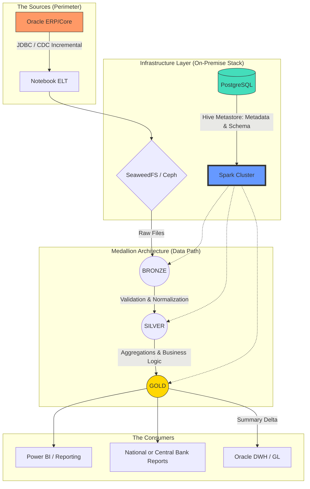

<!-- TOC BEGIN -->

- [1. Introduction](#p-1")
- [2. Delta Lake's main architectural pillars](#p-2)
- [3. A little history and comparisons](#p-3)
- [4. Let's consider a typical business case](#p-4)
- [5. Data storage: Your own cloud in a data center](#p-5)
- [6. What would I personally choose for a bank that can't go to the cloud, but wants to get the speed of Spark](#p-6)
- [7 ETL based on Jupyter Notebooks](#p-7)
- [7.1. Transparency and Manageability: A Manager's View](#p-7.1)
- [8. Appeal to developers](#p-8)
- [9. Where to start with ORACLE for a developer](#p-9)

<!-- TOC END -->

## <a name="p-1">1. Introduction</a>

For over two decades, I’ve lived in the world of relational databases. I’m used to the comfort of ACID transactions, the rigor of DDL, and the reliability of Oracle. But the data landscape is changing. When "Big Data" first arrived, it felt like a step backward into a "Data Swamp" of messy files. Then came Delta Lake.

In this article, I want to show you how a DB professional can build a modern Lakehouse architecture in their data center. And to get you started, how to build a modern Lakehouse architecture right on your laptop using Docker, PySpark, and Delta Lake. It’s not just about files; it’s about bringing the maturity and experience of a developer from the DB layer to the scalable world of Spark. 

**But first, I'll briefly tell you how I got here.**

Despite the fact that I continue to work with the ORACLE database, the focus of my attention has constantly shifted towards cloud tools. It was not a one-step decision and it was not a one-step solution. It was a long journey of trial and error, sometimes stopping or rolling back, and then repeated attempts to learn tools, studying architectural approaches and patterns. There was an attempt to initiate and build an On-premise Cloud and it turned out to be successful, in my opinion. I tried to study different platforms of different cloud providers. Recently, I have focused on AZURE, because I liked the functionality of their cloud the most. But over time, I realized that no matter how much I study clouds and campaign for clouds, there are cases when this or that client will not go to public clouds due to various restrictions. Most often regulatory ones. Therefore, while getting acquainted with the AZure Cloud Product **Microsoft Fabric**, I asked myself two questions:

- how to build something similar, only On Premise in a private cloud
- how to make the existing team not shrink, but simply expand its experience, because experience is more valuable
- if experience is not used, it becomes a burden

Very briefly about **Microsoft Fabric**

There is an enterprise product in the Azure cloud called **Microsoft Fabric**. It is a product that can automate many aspects of a corporation's work. You can read more about it at the link: [Get started with Microsoft Fabric](https://learn.microsoft.com/en-us/training/paths/get-started-fabric/).

The basis of this product is::

- Spark - computing resources in a cluster that can be dynamically increased or decreased.
- LakeHouse with Delta Lake, in fact, it is a universal opensource platform for storing data and building Data Lakes.
- Jupyter NoteBook - as the main platform for coding programs and executing program units in python.

In addition, there are a large number of other Azure products that allow you to combine integrations, reporting, and access control. But all of this revolves around the Spark compute cluster and Delta Lake structures.

As a developer who has designed and developed more than one application in ORACLE Database, it is very difficult for me to change the design logic to Delta Lake friendly.
Here I will try to explain why developers who are used to designing applications in an enterprise database environment: ORACLE, MSSQL.... should take SPARK and LakeHouse with Delta Lake seriously when designing applications. Personally, I have a lot of internal conflicts that prevent me from taking this product seriously.

**My first internal conflict**: Don’t get lost in the bright marketing of Microsoft Fabric. The various connectors (Data Factory, Copy Tool, Pipelines) are just “hoses” through which water flows (i.e. data is pumped). But if you haven’t built the right “reservoir” (Lakehouse structure), then these hoses will simply create chaos and your lake will turn into a swamp. Therefore, the first thing you need to do is learn how to build the right data structures in Lakehouse.

**My second internal conflict**: to change the logic of thoughts and algorithm construction, which we are accustomed to for large corporate databases such as ORACLE, to the logic of Delta Lake files.

In fact, these "internal conflicts" are a general conflict between the Tool-oriented and Architecture-oriented approaches.

Next, I will try to prove why developers of enterprise products should take Spark and LakeHouse with Delta Lake seriously, even if you are not ready to use Microsoft Fabric or give your data to the cloud at all. And I will explain a little about the LakeHouse with Delta Lake data architecture.

## <a name="p-2">2. The Architectural Pillars of Delta Lake</a>

Here are the 8 pillars on which the logic of the structure design in Delta Lake rests:

1. Medallion Architecture (Logical Zoning)

These are not just folder names, these are levels of quality and trust in the data. We should not design "tables", but "data paths":

- Bronze: The data should look exactly as it does in the source (even if the JSON is broken). This is our insurance.

- Silver: This is where relational cleanup takes place. Duplicate removal, type casting, Master-Detail checking.

- Gold: Here the data is aggregated for a specific report.

2. Partitioning (Physical Design)

- In Oracle we had indexes. In Delta Lake the main speed tool is Partitioning (dividing into folders) and Z-Ordering (sorting inside files).
- Design error: Split data by payment_ID. (We will get a million small files, Spark will "die").
- Correct logic: Split by Year/Month or Production_Category.

3. Idempotence and Keys

Since there are no Foreign Keys, we design the structure so that each transformation step is idempotent. That is, if we run the same JSON load 10 times, the table structure should remain intact. We design the MERGE logic as a foundation for stability.

At Oracle, we designed the structure to minimize duplicates (Normalization). At Lakehouse, we often design the structure to optimize reads (sometimes allowing for denormalization), because disk storage is cheap and Spark cluster runtime is expensive.

4. There are no cursors that are familiar to ORACLE.

Traditional ORACLE developer conflict: In ORACLE I could open a cursor and loop through the records and validate each record, but in SPARK it's an anti-pattern. Looping through the records in Spark via .collect() or using Python cursors is really an anti-pattern, as it kills distributed computing and turns our powerful cluster into one slow computer.

5. The Transaction Log (The "Heart" of Delta)

Think of this as the Oracle Redo Log or Archive Log. Every single change is recorded in a JSON-based transaction log (_delta_log). This ensures ACID compliance: if a write fails halfway, the system knows exactly how to roll back, leaving your "Data Lake" clean and consistent.

6. Schema Enforcement & Evolution

In a traditional Data Lake, you can accidentally drop a "corrupted" file into a folder and break every downstream report. Delta Lake acts as a gatekeeper. It validates data types during write (Enforcement) but also allows for graceful schema updates (Evolution) when business requirements change.

7. Time Travel (Data Versioning)

This is a "killer feature" for any DBA. Since every transaction is logged, you can query the state of your table at any specific point in time or version. Need to see the balance as of last Monday? Just use VERSION AS OF. It’s like having a built-in Flashback Query.

8. Unified Batch and Streaming

Delta Lake blurs the line between historical data processing and real-time streams. You can treat a Delta table as both a static source for batch jobs and a continuous sink for streaming data, ensuring that your analytics are always up to date.

## <a name="p-3">3. A little excursion into history and comparisons</a>

I had developed reporting for commercial banks in the NBU for about 10 years, and even on FOXPRO 2.0. Then we tried to migrate all this to ORACLE (it was version 10). There we encountered problems when materialized VIEW aggregated and non-aggregated worked slower than FoxPro, which merges all the necessary data onto the user's machine, sequentially scans the tables and prepares aggregated data, and then returns them to network dbf files. Moreover, the most reliable option in ORACLE was PL/SQL coding with a number of Oracle OLAP tools and parallelism in queries. But there is a separate problem there. There, the queries are kilometer long.

**Why did FoxPro seem faster than Oracle?**

FoxPro (as in Clipper/dBase) had a "navigational" access architecture. Data was fed to the client and the local processor "chewed" it sequentially. This worked quickly at small to medium volumes because there was no overhead of managing transactions, locking, and the SQL server network protocol.

Oracle is a "heavy" server. When we did Materialized View, Oracle tried to be too smart: checking consistency, updating indexes, monitoring Undo/Redo logs. And kilometer-long PL/SQL queries appeared because we tried to cram complex procedural logic into declarative SQL.

**Why is Lakehouse (Fabric/Spark) "FoxPro on steroids"?**

The Lakehouse architecture is ideologically closer to FoxPro than to Oracle, but with the power of thousands of servers:

Scans instead of indexes: Like FoxPro, Spark loves to "pour" large data sets through itself (Full Table Scan). But where FoxPro did it in a single thread, Spark does it in parallel.

Separation of compute and storage: In Oracle, disk and processor are “married.” In Lakehouse, the data resides in Delta/Parquet (like our good old .dbf), and the Spark cluster is a temporary “processor” that jumps on these files, processes them, and shuts down.

Logic instead of server magic: In Oracle, we relied on the Optimizer. In Spark, we write the plan ourselves (like in FoxPro): “Read this, filter that, do a Join.” This gives us the same control we had in the 90s, but at petabytes.

**How does Spark solve the problem of "mile-long queries"?**

In Oracle, we wrote one giant SELECT because each intermediate step (table) was expensive (disk I/O). In Spark, we use DataFrames. This allows us to break a “mile-long query” into 10 small, understandable steps. Each step is stored in memory (Lazy Evaluation), and Spark itself assembles them into the final execution plan.

## <a name="p-4">4. Consider a typical business case</a>

There is a core of the banking system, which is a "thing in itself" based on ORACLE. There is a prefix to this system on another ORACLE database, called DWH or GeneralLdge. Its function is:

- to take information from the banking system at the end of the day;
- to transform and calculate all this in such a way as to bring it as close as possible to the accounting standards;
- to transform and calculate the data so that they are suitable for the formation of bank reporting for the NBU;
- to provide an opportunity to form bank reporting, and to see errors in the parameters of accounts, contracts or in further aggregations.

The problem is that we can't do with just aggregation (SELECT sum(), count() FROM ...). The load and calculation process runs from the service user. There are several parallelization threads and parallelization at the query level. There are a bunch of cursors and thousands of PL/SQL lines. But the problem is that it eats up all the processors available to the ORACLE server. That is, there are still some on the server, but the database doesn't see more than a certain number of them. And there is a significant disk load, such that you can cook a lot of food on the disk rack for all admins. And there is also a network load, since you have to transfer gigabytes from one database to another.

Now let's look at it all from another side.

- The process of transformation from operational data to DWH is performed once a day.
- This process works from one to 4 hours. If more, then it is a problem in general.
- This process is usually started by one user (often a service user) and concurrent users are excluded from it.
- In order for this process to take no more than 4 hours, we constantly maintain 2 expensive databases with reserves for processors, memory, expensive disks and licenses.

**Questions to think about:**

If we don't need such expensive computing power 24*7 and the ORACLE database does not perform its main functions (meaning servicing transactions from concurent users), then it might make sense to think about making all this cheaper, namely:

- Extraction (Bronze): Oracle simply unloads flat files or something like that — this is a minimal load on the database.

- Transformation (Silver): You replace all that PL/SQL code that "eats" processors with your Spark code. It runs in parallel, is faster, and does not interfere with Oracle.

- Aggregation & Reporting (Gold): You generate reporting in Data Lake Delta.

- Feedback Loop: Only final aggregates (ready postings for GL) are entered back into Oracle or DWH.

Of course, it is quite easy to raise a Spark cluster in the cloud: Azure, IBM, AWS, and each of these providers has S3-compatible Object Storage for storing Delta files.

But, since I touched on the banking sector, a cloud from hyperscalers is probably not an option, so let's consider the option of building "your own cloud" in your own bank data center.

## <a name="p-5">5. Data storage: Your own cloud in a data center</a>

For Spark to work, you need to install the Spark cluster itself somewhere. Since everyone has already heard of Kubernetes and Openshift, this is the best option for a bank that already uses containerization.

1. **Spark on Kubernetes/OpenShift (The Modern approach)**

**How ​​it works:** Spark is launched as a set of pods. When a task comes in, Kubernetes creates a Spark Driver and the required number of Executors. Once the calculations are complete, the resources are released.

**Pros:** Efficient use of hardware, resource isolation, easy scaling. OpenShift adds enterprise security and a user-friendly interface.

2. **Spark on  virtual machines (Standalone Mode)**

This is a simpler option if you don't have Kubernetes. You just allocate a few servers (or VMs), put Java and Spark on them. One server becomes the Master, the others are Workers.

**Pros:** Minimum "magic", everything is clear to system administrators.

**Cons:** Less flexible resource management compared to K8s.

3. **Storage (Where to keep Delta files?)**

In the cloud it is S3 or ADLS. Locally - you will need analogues:

In order for Spark to work with Delta files locally, we need a storage that supports the S3 protocol. Although MinIO is popular, for banking systems it is worth considering alternatives with more loyal licenses:

- Ceph Object Gateway: if Enterprise-level scalability is required.

- SeaweedFS: if speed of metadata access and ease of maintenance are the priority.

4. **Use PostgreSQL** like Hive Metastore (the place where Spark stores a list of your silver_ledger, gold_balance tables).

This allows you to build a Data Lakehouse that does not physically leave the bank's perimeter, but works with the flexibility of cloud solutions.

## <a name="p-6">6. What I would personally choose for a bank that can't go to the cloud but wants to get the speed of Spark:</a>

1. **SeaweedFS — Object Storage (S3/OneLake Replacement)**

This is the foundation. Spark doesn't work with "just folders" on disk as efficiently as it does with object storage.

Why SeaweedFS: It's incredibly fast for small files (Delta metadata), easier to configure than Ceph, and has a "pure" Apache license.

Role: This is where our Delta files (Bronze, Silver, Gold) reside. Spark accesses it via the S3 protoc

2. **PostgreSQL — Metadata catalog (Hive Metastore)**

Spark is a memoryless "brain". It needs somewhere to store table definitions: where they are located and what their structure is.

Role: Performs the Hive Metastore function. When we write spark.table("silver_ledger") in the code, Spark goes to Postgres, learns the path to the files in SeaweedFS in a millisecond and starts the calculation.

Why Postgres: It is the most reliable database for storing metadata, which is available in every bank.

3. **Spark на Kubernetes (K8s) — Computing core**

This is our engine, which we have taken outside of Oracle.

Role: Does the heavy lifting (Joins, Aggregations, Merges).

Elasticity: At the time of nightly closing of the day, K8s allocates, for example, 500 GB of RAM and 100 cores to the Spark cluster. As soon as the balance is restored, the resources are instantly returned to the other systems of the bank.

**How it works together (Interaction diagram)**

- Extraction: The script loads data from Oracle into SeaweedFS (as JSON/CSV).

- Trigger: A Spark job is launched in Kubernetes.

- Metadata: Spark contacts PostgreSQL to find the table descriptions.

- Processing: Spark reads data from SeaweedFS, recalculates balances in memory, and writes the result back to SeaweedFS in Delta format.

- Access: Analysts connect to PostgreSQL (via Thrift Server) or read the final Gold result directly from files for BI.

This is the perfect tech stack for a "Private Lakehouse" inside a bank. It is completely Open Source, does not require cloud licenses, and yet provides Enterprise-level reliability. For those who can't go to the cloud but want the speed of Spark, we're putting together a stack of proven components.

Як це працює разом (Схема взаємодії)

- Extraction: Скрипт вивантажує дані з Oracle у SeaweedFS (як JSON/CSV).
    
*It should be noted here that we do not transfer everything every day. Our Notebook knows the 'High Watermark' (last processed date) and only requests new records from Oracle. This minimizes network traffic and load on Redo Logs.*

**Why is this stack "mature"?**

- Linear scalability: Need it faster? Just add two more servers to your Kubernetes cluster.

- No license fees: You pay for the hardware and support, not the number of cores in your DBMS license.

- Open formats: Even if you decide to remove Spark, your data in SeaweedFS will remain in Parquet format, which any modern system (such as Trino or Presto) will read.

This is an architecture that grows with the bank, rather than requiring you to replace the server every time the number of transactions doubles.

## <a name="p-7">7. ETL based on Jupyter Notebooks</a>

Given that calculations are done in Jupyter Notebooks, it would be logical to use this tool for ETL (ELT) processes as well. This idea is not new at all, although I first encountered it in Microsoft Fabric, but then I found many products that use the same approach.

We abandon disparate scripts and closed ETL platforms. Using Jupyter Notebooks (based on **Papermill** or **Airflow** or **Mage.ai**) as an engine for unloading allows:

- See the unloading logic directly in the code (Data Lineage).
- Use the power of Spark for parallel reading from Oracle.
- Easily test the unloading process

As options:

1. **Direct JDBC upload via Spark (The "Simple" Way)**

Spark can connect to Oracle as a source. You simply create a DataFrame from an Oracle SQL query and store it as Parquet in your repository.

**Pros:** It's as simple as possible and doesn't require additional licenses

2. **Orchestration Tools (The "Enterprise" Way)**

There are products that allow you to manage these notebooks (run them sequentially, track errors):

- [Apache Airflow](https://airflow.apache.org/) / [Dagster](https://dagster.io/): These are "conductors". They can run your Notebooks on a schedule.

- [Papermill](https://www.papermill.io/): This is an interesting tool that allows you to parameterize and execute Jupyter Notebooks from the command line. You can pass the reporting date to the notebook and it will upload data for that day.

- [Mage.ai](https://www.mage.ai/):

*Why Mage.ai?**
This is the next generation of ETL tools. Unlike Airflow, Mage is built around the idea of ​​'Data as a First-class Citizen'. It visualizes the data flow between code blocks, allowing you to see the result of the transformation at each step, which makes debugging banking algorithms many times faster.

At the Extraction stage, we do not burden Oracle with complex procedures. We use a lightweight Notebook that does 'Select' by index (e.g. by date) and immediately converts the data into a compressed Parquet format. This is faster than any standard CSV export, because Spark can unload data from Oracle in parallel (via multiple JDBC connections at the same time).

Separately, we should **mention CDC (Change Data Capture)** products. This is when we do not do Select from the database, but **read Oracle logs (Redo Logs)** to collect changes in real time without any load on the database CPU.
For example [Debezium](https://debezium.io/).

### <a name="p-7.1">7.1. Transparency and Manageability: A Manager's Perspective</a>

For IT management, the transition to Spark and Mage.ai is primarily a transition from "chaos of scripts" to "data factory."

<kbd></kbd>

<a name="pic-01">pic-1 Data Pipeline Management</a>

Instead of thousands of PL/SQL lines scattered throughout the database, we get visual control over each step of the transformation. This allows the bank to respond faster to changes in legislation or NBU requirements, without risking "breaking" the main database.

## <a name="p-8">8. Appeal to developers</a>

Here I will provide a diagram that reflects the ideal architecture that I was trying to convey to the readers.

**Description of key nodes:**

- Oracle ERP/Core: Our transactional database, which we no longer "torture" with heavy queries.
- Notebook ELT: Python/Spark code that replaces closed proprietary "hoses" and integration products.
- Spark Cluster (Kubernetes/Openshift): A computing core that scales to the load and frees up bank resources after settlement.
- SeaweedFS/Ceph: S3-compatible storage where data is stored in the open Parquet/Delta format.
- PostgreSQL: Acts as a "map" (Hive Metastore) so that Spark can instantly find the files it needs.
- Bronze/Silver/Gold: Data quality levels — from raw copies to verified balances.

**Explanation of architectural nodes**

- Oracle ERP/Core (The Source): The source of truth. We use Incremental Load, taking only the changed records per day to minimize the I/O load on the productive database.

- Notebook ELT (The Logic): A software node based on Jupyter Notebook. It contains the logic for connecting to Oracle and the initial structuring. This avoids the "black boxes" of proprietary ETL tools.

- SeaweedFS/Ceph (The Private Cloud Storage): A local object storage. This is the "bottom" of our lake, where data is stored in the open Delta/Parquet format. This ensures independence from cloud providers and compliance with bank security requirements.

- Spark Cluster (The Compute Core): A distributed "engine" based on Kubernetes. It dynamically allocates resources for heavy Join operations and aggregations, offloading Oracle processors.

- PostgreSQL (The Brain/Metastore): Stores table schemas and file paths. Spark looks here to understand how to interpret a set of files in SeaweedFS as a relational table.

**How are Idempotence and Reliability implemented here?**

For Oracle developers accustomed to transactions, these points are critical:

- Bronze (Raw Data): Each ELT run creates a new record (Append). If the download fails, we simply delete the corrupted files and run again. This is our "rollback point".

- Silver (The Merge Point): This is where the UPSERT (Update + Insert) logic works. Even if we mistakenly run the same day processing twice, the MERGE command in Delta Lake will simply update the existing records with the new values, without creating duplicates.

- Schema Enforcement: Unlike older Data Lakes, Delta Lake will not allow "garbage" to be written to the Silver layer if the data structure does not match the one defined in the Hive Metastore (PostgreSQL).

- Time Travel: Since Delta stores transaction logs, we can always look at the balances "as of yesterday" or "before we started this coveted laptop", simply by specifying the data version.

**to summarize:**
We get a system where the code is separated from the data. We can completely reinstall the Spark cluster or change the Python version, but our data in SeaweedFS and its descriptions in Postgres remain intact. This is the same "architectural maturity" that we strive for.

An Oracle developer does not cease to be a developer. He simply expands his horizons with other modern tools, carrying out calculations that are not very inherent in databases on other tools. This is, I would say, the opportunity for a very sharp transition, which gives the opportunity to modernize your skills and make them quite universal.

## <a name="p-9">9. Where to start for an ORACLE developer</a>

**To start learning Spark** and everything related to it, you don't need to deploy this entire infrastructure.
One or three containers with Spark and jupyter lab are enough for a postman.
Moreover, I am somehow sure that once you get used to these tools, developers can transfer their routine to Jupyter Notebook (Jupyter Lab).

To get started, you can use the Portable Jupyter Lab [Winpython](https://winpython.github.io/). It doesn't have Spark, but it's a very convenient platform to learn Python coding and Jupyter Notebook.

As an integration tool for some ETL processes, you can use a plugin for Jupyter Lab called [elyra](https://elyra.readthedocs.io/en/stable/getting_started/installation.html) and in Docker [elyra in Docker](https://elyra.readthedocs.io/en/latest/getting_started/installation.html#pulling-elyra-container-images).

How to accelerate and configure is described at the link on github: [sh-jpylab-spark](https://github.com/pavlo-shcherbukha/sh-jpylab-spark/blob/main/README.md). Several examples of using Spark are also built there.