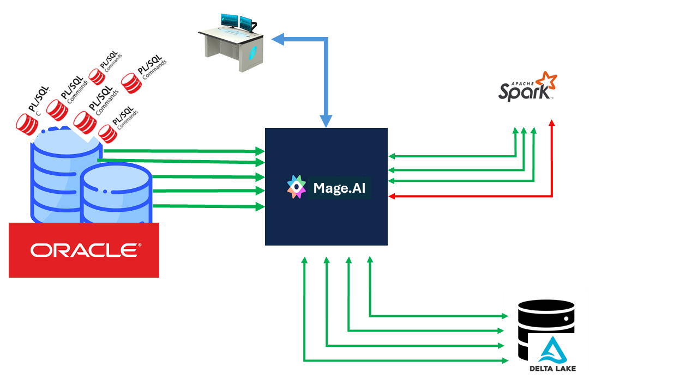
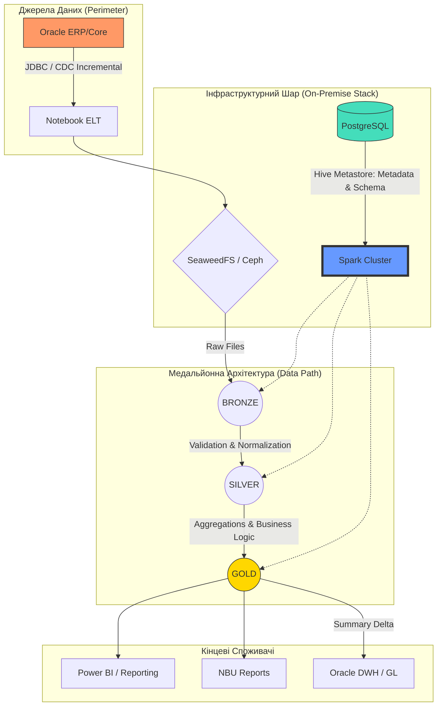

<!-- TOC BEGIN -->

- [1. Про що цей блог](#p-1")
- [2. Основні архітктурні стовпи  Delta Lake](#p-2)
- [3. Трошки екскурс в історію та порівнянь](#p-3)
- [4. Розглянемо типовий бізнес-кейс](#p-4)
- [5. Зберігання даних: Своя хмара в дата-центрі ](#p-5)
- [6. Що б вибрав особисто я  для банку, що не може йти в хмару, але хоче отримати швидкість Spark](#p-6)
- [7 ETL на базі Jupyter Notebooks](#p-7)
- [7.1. Прозорість та Керованість: Погляд Менеджера](#p-7.1)
- [8. Апеляція до розробників](#p-8)
- [9. З чого почати ORACLE розробнику](#p-9)


<!-- TOC END -->

## <a name="p-1">1. Про що цей блог</a>

В хмарі Azure є корпоративний продукт, що називається Microsoft Fabric. Це продукт, що може забезпечувати автоматизацію багатьох сторін роботи корпорації. Детальніше про нього можна почитати за лінком: [Get started with Microsoft Fabric](https://learn.microsoft.com/en-us/training/paths/get-started-fabric/).

Основою цього продукту є:

- Spark - обчислювальні ресурси в кластері, який можно динамічно нарощувати чи зменшувати.
- LakeHouse with Delta Lake, по суті це універсальна opensource платформа збереженя данних та побудови Data Lakes.
- Jupyter NoteBook - як основна платформа для кодігу програм і виконання програмних одиниць на pyhton.

На додатк там ще велика кількість інших продуктів Azure, що дозволяють поєднати в собі інтеграції, побудову звітів, контроль доступа. Але все це крутиться навколо обчислювального кластеру Spark та структур Delta Lake.

Основна ціль цього блогу спробувати пояснити, чому розробникам, що звикли проектувати додатки в середовищі корпоративних баз даних: ORACLE, MSSQL .... слід  серєйозно віднестися до SPARK да LakeHouse with Delta Lake при проектуванні  додатків.

Мені, як розробнику, що проектував і розробляв не один додатк в ORACLE Database дуже важко змінити логіку проектування на Delta Lake frendly.

Мій перший внурішній конфлік:  Не загубиться за яскравим маркетингом Microsoft Fabric. Різні конектори (Data Factory, Copy Tool, Pipelines) — це просто «шланги», якими тече вода (тобто качаються дані). Але якщо ви не збудували правильний «резервуар» (структуру Lakehouse), то ці шланги просто створять хаос і ваше озеро перетвориться в болото. Тому першочергово треба навичтися  будувати правильні структури даних в Lakehouse.

Мій другий внтуршній конфлік: змінити логіку думок і побудови алгоритмів, звичну нам для великих корпоративних баз даних, таких як ORACLE на логіку файлів Delta Lake

На справді ці «внутрішні конфлікти» — це загальний конфлікт між підходом Tool-oriented (орієнтованим на інструменти) та Architecture-oriented (орієнтованим на структуру).


Далі, в цьому блозі, я спробую довести, щому слід серйьозно віднестися до зв'язки Spark та LakeHouse with Delta Lake розробниками корпоративних пробуктів навіть, якщо ви не готові використати Microsoft Fabric чи віддати свої дані в хмару взагалі. Ну і трошки поясню архітектуру даних LakeHouse with Delta Lake 


## <a name="p-2">2. Основні архітктурні стовпи  Delta Lake</a>

Ось 3 стовпи, на яких тримається логіка проектування структури в Delta Lake:

1. Медальйонна архітектура (Логічне зонування)

Це не просто назви папок, це рівні якості та довіри до даних. Ми повинні проектувати не "таблиці", а "шлях даних":

- Bronze: Дані мають виглядати точно як у джерелі (навіть якщо JSON кривий). Це наша страховка.
- Silver: Тут відбувається  реляційна очистка. Видалення дублікатів, приведення типів, перевірка Master-Detail.
- Gold: Тут дані агреговані під конкретний звіт.

2. Партиціювання (Physical Design)

- В Oracle ми мали індекси. В Delta Lake головний інструмент швидкості — Partitioning (розбиття на папки) та Z-Ordering (сортування всередині файлів).
- Помилка проектування: Розбити дані по ID_платежу. (Отримаємо мільйон маленьких файлів, Spark "помре").
- Правильна логіка: Розбити по Рік/Місяць або Категорія_виробництва.

3. Ідемпотентність та Ключі

Оскільки Foreign Keys немає, ми проектуємо структуру так, щоб кожен крок трансформації був ідемпотентним. Тобто, якщо ми запустимо завантаження одного й того самого JSON 10 разів, структура таблиці має залишитися цілісною. Ми проектуємо логіку MERGE як фундамент стабільності.

В Oracle ми проектували структуру, щоб мінімізувати дублікати (Нормалізація). В Lakehouse ми часто проектуємо структуру так, щоб оптимізувати читання (іноді допускаючи денормалізацію), бо дискове сховище дешеве, а час роботи кластера Spark — дорогий.

4. Відсутність звичних для ORACLE  курсорів

Традицийний конфлікт розробника ORACLE:  В ORACLE я міг відкрити cursor і по записам пробігтися і виконати валідацію кожного запису, то в SPARK це антипаттерн. Пробігатися циклом по записах у Spark через .collect() або за допомогою Python-курсорів — це дійсно антипатерн, оскільки це вбиває розподілені обчислення і перетворює наш потужний кластер на один повільний комп'ютер.

## <a name="p-3">3. Трошки екскурс в історію та порівнянь</a>

Я років 10 писав розрахунок і подачу звітності з комерційних банків в НБУ, та ще і на FOXPRO 2.0. Потім спробували все це перевести на ORACLE (тоді був уже версії 10). Там зіткнулися з проблемами, коли materialized VIEW агреговані і не агреговані працюють повільніше за FoxPro, який зливає всі необхідні дані на машину користувача, послідовно сканує таблиці і готує агреговані дані, а потім це повертає в мережеві файли dbf уже агрегованих даних. Більш того, найнадійнішим варіантом в ORACLE було PL/SQL кодінг з деякою кількістю OLAP інструментів oracle та паралелізмом в запитах. Але там окрема проблема. ТАм запити кілометрові.

**Чому FoxPro здавався швидшим за Oracle?**

У FoxPro (як і в Clipper/dBase) панувала архітектура «навігаційного» доступу. Дані зливалися на клієнта, і локальний процесор «пережовував» їх послідовно. Це працювало швидко на малих та середніх об'ємах, бо не було оверхеду на керування транзакціями, блокуваннями та мережевим протоколом SQL-сервера.

Oracle — це «важкий» сервер. Коли ми робили Materialized View, Oracle намагався бути занадто розумним: перевіряв консистентність, оновлював індекси, стежив за Undo/Redo логами. А кілометрові запити на PL/SQL з'являлися тому, що ми намагалися запхати складну процедурну логіку в декларативний SQL.

**Чому Lakehouse (Fabric/Spark) — це "FoxPro на стероїдах"?**

Архітектура Lakehouse ідеологічно ближча до FoxPro, ніж до Oracle, але з потужністю тисяч серверів:

Сканування замість індексів: Як і FoxPro, Spark обожнює «проливати» через себе великі масиви даних (Full Table Scan). Але якщо FoxPro робив це одним потоком, то Spark робить це паралельно.

Розділення обчислень і зберігання: В Oracle диск і процесор «одружені». У Lakehouse дані лежать у Delta/Parquet (як наші старі добрі .dbf), а Spark-кластер — це тимчасовий «процесор», який накидається на ці файли, обробляє їх і відключається.

Логіка замість «магії» сервера: В Oracle ми надіялися на Optimizer. У Spark ми самі пишемо план (як у FoxPro): «Прочитай це, відфільтруй то, зроби Join». Це дає нам той самий контроль, який ми мали в 90-х, але на об'ємах у петабайти.

**Як Spark вирішує проблему «кілометрових запитів»?**

В Oracle ми писали один гігантський SELECT, бо кожен проміжний етап (таблиця) коштував дорого (I/O на диск). У Spark ми використовуємо DataFrames. Це дозволяє розбити «кілометровий запит» на 10 маленьких, зрозумілих кроків. Кожен крок зберігається в пам'яті (Lazy Evaluation), і Spark сам збирає їх у фінальний план виконання.


## <a name="p-4">4. Розглянемо типовий бізнес-кейс</a>

Є ядро банківської системи, яка "річ в собі" на базі ORACLE. Є приставка до цієї системи на іншій базі даних ORACLE, що називається DWH або  GeneralLdge. Її функція полягає:

- забрати з банківської системи в кінці дня інформацію;
- трансформувати і обрахувати все це так, щоб привести якомого ближче до стандартнів бух. обліку;
- трансформувати та обрахувати дані так, щоб вони підходили для формування банківської звітності для НБУ;
- дати можливість сформувати банківську звітність, та бачити помилки в параметрах рахунків, договорів чи в подальших агрегаціях.

Проблема в тому. що просто агрегацією (SELECT sum(), count() FROM ...) не обійдемося. Процес перекачки та обрахунку працює від службового користувача. Там кілька потоків розпаралелювання  та розпаралелювання на рівні запитів. Там куча курсорів і тисячі рядків PL/SQL.  Але проблема в тому, що воно вижирає всі процесори доступні для сервера ORACLE. Тобто на сервері ще є, але БД не бачить уже більше ніж якась їх кількість. Ну і значене дискове навантаження, таке: що на дисковій стійці  для всіх адмінів можна бограч приготувати. А ще мережеве навантаження, так як треба перелити гігабайти з одної бази даних в іншу.

Тепер поглянемо на це все з іншої сторони.

- Процес трансформації з опреативних даних в DWH виконується раз на день.
- Працює цей процес від години до 4 годин. Якщо більше, то це вже пробема взагалі.
- Цей процес за звичай запускається одним користувачем (часто служюовим) і в ньому відстуні конкуретні користувачі.
- Для того, щоб цей процес пройшов не більше ніж за 4 години ми тримаємо на постійній основі 2 дорогущих бази даних з запасми по  процесорам, пам'яті, дорогущим дискам і ліцензіям.

**Питання на подумати:**

Якщо нам не потрібна така дорогучща обчислювальна потужність 24*7 і база даних ORACLE  не виконує своїх основних функцій (мається на увазі обслуговування транзакцій від конкурентних користувачів), то може є сенс подумати про здешевлення всього цього, а саме:

- Extraction (Bronze): Oracle просто вивантажує плоскі файли чи щось подібне — це мінімальне навантаження на базу даних.
- Transformation (Silver): Весь той PL/SQL код, що "їсть" процесори, ви замінюєте на ваш Spark-код. Він працює паралельно, швидше і не заважає Oracle.

- Aggregation & Reporting (Gold): Ви формуєте звітність у Data Lake Delta.

- Feedback Loop: Тільки фінальні агрегати (готові проводки для GL) заносяться назад в Oracle або DWH.

Звичайно, досить легко можна підняти Spark  кластер в хмарі: Azure, IBM, AWS  і кожен з цих проіайдерів має S3-сумісний Object Storage  для збереження Delta-файлів.

Але, так як я торкнувся барнківської сфери, то хмара від гіперскейлерів, мабуть не варіант, тому розглянемо варіант побудови "своєї хмари" у власному банківському датацентрі.

## <a name="p-5">5. Зберігання даних: Своя хмара в дата-центрі</a>

Для роботи Spark  потрібно встановити десь сам Spark  кластер. Так як уже всі чули про Kubernets та Openshift то для банку, який вже використовує контейнеризацію, це найкращий варіант.

1. **Spark на Kubernetes/OpenShift (Найсучасніший шлях)**

**Як це працює:** Spark запускається як набір подів (pods). Коли приходить задача, Kubernetes створює Spark Driver та необхідну кількість Executors. Після завершення розрахунків ресурси звільняються.

**Плюси:** Ефективне використання "заліза", ізоляція ресурсів, легке масштабування. OpenShift додає до цього корпоративну безпеку та зручний інтерфейс.

2. **Spark на віртуальних машинах (Standalone Mode)**

Це простіший варіант, якщо у вас немає Kubernetes. Ви просто виділяєте кілька серверів (або віртуалок), ставите туди Java та Spark. Один сервер стає Master, інші — Workers.

**Плюси:** Мінімум "магії", все зрозуміло системним адміністраторам.

**Мінуси:** Менш гнучке керування ресурсами порівняно з K8s.

3. **Сховище (Де тримати Delta-файли?)**

В хмарі це S3 або ADLS. Локально - знадобляться аналоги:

Для того, щоб Spark міг працювати з Delta-файлами локально, нам потрібне сховище, що підтримує протокол S3. Хоча MinIO є популярним, для банківських систем варто розглянути альтернативи з більш лояльними ліцензіями:

- Ceph Object Gateway: якщо потрібна масштабованість рівня Enterprise.

- SeaweedFS: якщо пріоритетом є швидкість доступу до метаданих та простота підтримки.


4. **Використовувати PostgreSQL** як Hive Metastore (місце, де Spark зберігає список ваших таблиць silver_ledger, gold_balance).

Це дозволяє побудувати Data Lakehouse, який фізично не залишає периметр банку, але працює з гнучкістю хмарних рішень.

## <a name="p-6">6. Що б вибрав особисто я  для банку, що не може йти в хмару, але хоче отримати швидкість Spark:</a>

1. **SeaweedFS — Об’єктне сховище (Заміна S3/OneLake)**

Це фундамент. Spark не працює з "просто папками" на диску так ефективно, як з об'єктним сховищем.

Чому SeaweedFS: Вона неймовірно швидка для дрібних файлів (метаданих Delta), легша в налаштуванні за Ceph і має "чисту" Apache ліцензію.

Роль: Тут лежать наші Delta-файли (Bronze, Silver, Gold). Spark звертається до неї по протоколу S3.

2. **PostgreSQL — Каталог метаданих (Hive Metastore)**

Spark — це "мозок" без пам'яті. Йому потрібно десь зберігати визначення таблиць: де вони лежать і яка у них структура.

Роль: Виконує функцію Hive Metastore. Коли ми пишемо в коді spark.table("silver_ledger"), Spark йде в Postgres, за мілісекунду дізнається шлях до файлів у SeaweedFS і починає розрахунок.

Чому Postgres: Це найнадійніша база для зберігання метаданих, яка є в кожному банку.

3. **Spark на Kubernetes (K8s) — Обчислювальне ядро**

Це наш двигун, який ми винесли за межі Oracle.

Роль: Виконує важку роботу (Joins, Aggregations, Merges).

Еластичність: На час нічного закриття дня K8s виділяє Spark-кластеру, наприклад, 500 ГБ оперативної пам'яті та 100 ядер. Щойно баланс зійшовся — ресурси миттєво повертаються іншим системам банку.

**Як це працює разом (Схема взаємодії)**

- Extraction: Скрипт вивантажує дані з Oracle у SeaweedFS (як JSON/CSV).

- Trigger: Запускається Spark-job у Kubernetes.

- Metadata: Spark звертається до PostgreSQL, щоб знайти опис таблиць.

- Processing: Spark читає дані з SeaweedFS, перераховує баланси в пам'яті та записує результат назад у SeaweedFS у форматі Delta.

- Access: Аналітики підключаються до PostgreSQL (через Thrift Server) або читають фінальний Gold результат прямо з файлів для BI.


Це ідеальний технічний стек для "Приватного Lakehouse" всередині банку. Він повністю базується на Open Source, не потребує хмарних ліцензій і при цьому забезпечує Enterprise-рівень надійності.

Ось як можна структурувати цей розділ у вашому блозі, щоб пояснити роль кожного компонента:
Технічний стек "On-premise Lakehouse": Свобода від вендор-локу

Для тих, хто не може йти в хмару, але хоче отримати швидкість Spark, ми збираємо стек із перевірених компонентів:

1. SeaweedFS — Об’єктне сховище (Заміна S3/OneLake)

Це фундамент. Spark не працює з "просто папками" на диску так ефективно, як з об'єктним сховищем.

    Чому SeaweedFS: Вона неймовірно швидка для дрібних файлів (метаданих Delta), легша в налаштуванні за Ceph і має "чисту" Apache ліцензію.

    Роль: Тут лежать ваші Delta-файли (Bronze, Silver, Gold). Spark звертається до неї по протоколу S3.

2. PostgreSQL — Каталог метаданих (Hive Metastore)

Spark — це "мозок" без пам'яті. Йому потрібно десь зберігати визначення таблиць: де вони лежать і яка у них структура.

    Роль: Виконує функцію Hive Metastore. Коли ви пишете в коді spark.table("silver_ledger"), Spark йде в Postgres, за мілісекунду дізнається шлях до файлів у SeaweedFS і починає розрахунок.

    Чому Postgres: Це найнадійніша база для зберігання метаданих, яка є в кожному банку.

3. Spark на Kubernetes (K8s) — Обчислювальне ядро

Це ваш двигун, який ми винесли за межі Oracle.

    Роль: Виконує важку роботу (Joins, Aggregations, Merges).

    Еластичність: На час нічного закриття дня K8s виділяє Spark-кластеру, наприклад, 500 ГБ оперативної пам'яті та 100 ядер. Щойно баланс зійшовся — ресурси миттєво повертаються іншим системам банку.

Як це працює разом (Схема взаємодії)

    Extraction: Скрипт вивантажує дані з Oracle у SeaweedFS (як JSON/CSV).
    
    *Тут треба зазаначити, що ми не перекачуємо все щодня. Наш Notebook знає 'High Watermark' (останню оброблену дату) і просить у Oracle тільки нові записи. Це мінімізує мережевий трафік та навантаження на Redo Logs.*


    Trigger: Запускається Spark-job у Kubernetes.

    Metadata: Spark звертається до PostgreSQL, щоб знайти опис таблиць.

    Processing: Spark читає дані з SeaweedFS, перераховує баланси в пам'яті та записує результат назад у SeaweedFS у форматі Delta.

    Access: Аналітики підключаються до PostgreSQL (через Thrift Server) або читають фінальний Gold результат прямо з файлів для BI.

**Чому цей стек "зрілий"?**

- Лінійна масштабованість: Потрібно швидше? Просто додайте ще два сервери в кластер Kubernetes.

- Відсутність ліцензійних платежів: Ви платите за "залізо" та підтримку, а не за кількість ядер у ліцензії СУБД.

- Відкриті формати: Навіть якщо ви вирішите видалити Spark, ваші дані в SeaweedFS залишаться у форматі Parquet, який прочитає будь-яка сучасна система (наприклад, Trino або Presto).

Це архітектура, яка росте разом з банком, а не вимагає заміни сервера щоразу, коли кількість транзакцій подвоюється.


## <a name="p-7">7. ETL на базі Jupyter Notebooks</a>

Зважаючи на те, що розрахунки робляться Jupyter Notebooks лоічно було б і для ETL (ELT)  процесів використовувати цей інструмент. Ідея ця зовсім не нова, хоча я зню познайомився вперше в Microsoft Fabric,  але потім знайшов багато продуктів, які використовують цей же підхід.

Ми відмовляємося від розрізнених скриптів та закритих ETL-платформ. Використання Jupyter Notebooks (на базі **Papermill** або **Airflow** або **Mage.ai**) як рушія для вивантаження дозволяє:

- Бачити логіку вивантаження прямо в коді (Data Lineage).
- Використовувати потужність Spark для паралельного читання з Oracle.
- Легко тестувати процес вивантаження

Як варіанти:

1. **Пряме JDBC вивантаження через Spark (The "Simple" Way)**

Spark вміє підключатися до Oracle як до джерела. Ви просто створюєте DataFrame з SQL-запиту до Oracle і зберігаєте його як Parquet у ваше сховище.

**Плюс:** Це максимально просто і не потребує додаткових ліцензій

2. **Orchestration Tools (The "Enterprise" Way)**

Є продукти, які дозволяють керувати цими ноутбуками (запускати їх по черзі, відстежувати помилки):

- [Apache Airflow](https://airflow.apache.org/) / [Dagster](https://dagster.io/): Це "диригенти". Вони можуть запускати ваші Notebooks за розкладом.

- [Papermill](https://www.papermill.io/): Це цікавий інструмент, який дозволяє параметризувати та виконувати Jupyter Notebooks з командного рядка. Ви можете передати в ноутбук дату звітності, і він вивантажить дані саме за цей день.

- [Mage.ai](https://www.mage.ai/): 
**Чому Mage.ai?**
Це наступне покоління ETL-інструментів. На відміну від Airflow, Mage побудований навколо ідеї 'Data as a First-class Citizen'. Він візуалізує потік даних між блоками коду, дозволяючи бачити результат трансформації на кожному кроці, що робить налагодження банківських алгоритмів у рази швидшим.


На етапі Extraction ми не навантажуємо Oracle складними процедурами. Ми використовуємо легкий Notebook, який робить 'Select' по індексу (наприклад, по даті) і одразу перетворює дані у стиснутий формат Parquet. Це швидше за будь-який стандартний експорт у CSV, бо Spark може вивантажувати дані з Oracle паралельно (через кілька JDBC-з'єднань одночасно).

В окремиу чергу треба  **згадати про CDC (Change Data Capture)** продукти. Це коли ми не робимо Select з бази, а **читаємо логи Oracle (Redo Logs)**, щоб забирати зміни в реальному часі без жодного навантаження на CPU бази.
На приклад [Debezium](https://debezium.io/).


### <a name="p-7.1">7.1. Прозорість та Керованість: Погляд Менеджера</a>

Для керівництва IT-департаменту перехід на Spark та Mage.ai — це насамперед перехід від "хаосу скриптів" до "заводу даних".



Замість тисяч рядків PL/SQL, розкиданих по базі, ми отримуємо візуальний контроль над кожним кроком трансформації. Це дозволяє банку швидше реагувати на зміни в законодавстві чи вимогах НБУ, не ризикуючи "покласти" основну базу даних.


## <a name="p-8">8. Апеляція до розробників</a>

Тут я наведу діаграмку, яка відображає ідеальну архітектуру, що я пробував донести до читатів.


```    


**Опис ключових вузлів:**

- Oracle ERP/Core: Наша транзакційна база, яку ми більше не "катуємо" важкими запитами.
- Notebook ELT: Код на Python/Spark, який замінює закриті пропрієтарні "шланги" та інтеграційні продукти.
- Spark Cluster (Kubernetes/Openshift): Обчислювальне ядро, яке масштабується під навантаження і вивільняє ресурси банку після розрахунку.
- SeaweedFS/Ceph: S3-сумісне сховище, де дані лежать у відкритому форматі Parquet/Delta.
- PostgreSQL: Виконує роль "карти" (Hive Metastore), щоб Spark миттєво знаходив потрібні файли.
- Bronze/Silver/Gold: Рівні якості даних — від сирих копій до перевірених балансів.

**Пояснення архітектурних вузлів**

- Oracle ERP/Core (The Source): Першоджерело істини. Ми використовуємо інкрементальне вивантаження (Incremental Load), забираючи лише змінені записи за день, щоб звести до мінімуму I/O навантаження на продуктивну базу.

- Notebook ELT (The Logic): Програмний вузол на базі Jupyter Notebook. Він містить логіку підключення до Oracle та початкової структуризації. Це дозволяє уникнути "чорних скриньок" пропрієтарних ETL-інструментів.

- SeaweedFS/Ceph (The Private Cloud Storage): Локальне об’єктне сховище. Це "дно" нашого озера, де дані зберігаються у відкритому форматі Delta/Parquet. Це забезпечує незалежність від хмарних провайдерів та дотримання вимог банківської безпеки.

- Spark Cluster (The Compute Core): Розподілений "двигун" на базі Kubernetes. Він динамічно виділяє ресурси для важких Join-операцій та агрегацій, розвантажуючи процесори Oracle.

- PostgreSQL (The Brain/Metastore): Зберігає схеми таблиць та шляхи до файлів. Spark звертається сюди, щоб зрозуміти, як інтерпретувати набір файлів у SeaweedFS як реляційну таблицю.

**Як тут реалізована Ідемпотентність та Надійність?**

Для розробників Oracle, звиклих до транзакцій, ці пункти є критичними:

- Bronze (Raw Data): Кожен запуск ELT створює новий запис (Append). Якщо завантаження впало — ми просто видаляємо пошкоджені файли та запускаємо знову. Це наша "точка відкату".

- Silver (The Merge Point): Тут працює логіка UPSERT (Update + Insert). Навіть якщо ми помилково запустимо обробку одного й того самого дня двічі, команда MERGE в Delta Lake просто оновить існуючі записи новими значеннями, не створюючи дублікатів.

- Schema Enforcement: На відміну від старих Data Lakes, Delta Lake не дозволить записати "сміття" у Silver-шар, якщо структура даних не відповідає визначеній у Hive Metastore (PostgreSQL).

- Time Travel: Оскільки Delta зберігає логи транзакцій, ми завжди можемо подивитися стан балансів "на вчора" або "до того, як ми запустили цей бажний ноутбук", просто вказавши версію даних.


**У підсумку:**
Ми отримуємо систему, де код відокремлений від даних. Ми можемо повністю перевстановити Spark кластер або змінити версію Python, але наші дані в SeaweedFS та їхні описи в Postgres залишаться цілими. Це і є та сама "архітектурна зрілість", до якої ми прагнемо.

Oracle розробник не пересає бути розробником. Він просто розширяє свій горизонт іншими сучасними інстументами, виносячи обчислення, які не дуже притаманні базам данних на інші інстументи. Це, я б сказа, можливість дуже різкого переходу осучаснити свої навички і зробити їх досить універсальними. 


## <a name="p-9">9. З чого почати ORACLE розробнику</a>


**Щоб почати вичати Spark**, та все що зним пов'язано не потрібно розгортати всю цю інфраструктуру. 
Для почтаку достатньо одного-трьох контейнерів з Spark та jupyter lab.
Більш того, я чомусть впевенний, що пілсівши на ці інструменти розробники і свою рутину можуть перевести на Jupyter Notebook (Jupyter Lab).

Для почтаку можна використати Porable Juptyter Lab [Winpython](https://winpython.github.io/). Тут Spark  немає, але дуже зручна платформа вивчити pyhton  кодинг і Jupyter Notebook.

В якості інтеграційної тули для якихось  ETL  процесів можна використати плагін до Jupyter Lab, ща називається [elyra](https://elyra.readthedocs.io/en/stable/getting_started/installation.html) і в Docker [elyra in Docker](https://elyra.readthedocs.io/en/latest/getting_started/installation.html#pulling-elyra-container-images).

Коли ви відчуєете,  що готові працювати зі Spark, то використовуємо Docker containers [/jupyter/pyspark-notebook](https://hub.docker.com/r/jupyter/pyspark-notebook).

Як розгонути та налаштувати описано за лінком на github: [sh-jpylab-spark](https://github.com/pavlo-shcherbukha/sh-jpylab-spark/blob/main/README.md). Там же побудовано кілька прикладів викорситання Spark.