<!-- TOC BEGIN -->

- [1. ](#p-1")
- [2. ](#p-2)
- [3. ](#p-3)
- [4. ](#p-4)
- [5. ](#p-5)
- [6. ](#p-6)
- [7. ](#p-7)


<!-- TOC END -->

# Why Microsoft Fabric’s Copy Data Templates Might Fail Your Production ETL (And How to Fix It)

Many people start learning Fabric with Microsoft's templates (Copy Data), but they are designed for demos. In real life (especially in fintech or banking systems) we deal with unstable structures, duplicate files, and the need for full idempotence (so that re-runs don't break the data).

<kbd>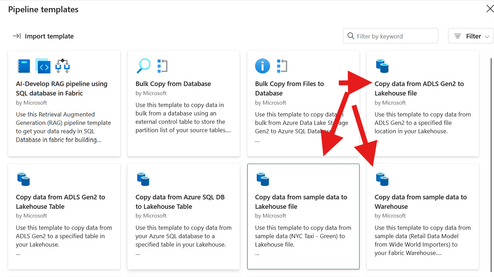</kbd>
<p style="text-align: center;"><a name="pic-p1-01">pic-p1-01</a></p>

In very simple cases, a variant of Microsoft templates (Copy Data) can be used. But this approach has a large number of disadvantages. I will describe the disadvantages that I see when using regular CopyData when processing files:

- There is no possibility to track the origin of the data, that is, from which source and with which specific file a particular version of the data came.

- It is possible to overwrite files during reception, as reading files is non-blocking.

- There is no processing or copying of files to the archive after receipt.

This makes the system unstable in case of an error if you delete the file after receiving it. And if you do not delete the file and run the pipeline on schedule, then if no data is received, the same version of the data will be received, causing excessive resource consumption and fragmentation of tables due to constant deletion of previous data. And most importantly, the previous version of the data may conflict with already received data from other sources, which you will notice already at the stage of building the storefront or updating the semantic model.

- The process is not fully automated, namely: the file reception pipeline should be started when the files have arrived.

You can run the pipeline manually. But it is not fully automated. If you run the pipeline on a schedule, what should you do if the files arrive after the scheduled time?

I'll try to give a real-life example to explain.

1. Example 1.

You have Fabric. You are a large enterprise with a large number of different wholesale consumers of your products. Every day they send you sales reports in files, for each point of sale. And for the company they also send files with a list of their points of sale: which ones are working, which ones have closed, and which new ones have opened. And you need to load all these data fragments into the Lake House table to build analytics data showcases.

The problem is that even if you agree with the wholesale consumers of your product, other words, with data providers, that all files must be sent by 5 p.m., the human factor will come into play when someone makes a mistake and sends a file. Someone even forgets to send it. The problem is further complicated by the fact that to build a data showcase, you must have at least 2 files:

- a file of point of sale;
- a file of sales from these point of sale,

from each wholesale consumer. And the showcase can be built only when both current files are available. And to start the calculation of showcases even at the Silver level, you must know for sure that you have received all the files. And if you have not received them, you must know the list of "culprits" and "push" them, possibly via e-mail, SMS, chat messages.
Thus, the option with Copy Data given in the pipeline examples does not solve all these problems.

2. Example 2.

You have Fabric and you are the owner of a network of payment terminals or ATMs or POS terminals, or their tenant. And you receive files with transactions that were carried out in them at frequent intervals, or once a day. At the end of the day (or better during the day) you have to process all this and build storefronts for transactions in payment devices. Then calculate the commission or income from these devices, or make a payment quality or calculate (forecast) the loading of ATMs with cash.


Using the Microsoft template (Copy Data), you cannot determine which file a particular piece of data came from. Payment terminals or ATMs may stop providing data simply because the Internet or power supply has gone out and you will not notice it. And if you are a tenant of these devices from a service company, then there will be the same problems as in example 1 about retail outlets: not sending, not sending on time, forwarding files with transactions - even forwarding with data changes.

And again, the Copy Data option given in the pipline examples does not solve all these problems, but rather does more harm, because receiving poor-quality data is worse than not receiving it at all.

Another negative side is that IT staff (data engineers) will be constantly involved in the file processing process, manually correcting data, which carries the risk of turning data into garbage. Imagine when at a critical moment an IT specialist writes an update a little incorrectly, not out of malicious intent, but because the person is worried and in a hurry to fix something. The result of such a data update can lead to unexpected problems.

Therefore, I tried to develop the concept of building a system that provides event-driven file reception and is transparent throughout the entire data transformation path, up to the SILVER level, and create a working prototype.


## High-level concept of file processing

The high-level diagram is shown in the figure [pic-p1-101](#pic-p1-101)

<kbd>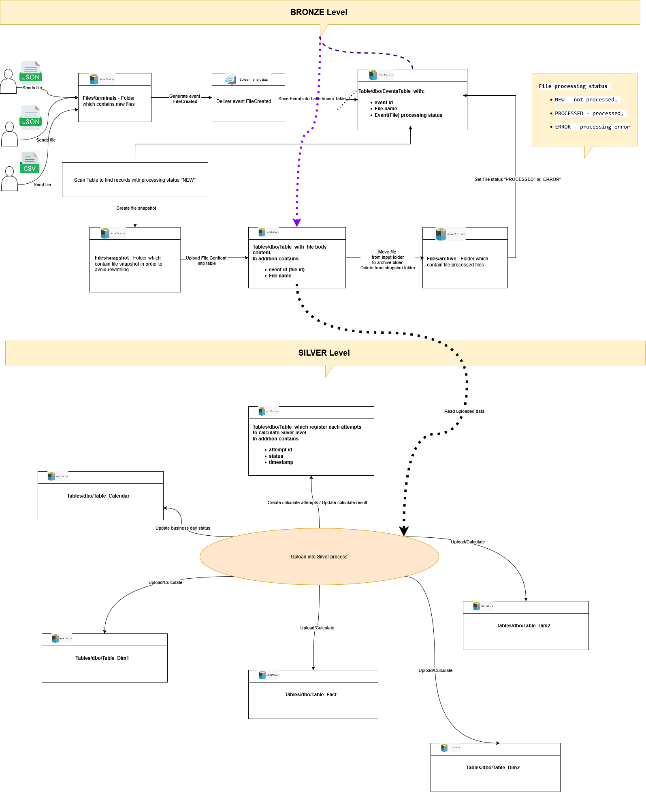</kbd>
<p style="text-align: center;"><a name="pic-p1-101">pic-p1-101</a></p>


To fully automate file processing, the Azure OneLake feature was used - to generate a [Fabric OneLake Events](https://learn.microsoft.com/en-us/fabric/real-time-hub/explore-fabric-onelake-events?toc=/fabric/onelake/toc.json&bc=/fabric/onelake/toc.json#onelake-events-profile) event when a file is created.

<kbd>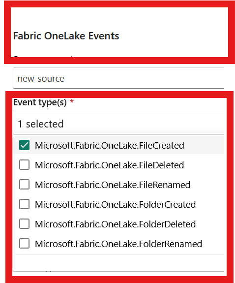</kbd>
<p style="text-align: center;"><a name="pic-p1-02">pic-p1-02</a></p>

with the schema (message structure):

<kbd>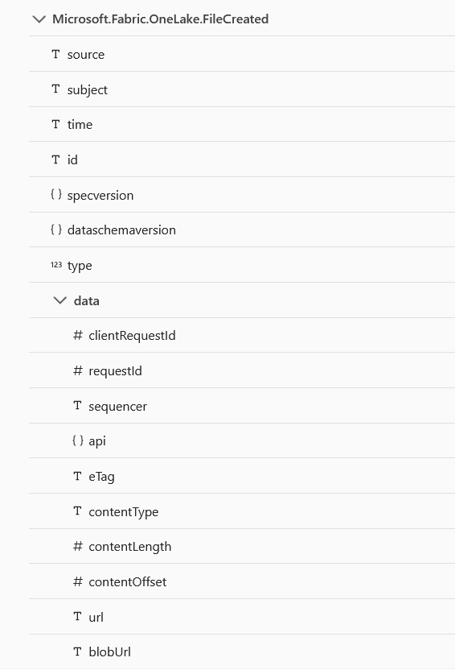</kbd>
<p style="text-align: center;"><a name="pic-p1-03">pic-p1-03</a></p>


In this case, it is enough to use the Event **Microsoft.Fabric.OneLake.FileCreated**, which means: "Raised when a file is created or updated in OneLake." If you receive and process this event via the Fabrivc Eventstream, the system will automatically receive a signal about the arrival of a new file. When we receive this event via the Fabric Eventstream in the structure described in the following table: [Schemas](https://learn.microsoft.com/en-us/fabric/real-time-hub/explore-fabric-onelake-events?toc=/fabric/onelake/toc.json&bc=/fabric/onelake/toc.json#schemas) and as shown in [pic-p1-03](#pic-p1-03), there are several ways to process it [pic-p1-04](#pic-p1-04):

<kbd>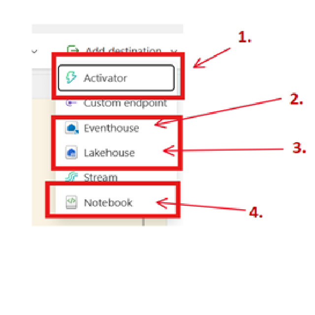</kbd>
<p style="text-align: center;"><a name="pic-p1-04">pic-p1-04</a></p>


1. **Activator**

A very interesting trigger that can be used to duplicate the same message to different sources. But I ran into two problems: It doesn't "see" the message schema if some transformation is performed before **Activator**; If you call notebook or pipline with it, there is a high probability of losing some messages (with very fast arrival), because these elements take a long time to run. Fast arrival means that you have marked 8 files, for example, 8 events were generated in one second, but notebook was started only 2 times. And when a file arrives once every 1-2 minutes, then everything is fine.
I don't like this behavior, and I rejected this approach.

2. **Eventhouse**

It is quite acceptable, but it makes sense to use it when you receive a constant stream of events from sensors (IOT) at a rate of 1-2 messages per second. For receiving files, I consider using a separate database redundant.

3. **Lakehouse**

This turned out to be the most acceptable option. In options 2 and 3, the structure of the table where messages from Eventstream are recorded is the same. To receive files, the LakeHouse table is enough. An acceptable option.

4. **Notebook**

If you call notebook with it, there is a high probability of losing some of the messages (with very fast arrival), because these elements take a long time to launch. Fast arrival means that you marked 8 files, for example, 8 events were generated in one second, but notebook was launched only 2 times. This was obtained in experiments, so this behavior does not suit me, and I rejected this approach.


Thus, having considered 4 options for message receivers, I rejected all options for processing messages "on the fly", as they were not redundant, and by running notebook I confirmed the unreliability of this approach. Therefore, I stopped at registering events in the database, namely: I used the Lakehouse table to register events.

Several service fields are added to the events table:

- file processing status ("NEW" - not processed, "PROCESSED" - processed, "ERROR" - processing error);

- date and time of the last status change.

Next, when the event is registered in the table, you can start the pipline, which will scan the table using the Lookup Activity and search for unprocessed records (record status "NEW") and then signal notebook to process the files.

Notebook will work like this:

1. In the table of registered events, the record status is changed to PROCESSING

2. Makes a snapshort of the file to be processed, copying the original file from the input directory to a special directory snapshort and already from this directory opens the file and reads its contents. This to some extent insures against overwriting the original file when receiving a new version of the same file.

3. When reading, the file contents are written in the fastest way to a table, the structure of which corresponds to the structure of the file contents. This table has several service fields:

- file name;

- file id, which coincides with the message id from the table of registered events in Lakehouse and is a kind of natural unique file identifier, allowing you to determine file versions, even with the same name;

- date and time of insertion of the record, which is simply a protocol field.

It is important to note here that we do not delete old data and insert new ones. This is not productive, especially on large files. We use SPARK Merge and if we delete, then only after verifying that the new file really does not contain any records.

4. When the file is read, the original file from the input directory is transferred to the archive directory and deleted from the input directory, and the file from the snapshort directory is simply deleted.

5. In the table of registered events, the record status changes to PROCESSED. If an error occurs during the process of receiving files, the record status changes to ERROR.

In this way, you can ensure fast reception of files with their writing to the database at high speed. Let's imagine that some problem arose at the stage of receiving files, for example, there is not enough dimension of the field to write a number to the table. You fixed the problem, but the file needs to be accepted again. You simply copy the problematic files from the archive directory to the input directory, a new event is generated and the files are processed according to the same process without manual manipulations.

Thus, at the first stage, we form the BRONZE level, the components of which are the log of incoming events (aka file log) and a table with the contents of the files.

**The next step is to convert RAW file data into SILVER level business entities**.

Typically, file processing is divided by business days or operating days. Therefore, at this stage, a business day calendar and a data upload table to the SILVER level are required. This will allow you to partition data by day and track errors when uploading data on a separately selected business day.

Each upload has its own id, for example, UUID and the status STARTING, SUCCESS, ERROR. If several files are required to form the SILVER level, then before uploading, the presence of all the necessary files is monitored, and if not all files are present, then the reason why the upload did not start is noted.

Well, then the display case calculation is started. Again, we do not delete and replace the data in the display case, but perform a merge. And each record in the fact table or in the Dimension has service fields, with the upload id and the timestamp of the record insertion.

After the SILVER level is formed, the data quality check process is started. At least check the number of records in the files and in the fact table, and check for the absence of null in the Dimensions fields.

## Technical implementation

For technical implementation, [pic-p1-06](#pic-p1-06) shows the structure of input directories.

<kbd>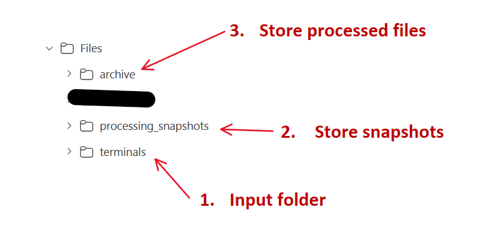</kbd>
<p style="text-align: center;"><a name="pic-p1-06">pic-p1-06</a></p>

This way the files end up in the **terminals** input directory. During the reception process the snapshot file is copied to the **processing_snapshots** directory. When the file is accepted it is moved to the **archive** directory.

[pic-p1-07](#pic-p1-07) shows the structure of the table that is the receiver of messages. 2 additional fields have been added to the table to record the processing status of the message - file.

<kbd>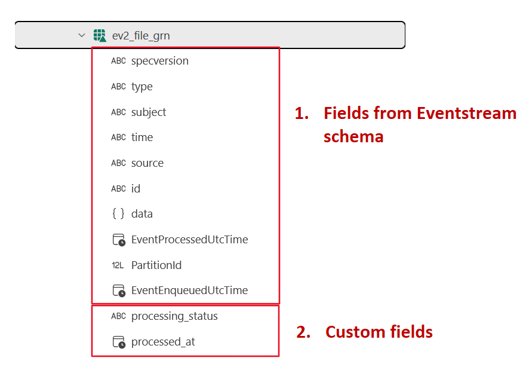</kbd>
<p style="text-align: center;"><a name="pic-p1-07">pic-p1-07</a></p>


### Eventstream settings

The technical implementation of event logging is shown in [pic-p1-05](#pic-p1-05)

<kbd></kbd>
<p style="text-align: center;"><a name="pic-p1-05">pic-p1-05</a></p>


1. **new-source** - Getting an event

This is where the event is received and properly filtered.

<kbd>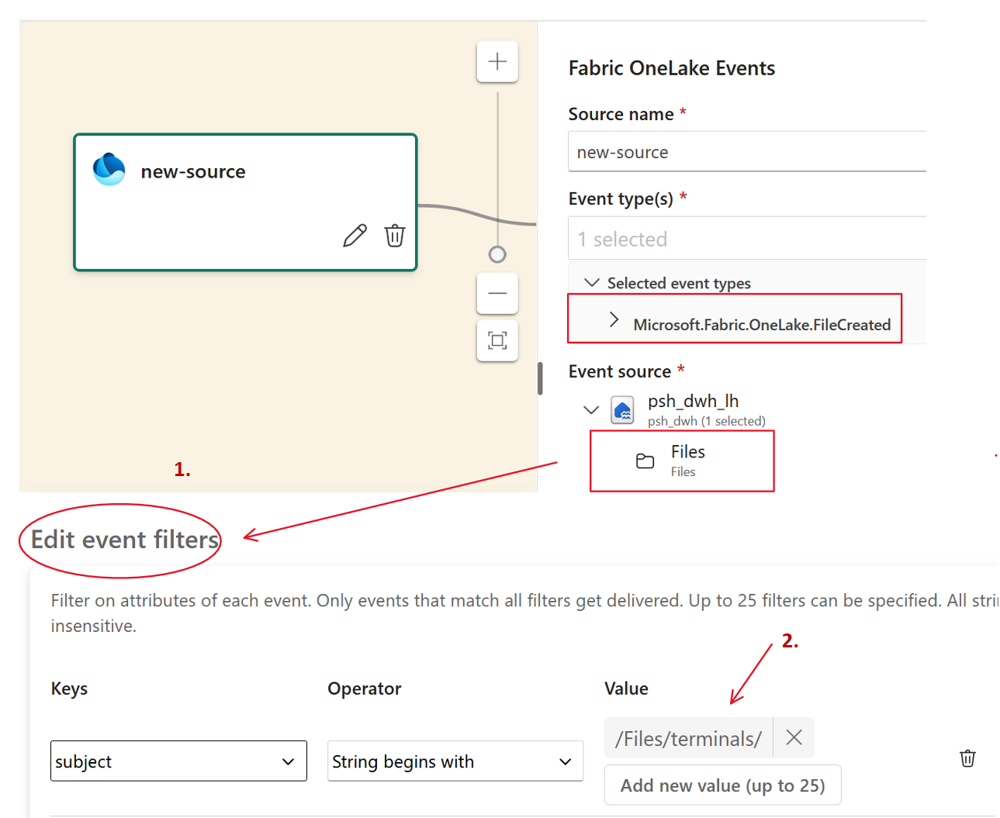</kbd>
<p style="text-align: center;"><a name="pic-p1-08">pic-p1-08</a></p>

You need to pay attention to the directory and file mask settings. If you leave it just /Files, events will be generated for all file actions. That is, if you create a file in the snapshot directory, you will receive an event. Therefore, it is better to configure a filter to definitely not receive unnecessary events.


2. **psh_dwh_ev-stream** - Eventstream

There is nothing to configure here.


3. **CreateLogFields** - message transformation

This node performs message transformation. In this node is added two additional fields and filling them.  So thees fields and  theirs values immediately enter the table of saved events fullfilled.

<kbd>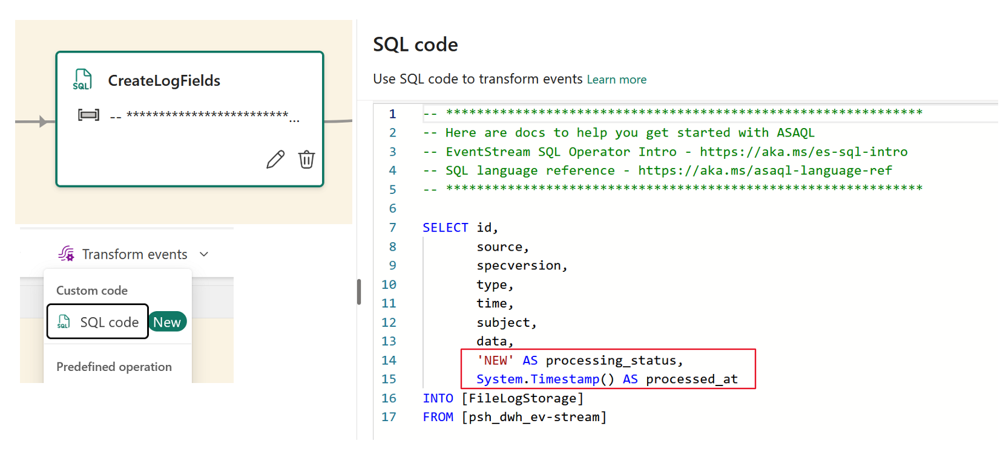</kbd>
<p style="text-align: center;"><a name="pic-p1-09">pic-p1-09</a></p>

Two fields are added:

- **processing_status**, file processing, which is immediately filled with the status value "NEW".

- **processed_at**, astronomical time of status change.

```text
    'NEW' AS processing_status, 
    System.Timestamp() AS processed_at 
```

4. **File Log Storage** - the table  to store  a file body (file content)

The figure shows where the event from the eventstream is stored.

<kbd>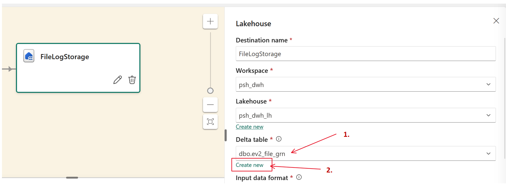</kbd>
<p style="text-align: center;"><a name="pic-p1-10">pic-p1-10</a></p>

It is important to note here that you can create a table automatically by clicking "create new" (2) or use an existing one. I created mine because I added two additional fields:

```py
        print(f"Create Table dbo.ev2_file_gr")
        spark.sql("""
        CREATE TABLE dbo.ev2_file_grn (
        specversion STRING,
        type STRING,
        subject STRING,
        time STRING,
        source STRING,
        id STRING,
        data STRUCT<
            api: STRING,
            clientRequestId: STRING,
            requestId: STRING,
            eTag: STRING,
            contentType: STRING,
            contentLength: BIGINT,
            contentOffset: BIGINT,
            blobUrl: STRING,
            url: STRING,
            sequencer: STRING
        >,
        EventProcessedUtcTime TIMESTAMP,
        PartitionId BIGINT,
        EventEnqueuedUtcTime TIMESTAMP,
        processing_status STRING,
        processed_at TIMESTAMP
        )
        USING DELTA;     
    """
    )
    print(f"Table created")

```

### Configuring PipeLine to receive files

The pipeline for receiving files with the Lookup Activity query setup is shown in [pic-p1-11](#pic-p1-11).

<kbd>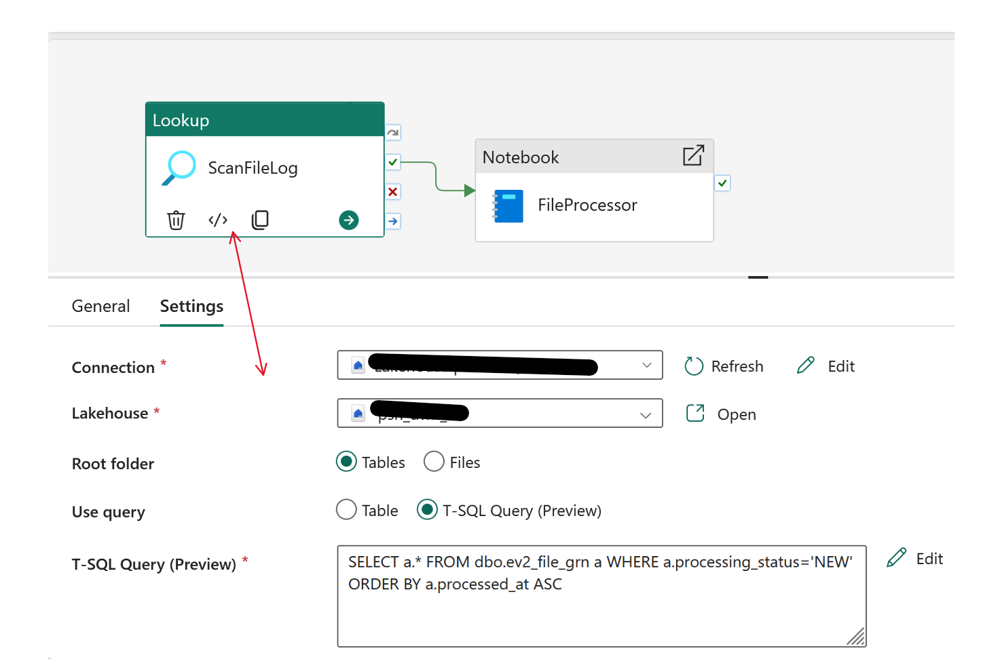</kbd>
<p style="text-align: center;"><a name="pic-p1-11">pic-p1-11</a></p>


The output of the Lookup Activity will be JSON with the following structure if the "First row only" checkbox is unchecked.


```json
{
	"count": 1,
	"value": [
		{
			"specversion": "1.0",
			"type": "Microsoft.Fabric.OneLake.FileCreated",
			"subject": "/Files/terminals/10546_2025-06-28.json",
			"time": "2026-05-06T07:03:10.5474693Z",
			"source": "/tenants/b-1-a/workspaces/5ccc4/items/1add63c",
			"id": "a6264859-a987-4364-a46a-a8fe1ee2e3ab",
			"EventProcessedUtcTime": null,
			"PartitionId": null,
			"EventEnqueuedUtcTime": null,
			"processing_status": "NEW",
			"processed_at": "2026-05-06T07:03:11.078Z"
		}
	
	]
}

```

Accordingly, the following Activity notebook accepts the "count" parameters from this json [pic-p1-12](#pic-p1-12).

<kbd>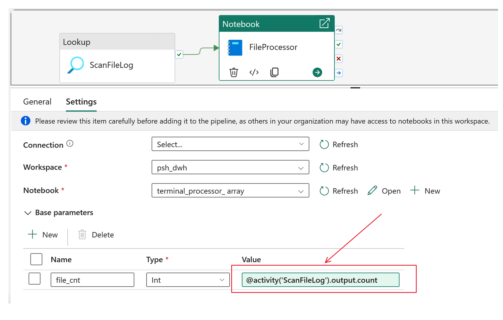</kbd>
<p style="text-align: center;"><a name="pic-p1-12">pic-p1-12</a></p>


 Parameter is passed through expression [Expressions and functions in Azure Data Factory and Azure Synapse Analytics](https://learn.microsoft.com/en-us/azure/data-factory/control-flow-expression-language-functions).

And notebook accepts it [pic-p1-13](#pic-p1-13):

<kbd>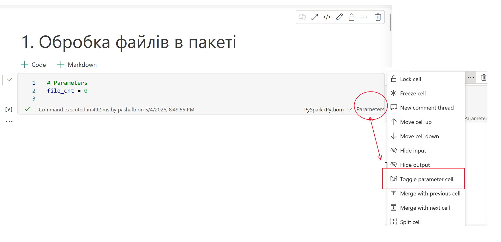</kbd>
<p style="text-align: center;"><a name="pic-p1-13">pic-p1-13</a></p>

But there is a nuance. In NoteBook, you can only pass simple parameters: STRING, INT, BOOLEAN, FLOAT. That is, you cannot pass a JSON structure and you cannot pass a list. You can pass one file, you can pass one field from an array of objects. But processing one file at a time is very inefficient in Spark. Therefore, the LookUp Activity itself is used as a signal that there are unprocessed files. And at the notebook level we understand what exactly has not been processed.
Therefore, the file_cnt parameter is passed from JSON with the count attribute.

```text

file_cnt = @activity('ScanFileLog').output.count
```

#### File processing

Here I will show the basic Flow with Notebook

```py
import json
import os

# dictionary  which nitebook returns as return value into pipline
result_data = {

    "status": "Success",
    "count": 0,
    "error": None    
}
counter=0
all_files=[]

try:
    print(f"Get list  of new files: {file_cnt}")
    df_queue = spark.sql("SELECT subject, id FROM ev2_file_grn WHERE processing_status = 'NEW' ORDER BY processed_at ASC")
    file_list = df_queue.collect()
    if not file_list:
        print("The Queue is empty!.")
        result_data["status"] ="Success"
        mssparkutils.notebook.exit(json.dumps(result_data))
    for item in file_list:
        file_path = item["subject"]
        context_id = item["id"]        
       
        print(f"Process file: {file_path}")
              raw_path = file_path.strip()
          if raw_path.startswith("/"):
            source_path = raw_path[1:]
        else:
            source_path = raw_path
        snapshots_dir = "Files/processing_snapshots"
        print("Create folder if it does not exists")
        if not mssparkutils.fs.exists(snapshots_dir):
            print(f"Create folder: {snapshots_dir}")
            mssparkutils.fs.mkdirs(snapshots_dir)
        else:
            print(f"The  {snapshots_dir}  exists")

        print("Copy faile for recieving")
        if source_path:
            print( "Create menporary file name")
            file_name = os.path.basename(source_path)
            snapshot_path = f"{snapshots_dir}/snap_{file_name}"
            print(f"Copy file from !{source_path}! to !{snapshot_path}!")
            mssparkutils.fs.cp( source_path, snapshot_path)
            print(f"Start file processing from snapshot: {snapshot_path}")
            all_files.append( {
                    "file_name": file_name,
                    "id": context_id,
                    "source_path": source_path,
                    "snapshot_path": snapshot_path
                }
            )

        counter+=1

    print("Read all Files....")  
    read_files(all_files)
    print("Read all files-ok")   

    print(f"Set status porocessed....") 
    set_status_processed(all_files)
    print(f"Set status porocessed - ok") 

    print("Move to archive....")
    archive_processed_files(all_files)
    print("Move to archive - ok")

    result_data["status"]="Success"     
    result_data["count"]=counter
except Exception as e:
    print(f"processing error : {e}")
    result_data["status"] = "Error"
    result_data["error"] = str(e)

# return result frimom notebook  
mssparkutils.notebook.exit(json.dumps(result_data))  
```

What useful thing can be gained from this fragment?

1. To work with files, the python package [mssparkutils.fs](https://learn.microsoft.com/en-us/fabric/data-engineering/microsoft-spark-utilities) is used. This is very important for performing file operations, because it uses the OneLake API under the hood, which is quite fast.

2. Notebook can return values. And not only simple types, but also complex types, such as a dictionary [Notebook utilities. Exit a notebook](https://learn.microsoft.com/en-us/fabric/data-engineering/microsoft-spark-utilities#exit-a-notebook).

The only thing to pay attention to here: **mssparkutils.notebook.exit** interrupts notebook execution at the point where it is called. And it throws an exception itself, so it is not independently called at the very end, approximately like a finally block.
 
Below is an example of a service function that performs a merge into a table of contents of files.

```py
from pyspark.sql.functions import input_file_name, regexp_extract, col, when, sum, count, substring, lit, coalesce, sequence, expr
def read_files(all_files):
    """
       Read files accirding to the list into table with files body. 
       File id is the same as id in  table -  event storage
    """
    target_table = "dbo.ev2_file_body"
    print(f"Start processing {len(all_files)} files...")

    # Create empty DataFrame with first file or empty DataFrame 
    combined_df = None

    for file_info in all_files:
        path = file_info["snapshot_path"]
        context_id = file_info["id"]
        # Read exact file
        temp_df = spark.read.json(path)
        # Add metadata int DataFrame
        temp_df = temp_df.withColumn("file_name", lit(file_info["file_name"])) \
                         .withColumn("file_id", lit(context_id))
        
        if combined_df is None:
            combined_df = temp_df
        else:
            combined_df = combined_df.unionByName(temp_df, allowMissingColumns=True)

    if combined_df:
        combined_df.createOrReplaceTempView("v_batch_incoming_data")

        # Create MERGE, now add FILE_ID
        spark.sql(f"""
            MERGE INTO {target_table} AS target
            USING v_batch_incoming_data AS source
            ON target.TX_ID = source.TX_ID
            WHEN MATCHED THEN
                UPDATE SET 
                    target.STATUS = 'UPDATED', 
                    target.FILE_NAME = source.file_name,
                    target.FILE_ID = source.file_id
            WHEN NOT MATCHED THEN
                INSERT (TX_ID, TERMINAL_ID, OPDATE, NAME, PASSPORT, AMOUNT, CHARGE, STATUS, FILE_NAME, FILE_ID)
                VALUES (source.TX_ID, source.terminal, source.opdate, source.name, source.passport, 
                        source.amount, source.charge, 'NEW', source.file_name, source.file_id)
        """)

        print("MERGE completed!.")
       
```

And at this stage, the file processing work is complete.

### Pipline for calculating the SILVER level.

This is the key moment when raw BRONZE level data is transformed into SILVER business entities:

- Dimension,

- таблицю фактів,

In the future, this will allow building semantic models and the GOLD level
The pipeline looks like in pic [pic-p1-14](#pic-p1-14):

<kbd>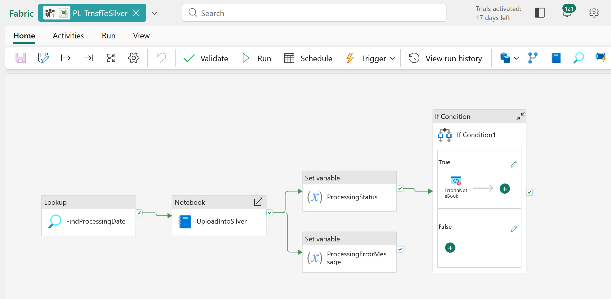</kbd>
<p style="text-align: center;"><a name="pic-p1-14">pic-p1-14</a></p>


If in the previous pipeline, where files are received, I only mentioned that Notebook returns the result of the work. Here in the current one, I showed the mechanism how to process the result, and determine when an error occurred, then raise the error to the pipeline level. If this is not done, then by catching the exception in the code and even returning the result with an error message, the output result must be processed correctly. If this is not done, then Notebook worked successfully, and the pipeline completed successfully, regardless of what result you returned. Schematically, how the transformation occurs is shown in [pic-p1-15](#pic-p1-15):

<kbd>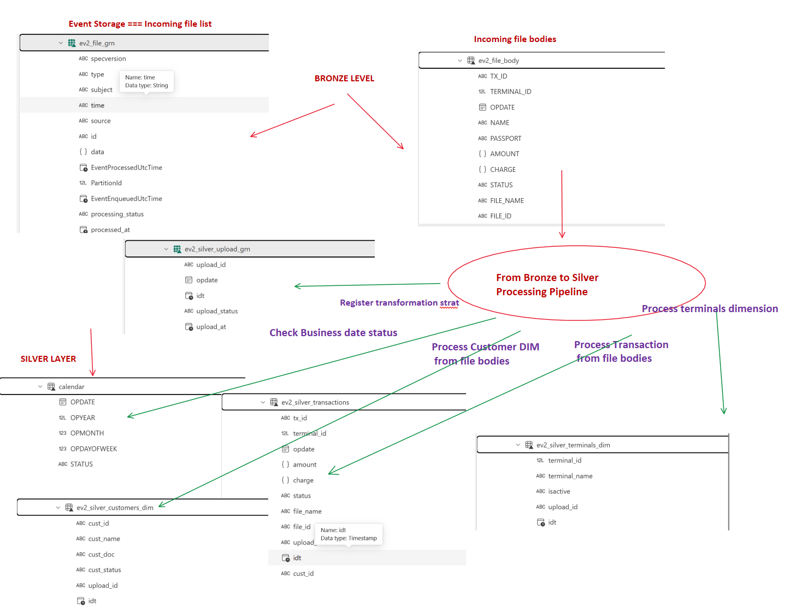</kbd>
<p style="text-align: center;"><a name="pic-p1-15">pic-p1-15</a></p>


The first interesting thing is FindProcessingDate. In contrast with previous Lookup Activity, this activity trying to find the first open busints date i calendar. So, the check box "Firs row only" is on. In pay attantion that JSON shema  outpu valuse is diffrent [pic-p1-18](#pic-p1-18).


<kbd>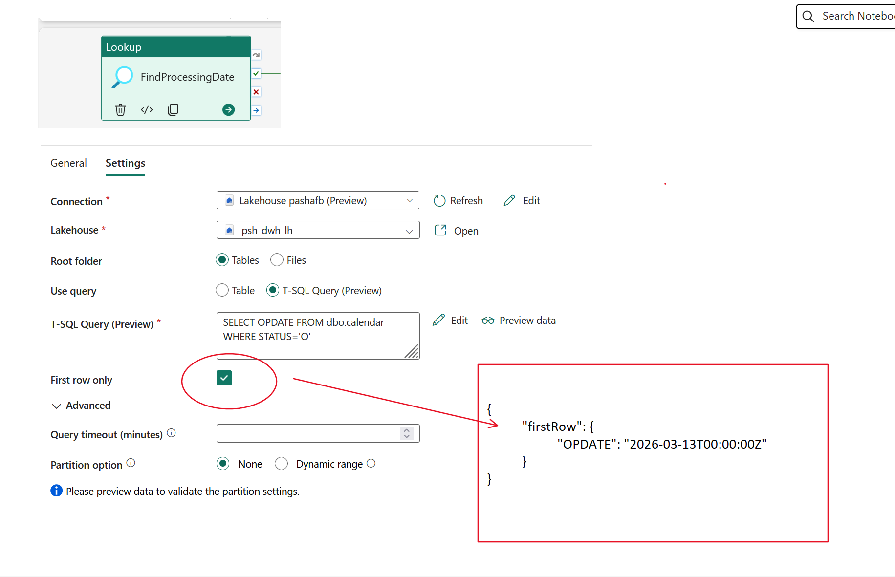</kbd>
<p style="text-align: center;"><a name="pic-p1-18">pic-p1-18</a></p>


Так як змінилася структура вихідного повідомлення в Lookup Activity, то  міняється і його передача в Notebook activity [pic-p1-19](#pic-p1-19).

<kbd>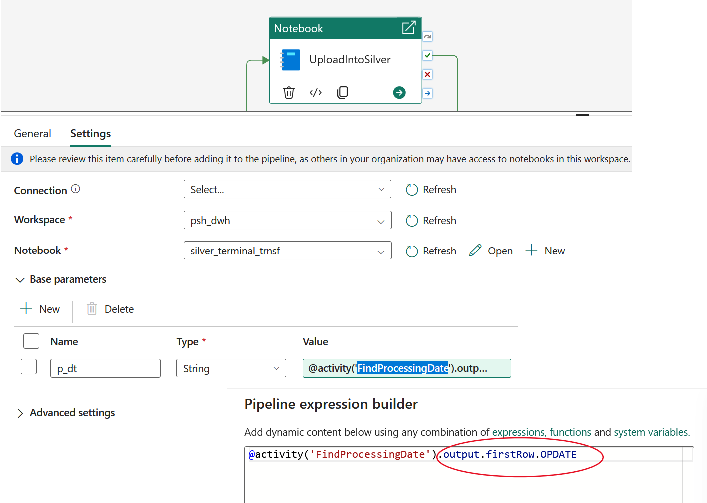</kbd>
<p style="text-align: center;"><a name="pic-p1-19">pic-p1-19</a></p>


**Let explore notebook.**

Each notebook cell has its own title and purpose. Even by looking at the title bar, it is clear what it does and in what order the cells are executed.

```text
    Table of Contents
    Transformation of data on Terminals from Bronze to Silver.
    1. Service functions
    2. Main processor
    2.1. Create a new record about the start of processing
    2.2. Load the terminal directory
    2.3. Load the customer table
    2.4. Load transactions
    2.5. Final loading process
```


In cell "2.1. Create a new record about the start of processing" is shown

- dictionary **result_data**, which return value.  
- variable **continue_processing = True** is used to control notebook flow. In case this variable has False value, the process terminating and **result_data** will be returned.

```py
up_opdate = p_dt
continue_processing = True
result_data = {
    "status": "Error",
    "error": None,
    "upload_id": None,
    "upload_opdate": None    
}

if up_opdate == "" or not up_opdate:
    continue_processing = False
    result_data["status"] = "Error"
    result_data["error"] = "Не знайдено жодного відкритого дня OPDATE" 

if not continue_processing :
    mssparkutils.notebook.exit(json.dumps(result_data))

try:
    up_id=init_upload(up_opdate)
    result_data["upload_id"] = up_id
    result_data["upload_opdate"] = up_opdate

except Exception as e:
    print(f"Помилка обробки : {e}")
    continue_processing = False
    result_data["status"] = "Error"
    result_data["error"] = str(e)     

```

In cell " 2.3. Load the customer table" is shown how  is building the customer dicitonary.

Тут треба звернути  увагу на дві речі:

-  Додаткова перевірка змінної **if not continue_processing**.

- Item ""2. Generate UUID in advance for the entire set""". As usual, there is a great desire to include the UUID generation in **merge**. But **merge** does not work with values ​​that change during its execution. Therefore, we quickly generate the UUID for the entire DataFrame, and then we do **Merge** with the specified values

```py
if not continue_processing :
    mssparkutils.notebook.exit(json.dumps(result_data))

try:

    # I select customers from transactions by date
    # and merge into the customers table
    print("Customer table refresh")
    
   # get upload parameters
    cu_up_id = result_data["upload_id"] 
    cu_up_opdate = result_data["upload_opdate"] 
    cu_idt_ts = datetime.now()

    cu_target_table="psh_dwh_lh.dbo.ev2_silver_customers_dim"
    cu_source_table="psh_dwh_lh.dbo.ev2_file_body"

    print("Updating the customer table - forming a customer buffer from transactions....")
    # forming a customer dataframe from the file body table by transactions using cu_up_opdate

    cu_df_buff = spark.sql(f"""
            SELECT tr.NAME as cust_name, tr.PASSPORT as cust_doc
            FROM {cu_source_table} tr
            WHERE tr.OPDATE = :p_opdate
       """,
       {
        "p_opdate": cu_up_opdate
       }
    )

     print("Updating the customer table - doing a merge.....")
    # 1. First, we remove duplicates from the input stream (if one customer made 2 transactions)
    # We leave unique Name + Passport pairs

    cu_df_distinct = cu_df_buff.select("cust_name", "cust_doc").distinct()

    # 2. Generate UUID in advance for the entire set
    # Now each ROW in cu_df_final has its own fixed ID    
    cu_df_final = cu_df_distinct.withColumn("new_cust_id", expr("uuid()"))

    # 3. Get a link to the target Delta table
    delta_target = DeltaTable.forName(spark, cu_target_table)

    # 4. MERGE
    print("Updating the customer table - executing MERGE.....")    
    delta_target.alias("target").merge(
        cu_df_final.alias("source"),
        "target.cust_name = source.cust_name AND target.cust_doc = source.cust_doc"
    ).whenMatchedUpdate(set = {
        "upload_id": lit(cu_up_id),
        "idt": lit(cu_idt_ts)
    }).whenNotMatchedInsert(values = {
        "cust_id": "source.new_cust_id", # Use the already generated ID
        "cust_name": "source.cust_name",
        "cust_doc": "source.cust_doc",
        "cust_status": lit("ACTIVE"),
        "upload_id": lit(cu_up_id),
        "idt": lit(cu_idt_ts)
    }).execute()

    print("Updating customer table - doing merge - OK")
    print("Updating customer table-OK")    
except Exception as e:
    print(f"Updating customer table-ERROR : {e}")
    continue_processing = False
    result_data["status"] = "Error"
    result_data["error"] = str(e)

```

In cell "2.4. Load transactions" is shown how is building transaction table, in other words, fact table.
In this cell, the most interesting thing is how to build a connection by cust_id between the current fact table and the customer directory formed at the previous stage.
Here, a subquery is used in Merge, which combines the raw data of the file and the silver customer table. And the resulting set of this query is substituted into merge as s SOURCE.

```py
if not continue_processing :
    mssparkutils.notebook.exit(json.dumps(result_data))

try:

    
    print("Transaction upload ....")
    trn_up_id=result_data["upload_id"] 
    trn_up_opdate = result_data["upload_opdate"] 
    trn_idt_ts = datetime.now()
    target_table="psh_dwh_lh.dbo.ev2_silver_transactions"
    source_table="psh_dwh_lh.dbo.ev2_file_body"


   # Query that joins the input data with the customer directory to get the cust_id
    source_query = f"""
        SELECT 
            fb.TX_ID, 
            fb.TERMINAL_ID, 
            fb.OPDATE, 
            fb.AMOUNT, 
            fb.CHARGE, 
            fb.FILE_NAME, 
            fb.FILE_ID,
            c.cust_id  -- Отримуємо той самий UUID, що створили в п. 2.3
        FROM psh_dwh_lh.dbo.ev2_file_body fb
        JOIN psh_dwh_lh.dbo.ev2_silver_customers_dim c 
            ON fb.NAME = c.cust_name AND fb.PASSPORT = c.cust_doc
        WHERE fb.OPDATE = :p_opdate
    """


    # Execute MERGE using the subquery as the source (USING)
    spark.sql(f"""
            MERGE INTO {target_table} AS target
            USING ({source_query}) AS source
            ON target.tx_id = source.TX_ID 
                AND target.file_id = source.FILE_ID 
                AND target.opdate = source.OPDATE
            WHEN MATCHED THEN
                UPDATE SET 
                    target.cust_id = source.cust_id, -- Оновлюємо зв'язок
                    target.terminal_id = source.TERMINAL_ID, 
                    target.amount = source.AMOUNT,
                    target.charge = source.CHARGE,
                    target.status = 'MODIFIED',
                    target.upload_id = :trn_up_id,
                    target.idt = :idt_ts
            WHEN NOT MATCHED THEN
                INSERT (tx_id, cust_id, terminal_id, opdate, amount, charge, status, file_name, file_id, upload_id, idt)
                VALUES (source.TX_ID, source.cust_id, source.TERMINAL_ID, source.OPDATE, source.AMOUNT, source.CHARGE, 'ACCEPTED',
                         source.FILE_NAME, source.FILE_ID, :trn_up_id, :idt_ts)
        """, {
            "trn_up_id": trn_up_id, 
            "idt_ts": trn_idt_ts,
            "p_opdate": trn_up_opdate
        }
    )

    print("Transaction upload - OK")
except Exception as e:
    print(f"Transaction upload ERROR : {e}")
    continue_processing = False
    result_data["status"] = "Error"
    result_data["error"] = str(e)
```

**Switching Business Days**

When I was debugging the prototype, I got tired of manually switching business days in the calendar. In addidtion, I forgot include cust_id in transaction table. It  was nesessary to recalculate all uploaded data  So I built in a cell that automatically selects the next business day and opens it and recalculate this date.

```py

def set_opdate_status(p_dt, p_status):
    """Set the status of the operating day"""
    # if we set the status to "O" then all others should be closed to "C"
    if p_status=='O':
        spark.sql("""
                    UPDATE psh_dwh_lh.dbo.calendar
                    SET STATUS='C'
                    WHERE  /*OPDATE = :opdate and*/ STATUS=:status
                """, {"status": p_status})

    # Set the status of the current operating day
    spark.sql("""
                UPDATE psh_dwh_lh.dbo.calendar
                SET STATUS=:status
                WHERE  OPDATE = :opdate
            """, {"opdate": p_dt, "status": p_status})

# 1. We get the first available day where there are transactions without cust_id
df_next_day = spark.sql("""
    SELECT A.opdate
    FROM psh_dwh_lh.dbo.ev2_silver_transactions A
    WHERE A.cust_id IS NULL
    GROUP BY A.opdate
    ORDER BY A.opdate
    LIMIT 1
""")

# 2. Checking if we found anything
if df_next_day.count() > 0:
    # Get the date value from the first row
    next_opdate = df_next_day.collect()[0]['opdate']
    print(f"Found the next day for processing: {next_opdate}")
    # Call function to make open next date 
    pa_status = "O" 
    set_opdate_status(next_opdate, pa_status)
    
else:
    print("All days processed. No new data..")
    mssparkutils.notebook.exit(json.dumps({"status": "SUCCESS", "msg": "No data to process"}))
```


When I completed all the operations as I noted, the loading was successful: "2.5. Final loading process"

```py
if not continue_processing :
    mssparkutils.notebook.exit(json.dumps(result_data))

try:
   
    fin_up_id = result_data["upload_id"] = up_id
    fin_up_opdate = result_data["upload_opdate"]
    print(f"Finish upload into Silver  {fin_up_id} at {fin_up_opdate} .....")
    close_upload(  fin_up_id )
    result_data["status"] = "SUCCESS"
    print(f"Finish upload into Silver  {fin_up_id} at {fin_up_opdate} - OK")
except Exception as e:
    print(f"Finish upload into Silver ERROR : {e}")
    continue_processing = False
    result_data["status"] = "Error"
    result_data["error"] = str(e)    

mssparkutils.notebook.exit(json.dumps(result_data))

```

You may ask: "Why did I write about the error?".
And I wrote about the error because even after discovering a gross error when building the database, using the described file processing and building method Silver layer made it possible to fix it in a simple way and proved that the model is idimpotent.


### Semantic model and visualisation in the SILVER level

The final steps for Silver Level is to build a semantic model [pic-p1-16](#pic-p1-16).

<kbd>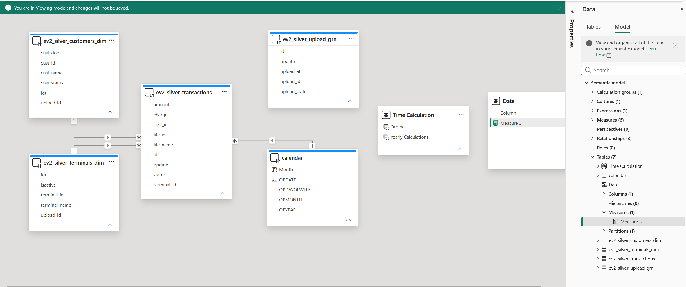</kbd>
<p style="text-align: center;"><a name="pic-p1-16">pic-p1-16</a></p>


Also, the report, which is shown on  [pic-p1-17](#pic-p1-17)

<kbd>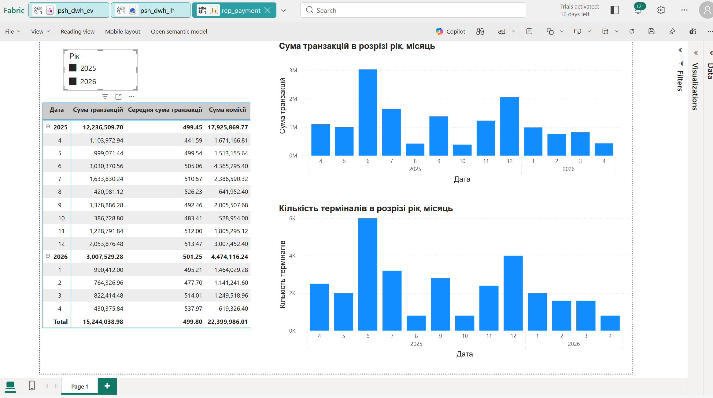</kbd>
<p style="text-align: center;"><a name="pic-p1-17">pic-p1-17</a></p>


