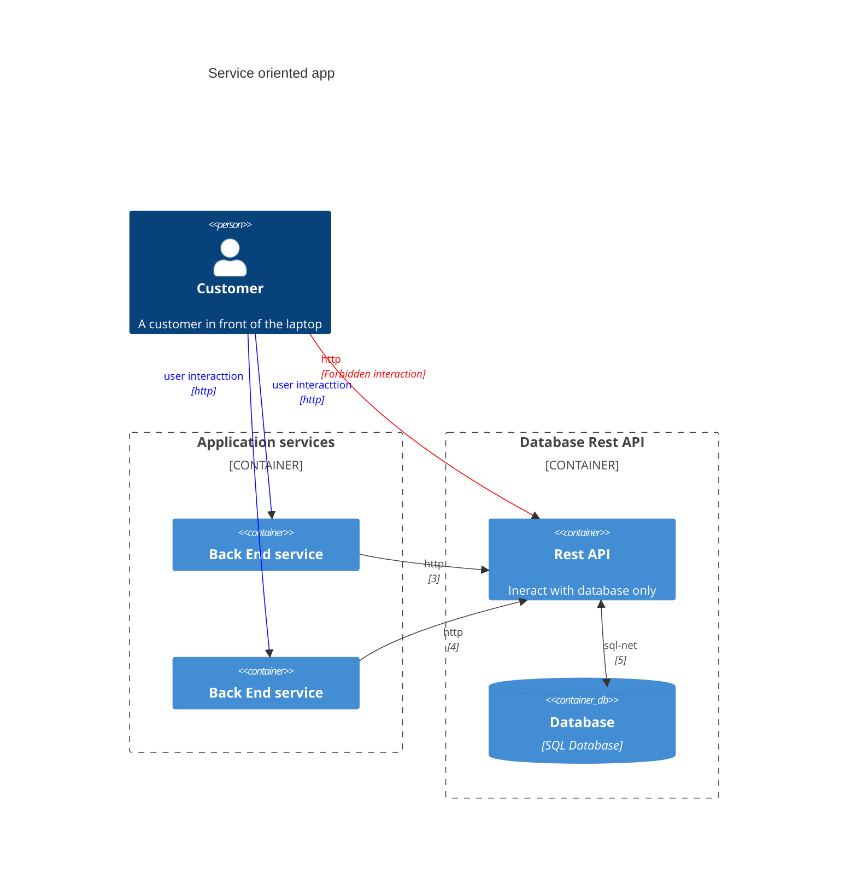

```mermaid
    C4Container
    title Service oriented app
    
    Person(customer, Customer, "A customer in front of the laptop")

    Container_Boundary(c2, "Application services") {
        Container(app1_service, "Back End service", "", "")
        Container(app2_service, "Back End service", "", "")
    }

    Container_Boundary(c1, "Database Rest API") {
       
        Container(appdbservice, "Rest API", "", "Ineract with  database only")
        ContainerDb(database, "Database", "SQL Database")
       

    }

    Rel( customer, app1_service, "user interacttion","http", "1")
    Rel( customer, app2_service, "user interacttion","http", "2")
    
    Rel(app1_service,  "appdbservice", "http", "3")
    Rel(app2_service,  "appdbservice", "http", "4")

    BiRel(appdbservice,  "database", "sql-net", "5")

    Rel(customer,  "appdbservice", http, "Forbidden interaction", "0")

    UpdateRelStyle(customer,  "appdbservice" $textColor="red",$lineColor="red", $offsetY="-80", $offsetX="-120")


    UpdateRelStyle(customer, app1_service, $textColor="blue",$lineColor="blue", $offsetY="-50", $offsetX="10")
    UpdateRelStyle(customer, app2_service, $textColor="blue",$lineColor="blue", $offsetY="-140", $offsetX="-110")
    
    UpdateLayoutConfig($c4ShapeInRow="1", $c4BoundaryInRow="2")

```