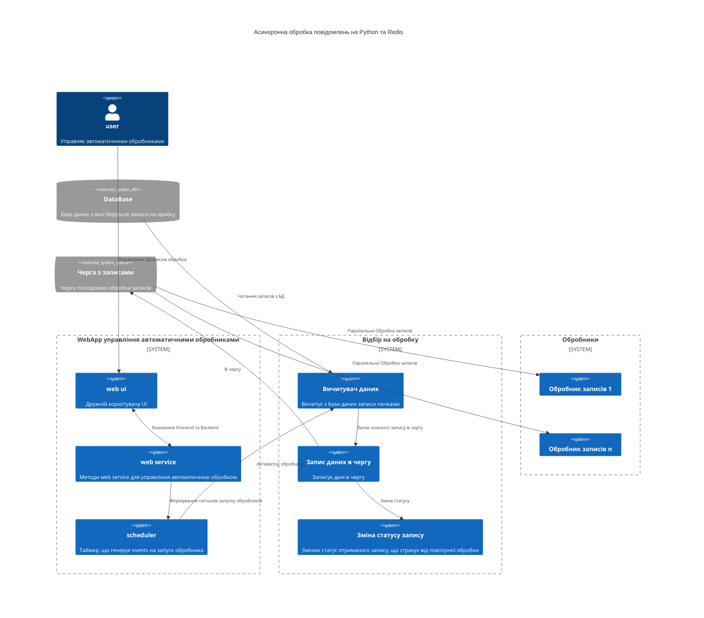

```mermaid
C4Container
    title Асинхронна обробка повідомлень на Python та Redis
    Person(user, "user", "Управляє автоматичними обробниками")
    System_Boundary(s1, "WebApp управління  автоматичними обробниками") {
        System( webui, "web ui", "Дружній користувачу UI ")
        System( webservice, "web service",  "Методи web service для управління автоматичною обробкою")
        System( scheduler, "scheduler",  "Таймер, що генерує events на запуск обробника")
    }

    SystemDb_Ext(db1, "DataBase", "База даних з якої беруться записи на оробку")
    
    System_Boundary(s2, "Відбір на обробку") {
        System( DbReader, "Вичитувач даних", "Вичитує з бази даних записи пачками")
        System( QueueWriter, "Запис даних в чергу", "Записує дані в чергу")
        System( DbWriter, "Зміна статусу запису", "Змінює статус отриманого запису, що страхує від повторної обробки")

    }

    SystemQueue_Ext(Queue1, "Черга з записами", "Черга послідовної обробки записів")
  
    System_Boundary(s3, "Обробники") {
         System( Worker-1, "Обробник записів 1")
         System( Worker-n, "Обробник записів n")
    }

   Rel(user, webui, "Управління процесом обробки")
   BiRel( webui, webservice, "Взаєможія Fronend  та Backend")
   Rel(webservice, scheduler, "Формування сигналів запуску обробників")
   Rel(scheduler, DbReader, "Активатор обробника")
   Rel(db1, DbReader, "Читання записів з БД")
   Rel(DbReader, QueueWriter ,"Запис кожного запису в чергу")
   Rel( QueueWriter, Queue1 ,"В чергу")
   Rel( QueueWriter, DbWriter ,"Зміна статусу")
   Rel(Queue1, Worker-1, "Паралельна Обробка записів")
   Rel(Queue1, Worker-n, "Паралельна Обробка записів")
   UpdateLayoutConfig($c4ShapeInRow="3", $c4BoundaryInRow="3")
   
```