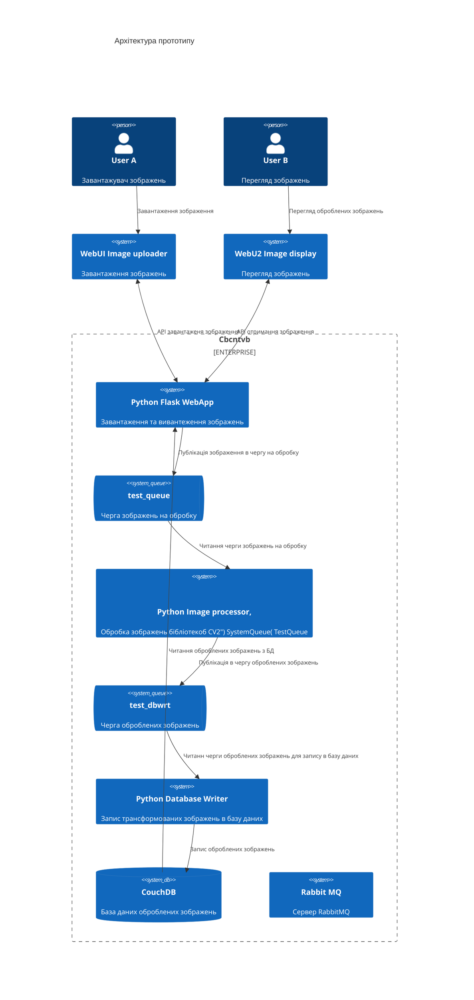

# pic-02

```mermaid
    C4Context
      title Архітектура прототипу
      
        Person(customerA, "User A", "Завантажувач зображень")
        Person(customerB, "User B", "Перегляд зображень")

        System(WebUI1, "WebUI Image uploader", "Завантаження  зображень")
        System(WebUI2, "WebU2 Image display", "Перегляд зображень")
        
        Enterprise_Boundary(b1, "Cbcntvb") {
          System(WebApp, "Python Flask WebApp", "Завантаження та вивантеження зображень")
          SystemQueue( TestQueue, "test_queue", "Черга зображень  на обробку")
          System(Worker1, "Python Image processor, "Обробка зображень бібліотекоб CV2")
          SystemQueue( TestQueue, "test_queue", "Черга зображень  на обробку")
          SystemQueue(TestDbWrt, "test_dbwrt", "Черга оброблених зображень")
          System(Worker2, "Python Database Writer", "Запис трансформованих зображень в базу даних")
          SystemDb(ImageDB, "CouchDB", "База даних оброблених зображень")

          System(RabbitMQ, "Rabbit MQ", "Сервер RabbitMQ")


        }

      Rel(customerA, WebUI1, "Завантаження зображення")
      Rel(customerB, WebUI2, "Перегляд оброблених зображень")
      BiRel(WebUI1, WebApp , "API завантаженя зображення")
      BiRel(WebUI2, WebApp , "API отримання зображення")
      Rel(WebApp, TestQueue, "Публікація зображення в чергу на обробку")
      Rel(TestQueue, Worker1, "Читання черги зображень на обробку")
      Rel(Worker1, TestDbWrt, "Публікація в чергу оброблених зображень")
      Rel(TestDbWrt, Worker2 , "Читанн черги оброблених зображень для запису в базу даних")
      Rel(Worker2, ImageDB, "Запис оброблених зображень")
      Rel(ImageDB, WebApp, "Читання оброблених зображень з БД")


      UpdateLayoutConfig($c4ShapeInRow="2", $c4BoundaryInRow="1")


```