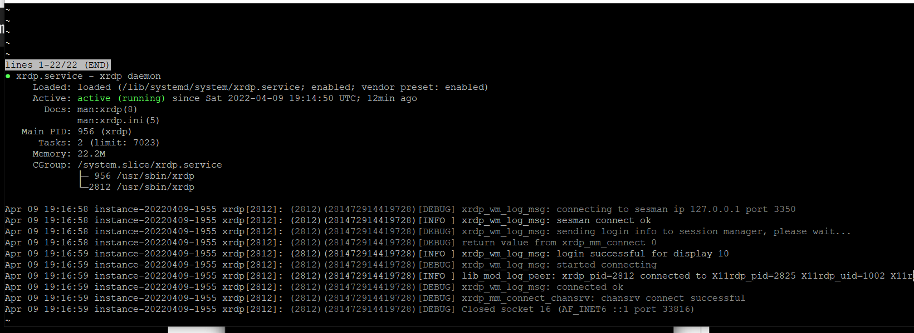

# Установка ubuntu - опис для початківця

<!-- TOC BEGIN -->
1. [Чому ubuntu](#p01) 
2. [Створення користувача  з правами SUDO](#p02)
3. [ Установка Ubuntu 20.04 GUI-графічного інтерфейсу](#p03)
4. [Установка RDP на UBUNTU (можливысть пыдключення по rdp з windows робочої станції)](#p04)
<!-- TOC END -->

## 1. <a name="p01">Чому ubuntu</a>

Linux-based  операційні системи зараз присуні в людій хмарі і на них побудовані контейнерні платформи.
Ubuntu  легка в установці. Має свій GUI інерфейс. Має широке ком'юніті та на її базі можна  підняти віруалки  у більшості хмар.
Ну як мінімум віртуальні машини з ubuntu 20.04  присутні в  хмарах IBM, AWS, Oracle, DigeitalOcean, AZURE  в різних конфігурація (по кількості процсорів та пам'яті). Ну а в AZURE  на ній навіть Kubernetes кластер можна підняти.  Тому, як на мене, то це ідеальна операційна система для вивчення Linex. Тому, далі по тексту, опсані кроки по  налаштуанню OS UBUNTU  для робои роробника  

## 2. <a name="p02">Створення користувача  з правами SUDO</a>

Матеріал взято відсіля: [digitalocean create-a-new-sudo-enabled-user-on-ubuntu-20-04-quickstart](https://www.digitalocean.com/community/tutorials/how-to-create-a-new-sudo-enabled-user-on-ubuntu-20-04-quickstart)

- Підключитсяь по ssh

```bash
ssh root@your_server_ip_address
```


- Виконаи команду створення користувача

в даном випадку username=**psh**

```bash
sudo adduser  psh

```

кругом можна проклікати enter. Пароль в хмарах бажано придумувати складний - обижаютьбся на прості. Ну, мають право.


- Додати створеного користувача в групу sudo

```bash
sudo usermod -aG sudo psh

```

- Перевіряємо результати роботи


    * протестувати можна, використовуючи коману  **su**  для перемикання но наовий account користувача:

```bash

su - psh

```
В резульаті буде 

```text
psh@instance-20220409-1955:~$
```

    * Спробуємо виконати команду, що вимагає привілегій sudo

Прочитаємо зміст каталога root, що доступний зазичай root клристувачу

    ```bash

    sudo ls -la /root

    ```

## 3. <a name="p03">Установка Ubuntu 20.04 GUI-графічного інтерфейсу<a>

Матеріал взятий відсіля: [Ubuntu 20.04 GUI installation](https://linuxconfig.org/ubuntu-20-04-gui-installation)


- Обновити пакети ОС та поставити менеджер пакетів **taskel**

```bash

$ sudo apt update
$ sudo apt install tasksel

```

Для перевірик установки виконаємо команду отримання списку пакетів

```bash
tasksel --list-tasks
```

- Установка **ubuntu Desctop**

```bash

sudo tasksel install ubuntu-desktop
```

- Перезавантаження системи

```bash
   reboot
```

- Установка завантаженя GUI за замовчуванням

```bash
$ sudo systemctl set-default graphical.target

```

## 4. <a name="p04">Установка RDP на UBUNTU (можливысть пыдключення по rdp з windows робочої станції)</a>


- Обновити пакети

```bash

sudo apt update

```


- Установка RDP сервера XRDP

Взято відсіль: https://www.youtube.com/watch?v=Moscv2moML8

```bash
  sudo apt install xrdp

```

- Зробити його автостартуючим

```bash
  sudo systemctl enable xrdp
```

- Перевірити роботу xrdp

```bash
sudo systemctl status xrdp
```
Повинно бути  щось отаке.
<kbd></kbd>
<p style="text-align: center;">pic-1</p>                        

Якщо виявлені помилки (не стартонув), значить скоріше всього не відкрито порт 3389 на сервері.

Для цього потрібно встановити пакет мережевних утиліт.

```bash
   sudo apt install net-tools

```

Перевіряємо дсотупність портів

```bash

netstat -nltp

```
Повинно бути  щось отаке.
<kbd></kbd>
<p style="text-align: center;">pic-2</p>


Якщо порт 3389 не слухається, то потрібно його відкрити шляхом редагування файлу редактором nano

```bash
  sudo nano /etc/iptables/rules.v4

```

та додати рядок, що  на малюнку обведено червоною рамкою

<kbd></kbd>
<p style="text-align: center;">pic-3</p>


В принципі на віртуалці все, але є нуюанс, якщо віртуалка піднята в хмарі то потрібно прокопати канал з вашого компа  в віртуальну приватну мережу. Показую на прикладі ORACLE CLOUD.

## Прокопування канал для віртуалки в ORACLE CLOUD

Взято відсіль: https://www.youtube.com/watch?v=Moscv2moML8


Заходимо на  перелік Virtual Cloud Networks https://cloud.oracle.com/networking/vcns

Заходимо в свою VCN **Virtual Cloud Network**

<kbd></kbd>
<p style="text-align: center;">pic-4</p>


Та вікриваємо меню: "Security List". В нему внесенмо правило для мережі.


<kbd></kbd>
<p style="text-align: center;">pic-5</p>


<kbd></kbd>
<p style="text-align: center;">pic-6</p>


Заходимо в **"Security List"**, що створено за замовчуванням, та вносимо правило для доступу но порта RDP 3389


<kbd></kbd>
<p style="text-align: center;">pic-7</p>


## Підключаємось по RDP  з windos 10

Запускаєм: %windir%\system32\mstsc.exe

або  просто **mstsc.exe**  та вносимо публічний IP вашої терміналки:

<kbd></kbd>
<p style="text-align: center;">pic-8</p>


Ну, а далі підключаємося під root **ubunta**  або під користувачм, що ви створили **psh**

<kbd></kbd>
<p style="text-align: center;">pic-9</p>


## Установка DOCKER

Вілціяля:

- Update the apt package index and install packages to allow apt to use a repository over HTTPS:

 ```bash
 sudo apt-get update

 sudo apt-get install \
    ca-certificates \
    curl \
    gnupg \
    lsb-release

 ```

- Add Docker’s official GPG key:

```bash

curl -fsSL https://download.docker.com/linux/ubuntu/gpg | sudo gpg --dearmor -o /usr/share/keyrings/docker-archive-keyring.gpg
```
- Use the following command to set up the stable repository. To add the nightly or test repository, add the word nightly or test (or both) after the word stable in the commands below.

```bash
echo \
  "deb [arch=$(dpkg --print-architecture) signed-by=/usr/share/keyrings/docker-archive-keyring.gpg] https://download.docker.com/linux/ubuntu \
  $(lsb_release -cs) stable" | sudo tee /etc/apt/sources.list.d/docker.list > /dev/null


```

- Install Docker Engine

```bash
sudo apt-get update

 sudo apt-get install docker-ce docker-ce-cli containerd.io
```

- Verify that Docker Engine is installed correctly by running the hello-world image.

```bash
 sudo docker run hello-world

```

## Перевірка codepage  для підримки кирилиці

- отримати локаль

```bash
$locale -  всі локалі
$locale -a  Display  a  list  of  all  available   locales
$locale -a -v
$locale -a -v  -Display Detail info
locale: en_US           archive: /usr/lib/locale/locale-archive
-------------------------------------------------------------------------------
    title | English locale for the USA
   source | Free Software Foundation, Inc.
  address | http://www.gnu.org/software/libc/
    email | bug-glibc-locales@gnu.org
 language | American English
territory | United States
 revision | 1.0
     date | 2000-06-24
  codeset | UTF-8

locale: en_US.utf8      archive: /usr/lib/locale/locale-archive
-------------------------------------------------------------------------------
    title | English locale for the USA
   source | Free Software Foundation, Inc.
  address | http://www.gnu.org/software/libc/
    email | bug-glibc-locales@gnu.org
 language | American English
territory | United States
 revision | 1.0
     date | 2000-06-24
  codeset | UTF-8

locale: C.UTF-8         directory: /usr/lib/locale/C.UTF-8
-------------------------------------------------------------------------------
    title | C locale
    email | aurel32@debian.org
 language | C
 revision | 1.6
     date | 2016-08-08
  codeset | UTF-8


$locale -c charmap  Display  the  available charmap

```

Для настройки на ураїнську  установити пакет:

```bash
  sudo dpkg-reconfigure locales 

```
та вибрати локаль  **uk_UA.UTF-8.**

Установити часову зону:

``` bash
  timedatectl list-timezones  -  отримати список

  sudo timedatectl set-timezone  Europe/Kiev   установити часову зону киэва

  timedatectl - отримати поточну  часову зону
```
