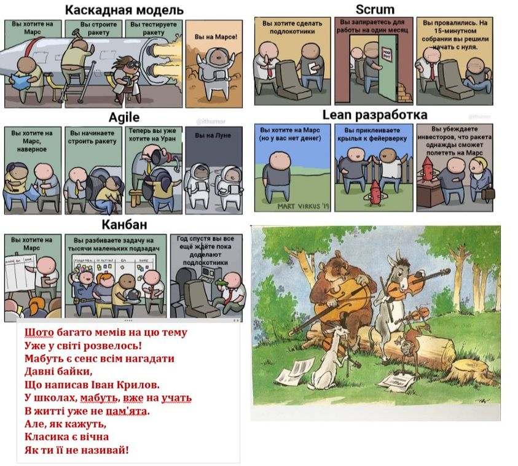
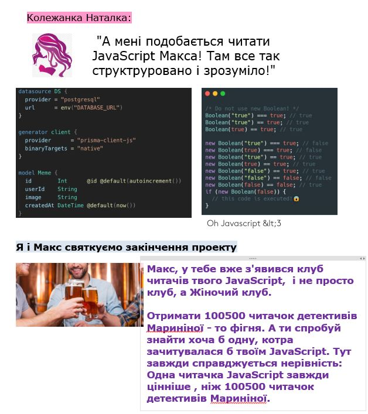
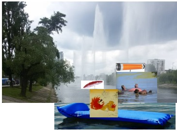

# Власні різні меми


## Про проектний менеджмент

Попався черговий мем про управління, але чтомусь згадалася давня класика, байка Івана Крилова "Квартет" 🙂, ну і  склався віршик 🙂

<kbd></kbd>
<p style="text-align: center;"><a name="project_mgm">project_mgm</a></p> 

## Як правильно писати на JavaScript

Історія власного досвіду, з категорії "Нарошне не придумаєш". Ото чорні картинки - то фрагменти JavaScript - але дуже маленькі. На ньому всі web формочки пишуться (у всякому разі інтерактивність формочок без нього не можлива). А тепер уявіть собі отаких фрагментів рядочків так на 2000 і прочитавши їх ти розумієш як працює web-сторінка. Оце коли колежанка Наталка прочитала 2000 таких рядків і зрозуміла як воно працює і їй це було в кайф.

<kbd></kbd>
<p style="text-align: center;"><a name="javascript_funclub">javascript_funclub</a></p> 

## Коли влітку 1 червня такий зюзьман як і 1 березня  

```text
Свинцеві хмари,
Дощ іде.....
Сусіди печі топлять,
По долині дим пливе...
Здраствуй,   Літо Золоте !
```
01.06.2020

<kbd></kbd>
<p style="text-align: center;"><a name="pic-summer">pic-summer</a></p> 

І в таке літо, коли карантин,  та зюзьман, особливо мріється по відпустку в теплих краях.

<kbd></kbd>
<p style="text-align: center;"><a name="summer_dream">summer_dream</a></p>


