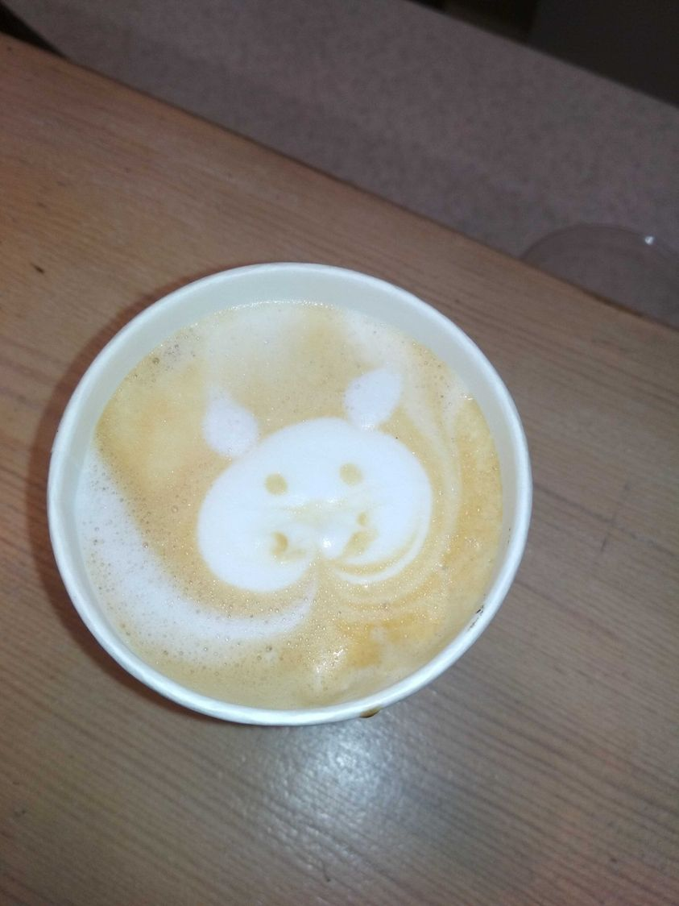
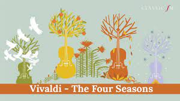

# Власні різні меми


## [Про проектний менеджмент](#projectmng)
<a name="projectmng"/>

Попався черговий мем про управління, але чтомусь згадалася давня класика, байка Івана Крилова "Квартет" 🙂, ну і  склався віршик 🙂

<kbd></kbd>
<p style="text-align: center;"><a name="project_mgm">project_mgm</a></p> 

### Казка про управління проектом

```text

В одному шанованому , але не великому офісному  центрі, що знаходиться  у віддаленому місці, сталася
звичайна життєва  трагедія: самий звичайний прорив труби з водою. Вода тече, не так щоб  потоп, але досить 
швидко.  Відра потрібно міняти часто. Ну, відра міняли, міняли, ..., поки чекали Професіоналів. 
Приїхали  Професіонали, які спеціально  навчені  для роботи з трубами.  Сказали, що вони не ті фахівці, у 
них немає сертифіката перекрити вентиль, потрібно викликати інших, спеціально навчених  та  сертифікованих  
професіоналів. А в цей час співробітники воду активно виливають, так як відра наповняються  швидко, щоб не 
потонути ....
Викликали сертифікованих Професіоналів. Через пару годин приїхали, знайшли потрібний вентиль. Провели 
проектний аналіз: хитали головами, махали руками, вказівними пальцями показували.  В результаті проектного 
аналізу оголосили висновок, з урахування всіх ризиків: «Ну який рукопоп  це монтував!». По результатах 
проекту, почали виконувати роботи. Проектний менеджер, бригадір Дядя Коля  зкоординував дії  учасників 
проекту, і Мишко, здоровенний козарлюга, хоч мордою їжаків бий , взявся крутити вентиль.  Мишко напрягся, з 
усієї сили,  пробуючи повернути вентиль – не крутиться. Його обличчя почервоніло,  очі виросли розширилися 
до розміру гривневої монети. Раптом  він  зібрався з силами,  видавив з себе: «Ууууу-ххх», і….. баранчик 
вентиля, залишився у Мишка в руках, а вода як текла так і тече. Вентиль зламався. Тут почалася друга фаза 
проекту: Залучити до проекту консультантів. Сертифіковані спеціалісти зібралися і поїхали до  консультантів.
Через кілька  годин повернулися  і , показали, що є інший вентиль, пустіть, ми враз перекриємо і буде щастя. 
Пустили. Знову проектний аналіз, рукопопи робили. Мишко  знову напрягається, очі по рублю,  і,  переможно 
ламає другий вентиль. 
А вода тече, співробітники відра носять…..
Професіонали швидко зібралися і поїхали знову до консультантів. Консультувалися довго і якимось дивом їм 
вдалося знайти третій вентиль, де то за межами центру, який вже, Мишко таки  перекрив успішно, після того як 
Дядя Коля показав Мишку кулака і  виголосив промову менеджера, що в офісному центрі, зазвичай, не 
використовують. Потім професіонали успішно зібралися, і мабуть, мотнули знову до консультантів. Бо потрібно 
знайти сертифікованих спеціалістів, що можуть замінити  два вентиля, а потім іще – закрутити, та ще і труби 
відремонтувати. А це, зрозуміло, уже інший проект, що потребує детального планування і аналізу всіх ризиків.
Ну, коротше кажучи, кілька днів екологічної катастрофи  співробітники центру групами їздили на найближчу 
заправку, або працювали  дома.
Єдине, що радує, що через кілька днів, такий глобальний проект був успішно закінчений

```

## <a name="aboutjs"/> [Як правильно писати на JavaScript](#aboutjs)

Історія власного досвіду, з категорії "Нарошне не придумаєш". Ото чорні картинки - то фрагменти JavaScript - але дуже маленькі. На ньому всі web формочки пишуться (у всякому разі інтерактивність формочок без нього не можлива). А тепер уявіть собі отаких фрагментів рядочків так на 2000 і прочитавши їх ти розумієш як працює web-сторінка. Оце коли колежанка Наталка прочитала 2000 таких рядків і зрозуміла як воно працює і їй це було в кайф.

<kbd></kbd>
<p style="text-align: center;"><a name="javascript_funclub">javascript_funclub</a></p> 


## <a name="coffeinit"/> [It-шиники та кава](#coffeinit)
### І спробуй не відремонтуй...... 

<kbd></kbd>
<p style="text-align: center;"><a name="it-and-coffe">it-and-coffe</a></p>

### Попросив дівчат на каві намалювати котика. Ось шо вийшло 😊

<kbd></kbd>
<p style="text-align: center;"><a name="coffee-cat">coffee-cat</a></p>

## От не пойму, це Solution  чи таки  Decision

<kbd></kbd>
<p style="text-align: center;"><a name="solution-vs-decision">solution-vs-decision</a></p>

## <a name="seasons"/> [Про пори року](#seasons)

У Вівльді є Four Seasons, у Баха є сезонні твори. А чим я хуже......  

<table>
    <tr>
        <td></td>
        <td></td>
        <td></td>
    </tr>

</table>

**Таки Весна**

```text


Іду якось вранці по вулиці. Сонечко пригріває, відносно тихо вранці, вулиця чиста. 
Попереду чимчикує молода жіночка. Гарна  жіноча фігурка з шикарним чорним волоссям 
у стильному,  демисезонному пальто. Гарні ніжки в на півчобітках  ритмічно тупотять 
по бруківці.  Весна,  іду любуюся природою та жіночою вродою. Принюхуюсь до  запаху 
кондитерки,  що метрів  за 20  від мене. Смачно пахне тістечкам. Там взагалі смачно 
пахне, тому, що кондитерка рядом.
Раптом, ніжки почали збивати ритм. Явно, ніжки захвилювалися. Далі більше, хвилювання 
повільно переходить в боротьбу. Ніжки  плавно,  але  впевнено відхиляються  праворуч, 
в сторону кондитерки. Але силою волі, жіночка плавно повертає ніжки на дорогу. Та все 
ж ніжки беруть своє і знову, з більшою амплітудою, ніжки відхиляються в сторону кондитерки. 
І знову, жіночці, ціною неймовірних зусиль,   вдалося повернути ніжки на пряму. Але подальші  
зусилля були марними. Ніжки виписували змійку, причому з кожним коливанням, амплітуда 
відхилення в сторону кондитерки все збільшувалася, а сила волі, що повертала ніжки на 
дорогу - зменшувалася. Та коли до кондитерки лишилося метрів 7, ніжки вирівнялися, і 
впевнено, по траекторії сідаючого Боінга, понесли свою хазяйку до дверей кондитерки.
Отака весна!!
```

**Коли влітку 1 червня такий зюзьман як і 1 березня**  

```text
Свинцеві хмари,
Дощ іде.....
Сусіди печі топлять,
По долині дим пливе...
Здраствуй,   Літо Золоте !
```
01.06.2020

<kbd></kbd>
<p style="text-align: center;"><a name="pic-summer">pic-summer</a></p> 

**І в таке літо, коли карантин,  та зюзьман - особливо мріється по відпустку в теплих краях**

<kbd></kbd>
<p style="text-align: center;"><a name="summer_dream">summer_dream</a></p>


## Єтюд

```text

НЕДІЛЬНИЙ ЕТЮД
Вихідні тихо спливали. Уже маячила за вікном сонна морда понеділка і тут Наташа сказала: «Мені потрібно побути наодинці, я поїхала на ринок». 
Ну на ринок так на ринок у мене ще хата не прибрана. 
І тільки я глибоко видихнув, випив літру молока і з’їв пів батона  і,  після такого настрою, розвернув пило втяг, і уже навіть зібрався з духом щоб його ввімкнути, як задзвонив мобільний…..
«Ух, поламали весь настрой, тепер знову в холодильник за настройкою звертатися….» - розізлився я. Хватаю мобілку і чую: «Я на братіславській. У мене з руля дим пішов, як від цигарки. Що мені робити?». І що мені відповісти? Відповів щоб чекала, поки приїду. А сам збираю кошильочок: гроші, ключі (що гайки крутять), ручку, олівець блокнот, окуляри, ліхтарик, батарейки ,  склеротичку з телефони евакуаторів, мануал на машину. Біжу на маршрутку, думаю, що робити – мабуть треба мануал почитати, а раптом знайду щось цікаве? 
Приїжджаю до епіцентра і що я бачу:
- Стоять дві знайомі машини синенький КІА і сріблястий КІА, а навкруги них ілюмінація, як в новий рік. Мерехтять  машинки усіма різнокольровими лампочками – ну просто дискотека. Тільки чомусь синенька без колеса. Підхожу, таки да, колесо рядом і  докатка тутечки. 
Питаю : «Не зрозумів. Поясніть у кого проблеми»?
Пояснюють: «У обох». Синенька швиденько поїхала виручати сріблясту і сама колесом в халепу попала. Ну з синенькою Женька управився швидко. А з сріблястою катастрофа. 
Питаю: «Що сталося?»
- «Пішов білий дим з руля».
Обдивився і обнюхав все навкруг – запаху нема. Навіть під капот заглянов. Пилу дочорта, а запаху нема. Стою , як стовп, думаю:
« Уже годину стоїть, блимає, як гірлянда і нічого. Запобіжники всі в нормі. Запаху нема. Мабуть тут щось не те. »
- Кажу :«Заводь»
- «Не буду»
- «Заводь кажу»
- «Не буду»
- «Ну ти вже годину тут блимаєш і нічого, заводься швидше»
- «Ну добре, тільки вивчи інструкцію, як вогнегасником користуватися!»
- «Чекай зараз  три рази прочитаю, а потім перекажу»
- «Ні, тоді поїхали»
Коротше кажучи успішно доїхали, все виключили, я маю на увазі від акумулятора відключили» і пішли. А наступного дня оддали Сергію в ремонт. На слід. День усе готово. Підгоріли вимикачі поворотів.
Коротше вихідні пройшли весело, з димком.
PS. Написав, значить, у ФБ, чекаю реакції.  Чекаю, чекаю…..., а навкруги синє небо, я на пісочку, сонечко ласкаве –пляж. Попереду бірюзове ласкаве море…. Зліва чорні скелі, обгорнуті зеленню. ЗА спиною травичка з пальмами. Зараз,  ще полежу і піду купатися…… Хмаринка по небу пливе… Така собі, невеличка, біленька. Та раптом  грім серед синього неба: «Я тебе скоро публікувати буду!!!!», а потім ще розкат: « Разом з граматичними помилками !!!»
І туту уже не море а озеро, а  з озера вода швиденько витікає через струмочок і уже не озеро, а калюжа –  і все відпустка виключилася. Ех, такий пейзаж не змалював……
```

## <a name="school"/> [Про школу та електронні підручники](#school)

<kbd></kbd>
<p style="text-align: center;"><a name="sch-1">sch-1</a></p>


>Пєльмяшка з електронним підручником в планшеті. Ну, і йорзаємо на планшеті: то теорія по трикутникам, то малюнок до задачі. Ну мене це дратує. Я ж до книжок звик. Тут мала: "Дядя Паша, шо ти мучаєшся". Отак беремо телефон - фоткаємо планшет на телефон, кладемо рядом і не треба йорзати туди сюди!


## <a name="baking"/> [Про кондитерку](#baking)

<kbd></kbd>
<p style="text-align: center;"><a name="sch-2">sch-2</a></p>

## <a name="innovation"/> [Про іноваційні підходи](#innovation)

<kbd></kbd>
<p style="text-align: center;"><a name="sch-3">sch-3</a></p>


## <a name="testing"/>[Про тестування в ДІЯ](#testing)

<kbd></kbd>
<p style="text-align: center;"><a name="sch-4">sch-4</a></p>

## <a name="greenenergy"/>[Про зелену енергетику](#greenenergy)

<kbd></kbd>
<p style="text-align: center;"><a name="sch-5">sch-5</a></p>

Може марку випустити чи откритку. Історичне ж фото!

## <a name="summer"/>[Про червень](#summer)

---

Вийшов зранку на зарядку і зі здивуванням помітив, що запах липи стоїть  навіть в коридорах і на загальних сходах нашого будинку. А доки спускався, подумалося, а за що я люблю червень?

Я люблю червень  за запахи та смаки - натуральні, анітрохи не штучні і за соковиті кольори.

А ще за спарінгування (:. У червні спарінгуємо зі шпаками, хто швидше збере різнокольорову черешню.

Червень-  це прохолодна і соковита полуниця і запах суниці, тієї дикої, яка росте на лісових галявинах. Вона не дуже соковита, вона не найсолодша, але завжди  свіжа і пружна і пахне так сильно, що ти запах чуєш, а ягід ще не видно, бо вони сховалися десь під травою.

А ще, це запах липи та липового меду. Того меду, який ще не фільтрований. У ньому плавають ще шматочки воску, пилок квітів, але від цього він ще смачніший. Якщо перекласти цей запах на мову музики, то це не тонічний призвук, а  домінат септакорд, в якому  смак перги десь знизу, навіть з легкою гірчинкою, в середині смак воску, а вище вже нотки липи.

 Рано-вранці виходиш на вулицю. Повітря ще не висушене сонцем, трохи вологе і рясно присмачене ароматом липи. Така свіжість, що хочеться забути про все. Влягтися десь на степовому схилі на траву, руки за голову і дивитися на небо і просто вдихати свіжі природні запахи.

---

## <a name="fexiblesoft"/> [Що таке гнучкі програмні продукти](#fexiblesoft)

---
Ну, значить, четвертий день знімаюся фігньою, яку дуже важко формалізувати.
Ну, порученіє просте і понятне: "Отут єсть такий от продукт. Ти
почитай про нього і найди  задачу, щоб тіпа реальна була і
продемонструй нам, а потім клієнту. Ми хочем запропонувати  купити
клієнту цей продукт".
Продукт хорошо відомий в світі, розкручений жирною, всім відомою IT-компанією.
Ну сиджу. Прототип придумав. Уже навіть половину зробив. Но, з цим
продуктом воно не хоче працювати, хоть об стінку бийся. Я документацію
вчора до  кінця першої тривоги читав! Ніфіга не знайшов, чому воно
працює так, як мені Не Треба.

А перед цим пішов в парк гуляти, ну взяв кави, а потім подумалося, от
як пояснити  чим я займаюся. 
Ну, уявіть шо вам замість звичайної хорошої каво-машини привезли саму 
нову зі штучним інтелектом і сказали навчитися з нею працювати. Кавоварка крута, 
розуміє всі мови світу, управляється мовою і жестами. Ну, ви все по інструкції зробили,
включили. Пробуєте працювати з нею, а кавоварка замість кави наливає
якусь холодну брудну  рідину в чашку. 
Ви вже і  по доброму, і голосніше, і "по колесу стукали" і як з "радянським 
телевізором"  поводилися - ну нічого не помагає. І розділ: "як зварити
еспресо" - уже на пам'ять вивчили. Всьо -нема фантазії.

Включили тєлік, а там раптом показують "Укрощеніє строптівой" з
Челєнтано в головній ролі. Ну, от бєзісходності, почали дивитися.
Вдруг, на моменті, коли Челєнтано шото поругався, кофеварка
зажужала і почала наливати кип'яток.
Ви ще подивилися і на похожому моменті знову кавоврака почала шото
робити. Ви давай тренірувать голос і з інтонаціями Челентано: "Хочу
еспресо"- і бліін!! Вона почала кип'ятити воду і наливати. Ви значить,
знову треніруєте голос, ну тіпа знову шото вона пойняла- тіко каву
готувати всіравно не хоче, а наливає гарячу воду.

Ну, ви уже думаєте: "докого б написати: хто знайде в документації як
заставити її змолоти каву - новою поштою вишлю 10 рошенівських
батончиків!".

Вдруг, побудувався асоціативний ряд: "Челентано", "вироблена кавоврака
в Італії" , "ЛуіДефінес". О, а єслі поморгать, як "ЛуіДефінес" шо
буде? І о чудо, воно почало перебирати і показувати режими роботи
кавомашини!!!.
Ага, значить, батончики відправляюцця победітєлю - тоєсть мені ж!

І раптом подумалося, а єслі б кавомашина  розуміла тільки інтонації
Орнелли Муті чи Джини Лолобриджити? Яким чином до цього висновку дійти? 
І як особисто повторити?

Да, пора розрпаковувать свій чесний виграш. Пішов за батончиком - один
точно заслужив. А каву пока заварю в турочці.


Висновок:

Ето значить, що кожний гібучий продукт має ряд ограніченій гібкості ,
шо вимагає самошедшої гібучості користувача , що працює з цим
продуктом.

---

### Продовжуючи філософію гнучких програмних продуктів

---
Багато людей думають, що вибираючи гнучкий, параметризуємий програмний
продукт вони отрмають щось на кшталт конструктора "Лєго" чи
кананалізаційних труб. От взяв, натикав там т'юбінгів, фітінгів,
клапанів, вентелів, тройничків - і получиться така собі незламна
етажерака. 
А, виявляється, завсім не ні. Гнучкий програмний продукт -
це то, що  внутрі каналізаційних труб. Програмний продукт прогинається
 в любу сторону, і більшість цих прогинів нігде не описано. А ефект
каналізаціних труб створюють люди, що набралися досвіду ,натикаючись
на  гострі вугли в темній кумнаті (не знань, а саме досвіду),
заставляти цей програмний продукт тримати форму і прогинатися тільки
туди - куди треба. 
І, як тільки така людина випадає із обойми, то це рівнозначно дірці в 
каналізаційній трубі. І гнучкий програмний продукт обізатєльно туди прогнеться. 
Ну, а яку форму має те, що вийшло з дірки каналізаційної труби -  загально відомо.
---


## <a name="goodfryday"/> [Good Fryday](#goodfryday)
	

П'ятниця. Сиджу на диванчику, ноут на колінках. Ну, уже після 16 години, навіть ближче до 17. І тут стукаються в чат: " Паша, там якась помилка! Нас обозвали не харошими словами! Клієнту отказали! Це твоє? "
- ну , так , пробігаю тікет очима. Вроді і на моє похоже, но не хвакт. Я пам'ятаю, що писав сам автоматизовані тести. Не повинно бути проблем. Но відповідь треба дати вмотивовану, щоб не повадно було обзивауця. Обзивауця ми тоже вміємо. Ліниво відповідаю: "ну подожди трохи, надо дать вмотивовану відповідь. Щас поміняю положеніє з романтічеськи-робочого в злостно-робоче.
- така доооовга пауза. А потім: "а злостно-робоче ето як? Ти тільки нікого не посилай!"
- та я токо з дивана за стіл переїду! - відповідаю.
